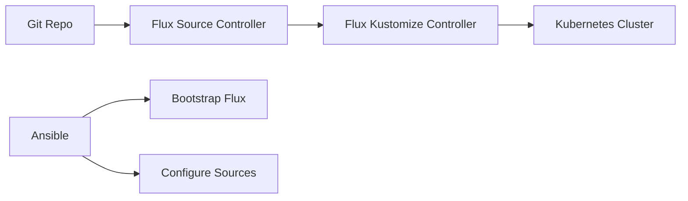

# How to Use Ansible with FluxCD for GitOps

Author: [nawazdhandala](https://www.github.com/nawazdhandala)

Tags: Ansible, FluxCD, GitOps, Kubernetes

Description: Bootstrap and configure FluxCD on Kubernetes clusters using Ansible for automated GitOps-based continuous delivery.

---

FluxCD is a GitOps toolkit for Kubernetes that automatically reconciles cluster state with Git repositories. Ansible can bootstrap FluxCD, configure Git sources, and manage Kustomization resources for a fully automated GitOps pipeline.

## FluxCD Architecture



## Bootstrapping FluxCD with Ansible

```yaml
# roles/fluxcd_bootstrap/tasks/main.yml
# Bootstrap FluxCD on a Kubernetes cluster
---
- name: Install Flux CLI
  ansible.builtin.get_url:
    url: "https://github.com/fluxcd/flux2/releases/download/v{{ flux_version }}/flux_{{ flux_version }}_linux_amd64.tar.gz"
    dest: /tmp/flux.tar.gz
    mode: '0644'

- name: Extract Flux CLI
  ansible.builtin.unarchive:
    src: /tmp/flux.tar.gz
    dest: /usr/local/bin/
    remote_src: true

- name: Check Flux prerequisites
  ansible.builtin.command:
    cmd: flux check --pre
  environment:
    KUBECONFIG: "{{ kubeconfig_path }}"
  register: flux_prereqs
  changed_when: false

- name: Bootstrap Flux with GitHub
  ansible.builtin.command:
    cmd: >
      flux bootstrap github
      --owner={{ github_org }}
      --repository={{ flux_repo }}
      --branch=main
      --path=clusters/{{ cluster_name }}
      --personal
  environment:
    KUBECONFIG: "{{ kubeconfig_path }}"
    GITHUB_TOKEN: "{{ github_token }}"
  register: bootstrap_result
  changed_when: "'configured' in bootstrap_result.stderr"
```

## Configuring Flux Sources

```yaml
# roles/fluxcd_sources/tasks/main.yml
# Configure Flux Git and Helm sources
---
- name: Create GitRepository source
  kubernetes.core.k8s:
    state: present
    definition:
      apiVersion: source.toolkit.fluxcd.io/v1
      kind: GitRepository
      metadata:
        name: "{{ item.name }}"
        namespace: flux-system
      spec:
        interval: "{{ item.interval | default('1m') }}"
        url: "{{ item.url }}"
        ref:
          branch: "{{ item.branch | default('main') }}"
        secretRef:
          name: "{{ item.secret | default('flux-system') }}"
  loop: "{{ flux_git_sources }}"

- name: Create HelmRepository source
  kubernetes.core.k8s:
    state: present
    definition:
      apiVersion: source.toolkit.fluxcd.io/v1beta2
      kind: HelmRepository
      metadata:
        name: "{{ item.name }}"
        namespace: flux-system
      spec:
        interval: 10m
        url: "{{ item.url }}"
  loop: "{{ flux_helm_repos }}"
```

## Configuring Kustomizations

```yaml
# roles/fluxcd_kustomizations/tasks/main.yml
# Configure Flux Kustomization resources
---
- name: Create Kustomization for each environment
  kubernetes.core.k8s:
    state: present
    definition:
      apiVersion: kustomize.toolkit.fluxcd.io/v1
      kind: Kustomization
      metadata:
        name: "{{ item.name }}"
        namespace: flux-system
      spec:
        interval: 5m
        sourceRef:
          kind: GitRepository
          name: "{{ item.source }}"
        path: "{{ item.path }}"
        prune: true
        targetNamespace: "{{ item.namespace }}"
        healthChecks:
          - apiVersion: apps/v1
            kind: Deployment
            name: "{{ item.deployment_name }}"
            namespace: "{{ item.namespace }}"
  loop: "{{ flux_kustomizations }}"
```

Variables for FluxCD configuration:

```yaml
# group_vars/all/flux.yml
flux_git_sources:
  - name: app-manifests
    url: ssh://git@github.com/myorg/k8s-manifests.git
    branch: main

flux_helm_repos:
  - { name: bitnami, url: "https://charts.bitnami.com/bitnami" }
  - { name: prometheus, url: "https://prometheus-community.github.io/helm-charts" }

flux_kustomizations:
  - name: production-app
    source: app-manifests
    path: ./overlays/production
    namespace: production
    deployment_name: myapp
  - name: monitoring
    source: app-manifests
    path: ./monitoring
    namespace: monitoring
    deployment_name: prometheus
```

## Flux Health Monitoring

```yaml
# playbooks/check-flux-health.yml
---
- name: Check FluxCD health
  hosts: k8s_control_plane
  tasks:
    - name: Check all Flux components
      ansible.builtin.command:
        cmd: flux check
      environment:
        KUBECONFIG: "{{ kubeconfig_path }}"
      register: flux_health
      changed_when: false

    - name: Check Kustomization status
      kubernetes.core.k8s_info:
        kind: Kustomization
        api_version: kustomize.toolkit.fluxcd.io/v1
        namespace: flux-system
      register: kustomizations

    - name: Report any failed reconciliations
      ansible.builtin.debug:
        msg: "{{ item.metadata.name }}: {{ item.status.conditions[-1].message }}"
      loop: "{{ kustomizations.resources }}"
      when: item.status.conditions[-1].status != 'True'
```

## Key Takeaways

FluxCD provides pull-based GitOps for Kubernetes, automatically reconciling cluster state with Git. Ansible handles the initial bootstrap and configuration of FluxCD components. Define Git sources, Helm repositories, and Kustomizations as Ansible variables for version-controlled GitOps configuration. Once FluxCD is running, it handles ongoing deployments automatically based on Git changes. Use Ansible for health checks and troubleshooting when reconciliation fails.

## Common Use Cases

Here are several practical scenarios where this module proves essential in real-world playbooks.

### Infrastructure Provisioning Workflow

```yaml
# Complete workflow incorporating this module
- name: Infrastructure provisioning
  hosts: all
  become: true
  gather_facts: true
  tasks:
    - name: Gather system information
      ansible.builtin.setup:
        gather_subset:
          - hardware
          - network

    - name: Display system summary
      ansible.builtin.debug:
        msg: >-
          Host {{ inventory_hostname }} has
          {{ ansible_memtotal_mb }}MB RAM,
          {{ ansible_processor_vcpus }} vCPUs,
          running {{ ansible_distribution }} {{ ansible_distribution_version }}

    - name: Install required packages
      ansible.builtin.package:
        name:
          - curl
          - wget
          - git
          - vim
          - htop
          - jq
        state: present

    - name: Configure system timezone
      ansible.builtin.timezone:
        name: "{{ system_timezone | default('UTC') }}"

    - name: Configure hostname
      ansible.builtin.hostname:
        name: "{{ inventory_hostname }}"

    - name: Update /etc/hosts
      ansible.builtin.lineinfile:
        path: /etc/hosts
        regexp: '^127\.0\.1\.1'
        line: "127.0.1.1 {{ inventory_hostname }}"

    - name: Configure SSH hardening
      ansible.builtin.lineinfile:
        path: /etc/ssh/sshd_config
        regexp: "{{ item.regexp }}"
        line: "{{ item.line }}"
      loop:
        - { regexp: '^PermitRootLogin', line: 'PermitRootLogin no' }
        - { regexp: '^PasswordAuthentication', line: 'PasswordAuthentication no' }
      notify: restart sshd

    - name: Configure firewall rules
      community.general.ufw:
        rule: allow
        port: "{{ item }}"
        proto: tcp
      loop:
        - "22"
        - "80"
        - "443"

    - name: Enable firewall
      community.general.ufw:
        state: enabled
        policy: deny

  handlers:
    - name: restart sshd
      ansible.builtin.service:
        name: sshd
        state: restarted
```

### Integration with Monitoring

```yaml
# Using gathered facts to configure monitoring thresholds
- name: Configure monitoring based on system specs
  hosts: all
  become: true
  tasks:
    - name: Set monitoring thresholds based on hardware
      ansible.builtin.template:
        src: monitoring_config.yml.j2
        dest: /etc/monitoring/config.yml
      vars:
        memory_warning_threshold: "{{ (ansible_memtotal_mb * 0.8) | int }}"
        memory_critical_threshold: "{{ (ansible_memtotal_mb * 0.95) | int }}"
        cpu_warning_threshold: 80
        cpu_critical_threshold: 95

    - name: Register host with monitoring system
      ansible.builtin.uri:
        url: "https://monitoring.example.com/api/hosts"
        method: POST
        body_format: json
        body:
          hostname: "{{ inventory_hostname }}"
          ip_address: "{{ ansible_default_ipv4.address }}"
          os: "{{ ansible_distribution }}"
          memory_mb: "{{ ansible_memtotal_mb }}"
          cpus: "{{ ansible_processor_vcpus }}"
        headers:
          Authorization: "Bearer {{ monitoring_api_token }}"
        status_code: [200, 201, 409]
```

### Error Handling Patterns

```yaml
# Robust error handling with this module
- name: Robust task execution
  hosts: all
  tasks:
    - name: Attempt primary operation
      ansible.builtin.command: /opt/app/primary-task.sh
      register: primary_result
      failed_when: false

    - name: Handle primary failure with fallback
      ansible.builtin.command: /opt/app/fallback-task.sh
      when: primary_result.rc != 0
      register: fallback_result

    - name: Report final status
      ansible.builtin.debug:
        msg: >-
          Task completed via {{ 'primary' if primary_result.rc == 0 else 'fallback' }} path.
          Return code: {{ primary_result.rc if primary_result.rc == 0 else fallback_result.rc }}

    - name: Fail if both paths failed
      ansible.builtin.fail:
        msg: "Both primary and fallback operations failed"
      when:
        - primary_result.rc != 0
        - fallback_result is defined
        - fallback_result.rc != 0
```

### Scheduling and Automation

```yaml
# Set up scheduled compliance scans using cron
- name: Configure automated scans
  hosts: all
  become: true
  tasks:
    - name: Create scan script
      ansible.builtin.copy:
        dest: /opt/scripts/compliance_scan.sh
        mode: '0755'
        content: |
          #!/bin/bash
          cd /opt/ansible
          ansible-playbook playbooks/validate.yml -i inventory/ > /var/log/compliance_scan.log 2>&1
          EXIT_CODE=$?
          if [ $EXIT_CODE -ne 0 ]; then
            curl -X POST https://hooks.example.com/alert \
              -H "Content-Type: application/json" \
              -d "{\"text\":\"Compliance scan failed on $(hostname)\"}"
          fi
          exit $EXIT_CODE

    - name: Schedule weekly compliance scan
      ansible.builtin.cron:
        name: "Weekly compliance scan"
        minute: "0"
        hour: "3"
        weekday: "1"
        job: "/opt/scripts/compliance_scan.sh"
        user: ansible
```

