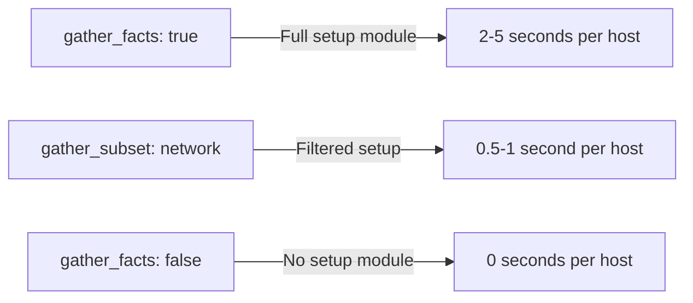

# How to Set gather_facts to False to Speed Up Playbooks

Author: [nawazdhandala](https://www.github.com/nawazdhandala)

Tags: Ansible, Performance, Facts, Playbook Optimization

Description: Learn how disabling fact gathering in Ansible playbooks can significantly reduce execution time, and when it is safe to do so.

---

Every time Ansible runs a playbook, the very first thing it does on each host is gather facts. This "Gathering Facts" task collects detailed information about the remote system: OS version, IP addresses, CPU count, memory, disk layout, and much more. On a single host, this takes a couple of seconds. When you are running against 500 hosts, those seconds add up fast.

If your playbook does not need any of that information, you can skip fact gathering entirely by setting `gather_facts: false`. This one change can shave significant time off your playbook runs.

## How to Disable Fact Gathering

Set `gather_facts: false` at the play level.

```yaml
# fast-deploy.yml - skips fact gathering for faster execution
---
- name: Quick deployment
  hosts: webservers
  become: yes
  gather_facts: false

  tasks:
    - name: Deploy configuration file
      copy:
        src: files/app.conf
        dest: /etc/myapp/app.conf
        owner: root
        group: root
        mode: '0644'

    - name: Restart application
      service:
        name: myapp
        state: restarted
```

When you run this playbook, you will notice the "Gathering Facts" task is absent from the output. Ansible connects to the hosts and goes straight to the first task.

## How Much Time Does It Save?

The time savings depend on the number of hosts and the network latency. Here are some rough numbers from real-world scenarios:

| Hosts | With Facts | Without Facts | Time Saved |
|-------|-----------|--------------|------------|
| 10 | ~8 seconds | ~2 seconds | ~6 seconds |
| 100 | ~45 seconds | ~5 seconds | ~40 seconds |
| 500 | ~3.5 minutes | ~15 seconds | ~3 minutes |
| 1000 | ~7 minutes | ~25 seconds | ~6.5 minutes |

The fact gathering module (`setup`) collects a lot of data. It runs multiple system commands, reads files from `/proc` and `/sys`, and parses the results. On slow or heavily loaded hosts, it can take even longer.

## What Are Ansible Facts?

Before deciding to disable facts, you should understand what you are giving up. Facts are variables that describe the remote host. Here are some commonly used ones.

```yaml
# Common facts you lose when gather_facts is false
ansible_hostname: web01
ansible_fqdn: web01.example.com
ansible_default_ipv4:
  address: 192.168.1.10
  interface: eth0
ansible_distribution: Ubuntu
ansible_distribution_version: "22.04"
ansible_os_family: Debian
ansible_memtotal_mb: 8192
ansible_processor_vcpus: 4
ansible_mounts:
  - mount: /
    size_total: 42949672960
    size_available: 30064771072
```

If your playbook references any of these `ansible_*` variables, disabling facts will cause undefined variable errors.

## When It Is Safe to Disable Facts

Disabling facts is safe when your playbook:

- Does not use any `ansible_*` variables
- Does not use `when` conditions based on OS type or version
- Does not use templates that reference host-specific facts
- Only runs simple commands, copies files, or manages services

```yaml
# safe-example.yml - none of these tasks need facts
---
- name: Restart services across fleet
  hosts: all
  become: yes
  gather_facts: false

  tasks:
    - name: Restart nginx
      service:
        name: nginx
        state: restarted

    - name: Restart application
      service:
        name: myapp
        state: restarted

    - name: Clear application cache
      file:
        path: /var/cache/myapp/
        state: absent
```

## When You Need Facts

Keep `gather_facts: true` (the default) when your playbook does any of the following.

```yaml
# needs-facts.yml - these tasks depend on gathered facts
---
- name: OS-specific configuration
  hosts: all
  become: yes
  # gather_facts must be true (default) for this to work

  tasks:
    # Uses ansible_os_family
    - name: Install packages on Debian
      apt:
        name: nginx
        state: present
      when: ansible_os_family == "Debian"

    # Uses ansible_os_family
    - name: Install packages on RedHat
      yum:
        name: nginx
        state: present
      when: ansible_os_family == "RedHat"

    # Uses ansible_default_ipv4
    - name: Configure application to bind to primary IP
      lineinfile:
        path: /etc/myapp/app.conf
        regexp: '^bind_address='
        line: "bind_address={{ ansible_default_ipv4.address }}"

    # Uses ansible_memtotal_mb
    - name: Set worker count based on available memory
      lineinfile:
        path: /etc/myapp/app.conf
        regexp: '^workers='
        line: "workers={{ (ansible_memtotal_mb / 512) | int }}"
```

## Gathering Specific Facts Only

If you only need a few facts but not the full set, you can disable the automatic gathering and manually call the `setup` module with a filter.

```yaml
# selective-facts.yml - gather only network-related facts
---
- name: Deploy with selective facts
  hosts: webservers
  become: yes
  gather_facts: false

  tasks:
    # Gather only network facts instead of everything
    - name: Gather network facts only
      setup:
        gather_subset:
          - network

    - name: Configure application with host IP
      template:
        src: templates/app.conf.j2
        dest: /etc/myapp/app.conf
      vars:
        bind_ip: "{{ ansible_default_ipv4.address }}"
```

Available subsets include: `all`, `min`, `hardware`, `network`, `virtual`, `ohai`, `facter`. You can also use `!` to exclude subsets.

```yaml
# Gather everything except hardware facts (which are slow)
- name: Gather non-hardware facts
  setup:
    gather_subset:
      - "!hardware"
```

## Fact Gathering Performance Comparison

Here is how different fact gathering strategies compare.



## Caching Facts for Repeated Runs

If you need facts but run playbooks frequently against the same hosts, fact caching can help. Ansible caches the facts from the first run and reuses them in subsequent runs.

```ini
# ansible.cfg - enable JSON file-based fact caching
[defaults]
gathering = smart
fact_caching = jsonfile
fact_caching_connection = /tmp/ansible_facts_cache
fact_caching_timeout = 3600
```

With `gathering = smart`, Ansible will use cached facts if they are available and not expired. The first run still takes the normal time, but subsequent runs within the timeout period skip fact gathering.

```yaml
# With fact caching enabled, even a playbook that needs facts benefits
---
- name: Deploy with cached facts
  hosts: webservers
  become: yes
  # gather_facts defaults to true, but with 'smart' gathering
  # it will use cache if available

  tasks:
    - name: Configure based on OS
      apt:
        name: nginx
        state: present
      when: ansible_os_family == "Debian"
```

## Conditional Fact Gathering Pattern

Here is a pattern that gathers facts only when needed, letting you keep `gather_facts: false` while still having a fallback.

```yaml
# conditional-facts.yml - gathers facts only when a task needs them
---
- name: Smart fact gathering
  hosts: webservers
  become: yes
  gather_facts: false

  tasks:
    - name: Deploy static config (no facts needed)
      copy:
        src: files/static.conf
        dest: /etc/myapp/static.conf

    # Only gather facts if we need them for the next task
    - name: Gather facts for template
      setup:
        gather_subset:
          - min
          - network
      when: gather_host_info | default(false) | bool

    - name: Deploy dynamic config (needs facts)
      template:
        src: templates/dynamic.conf.j2
        dest: /etc/myapp/dynamic.conf
      when: gather_host_info | default(false) | bool
```

```bash
# Run without facts (fast mode)
ansible-playbook -i inventory.ini conditional-facts.yml

# Run with facts when needed
ansible-playbook -i inventory.ini conditional-facts.yml -e "gather_host_info=true"
```

## Summary

Disabling fact gathering is one of the simplest performance optimizations for Ansible playbooks. For playbooks that do not reference `ansible_*` variables, setting `gather_facts: false` is a no-brainer. For playbooks that need some facts, use `gather_subset` to collect only what you need. And for frequently run playbooks, fact caching gives you the best of both worlds. The time you save scales linearly with your host count, making this optimization especially impactful in large environments.
