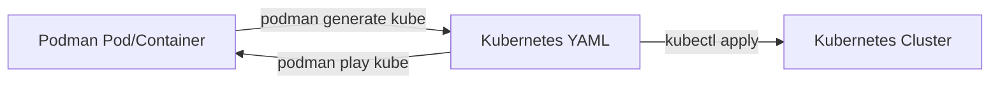

# How to Use Ansible to Generate Kubernetes YAML from Podman

Author: [nawazdhandala](https://www.github.com/nawazdhandala)

Tags: Ansible, Podman, Kubernetes, YAML, Migration

Description: Generate Kubernetes-compatible YAML manifests from running Podman pods and containers using Ansible for seamless migration.

---

One of Podman's most useful features is its ability to generate Kubernetes YAML manifests from running containers and pods. This lets you prototype your application on a single machine with Podman, then generate the Kubernetes manifests needed to deploy it to a cluster. Ansible can automate this workflow, making it easy to go from local development to production Kubernetes deployment.

## The Podman-to-Kubernetes Bridge

Podman was designed with Kubernetes compatibility in mind. The `podman generate kube` command produces valid Kubernetes Pod, Service, and PersistentVolumeClaim YAML from running Podman resources. Going the other direction, `podman play kube` can create Podman containers from Kubernetes YAML.



This bidirectional compatibility means you can develop locally and deploy to Kubernetes without rewriting your deployment manifests from scratch.

## Basic YAML Generation

Start by setting up a running Podman pod, then generate the Kubernetes YAML:

```yaml
# generate_basic.yml - Create a pod and generate its K8s manifest
---
- name: Generate Kubernetes YAML from Podman Pod
  hosts: dev_machines
  become: false
  vars:
    output_dir: "{{ ansible_user_dir }}/k8s-manifests"

  tasks:
    - name: Create output directory
      ansible.builtin.file:
        path: "{{ output_dir }}"
        state: directory
        mode: '0755'

    - name: Create a sample pod
      containers.podman.podman_pod:
        name: webapp-pod
        state: created
        ports:
          - "8080:80"

    - name: Add nginx container to pod
      containers.podman.podman_container:
        name: webapp-nginx
        image: docker.io/library/nginx:latest
        pod: webapp-pod
        state: started
        volumes:
          - "{{ ansible_user_dir }}/html:/usr/share/nginx/html:ro"

    - name: Generate Kubernetes YAML from the pod
      ansible.builtin.command:
        cmd: podman generate kube webapp-pod
      register: kube_yaml
      changed_when: false

    - name: Save the generated YAML
      ansible.builtin.copy:
        content: "{{ kube_yaml.stdout }}"
        dest: "{{ output_dir }}/webapp-pod.yaml"
        mode: '0644'

    - name: Display the generated manifest
      ansible.builtin.debug:
        msg: "{{ kube_yaml.stdout }}"
```

## Multi-Container Pod YAML Generation

A more realistic scenario involves a pod with multiple containers. Here is a full application stack:

```yaml
# generate_multicontainer.yml - Generate K8s YAML from a multi-container pod
---
- name: Build and Export Multi-Container Pod
  hosts: dev_machines
  become: false
  vars:
    output_dir: "{{ ansible_user_dir }}/k8s-manifests"

  tasks:
    - name: Create the application pod
      containers.podman.podman_pod:
        name: fullapp-pod
        state: created
        ports:
          - "80:80"
          - "9090:9090"

    - name: Add app volumes
      containers.podman.podman_volume:
        name: "{{ item }}"
        state: present
      loop:
        - app-data
        - app-logs

    - name: Run the main application
      containers.podman.podman_container:
        name: fullapp-api
        image: registry.example.com/api:latest
        pod: fullapp-pod
        state: started
        env:
          PORT: "8080"
          LOG_PATH: "/var/log/app"
        volumes:
          - "app-data:/app/data"
          - "app-logs:/var/log/app"

    - name: Run the nginx reverse proxy
      containers.podman.podman_container:
        name: fullapp-proxy
        image: docker.io/library/nginx:latest
        pod: fullapp-pod
        state: started

    - name: Run the metrics sidecar
      containers.podman.podman_container:
        name: fullapp-metrics
        image: docker.io/prom/node-exporter:latest
        pod: fullapp-pod
        state: started

    - name: Generate Kubernetes YAML with service definition
      ansible.builtin.command:
        cmd: podman generate kube --service fullapp-pod
      register: full_kube_yaml
      changed_when: false

    - name: Save the complete manifest
      ansible.builtin.copy:
        content: "{{ full_kube_yaml.stdout }}"
        dest: "{{ output_dir }}/fullapp-pod.yaml"
        mode: '0644'
```

The `--service` flag tells Podman to also generate a Kubernetes Service definition alongside the Pod manifest.

## Post-Processing the Generated YAML

The raw YAML from Podman is a good starting point, but it usually needs adjustments for production Kubernetes. Use Ansible to post-process the manifest:

```yaml
# postprocess_yaml.yml - Clean up and enhance generated K8s YAML
---
- name: Post-Process Generated Kubernetes YAML
  hosts: dev_machines
  become: false
  vars:
    source_yaml: "{{ ansible_user_dir }}/k8s-manifests/fullapp-pod.yaml"
    output_yaml: "{{ ansible_user_dir }}/k8s-manifests/fullapp-deployment.yaml"
    namespace: production
    replicas: 3

  tasks:
    - name: Read the generated YAML
      ansible.builtin.slurp:
        src: "{{ source_yaml }}"
      register: raw_yaml

    - name: Parse the YAML
      ansible.builtin.set_fact:
        k8s_resources: "{{ raw_yaml.content | b64decode | from_yaml_all | list }}"

    - name: Convert Pod to Deployment
      ansible.builtin.template:
        src: templates/deployment-wrapper.yml.j2
        dest: "{{ output_yaml }}"
        mode: '0644'
```

The Jinja2 template wraps the pod spec in a Deployment:

```yaml
# templates/deployment-wrapper.yml.j2 - Convert pod spec to Deployment
apiVersion: apps/v1
kind: Deployment
metadata:
  name: {{ k8s_resources[0].metadata.name | replace('-pod', '') }}
  namespace: {{ namespace }}
  labels:
    app: {{ k8s_resources[0].metadata.name | replace('-pod', '') }}
spec:
  replicas: {{ replicas }}
  selector:
    matchLabels:
      app: {{ k8s_resources[0].metadata.name | replace('-pod', '') }}
  template:
    metadata:
      labels:
        app: {{ k8s_resources[0].metadata.name | replace('-pod', '') }}
    spec:
      containers:

        - name: {{ container.name }}
          image: {{ container.image }}

          env:

            - name: {{ env_item.name }}
              value: "{{ env_item.value }}"



          ports:

            - containerPort: {{ port.containerPort }}



          volumeMounts:

            - name: {{ mount.name }}
              mountPath: {{ mount.mountPath }}

              readOnly: {{ mount.readOnly }}




```

## Playing Kubernetes YAML Back to Podman

The reverse operation is also useful. Take Kubernetes YAML and create Podman pods from it:

```yaml
# play_kube.yml - Create Podman pods from Kubernetes YAML
---
- name: Create Podman Pods from Kubernetes YAML
  hosts: dev_machines
  become: false
  vars:
    manifest_path: "{{ ansible_user_dir }}/k8s-manifests/app.yaml"

  tasks:
    - name: Create a Kubernetes manifest to play
      ansible.builtin.copy:
        dest: "{{ manifest_path }}"
        mode: '0644'
        content: |
          apiVersion: v1
          kind: Pod
          metadata:
            name: redis-pod
            labels:
              app: redis
          spec:
            containers:
              - name: redis
                image: docker.io/library/redis:7
                ports:
                  - containerPort: 6379
                resources:
                  limits:
                    memory: "256Mi"
                    cpu: "500m"
              - name: redis-exporter
                image: docker.io/oliver006/redis_exporter:latest
                ports:
                  - containerPort: 9121

    - name: Play the Kubernetes YAML with Podman
      ansible.builtin.command:
        cmd: "podman play kube {{ manifest_path }}"
      register: play_result
      changed_when: "'Pod' in play_result.stdout"

    - name: Show created resources
      ansible.builtin.debug:
        msg: "{{ play_result.stdout_lines }}"
```

## Automating the Dev-to-Production Workflow

Here is a complete workflow that develops locally with Podman, generates manifests, and validates them:

```yaml
# dev_to_prod.yml - Full dev-to-prod workflow
---
- name: Dev to Production Pipeline
  hosts: dev_machines
  become: false
  vars:
    app_name: myservice
    app_version: "1.0.0"
    manifest_dir: "{{ ansible_user_dir }}/k8s-manifests/{{ app_name }}"

  tasks:
    - name: Create manifest output directory
      ansible.builtin.file:
        path: "{{ manifest_dir }}"
        state: directory
        mode: '0755'

    - name: Create and configure the pod locally
      containers.podman.podman_pod:
        name: "{{ app_name }}-pod"
        state: created
        ports:
          - "8080:8080"

    - name: Run the application in the pod
      containers.podman.podman_container:
        name: "{{ app_name }}-app"
        image: "registry.example.com/{{ app_name }}:{{ app_version }}"
        pod: "{{ app_name }}-pod"
        state: started
        env:
          PORT: "8080"

    - name: Test the application locally
      ansible.builtin.uri:
        url: "http://localhost:8080/health"
        method: GET
      register: local_test
      retries: 10
      delay: 3
      until: local_test.status == 200

    - name: Generate Kubernetes manifests
      ansible.builtin.command:
        cmd: "podman generate kube --service {{ app_name }}-pod"
      register: generated_yaml
      changed_when: false

    - name: Save Pod and Service YAML
      ansible.builtin.copy:
        content: "{{ generated_yaml.stdout }}"
        dest: "{{ manifest_dir }}/pod-and-service.yaml"
        mode: '0644'

    - name: Validate the YAML syntax
      ansible.builtin.command:
        cmd: "python3 -c \"import yaml; yaml.safe_load_all(open('{{ manifest_dir }}/pod-and-service.yaml'))\""
      changed_when: false

    - name: Clean up local pod
      containers.podman.podman_pod:
        name: "{{ app_name }}-pod"
        state: absent
        force: true

    - name: Report generated files
      ansible.builtin.debug:
        msg: "Kubernetes manifests saved to {{ manifest_dir }}/pod-and-service.yaml"
```

## Generating YAML for Individual Containers

You do not need pods to generate YAML. Individual containers work too:

```yaml
# generate_from_container.yml - Generate K8s YAML from a standalone container
---
- name: Generate YAML from Standalone Container
  hosts: dev_machines
  become: false

  tasks:
    - name: Run a standalone container
      containers.podman.podman_container:
        name: standalone-redis
        image: docker.io/library/redis:7
        state: started
        ports:
          - "6379:6379"
        volumes:
          - redis-data:/data

    - name: Generate Kubernetes YAML
      ansible.builtin.command:
        cmd: podman generate kube standalone-redis
      register: container_yaml
      changed_when: false

    - name: Display the manifest
      ansible.builtin.debug:
        msg: "{{ container_yaml.stdout }}"

    - name: Clean up
      containers.podman.podman_container:
        name: standalone-redis
        state: absent
        force: true
```

## Summary

The ability to generate Kubernetes YAML from Podman pods and containers is a powerful bridge between local development and cluster deployment. Ansible can automate the entire workflow: create pods locally, verify they work, generate manifests, post-process them for production (adding Deployment wrappers, namespaces, resource limits), and validate the output. Going the other direction, `podman play kube` lets you test Kubernetes manifests on a local machine without needing a cluster. This round-trip capability makes Podman and Ansible a productive combination for teams that develop locally but deploy to Kubernetes.
