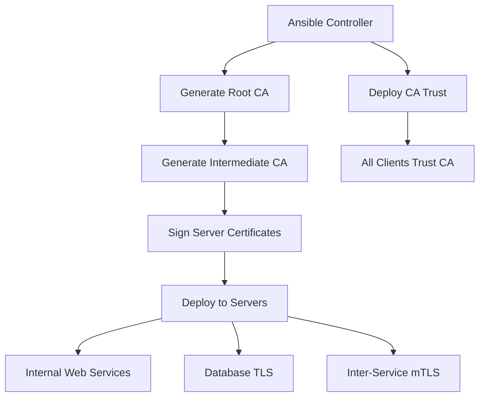

# How to Use Ansible to Generate Self-Signed Certificates

Author: [nawazdhandala](https://www.github.com/nawazdhandala)

Tags: Ansible, SSL, Self-Signed Certificates, Security, DevOps

Description: Generate and deploy self-signed SSL certificates for development and internal services using Ansible with OpenSSL and custom CA creation.

---

Self-signed certificates get a bad reputation, but they have legitimate uses. Development environments, internal services that never face the public internet, lab setups, and testing environments all benefit from TLS encryption without needing certificates from a public CA. The problem with self-signed certificates is not that they are inherently insecure; it is that they are usually created ad-hoc with inconsistent settings and nobody tracks when they expire.

Ansible solves both problems. You can generate self-signed certificates with consistent parameters, deploy them to all the servers that need them, and even create your own internal CA so that clients only need to trust one root certificate. In this guide, I will cover generating self-signed certificates, building an internal CA, and deploying everything with Ansible.

## What We Are Building



## Variables

```yaml
# group_vars/all.yml
# CA certificate settings
ca_dir: /opt/ansible-ca
ca_country: US
ca_state: California
ca_locality: "San Francisco"
ca_organization: "Example Corp"
ca_organizational_unit: "Engineering"
ca_common_name: "Example Corp Internal CA"
ca_key_size: 4096
ca_validity_days: 3650  # 10 years for CA

# Server certificate defaults
cert_key_size: 2048
cert_validity_days: 365
cert_output_dir: /opt/ansible-ca/certs

# Certificates to generate
self_signed_certs:
  - common_name: "dev-api.internal"
    san_dns:
      - dev-api.internal
      - localhost
    san_ip:
      - 10.0.1.10
      - 127.0.0.1
    deploy_to: appservers
    cert_dest: /etc/ssl/certs/dev-api.crt
    key_dest: /etc/ssl/private/dev-api.key
    services_to_reload:
      - nginx

  - common_name: "db.internal"
    san_dns:
      - db.internal
      - db-primary.internal
      - db-replica.internal
    san_ip:
      - 10.0.2.10
      - 10.0.2.11
    deploy_to: dbservers
    cert_dest: /etc/postgresql/ssl/server.crt
    key_dest: /etc/postgresql/ssl/server.key
    services_to_reload:
      - postgresql

  - common_name: "grafana.internal"
    san_dns:
      - grafana.internal
      - monitoring.internal
    san_ip:
      - 10.0.3.10
    deploy_to: monitoring
    cert_dest: /etc/grafana/ssl/grafana.crt
    key_dest: /etc/grafana/ssl/grafana.key
    services_to_reload:
      - grafana-server

# Client certificates for mutual TLS
mtls_client_certs:
  - common_name: "service-a-client"
    deploy_to: appservers
  - common_name: "service-b-client"
    deploy_to: appservers
```

## Internal CA Creation Role

First, create an internal Certificate Authority on the Ansible controller.

```yaml
# roles/internal-ca/tasks/main.yml
---
- name: Create CA directory structure
  ansible.builtin.file:
    path: "{{ item }}"
    state: directory
    mode: '0700'
  loop:
    - "{{ ca_dir }}"
    - "{{ ca_dir }}/private"
    - "{{ ca_dir }}/certs"
    - "{{ ca_dir }}/crl"
    - "{{ ca_dir }}/newcerts"
    - "{{ ca_dir }}/csr"
  delegate_to: localhost

- name: Create CA serial and index files
  ansible.builtin.file:
    path: "{{ ca_dir }}/{{ item }}"
    state: touch
    mode: '0644'
  loop:
    - index.txt
  delegate_to: localhost

- name: Initialize serial number
  ansible.builtin.copy:
    dest: "{{ ca_dir }}/serial"
    content: "1000"
    force: no
    mode: '0644'
  delegate_to: localhost

- name: Deploy OpenSSL CA configuration
  ansible.builtin.template:
    src: openssl-ca.cnf.j2
    dest: "{{ ca_dir }}/openssl-ca.cnf"
    mode: '0644'
  delegate_to: localhost

- name: Check if CA key already exists
  ansible.builtin.stat:
    path: "{{ ca_dir }}/private/ca.key"
  register: ca_key_stat
  delegate_to: localhost

- name: Generate CA private key
  community.crypto.openssl_privatekey:
    path: "{{ ca_dir }}/private/ca.key"
    size: "{{ ca_key_size }}"
    type: RSA
    mode: '0400'
  delegate_to: localhost
  when: not ca_key_stat.stat.exists

- name: Generate CA certificate
  community.crypto.x509_certificate:
    path: "{{ ca_dir }}/certs/ca.crt"
    privatekey_path: "{{ ca_dir }}/private/ca.key"
    provider: selfsigned
    selfsigned_not_after: "+{{ ca_validity_days }}d"
    mode: '0644'
  delegate_to: localhost
  when: not ca_key_stat.stat.exists
```

The OpenSSL configuration for the CA.

```jinja2
# roles/internal-ca/templates/openssl-ca.cnf.j2
# Internal CA Configuration - Managed by Ansible
[ca]
default_ca = CA_default

[CA_default]
dir               = {{ ca_dir }}
certs             = $dir/certs
crl_dir           = $dir/crl
new_certs_dir     = $dir/newcerts
database          = $dir/index.txt
serial            = $dir/serial
private_key       = $dir/private/ca.key
certificate       = $dir/certs/ca.crt
default_days      = {{ cert_validity_days }}
default_md        = sha256
preserve          = no
policy            = policy_loose

[policy_loose]
countryName             = optional
stateOrProvinceName     = optional
organizationName        = optional
organizationalUnitName  = optional
commonName              = supplied
emailAddress            = optional

[req]
default_bits        = {{ ca_key_size }}
distinguished_name  = req_distinguished_name
string_mask         = utf8only
default_md          = sha256
x509_extensions     = v3_ca

[req_distinguished_name]
countryName                     = Country Name
stateOrProvinceName             = State
localityName                    = Locality
organizationName                = Organization
organizationalUnitName          = Organizational Unit
commonName                      = Common Name

[v3_ca]
subjectKeyIdentifier = hash
authorityKeyIdentifier = keyid:always,issuer
basicConstraints = critical, CA:true
keyUsage = critical, digitalSignature, cRLSign, keyCertSign

[server_cert]
basicConstraints = CA:FALSE
nsCertType = server
nsComment = "Ansible Generated Server Certificate"
subjectKeyIdentifier = hash
authorityKeyIdentifier = keyid,issuer
keyUsage = critical, digitalSignature, keyEncipherment
extendedKeyUsage = serverAuth

[client_cert]
basicConstraints = CA:FALSE
nsCertType = client
nsComment = "Ansible Generated Client Certificate"
subjectKeyIdentifier = hash
authorityKeyIdentifier = keyid,issuer
keyUsage = critical, digitalSignature
extendedKeyUsage = clientAuth
```

## Server Certificate Generation Role

Generate certificates for each service signed by our internal CA.

```yaml
# roles/generate-certs/tasks/main.yml
---
- name: Generate server certificates
  ansible.builtin.include_tasks: generate-server-cert.yml
  loop: "{{ self_signed_certs }}"
  loop_control:
    loop_var: cert_spec
  delegate_to: localhost
```

Individual certificate generation.

```yaml
# roles/generate-certs/tasks/generate-server-cert.yml
---
- name: "Generate private key for {{ cert_spec.common_name }}"
  community.crypto.openssl_privatekey:
    path: "{{ cert_output_dir }}/{{ cert_spec.common_name }}.key"
    size: "{{ cert_key_size }}"
    type: RSA
    mode: '0600'

- name: "Generate CSR for {{ cert_spec.common_name }}"
  community.crypto.openssl_csr:
    path: "{{ ca_dir }}/csr/{{ cert_spec.common_name }}.csr"
    privatekey_path: "{{ cert_output_dir }}/{{ cert_spec.common_name }}.key"
    common_name: "{{ cert_spec.common_name }}"
    country_name: "{{ ca_country }}"
    state_or_province_name: "{{ ca_state }}"
    organization_name: "{{ ca_organization }}"
    subject_alt_name: >-
      {{ (cert_spec.san_dns | default([]) | map('regex_replace', '^', 'DNS:') | list)
         + (cert_spec.san_ip | default([]) | map('regex_replace', '^', 'IP:') | list) }}
    key_usage:
      - digitalSignature
      - keyEncipherment
    extended_key_usage:
      - serverAuth

- name: "Sign certificate for {{ cert_spec.common_name }} with internal CA"
  community.crypto.x509_certificate:
    path: "{{ cert_output_dir }}/{{ cert_spec.common_name }}.crt"
    csr_path: "{{ ca_dir }}/csr/{{ cert_spec.common_name }}.csr"
    ownca_path: "{{ ca_dir }}/certs/ca.crt"
    ownca_privatekey_path: "{{ ca_dir }}/private/ca.key"
    provider: ownca
    ownca_not_after: "+{{ cert_validity_days }}d"
    mode: '0644'

- name: "Create fullchain for {{ cert_spec.common_name }}"
  ansible.builtin.shell:
    cmd: >
      cat {{ cert_output_dir }}/{{ cert_spec.common_name }}.crt
      {{ ca_dir }}/certs/ca.crt
      > {{ cert_output_dir }}/{{ cert_spec.common_name }}-fullchain.crt
  changed_when: true

- name: "Verify the generated certificate"
  ansible.builtin.command:
    cmd: "openssl verify -CAfile {{ ca_dir }}/certs/ca.crt {{ cert_output_dir }}/{{ cert_spec.common_name }}.crt"
  register: verify_result
  changed_when: false

- name: "Show certificate details"
  ansible.builtin.command:
    cmd: "openssl x509 -in {{ cert_output_dir }}/{{ cert_spec.common_name }}.crt -noout -subject -dates -ext subjectAltName"
  register: cert_info
  changed_when: false

- name: "Display certificate info for {{ cert_spec.common_name }}"
  ansible.builtin.debug:
    msg: "{{ cert_info.stdout_lines }}"
```

## Client Certificate Generation for mTLS

```yaml
# roles/generate-certs/tasks/generate-client-cert.yml
---
- name: "Generate client key for {{ client_cert.common_name }}"
  community.crypto.openssl_privatekey:
    path: "{{ cert_output_dir }}/{{ client_cert.common_name }}.key"
    size: "{{ cert_key_size }}"
    type: RSA
    mode: '0600'
  delegate_to: localhost

- name: "Generate client CSR for {{ client_cert.common_name }}"
  community.crypto.openssl_csr:
    path: "{{ ca_dir }}/csr/{{ client_cert.common_name }}.csr"
    privatekey_path: "{{ cert_output_dir }}/{{ client_cert.common_name }}.key"
    common_name: "{{ client_cert.common_name }}"
    organization_name: "{{ ca_organization }}"
    key_usage:
      - digitalSignature
    extended_key_usage:
      - clientAuth
  delegate_to: localhost

- name: "Sign client certificate for {{ client_cert.common_name }}"
  community.crypto.x509_certificate:
    path: "{{ cert_output_dir }}/{{ client_cert.common_name }}.crt"
    csr_path: "{{ ca_dir }}/csr/{{ client_cert.common_name }}.csr"
    ownca_path: "{{ ca_dir }}/certs/ca.crt"
    ownca_privatekey_path: "{{ ca_dir }}/private/ca.key"
    provider: ownca
    ownca_not_after: "+{{ cert_validity_days }}d"
    mode: '0644'
  delegate_to: localhost
```

## Deploy Certificates to Servers

```yaml
# roles/deploy-self-signed/tasks/main.yml
---
- name: Deploy CA certificate for trust
  ansible.builtin.copy:
    src: "{{ ca_dir }}/certs/ca.crt"
    dest: "/usr/local/share/ca-certificates/internal-ca.crt"
    owner: root
    group: root
    mode: '0644'
  notify: Update CA trust store
  when: ansible_os_family == "Debian"

- name: Deploy CA certificate on RHEL
  ansible.builtin.copy:
    src: "{{ ca_dir }}/certs/ca.crt"
    dest: "/etc/pki/ca-trust/source/anchors/internal-ca.crt"
    owner: root
    group: root
    mode: '0644'
  notify: Update CA trust store RHEL
  when: ansible_os_family == "RedHat"

- name: Deploy server certificates
  ansible.builtin.include_tasks: deploy-cert.yml
  loop: "{{ self_signed_certs }}"
  loop_control:
    loop_var: cert_spec
  when: cert_spec.deploy_to in group_names or cert_spec.deploy_to == 'all'
```

```yaml
# roles/deploy-self-signed/tasks/deploy-cert.yml
---
- name: "Create certificate directory for {{ cert_spec.common_name }}"
  ansible.builtin.file:
    path: "{{ cert_spec.cert_dest | dirname }}"
    state: directory
    owner: root
    group: root
    mode: '0755'

- name: "Create key directory for {{ cert_spec.common_name }}"
  ansible.builtin.file:
    path: "{{ cert_spec.key_dest | dirname }}"
    state: directory
    owner: root
    group: root
    mode: '0750'

- name: "Deploy certificate for {{ cert_spec.common_name }}"
  ansible.builtin.copy:
    src: "{{ cert_output_dir }}/{{ cert_spec.common_name }}.crt"
    dest: "{{ cert_spec.cert_dest }}"
    owner: root
    group: root
    mode: '0644'
  notify: "Reload services"

- name: "Deploy private key for {{ cert_spec.common_name }}"
  ansible.builtin.copy:
    src: "{{ cert_output_dir }}/{{ cert_spec.common_name }}.key"
    dest: "{{ cert_spec.key_dest }}"
    owner: root
    group: root
    mode: '0600'
  notify: "Reload services"

- name: "Deploy CA chain"
  ansible.builtin.copy:
    src: "{{ ca_dir }}/certs/ca.crt"
    dest: "{{ cert_spec.cert_dest | dirname }}/ca.crt"
    owner: root
    group: root
    mode: '0644'
```

## Quick Self-Signed Certificate (No CA)

For quick development setups where you just need a certificate and do not want to set up a full CA.

```yaml
# roles/quick-self-signed/tasks/main.yml
---
- name: "Generate self-signed certificate for {{ item.common_name }}"
  community.crypto.openssl_privatekey:
    path: "{{ item.key_dest }}"
    size: 2048
    mode: '0600'
  loop: "{{ quick_certs | default([]) }}"

- name: "Generate self-signed certificate for {{ item.common_name }}"
  community.crypto.x509_certificate:
    path: "{{ item.cert_dest }}"
    privatekey_path: "{{ item.key_dest }}"
    provider: selfsigned
    selfsigned_not_after: "+365d"
    mode: '0644'
  loop: "{{ quick_certs | default([]) }}"
```

Usage in your variables.

```yaml
# For quick development certs
quick_certs:
  - common_name: localhost
    cert_dest: /etc/ssl/certs/localhost.crt
    key_dest: /etc/ssl/private/localhost.key
```

## Handlers

```yaml
# roles/deploy-self-signed/handlers/main.yml
---
- name: Update CA trust store
  ansible.builtin.command:
    cmd: update-ca-certificates

- name: Update CA trust store RHEL
  ansible.builtin.command:
    cmd: update-ca-trust

- name: Reload services
  ansible.builtin.service:
    name: "{{ item }}"
    state: reloaded
  loop: "{{ cert_spec.services_to_reload | default([]) }}"
  ignore_errors: yes
```

## Main Playbook

```yaml
# site.yml
---
- name: Create internal CA (runs on controller)
  hosts: localhost
  gather_facts: no
  roles:
    - internal-ca
    - generate-certs

- name: Deploy certificates to servers
  hosts: all
  become: yes
  roles:
    - deploy-self-signed
```

## Running the Playbook

```bash
# Generate and deploy all certificates
ansible-playbook -i inventory/hosts.ini site.yml

# Regenerate a specific certificate
ansible-playbook -i inventory/hosts.ini site.yml -e '{"self_signed_certs": [{"common_name": "dev-api.internal", "san_dns": ["dev-api.internal"], "deploy_to": "appservers", "cert_dest": "/etc/ssl/certs/dev-api.crt", "key_dest": "/etc/ssl/private/dev-api.key"}]}'

# Deploy only (skip generation if certs already exist)
ansible-playbook -i inventory/hosts.ini site.yml --tags deploy
```

## Wrapping Up

Self-signed certificates managed through Ansible give you encrypted communications for internal services without the cost or complexity of public CAs. The internal CA approach is strongly preferred over individual self-signed certificates because clients only need to trust one CA certificate instead of trusting each server's individual certificate. The community.crypto Ansible collection handles the heavy lifting of key generation, CSR creation, and certificate signing. For production environments, consider replacing the self-signed CA with a proper internal CA like HashiCorp Vault's PKI engine, but the deployment patterns from this guide remain the same.
