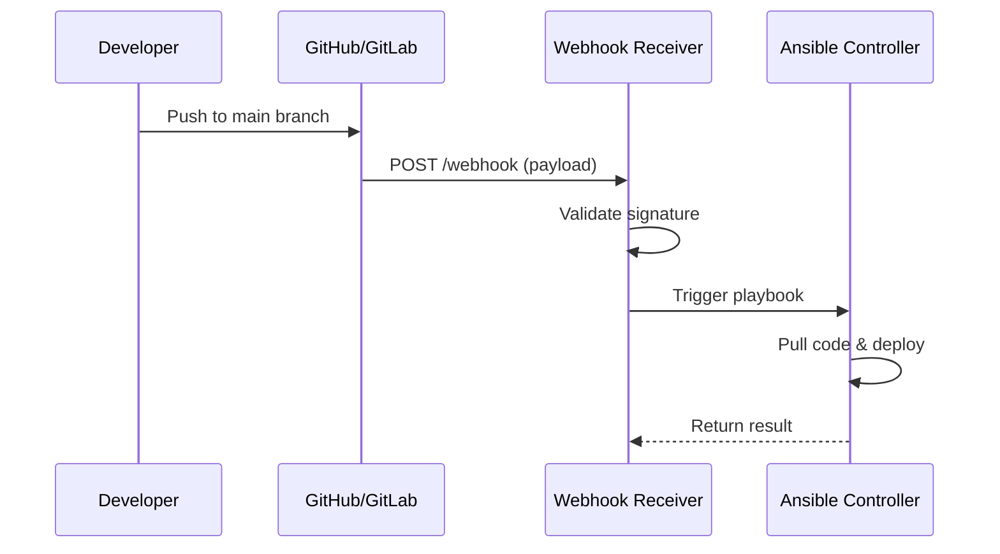

# How to Use Ansible with Git Webhooks for Auto-Deployment

Author: [nawazdhandala](https://www.github.com/nawazdhandala)

Tags: Ansible, Git Webhooks, Auto-Deployment, CI/CD

Description: Set up Git webhooks to automatically trigger Ansible deployments whenever code is pushed to your repository.

---

Manually running Ansible playbooks every time you want to deploy gets old quickly. Git webhooks solve this by letting your version control system notify a deployment server whenever code changes. The webhook hits an endpoint, your server validates the payload, and then kicks off an Ansible playbook. No human needed.

In this post, I will walk through building a lightweight webhook receiver that triggers Ansible deployments on push events from GitHub, GitLab, or Bitbucket.

## Architecture Overview

The flow is straightforward: a developer pushes code, the Git provider sends a webhook to your deployment server, the webhook receiver validates the request and triggers the appropriate Ansible playbook.



## Building the Webhook Receiver

Here is a simple Python Flask application that receives webhook events and triggers Ansible.

```python
# webhook_receiver.py
# Flask app that listens for Git webhooks and triggers Ansible deployments
import hmac
import hashlib
import subprocess
import json
import os
from flask import Flask, request, jsonify
from datetime import datetime

app = Flask(__name__)

WEBHOOK_SECRET = os.environ.get('WEBHOOK_SECRET', 'your-secret-here')
ANSIBLE_PLAYBOOK = '/opt/deploy/playbooks/deploy.yml'
ANSIBLE_INVENTORY = '/opt/deploy/inventory/production.yml'
LOG_FILE = '/var/log/ansible-deploy/webhook.log'

def verify_github_signature(payload, signature):
    """Verify the HMAC signature from GitHub webhooks."""
    expected = 'sha256=' + hmac.new(
        WEBHOOK_SECRET.encode(),
        payload,
        hashlib.sha256
    ).hexdigest()
    return hmac.compare_digest(expected, signature)

def log_deployment(message):
    """Write a log entry for the deployment."""
    timestamp = datetime.now().isoformat()
    with open(LOG_FILE, 'a') as f:
        f.write(f"[{timestamp}] {message}\n")

@app.route('/webhook', methods=['POST'])
def handle_webhook():
    # Verify the signature
    signature = request.headers.get('X-Hub-Signature-256', '')
    if not verify_github_signature(request.data, signature):
        log_deployment("REJECTED: Invalid signature")
        return jsonify({'error': 'Invalid signature'}), 403

    payload = request.json
    ref = payload.get('ref', '')
    repo = payload.get('repository', {}).get('full_name', 'unknown')

    # Only deploy on pushes to main branch
    if ref != 'refs/heads/main':
        return jsonify({'message': f'Ignoring push to {ref}'}), 200

    commit_sha = payload.get('after', 'unknown')
    log_deployment(f"Deploying {repo} at {commit_sha}")

    # Trigger Ansible playbook asynchronously
    cmd = [
        'ansible-playbook', ANSIBLE_PLAYBOOK,
        '-i', ANSIBLE_INVENTORY,
        '-e', f'deploy_version={commit_sha}',
        '-e', f'deploy_repo={repo}'
    ]

    try:
        result = subprocess.Popen(
            cmd,
            stdout=open(f'/var/log/ansible-deploy/{commit_sha}.log', 'w'),
            stderr=subprocess.STDOUT
        )
        log_deployment(f"Started deployment PID {result.pid}")
        return jsonify({
            'message': 'Deployment started',
            'commit': commit_sha,
            'pid': result.pid
        }), 202
    except Exception as e:
        log_deployment(f"FAILED: {str(e)}")
        return jsonify({'error': str(e)}), 500

if __name__ == '__main__':
    app.run(host='0.0.0.0', port=9000)
```

## The Deployment Playbook

Here is the Ansible playbook that the webhook receiver triggers.

```yaml
# playbooks/deploy.yml
# Pull latest code from Git and deploy the application
---
- name: Auto-deploy from webhook
  hosts: webservers
  serial: 2
  become: true
  vars:
    app_dir: /opt/myapp
    deploy_version: "{{ deploy_version | default('HEAD') }}"

  tasks:
    - name: Pull latest code
      git:
        repo: "https://github.com/{{ deploy_repo }}.git"
        dest: "{{ app_dir }}"
        version: "{{ deploy_version }}"
        force: true
      register: git_result

    - name: Install dependencies
      command: npm ci
      args:
        chdir: "{{ app_dir }}"
      when: git_result.changed

    - name: Build application
      command: npm run build
      args:
        chdir: "{{ app_dir }}"
      when: git_result.changed

    - name: Restart application service
      systemd:
        name: myapp
        state: restarted
      when: git_result.changed

    - name: Verify application health
      uri:
        url: "http://{{ ansible_host }}:8080/health"
        status_code: 200
      register: health
      until: health.status == 200
      retries: 10
      delay: 5
```

## Deploying the Webhook Receiver with Ansible

You can use Ansible itself to set up the webhook receiver on your deployment server.

```yaml
# playbooks/setup-webhook-receiver.yml
# Install and configure the webhook receiver service
---
- name: Setup webhook receiver
  hosts: deploy_server
  become: true

  tasks:
    - name: Install Python dependencies
      pip:
        name:
          - flask
          - gunicorn
        state: present

    - name: Create deployment directories
      file:
        path: "{{ item }}"
        state: directory
        owner: deploy
        group: deploy
      loop:
        - /opt/deploy
        - /opt/deploy/playbooks
        - /var/log/ansible-deploy

    - name: Copy webhook receiver script
      copy:
        src: ../files/webhook_receiver.py
        dest: /opt/deploy/webhook_receiver.py
        owner: deploy
        group: deploy
        mode: '0755'

    - name: Create systemd service for webhook receiver
      copy:
        dest: /etc/systemd/system/webhook-receiver.service
        content: |
          [Unit]
          Description=Git Webhook Receiver for Ansible
          After=network.target

          [Service]
          Type=simple
          User=deploy
          Group=deploy
          WorkingDirectory=/opt/deploy
          Environment=WEBHOOK_SECRET={{ webhook_secret }}
          ExecStart=/usr/local/bin/gunicorn -w 2 -b 0.0.0.0:9000 webhook_receiver:app
          Restart=always
          RestartSec=5

          [Install]
          WantedBy=multi-user.target

    - name: Enable and start webhook receiver
      systemd:
        name: webhook-receiver
        enabled: true
        state: started
        daemon_reload: true
```

## Configuring the GitHub Webhook

Go to your GitHub repository settings, click Webhooks, and add a new webhook with these settings:

- Payload URL: `https://deploy.myorg.com:9000/webhook`
- Content type: `application/json`
- Secret: The same secret you set in `WEBHOOK_SECRET`
- Events: Select "Just the push event"

For GitLab, the process is similar but the signature header is different. Here is how to verify GitLab webhooks.

```python
# GitLab uses a simple token header instead of HMAC
def verify_gitlab_token(request):
    """Verify the webhook token from GitLab."""
    token = request.headers.get('X-Gitlab-Token', '')
    return hmac.compare_digest(token, WEBHOOK_SECRET)
```

## Adding Branch-Based Deployment Logic

In practice, you probably want different branches to deploy to different environments. Here is an enhanced version of the webhook handler.

```python
# Branch-to-environment mapping for multi-environment deployments
BRANCH_CONFIG = {
    'refs/heads/main': {
        'inventory': '/opt/deploy/inventory/production.yml',
        'playbook': '/opt/deploy/playbooks/deploy.yml',
        'extra_vars': {'env_name': 'production'}
    },
    'refs/heads/staging': {
        'inventory': '/opt/deploy/inventory/staging.yml',
        'playbook': '/opt/deploy/playbooks/deploy.yml',
        'extra_vars': {'env_name': 'staging'}
    },
    'refs/heads/develop': {
        'inventory': '/opt/deploy/inventory/dev.yml',
        'playbook': '/opt/deploy/playbooks/deploy.yml',
        'extra_vars': {'env_name': 'development'}
    }
}

@app.route('/webhook', methods=['POST'])
def handle_webhook():
    # ... signature verification ...

    ref = payload.get('ref', '')
    config = BRANCH_CONFIG.get(ref)

    if not config:
        return jsonify({'message': f'No deployment configured for {ref}'}), 200

    commit_sha = payload.get('after', 'unknown')
    extra_vars = {**config['extra_vars'], 'deploy_version': commit_sha}
    extra_vars_str = ' '.join(f'{k}={v}' for k, v in extra_vars.items())

    cmd = [
        'ansible-playbook', config['playbook'],
        '-i', config['inventory'],
        '-e', extra_vars_str
    ]
    # ... run command ...
```

## Securing the Webhook Endpoint

Your webhook receiver is an internet-facing service that can trigger deployments, so security is critical. Put it behind Nginx with TLS.

```nginx
# /etc/nginx/sites-available/webhook
# Nginx reverse proxy with TLS for the webhook receiver
server {
    listen 443 ssl;
    server_name deploy.myorg.com;

    ssl_certificate /etc/letsencrypt/live/deploy.myorg.com/fullchain.pem;
    ssl_certificate_key /etc/letsencrypt/live/deploy.myorg.com/privkey.pem;

    # Only allow requests from GitHub webhook IPs
    allow 140.82.112.0/20;
    allow 185.199.108.0/22;
    allow 192.30.252.0/22;
    deny all;

    location /webhook {
        proxy_pass http://127.0.0.1:9000;
        proxy_set_header Host $host;
        proxy_set_header X-Real-IP $remote_addr;
        proxy_set_header X-Hub-Signature-256 $http_x_hub_signature_256;
    }
}
```

## Conclusion

Git webhooks combined with Ansible give you a simple, self-hosted auto-deployment pipeline. You do not need a full CI/CD platform for straightforward deploy-on-push workflows. The webhook receiver validates incoming requests, determines which environment to deploy to based on the branch, and triggers the appropriate Ansible playbook. Add TLS, IP allowlisting, and HMAC signature verification, and you have a secure deployment trigger that runs without any manual intervention.
