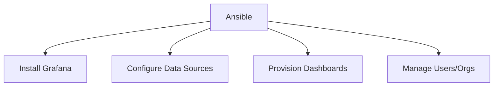

# How to Use Ansible with Grafana for Dashboard Provisioning

Author: [nawazdhandala](https://www.github.com/nawazdhandala)

Tags: Ansible, Grafana, Monitoring, Dashboards

Description: Automate Grafana deployment and dashboard provisioning with Ansible to maintain consistent monitoring dashboards across environments.

---

Grafana turns metrics into visual dashboards. Manually creating dashboards through the UI works for exploration, but production dashboards should be provisioned as code. Ansible can install Grafana, configure data sources, and deploy dashboards from JSON templates.

## Grafana Deployment Architecture



## Installing Grafana

```yaml
# roles/grafana/tasks/main.yml
---
- name: Add Grafana GPG key
  ansible.builtin.apt_key:
    url: https://apt.grafana.com/gpg.key
    state: present

- name: Add Grafana repository
  ansible.builtin.apt_repository:
    repo: "deb https://apt.grafana.com stable main"
    state: present

- name: Install Grafana
  ansible.builtin.apt:
    name: grafana
    state: present
    update_cache: true

- name: Deploy Grafana configuration
  ansible.builtin.template:
    src: grafana.ini.j2
    dest: /etc/grafana/grafana.ini
    mode: '0640'
    owner: grafana
  notify: restart grafana

- name: Ensure Grafana is running
  ansible.builtin.service:
    name: grafana-server
    state: started
    enabled: true
```

## Configuring Data Sources

```yaml
# roles/grafana/tasks/datasources.yml
---
- name: Configure Prometheus data source
  ansible.builtin.uri:
    url: "http://localhost:3000/api/datasources"
    method: POST
    headers:
      Authorization: "Bearer {{ grafana_api_key }}"
    body_format: json
    body:
      name: Prometheus
      type: prometheus
      url: "http://{{ prometheus_host }}:9090"
      access: proxy
      isDefault: true
    status_code: [200, 409]

- name: Configure Loki data source
  ansible.builtin.uri:
    url: "http://localhost:3000/api/datasources"
    method: POST
    headers:
      Authorization: "Bearer {{ grafana_api_key }}"
    body_format: json
    body:
      name: Loki
      type: loki
      url: "http://{{ loki_host }}:3100"
      access: proxy
    status_code: [200, 409]
```

## Provisioning Dashboards

```yaml
# roles/grafana/tasks/dashboards.yml
---
- name: Create dashboard provisioning config
  ansible.builtin.copy:
    content: |
      apiVersion: 1
      providers:
        - name: 'default'
          orgId: 1
          folder: 'Provisioned'
          type: file
          disableDeletion: false
          updateIntervalSeconds: 30
          options:
            path: /var/lib/grafana/dashboards
    dest: /etc/grafana/provisioning/dashboards/default.yml
    mode: '0644'
  notify: restart grafana

- name: Deploy dashboard JSON files
  ansible.builtin.template:
    src: "dashboards/{{ item }}.json.j2"
    dest: "/var/lib/grafana/dashboards/{{ item }}.json"
    mode: '0644'
  loop:
    - node-overview
    - application-performance
    - database-metrics
  notify: restart grafana
```

## Dashboard via API

```yaml
# tasks/grafana-dashboard-api.yml
---
- name: Deploy dashboard via API
  ansible.builtin.uri:
    url: "http://localhost:3000/api/dashboards/db"
    method: POST
    headers:
      Authorization: "Bearer {{ grafana_api_key }}"
    body_format: json
    body:
      dashboard: "{{ lookup('file', 'dashboards/' + item + '.json') | from_json }}"
      overwrite: true
      folderId: 0
  loop:
    - system-overview
    - app-metrics
```

## Key Takeaways

Provisioning Grafana with Ansible ensures consistent dashboards across environments. Install Grafana, configure data sources, and deploy dashboards all through playbooks. Use the file provisioning method for dashboards that should always exist, and the API method for dashboards that change frequently. Store dashboard JSON in your repository alongside your Ansible code.

## Common Use Cases

Here are several practical scenarios where this module proves essential in real-world playbooks.

### Infrastructure Provisioning Workflow

```yaml
# Complete workflow incorporating this module
- name: Infrastructure provisioning
  hosts: all
  become: true
  gather_facts: true
  tasks:
    - name: Gather system information
      ansible.builtin.setup:
        gather_subset:
          - hardware
          - network

    - name: Display system summary
      ansible.builtin.debug:
        msg: >-
          Host {{ inventory_hostname }} has
          {{ ansible_memtotal_mb }}MB RAM,
          {{ ansible_processor_vcpus }} vCPUs,
          running {{ ansible_distribution }} {{ ansible_distribution_version }}

    - name: Install required packages
      ansible.builtin.package:
        name:
          - curl
          - wget
          - git
          - vim
          - htop
          - jq
        state: present

    - name: Configure system timezone
      ansible.builtin.timezone:
        name: "{{ system_timezone | default('UTC') }}"

    - name: Configure hostname
      ansible.builtin.hostname:
        name: "{{ inventory_hostname }}"

    - name: Update /etc/hosts
      ansible.builtin.lineinfile:
        path: /etc/hosts
        regexp: '^127\.0\.1\.1'
        line: "127.0.1.1 {{ inventory_hostname }}"

    - name: Configure SSH hardening
      ansible.builtin.lineinfile:
        path: /etc/ssh/sshd_config
        regexp: "{{ item.regexp }}"
        line: "{{ item.line }}"
      loop:
        - { regexp: '^PermitRootLogin', line: 'PermitRootLogin no' }
        - { regexp: '^PasswordAuthentication', line: 'PasswordAuthentication no' }
      notify: restart sshd

    - name: Configure firewall rules
      community.general.ufw:
        rule: allow
        port: "{{ item }}"
        proto: tcp
      loop:
        - "22"
        - "80"
        - "443"

    - name: Enable firewall
      community.general.ufw:
        state: enabled
        policy: deny

  handlers:
    - name: restart sshd
      ansible.builtin.service:
        name: sshd
        state: restarted
```

### Integration with Monitoring

```yaml
# Using gathered facts to configure monitoring thresholds
- name: Configure monitoring based on system specs
  hosts: all
  become: true
  tasks:
    - name: Set monitoring thresholds based on hardware
      ansible.builtin.template:
        src: monitoring_config.yml.j2
        dest: /etc/monitoring/config.yml
      vars:
        memory_warning_threshold: "{{ (ansible_memtotal_mb * 0.8) | int }}"
        memory_critical_threshold: "{{ (ansible_memtotal_mb * 0.95) | int }}"
        cpu_warning_threshold: 80
        cpu_critical_threshold: 95

    - name: Register host with monitoring system
      ansible.builtin.uri:
        url: "https://monitoring.example.com/api/hosts"
        method: POST
        body_format: json
        body:
          hostname: "{{ inventory_hostname }}"
          ip_address: "{{ ansible_default_ipv4.address }}"
          os: "{{ ansible_distribution }}"
          memory_mb: "{{ ansible_memtotal_mb }}"
          cpus: "{{ ansible_processor_vcpus }}"
        headers:
          Authorization: "Bearer {{ monitoring_api_token }}"
        status_code: [200, 201, 409]
```

### Error Handling Patterns

```yaml
# Robust error handling with this module
- name: Robust task execution
  hosts: all
  tasks:
    - name: Attempt primary operation
      ansible.builtin.command: /opt/app/primary-task.sh
      register: primary_result
      failed_when: false

    - name: Handle primary failure with fallback
      ansible.builtin.command: /opt/app/fallback-task.sh
      when: primary_result.rc != 0
      register: fallback_result

    - name: Report final status
      ansible.builtin.debug:
        msg: >-
          Task completed via {{ 'primary' if primary_result.rc == 0 else 'fallback' }} path.
          Return code: {{ primary_result.rc if primary_result.rc == 0 else fallback_result.rc }}

    - name: Fail if both paths failed
      ansible.builtin.fail:
        msg: "Both primary and fallback operations failed"
      when:
        - primary_result.rc != 0
        - fallback_result is defined
        - fallback_result.rc != 0
```

### Scheduling and Automation

```yaml
# Set up scheduled compliance scans using cron
- name: Configure automated scans
  hosts: all
  become: true
  tasks:
    - name: Create scan script
      ansible.builtin.copy:
        dest: /opt/scripts/compliance_scan.sh
        mode: '0755'
        content: |
          #!/bin/bash
          cd /opt/ansible
          ansible-playbook playbooks/validate.yml -i inventory/ > /var/log/compliance_scan.log 2>&1
          EXIT_CODE=$?
          if [ $EXIT_CODE -ne 0 ]; then
            curl -X POST https://hooks.example.com/alert \
              -H "Content-Type: application/json" \
              -d "{\"text\":\"Compliance scan failed on $(hostname)\"}"
          fi
          exit $EXIT_CODE

    - name: Schedule weekly compliance scan
      ansible.builtin.cron:
        name: "Weekly compliance scan"
        minute: "0"
        hour: "3"
        weekday: "1"
        job: "/opt/scripts/compliance_scan.sh"
        user: ansible
```

