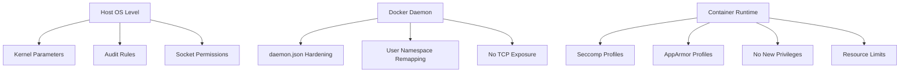

# How to Use Ansible to Harden Docker Installations

Author: [nawazdhandala](https://www.github.com/nawazdhandala)

Tags: Ansible, Docker, Security, Hardening, DevOps

Description: Automate Docker security hardening across your infrastructure using Ansible playbooks based on CIS Docker Benchmark recommendations.

---

Docker out of the box is not secure enough for production. The default configuration leaves several attack surfaces open, from the Docker daemon socket to container privilege escalation. I have seen too many production environments running Docker with default settings, which is essentially an invitation for trouble. This post covers how to use Ansible to systematically harden Docker installations following CIS Docker Benchmark guidelines.

## What We Are Hardening

The CIS Docker Benchmark covers several areas: host configuration, daemon configuration, container runtime, images, and Docker Swarm (if used). We will focus on the most impactful items that apply to standalone Docker hosts.

## Base Docker Installation with Security in Mind

Let us start with a secure Docker installation playbook that sets things up correctly from the beginning.

This playbook installs Docker CE from the official repository and configures secure defaults:

```yaml
# install-docker-secure.yml - Secure Docker CE installation
---
- name: Install and Harden Docker
  hosts: docker_hosts
  become: true
  vars:
    docker_users:
      - deploy
    docker_storage_driver: overlay2
    docker_log_max_size: "50m"
    docker_log_max_file: "3"

  tasks:
    - name: Remove old Docker packages if present
      ansible.builtin.apt:
        name:
          - docker
          - docker-engine
          - docker.io
          - containerd
          - runc
        state: absent
      when: ansible_os_family == "Debian"

    - name: Install prerequisites
      ansible.builtin.apt:
        name:
          - apt-transport-https
          - ca-certificates
          - curl
          - gnupg
          - lsb-release
        state: present
        update_cache: true
      when: ansible_os_family == "Debian"

    - name: Add Docker GPG key
      ansible.builtin.shell: |
        curl -fsSL https://download.docker.com/linux/ubuntu/gpg | \
        gpg --dearmor -o /usr/share/keyrings/docker-archive-keyring.gpg
      args:
        creates: /usr/share/keyrings/docker-archive-keyring.gpg

    - name: Add Docker APT repository
      ansible.builtin.apt_repository:
        repo: >-
          deb [arch=amd64 signed-by=/usr/share/keyrings/docker-archive-keyring.gpg]
          https://download.docker.com/linux/ubuntu {{ ansible_distribution_release }} stable
        state: present
      when: ansible_os_family == "Debian"

    - name: Install Docker CE
      ansible.builtin.apt:
        name:
          - docker-ce
          - docker-ce-cli
          - containerd.io
        state: present
        update_cache: true
```

## Hardening the Docker Daemon

The daemon configuration is where most security gains happen. This is the daemon.json file that locks things down.

This task deploys a hardened daemon.json configuration:

```yaml
    - name: Create Docker configuration directory
      ansible.builtin.file:
        path: /etc/docker
        state: directory
        mode: '0755'

    - name: Deploy hardened Docker daemon configuration
      ansible.builtin.copy:
        dest: /etc/docker/daemon.json
        mode: '0644'
        content: |
          {
            "storage-driver": "{{ docker_storage_driver }}",
            "log-driver": "json-file",
            "log-opts": {
              "max-size": "{{ docker_log_max_size }}",
              "max-file": "{{ docker_log_max_file }}"
            },
            "live-restore": true,
            "userland-proxy": false,
            "no-new-privileges": true,
            "icc": false,
            "userns-remap": "default",
            "default-ulimits": {
              "nofile": {
                "Name": "nofile",
                "Hard": 64000,
                "Soft": 64000
              },
              "nproc": {
                "Name": "nproc",
                "Hard": 4096,
                "Soft": 4096
              }
            },
            "default-address-pools": [
              {
                "base": "172.17.0.0/12",
                "size": 24
              }
            ]
          }
      notify: Restart Docker
```

Let me break down what each setting does:

- **live-restore**: Keeps containers running during daemon upgrades
- **userland-proxy**: Disabling this uses iptables instead, which is more performant and secure
- **no-new-privileges**: Prevents processes inside containers from gaining additional privileges
- **icc**: Disabling inter-container communication forces you to use explicit links or networks
- **userns-remap**: Maps container root to a non-root user on the host

## Securing the Docker Socket

The Docker socket is the single most dangerous thing on a Docker host. Anyone with access to it has root-equivalent privileges.

This section locks down the Docker socket permissions:

```yaml
    - name: Create docker group if it does not exist
      ansible.builtin.group:
        name: docker
        state: present

    - name: Add authorized users to docker group
      ansible.builtin.user:
        name: "{{ item }}"
        groups: docker
        append: true
      loop: "{{ docker_users }}"

    - name: Set secure permissions on Docker socket directory
      ansible.builtin.file:
        path: /var/run/docker.sock
        owner: root
        group: docker
        mode: '0660'

    - name: Ensure Docker socket is not exposed over TCP
      ansible.builtin.lineinfile:
        path: /lib/systemd/system/docker.service
        regexp: '^ExecStart=.*-H tcp://'
        state: absent
      notify: Reload systemd
```

## Kernel Security Parameters for Docker

Several kernel parameters improve Docker security. These should be set on every Docker host.

This task configures sysctl parameters that enhance container isolation:

```yaml
    - name: Set kernel security parameters for Docker
      ansible.posix.sysctl:
        name: "{{ item.key }}"
        value: "{{ item.value }}"
        sysctl_set: true
        state: present
        reload: true
      loop:
        # Prevent IP spoofing
        - { key: "net.ipv4.conf.all.rp_filter", value: "1" }
        # Disable IP forwarding source routing
        - { key: "net.ipv4.conf.all.accept_source_route", value: "0" }
        # Enable TCP SYN cookies for SYN flood protection
        - { key: "net.ipv4.tcp_syncookies", value: "1" }
        # Restrict kernel pointer exposure
        - { key: "kernel.kptr_restrict", value: "2" }
        # Restrict dmesg access
        - { key: "kernel.dmesg_restrict", value: "1" }
        # Limit user namespace usage (if not using userns-remap)
        - { key: "kernel.unprivileged_userns_clone", value: "0" }
```

## Auditing Docker Files and Directories

The CIS benchmark requires auditing Docker-related files. This helps you detect unauthorized changes.

This task sets up auditd rules for Docker:

```yaml
    - name: Install auditd
      ansible.builtin.apt:
        name: auditd
        state: present

    - name: Configure audit rules for Docker
      ansible.builtin.copy:
        dest: /etc/audit/rules.d/docker.rules
        mode: '0640'
        content: |
          # Monitor Docker daemon configuration
          -w /etc/docker -p wa -k docker-config
          -w /etc/docker/daemon.json -p wa -k docker-config

          # Monitor Docker service files
          -w /lib/systemd/system/docker.service -p wa -k docker-service
          -w /lib/systemd/system/docker.socket -p wa -k docker-service

          # Monitor Docker socket
          -w /var/run/docker.sock -p wa -k docker-socket

          # Monitor Docker data directory
          -w /var/lib/docker -p wa -k docker-data

          # Monitor Docker executables
          -w /usr/bin/docker -p wa -k docker-binary
          -w /usr/bin/containerd -p wa -k docker-binary
          -w /usr/bin/runc -p wa -k docker-binary
      notify: Restart auditd
```

## Container Runtime Restrictions

Beyond the daemon, you should enforce restrictions on how containers run. This role creates a default AppArmor profile and seccomp profile.

This task deploys a custom seccomp profile that blocks dangerous syscalls:

```yaml
    - name: Create custom seccomp profile directory
      ansible.builtin.file:
        path: /etc/docker/seccomp
        state: directory
        mode: '0755'

    - name: Deploy restrictive seccomp profile
      ansible.builtin.copy:
        dest: /etc/docker/seccomp/default.json
        mode: '0644'
        # This blocks syscalls that containers rarely need
        # but attackers commonly exploit
        content: |
          {
            "defaultAction": "SCMP_ACT_ERRNO",
            "syscalls": [
              {
                "names": [
                  "accept", "accept4", "access", "alarm", "bind",
                  "brk", "chdir", "chmod", "chown", "clock_getres",
                  "clock_gettime", "clone", "close", "connect", "dup",
                  "dup2", "dup3", "epoll_create", "epoll_ctl", "epoll_wait",
                  "execve", "exit", "exit_group", "fchmod", "fchown",
                  "fcntl", "fork", "fstat", "futex", "getcwd",
                  "getdents", "getegid", "geteuid", "getgid", "getpid",
                  "getppid", "getuid", "ioctl", "kill", "listen",
                  "lseek", "lstat", "madvise", "mkdir", "mmap",
                  "mprotect", "munmap", "nanosleep", "open", "openat",
                  "pipe", "poll", "prctl", "pread64", "pwrite64",
                  "read", "readlink", "recvfrom", "recvmsg", "rename",
                  "rmdir", "rt_sigaction", "rt_sigreturn", "select",
                  "sendmsg", "sendto", "set_tid_address", "setgid",
                  "setuid", "sigaltstack", "socket", "stat", "statfs",
                  "symlink", "unlink", "wait4", "write"
                ],
                "action": "SCMP_ACT_ALLOW"
              }
            ]
          }
```

## Handlers Section

These handlers are referenced by the tasks above:

```yaml
  handlers:
    - name: Restart Docker
      ansible.builtin.systemd:
        name: docker
        state: restarted

    - name: Reload systemd
      ansible.builtin.systemd:
        daemon_reload: true

    - name: Restart auditd
      ansible.builtin.service:
        name: auditd
        state: restarted
```

## Hardening Verification Playbook

After applying all the hardening, run this verification playbook to check the results.

This playbook validates that Docker hardening is applied correctly:

```yaml
# verify-docker-hardening.yml - Check hardening status
---
- name: Verify Docker Hardening
  hosts: docker_hosts
  become: true
  tasks:
    - name: Check Docker daemon configuration
      ansible.builtin.command: docker info --format '{{ "{{" }} json . {{ "}}" }}'
      register: docker_info
      changed_when: false

    - name: Verify no-new-privileges is set
      ansible.builtin.assert:
        that:
          - "'no-new-privileges' in docker_info.stdout"
        fail_msg: "no-new-privileges is not enabled"

    - name: Check Docker socket permissions
      ansible.builtin.stat:
        path: /var/run/docker.sock
      register: socket_stat

    - name: Verify socket is not world-readable
      ansible.builtin.assert:
        that:
          - not socket_stat.stat.roth
          - not socket_stat.stat.woth
        fail_msg: "Docker socket has overly permissive access"

    - name: Check that Docker is not listening on TCP
      ansible.builtin.shell: |
        ss -tlnp | grep -c "2375\|2376" || echo "0"
      register: tcp_check
      changed_when: false

    - name: Verify Docker TCP port is not exposed
      ansible.builtin.assert:
        that:
          - tcp_check.stdout | int == 0
        fail_msg: "Docker is listening on TCP - this is a security risk"
```

## Security Hardening Layers

Here is a visual overview of what we have secured:



Docker hardening is not a one-time task. New CVEs come out regularly, and your hardening playbooks should evolve with them. The playbooks above give you a solid foundation that covers the most critical CIS Docker Benchmark recommendations. Run them against every Docker host in your fleet and sleep a little better at night.
