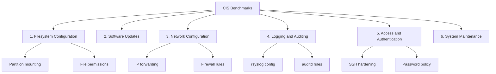

# How to Use Ansible to Harden Linux Servers (CIS Benchmarks)

Author: [nawazdhandala](https://www.github.com/nawazdhandala)

Tags: Ansible, Security, CIS Benchmarks, Linux Hardening, DevOps

Description: Implement CIS Benchmark security controls on Linux servers using Ansible playbooks for automated and repeatable system hardening.

---

The Center for Internet Security (CIS) Benchmarks are the industry standard for server hardening. They provide specific, actionable configuration recommendations for every major operating system. The problem is that a typical CIS Benchmark for Ubuntu or RHEL has over 200 individual controls, and applying them manually is not realistic when you have more than a handful of servers.

Ansible makes CIS compliance achievable by codifying each control into tasks that can be applied consistently across your entire fleet. In this guide, I will walk through implementing key CIS Benchmark controls for Ubuntu/Debian and RHEL/CentOS using Ansible. We will cover filesystem hardening, user account policies, network configuration, logging, and access controls.

## CIS Benchmark Categories



## Project Structure

```bash
cis-hardening/
  inventory/
    hosts.ini
  group_vars/
    all.yml
  roles/
    cis-filesystem/
    cis-network/
    cis-logging/
    cis-access/
    cis-services/
    cis-audit/
  site.yml
```

## Variables

Control which CIS sections to apply and configure exception handling.

```yaml
# group_vars/all.yml
# CIS Benchmark version
cis_benchmark_version: "2.0.0"

# Enable/disable sections (useful for phased rollout)
cis_filesystem_enabled: true
cis_network_enabled: true
cis_logging_enabled: true
cis_access_enabled: true
cis_services_enabled: true
cis_audit_enabled: true

# Password policy
cis_password_max_days: 365
cis_password_min_days: 7
cis_password_warn_days: 7
cis_password_min_length: 14
cis_password_remember: 5

# SSH configuration
cis_ssh_max_auth_tries: 4
cis_ssh_client_alive_interval: 300
cis_ssh_client_alive_count_max: 3
cis_ssh_login_grace_time: 60
cis_ssh_allow_groups: "sshusers"

# Audit log retention
cis_audit_max_log_file: 8
cis_audit_max_log_file_action: keep_logs
cis_audit_space_left_action: email
cis_audit_admin_space_left_action: halt

# Services to disable
cis_disabled_services:
  - avahi-daemon
  - cups
  - isc-dhcp-server
  - slapd
  - nfs-server
  - rpcbind
  - vsftpd
  - apache2
  - dovecot
  - smbd
  - squid
  - snmpd
  - nis
  - rsh-server
  - talk
  - telnet
  - tftp
  - xinetd

# Allowed cron users
cis_cron_allow_users:
  - root
```

## Filesystem Hardening (CIS Section 1)

```yaml
# roles/cis-filesystem/tasks/main.yml
---
# 1.1.1 - Disable unused filesystems
- name: "1.1.1 - Disable cramfs filesystem"
  ansible.builtin.copy:
    dest: /etc/modprobe.d/cramfs.conf
    content: |
      install cramfs /bin/true
      blacklist cramfs
    owner: root
    group: root
    mode: '0644'

- name: "1.1.1 - Disable freevxfs filesystem"
  ansible.builtin.copy:
    dest: /etc/modprobe.d/freevxfs.conf
    content: |
      install freevxfs /bin/true
      blacklist freevxfs
    owner: root
    group: root
    mode: '0644'

- name: "1.1.1 - Disable squashfs filesystem"
  ansible.builtin.copy:
    dest: /etc/modprobe.d/squashfs.conf
    content: |
      install squashfs /bin/true
      blacklist squashfs
    owner: root
    group: root
    mode: '0644'

- name: "1.1.1 - Disable udf filesystem"
  ansible.builtin.copy:
    dest: /etc/modprobe.d/udf.conf
    content: |
      install udf /bin/true
      blacklist udf
    owner: root
    group: root
    mode: '0644'

- name: "1.1.1 - Disable usb-storage"
  ansible.builtin.copy:
    dest: /etc/modprobe.d/usb-storage.conf
    content: |
      install usb-storage /bin/true
      blacklist usb-storage
    owner: root
    group: root
    mode: '0644'

# 1.4 - Secure boot settings
- name: "1.4.1 - Set permissions on bootloader config"
  ansible.builtin.file:
    path: /boot/grub/grub.cfg
    owner: root
    group: root
    mode: '0400'
  ignore_errors: yes

# 1.5 - Process hardening
- name: "1.5.1 - Ensure core dumps are restricted"
  ansible.builtin.copy:
    dest: /etc/security/limits.d/cis-coredump.conf
    content: |
      * hard core 0
    owner: root
    group: root
    mode: '0644'

- name: "1.5.1 - Set fs.suid_dumpable to 0"
  ansible.posix.sysctl:
    name: fs.suid_dumpable
    value: '0'
    sysctl_set: yes
    state: present
    reload: yes

- name: "1.5.3 - Enable ASLR"
  ansible.posix.sysctl:
    name: kernel.randomize_va_space
    value: '2'
    sysctl_set: yes
    state: present
    reload: yes
```

## Network Hardening (CIS Section 3)

```yaml
# roles/cis-network/tasks/main.yml
---
# 3.1 - Disable unused network protocols
- name: "3.1.1 - Disable IPv6 if not needed"
  ansible.posix.sysctl:
    name: "{{ item }}"
    value: '1'
    sysctl_set: yes
    state: present
    reload: yes
  loop:
    - net.ipv6.conf.all.disable_ipv6
    - net.ipv6.conf.default.disable_ipv6
  when: cis_disable_ipv6 | default(false) | bool

# 3.2 - Network parameters (host)
- name: "3.2.1 - Disable IP forwarding"
  ansible.posix.sysctl:
    name: net.ipv4.ip_forward
    value: '0'
    sysctl_set: yes
    state: present
    reload: yes

- name: "3.2.2 - Disable ICMP redirects"
  ansible.posix.sysctl:
    name: "{{ item }}"
    value: '0'
    sysctl_set: yes
    state: present
    reload: yes
  loop:
    - net.ipv4.conf.all.send_redirects
    - net.ipv4.conf.default.send_redirects

# 3.3 - Network parameters (host and router)
- name: "3.3.1 - Disable source routed packets"
  ansible.posix.sysctl:
    name: "{{ item }}"
    value: '0'
    sysctl_set: yes
    state: present
    reload: yes
  loop:
    - net.ipv4.conf.all.accept_source_route
    - net.ipv4.conf.default.accept_source_route

- name: "3.3.2 - Disable ICMP redirect acceptance"
  ansible.posix.sysctl:
    name: "{{ item }}"
    value: '0'
    sysctl_set: yes
    state: present
    reload: yes
  loop:
    - net.ipv4.conf.all.accept_redirects
    - net.ipv4.conf.default.accept_redirects

- name: "3.3.3 - Disable secure ICMP redirect acceptance"
  ansible.posix.sysctl:
    name: "{{ item }}"
    value: '0'
    sysctl_set: yes
    state: present
    reload: yes
  loop:
    - net.ipv4.conf.all.secure_redirects
    - net.ipv4.conf.default.secure_redirects

- name: "3.3.4 - Log suspicious packets"
  ansible.posix.sysctl:
    name: "{{ item }}"
    value: '1'
    sysctl_set: yes
    state: present
    reload: yes
  loop:
    - net.ipv4.conf.all.log_martians
    - net.ipv4.conf.default.log_martians

- name: "3.3.5 - Ignore broadcast ICMP requests"
  ansible.posix.sysctl:
    name: net.ipv4.icmp_echo_ignore_broadcasts
    value: '1'
    sysctl_set: yes
    state: present
    reload: yes

- name: "3.3.7 - Enable TCP SYN cookies"
  ansible.posix.sysctl:
    name: net.ipv4.tcp_syncookies
    value: '1'
    sysctl_set: yes
    state: present
    reload: yes
```

## Access Control (CIS Section 5)

```yaml
# roles/cis-access/tasks/main.yml
---
# 5.2 - SSH Server Configuration
- name: "5.2.1 - Set SSH Protocol to 2"
  ansible.builtin.lineinfile:
    path: /etc/ssh/sshd_config
    regexp: '^#?Protocol'
    line: 'Protocol 2'
  notify: Restart sshd

- name: "5.2.2 - Set SSH MaxAuthTries"
  ansible.builtin.lineinfile:
    path: /etc/ssh/sshd_config
    regexp: '^#?MaxAuthTries'
    line: "MaxAuthTries {{ cis_ssh_max_auth_tries }}"
  notify: Restart sshd

- name: "5.2.3 - Disable SSH root login"
  ansible.builtin.lineinfile:
    path: /etc/ssh/sshd_config
    regexp: '^#?PermitRootLogin'
    line: 'PermitRootLogin no'
  notify: Restart sshd

- name: "5.2.4 - Disable SSH empty passwords"
  ansible.builtin.lineinfile:
    path: /etc/ssh/sshd_config
    regexp: '^#?PermitEmptyPasswords'
    line: 'PermitEmptyPasswords no'
  notify: Restart sshd

- name: "5.2.5 - Disable SSH X11 forwarding"
  ansible.builtin.lineinfile:
    path: /etc/ssh/sshd_config
    regexp: '^#?X11Forwarding'
    line: 'X11Forwarding no'
  notify: Restart sshd

- name: "5.2.6 - Set SSH idle timeout"
  ansible.builtin.lineinfile:
    path: /etc/ssh/sshd_config
    regexp: '^#?ClientAliveInterval'
    line: "ClientAliveInterval {{ cis_ssh_client_alive_interval }}"
  notify: Restart sshd

- name: "5.2.6 - Set SSH ClientAliveCountMax"
  ansible.builtin.lineinfile:
    path: /etc/ssh/sshd_config
    regexp: '^#?ClientAliveCountMax'
    line: "ClientAliveCountMax {{ cis_ssh_client_alive_count_max }}"
  notify: Restart sshd

- name: "5.2.7 - Set SSH LoginGraceTime"
  ansible.builtin.lineinfile:
    path: /etc/ssh/sshd_config
    regexp: '^#?LoginGraceTime'
    line: "LoginGraceTime {{ cis_ssh_login_grace_time }}"
  notify: Restart sshd

# 5.3 - Password policies
- name: "5.3.1 - Set password expiration"
  ansible.builtin.lineinfile:
    path: /etc/login.defs
    regexp: '^PASS_MAX_DAYS'
    line: "PASS_MAX_DAYS {{ cis_password_max_days }}"

- name: "5.3.2 - Set minimum password age"
  ansible.builtin.lineinfile:
    path: /etc/login.defs
    regexp: '^PASS_MIN_DAYS'
    line: "PASS_MIN_DAYS {{ cis_password_min_days }}"

- name: "5.3.3 - Set password warning age"
  ansible.builtin.lineinfile:
    path: /etc/login.defs
    regexp: '^PASS_WARN_AGE'
    line: "PASS_WARN_AGE {{ cis_password_warn_days }}"

# 5.4 - Restrict cron access
- name: "5.4.1 - Restrict cron to allowed users"
  ansible.builtin.template:
    src: cron.allow.j2
    dest: /etc/cron.allow
    owner: root
    group: root
    mode: '0600'

- name: "5.4.2 - Remove cron.deny"
  ansible.builtin.file:
    path: /etc/cron.deny
    state: absent
```

## Disable Unnecessary Services (CIS Section 2)

```yaml
# roles/cis-services/tasks/main.yml
---
- name: "2.1 - Disable unnecessary services"
  ansible.builtin.service:
    name: "{{ item }}"
    state: stopped
    enabled: no
  loop: "{{ cis_disabled_services }}"
  ignore_errors: yes

- name: "2.2 - Remove unnecessary packages"
  ansible.builtin.package:
    name: "{{ item }}"
    state: absent
  loop:
    - telnet
    - rsh-client
    - talk
    - nis
  ignore_errors: yes
```

## Handlers

```yaml
# roles/cis-access/handlers/main.yml
---
- name: Restart sshd
  ansible.builtin.service:
    name: sshd
    state: restarted
```

## Main Playbook

```yaml
# site.yml
---
- name: Apply CIS Benchmark hardening
  hosts: all
  become: yes
  roles:
    - role: cis-filesystem
      when: cis_filesystem_enabled | bool
    - role: cis-services
      when: cis_services_enabled | bool
    - role: cis-network
      when: cis_network_enabled | bool
    - role: cis-logging
      when: cis_logging_enabled | bool
    - role: cis-access
      when: cis_access_enabled | bool
    - role: cis-audit
      when: cis_audit_enabled | bool
```

## Running the Hardening

```bash
# Apply full CIS hardening
ansible-playbook -i inventory/hosts.ini site.yml

# Apply only network hardening
ansible-playbook -i inventory/hosts.ini site.yml --tags cis-network

# Dry run to see what would change
ansible-playbook -i inventory/hosts.ini site.yml --check --diff

# Apply to specific server group
ansible-playbook -i inventory/hosts.ini site.yml --limit webservers
```

## Wrapping Up

CIS Benchmark compliance is not a one-time activity. Servers drift over time as packages are installed, configurations change, and new users are added. Running this Ansible playbook regularly ensures your servers stay compliant. The modular structure lets you enable or disable sections based on your environment's needs, and the check mode lets you audit compliance without making changes. Start with a dry run on a test server, review the changes carefully, and roll out gradually to production.
