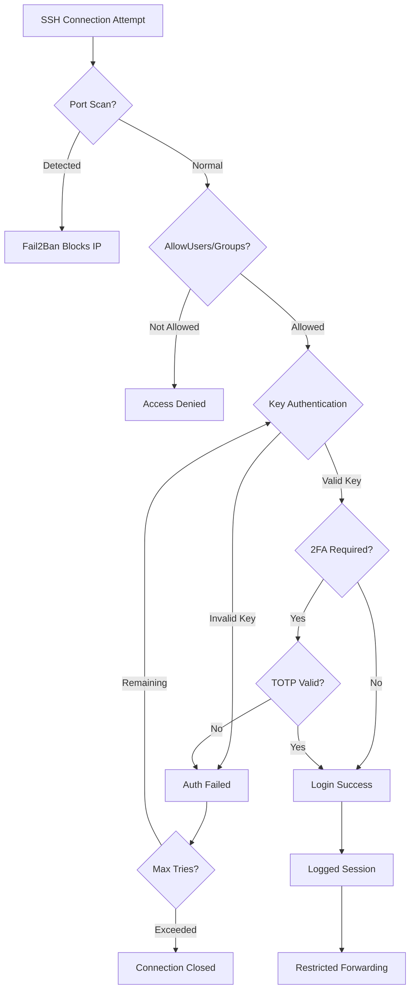

# How to Use Ansible to Harden SSH Configuration

Author: [nawazdhandala](https://www.github.com/nawazdhandala)

Tags: Ansible, SSH, Security Hardening, CIS Benchmarks, Linux

Description: Learn how to harden SSH server configuration using Ansible following CIS benchmarks and security best practices for production servers.

---

Configuring SSH is one thing. Hardening it to withstand real-world attacks is another. SSH hardening goes beyond basic settings like disabling password authentication. It includes removing weak ciphers, configuring key exchange algorithms, setting up intrusion detection, implementing two-factor authentication, and following CIS benchmark recommendations. This post walks through a comprehensive SSH hardening playbook.

## Prerequisites

- Ansible 2.9+ on your control node
- Linux target hosts running OpenSSH 7.4+
- Root or sudo access
- Console access as a safety net (in case SSH gets misconfigured)
- Existing SSH key-based authentication already set up

## The Full Hardening Playbook

Let us start with the complete playbook and then break down each section:

```yaml
# harden_ssh.yml - Comprehensive SSH hardening
---
- name: Harden SSH configuration
  hosts: all
  become: true
  vars:
    ssh_port: 22
    ssh_allowed_users:
      - deploy
      - admin
    ssh_allowed_groups:
      - sshusers
    ssh_max_auth_tries: 3
    ssh_max_sessions: 3
    ssh_client_alive_interval: 300
    ssh_client_alive_count_max: 2
    ssh_login_grace_time: 20
    ssh_log_level: VERBOSE
  tasks:
    - name: Backup original sshd_config
      ansible.builtin.copy:
        src: /etc/ssh/sshd_config
        dest: "/etc/ssh/sshd_config.backup.{{ ansible_date_time.date }}"
        remote_src: true
        mode: '0600'
        force: false

    - name: Deploy hardened sshd_config
      ansible.builtin.template:
        src: templates/sshd_config_hardened.j2
        dest: /etc/ssh/sshd_config
        owner: root
        group: root
        mode: '0600'
        validate: 'sshd -t -f %s'
      notify: Restart sshd

    - name: Set correct permissions on SSH host keys
      ansible.builtin.file:
        path: "{{ item }}"
        owner: root
        group: root
        mode: '0600'
      loop:
        - /etc/ssh/ssh_host_rsa_key
        - /etc/ssh/ssh_host_ecdsa_key
        - /etc/ssh/ssh_host_ed25519_key
      ignore_errors: true

    - name: Set correct permissions on public host keys
      ansible.builtin.file:
        path: "{{ item }}"
        owner: root
        group: root
        mode: '0644'
      loop:
        - /etc/ssh/ssh_host_rsa_key.pub
        - /etc/ssh/ssh_host_ecdsa_key.pub
        - /etc/ssh/ssh_host_ed25519_key.pub
      ignore_errors: true

    - name: Remove weak SSH host keys (DSA)
      ansible.builtin.file:
        path: "{{ item }}"
        state: absent
      loop:
        - /etc/ssh/ssh_host_dsa_key
        - /etc/ssh/ssh_host_dsa_key.pub

  handlers:
    - name: Restart sshd
      ansible.builtin.service:
        name: sshd
        state: restarted
```

## The Hardened sshd_config Template

This template follows CIS Benchmark recommendations and security best practices:

```jinja2
# templates/sshd_config_hardened.j2 - Hardened SSH configuration
# Managed by Ansible - do not edit manually
# Based on CIS Benchmark for SSH

# === Network ===
Port {{ ssh_port }}
AddressFamily any
ListenAddress 0.0.0.0
ListenAddress ::

# === Protocol ===
# Only allow SSH protocol 2
Protocol 2

# === Host Keys (strongest only) ===
HostKey /etc/ssh/ssh_host_ed25519_key
HostKey /etc/ssh/ssh_host_rsa_key
HostKey /etc/ssh/ssh_host_ecdsa_key

# === Key Exchange Algorithms (remove weak ones) ===
KexAlgorithms curve25519-sha256,curve25519-sha256@libssh.org,diffie-hellman-group16-sha512,diffie-hellman-group18-sha512,diffie-hellman-group-exchange-sha256

# === Ciphers (AES-GCM and ChaCha20 only) ===
Ciphers chacha20-poly1305@openssh.com,aes256-gcm@openssh.com,aes128-gcm@openssh.com,aes256-ctr,aes192-ctr,aes128-ctr

# === MACs (strong only) ===
MACs hmac-sha2-512-etm@openssh.com,hmac-sha2-256-etm@openssh.com,hmac-sha2-512,hmac-sha2-256

# === Authentication ===
PermitRootLogin no
PubkeyAuthentication yes
PasswordAuthentication no
PermitEmptyPasswords no
ChallengeResponseAuthentication no
KerberosAuthentication no
GSSAPIAuthentication no
HostbasedAuthentication no

# Limit authentication attempts
MaxAuthTries {{ ssh_max_auth_tries }}
MaxSessions {{ ssh_max_sessions }}
LoginGraceTime {{ ssh_login_grace_time }}
MaxStartups 10:30:60

# === Access Control ===

AllowUsers {{ ssh_allowed_users | join(' ') }}


AllowGroups {{ ssh_allowed_groups | join(' ') }}


# === Session ===
ClientAliveInterval {{ ssh_client_alive_interval }}
ClientAliveCountMax {{ ssh_client_alive_count_max }}
TCPKeepAlive no
UseDNS no

# === Forwarding ===
X11Forwarding no
AllowTcpForwarding no
AllowStreamLocalForwarding no
GatewayPorts no
PermitTunnel no

# === Logging ===
SyslogFacility AUTH
LogLevel {{ ssh_log_level }}

# === Environment ===
PermitUserEnvironment no
AcceptEnv LANG LC_*

# === Misc ===
PrintMotd no
PrintLastLog yes
Banner /etc/ssh/banner
Compression no
StrictModes yes
IgnoreRhosts yes

# === SFTP ===
Subsystem sftp /usr/lib/openssh/sftp-server -f AUTHPRIV -l INFO
```

## Configuring Fail2Ban for SSH

Fail2ban monitors SSH logs and bans IPs that fail authentication too many times:

```yaml
# fail2ban_ssh.yml - Install and configure fail2ban for SSH protection
---
- name: Configure fail2ban for SSH
  hosts: all
  become: true
  vars:
    fail2ban_maxretry: 3
    fail2ban_bantime: 3600
    fail2ban_findtime: 600
  tasks:
    - name: Install fail2ban
      ansible.builtin.package:
        name: fail2ban
        state: present

    - name: Deploy fail2ban SSH jail configuration
      ansible.builtin.copy:
        dest: /etc/fail2ban/jail.local
        content: |
          [DEFAULT]
          bantime = {{ fail2ban_bantime }}
          findtime = {{ fail2ban_findtime }}
          maxretry = {{ fail2ban_maxretry }}
          banaction = iptables-multiport
          backend = systemd

          [sshd]
          enabled = true
          port = ssh
          filter = sshd
          logpath = /var/log/auth.log
          maxretry = {{ fail2ban_maxretry }}
          bantime = {{ fail2ban_bantime }}
        owner: root
        group: root
        mode: '0644'
      notify: Restart fail2ban

    - name: Enable and start fail2ban
      ansible.builtin.service:
        name: fail2ban
        state: started
        enabled: true

  handlers:
    - name: Restart fail2ban
      ansible.builtin.service:
        name: fail2ban
        state: restarted
```

## SSH Key Rotation

Rotating host keys periodically is a good practice:

```yaml
# rotate_host_keys.yml - Rotate SSH host keys
---
- name: Rotate SSH host keys
  hosts: all
  become: true
  tasks:
    - name: Remove old host keys
      ansible.builtin.file:
        path: "{{ item }}"
        state: absent
      loop:
        - /etc/ssh/ssh_host_rsa_key
        - /etc/ssh/ssh_host_rsa_key.pub
        - /etc/ssh/ssh_host_ecdsa_key
        - /etc/ssh/ssh_host_ecdsa_key.pub
        - /etc/ssh/ssh_host_ed25519_key
        - /etc/ssh/ssh_host_ed25519_key.pub

    - name: Regenerate host keys
      ansible.builtin.command: ssh-keygen -A
      changed_when: true

    - name: Set private key permissions
      ansible.builtin.file:
        path: "{{ item }}"
        mode: '0600'
      loop:
        - /etc/ssh/ssh_host_rsa_key
        - /etc/ssh/ssh_host_ecdsa_key
        - /etc/ssh/ssh_host_ed25519_key

    - name: Restart SSH to use new keys
      ansible.builtin.service:
        name: sshd
        state: restarted
```

## Two-Factor Authentication with Google Authenticator

Add TOTP-based 2FA to SSH:

```yaml
# ssh_2fa.yml - Configure two-factor authentication for SSH
---
- name: Configure SSH 2FA
  hosts: all
  become: true
  tasks:
    - name: Install Google Authenticator PAM module
      ansible.builtin.package:
        name: libpam-google-authenticator
        state: present

    - name: Configure PAM for SSH
      ansible.builtin.lineinfile:
        path: /etc/pam.d/sshd
        line: "auth required pam_google_authenticator.so nullok"
        insertafter: "@include common-auth"

    - name: Enable ChallengeResponseAuthentication
      ansible.builtin.lineinfile:
        path: /etc/ssh/sshd_config
        regexp: '^#?ChallengeResponseAuthentication'
        line: 'ChallengeResponseAuthentication yes'
        validate: 'sshd -t -f %s'

    - name: Configure authentication methods (key + TOTP)
      ansible.builtin.lineinfile:
        path: /etc/ssh/sshd_config
        regexp: '^#?AuthenticationMethods'
        line: 'AuthenticationMethods publickey,keyboard-interactive'
        validate: 'sshd -t -f %s'
      notify: Restart sshd

  handlers:
    - name: Restart sshd
      ansible.builtin.service:
        name: sshd
        state: restarted
```

## SSH Audit and Compliance Check

Verify your hardening is effective:

```yaml
# audit_ssh.yml - Audit SSH configuration against best practices
---
- name: Audit SSH configuration
  hosts: all
  become: true
  tasks:
    - name: Get current SSH configuration
      ansible.builtin.command: sshd -T
      register: sshd_config
      changed_when: false

    - name: Parse SSH settings
      ansible.builtin.set_fact:
        ssh_settings: "{{ dict(sshd_config.stdout_lines | map('split', ' ', 1)) }}"

    - name: Check critical security settings
      ansible.builtin.assert:
        that: "{{ item.check }}"
        fail_msg: "FAIL: {{ item.name }}"
        success_msg: "PASS: {{ item.name }}"
      loop:
        - name: "Root login is disabled"
          check: "ssh_settings.permitrootlogin == 'no'"
        - name: "Password auth is disabled"
          check: "ssh_settings.passwordauthentication == 'no'"
        - name: "Empty passwords are disabled"
          check: "ssh_settings.permitemptypasswords == 'no'"
        - name: "X11 forwarding is disabled"
          check: "ssh_settings.x11forwarding == 'no'"
        - name: "Host-based auth is disabled"
          check: "ssh_settings.hostbasedauthentication == 'no'"
        - name: "Max auth tries is 3 or less"
          check: "ssh_settings.maxauthtries | int <= 3"
      ignore_errors: true

    - name: Check for weak ciphers
      ansible.builtin.command: "sshd -T"
      register: cipher_check
      changed_when: false

    - name: Verify no weak ciphers are present
      ansible.builtin.assert:
        that:
          - "'3des' not in cipher_check.stdout"
          - "'arcfour' not in cipher_check.stdout"
          - "'blowfish' not in cipher_check.stdout"
        fail_msg: "WARNING: Weak ciphers detected in SSH configuration"
        success_msg: "No weak ciphers found"
      ignore_errors: true

    - name: Check SSH host key permissions
      ansible.builtin.stat:
        path: "{{ item }}"
      loop:
        - /etc/ssh/ssh_host_rsa_key
        - /etc/ssh/ssh_host_ed25519_key
      register: key_perms

    - name: Verify host key permissions
      ansible.builtin.assert:
        that:
          - item.stat.mode == '0600'
        fail_msg: "FAIL: {{ item.item }} has wrong permissions ({{ item.stat.mode }})"
        success_msg: "PASS: {{ item.item }} permissions correct"
      loop: "{{ key_perms.results }}"
      loop_control:
        label: "{{ item.item }}"
      ignore_errors: true
```

## SSH Hardening Layers



## Summary of Hardening Measures

Here is a quick reference of what each hardening measure protects against:

Disabling root login prevents direct root access, forcing attackers to compromise a regular user first. Disabling password authentication eliminates brute-force password attacks entirely. Strong cipher and key exchange algorithms protect against cryptographic attacks. Fail2ban blocks automated scanning and brute-force attempts. Rate limiting with MaxAuthTries and MaxStartups prevents resource exhaustion. Verbose logging gives you visibility into SSH activity for incident response. Disabling forwarding prevents SSH from being used as a proxy by compromised accounts. And 2FA adds a second layer even if an SSH key is stolen.

Each layer adds defense in depth. No single measure is enough by itself, but together they make your SSH infrastructure significantly harder to compromise.
