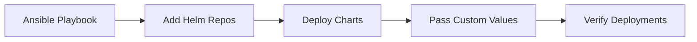

# How to Use Ansible with Helm for Kubernetes

Author: [nawazdhandala](https://www.github.com/nawazdhandala)

Tags: Ansible, Helm, Kubernetes, DevOps

Description: Deploy and manage Helm charts on Kubernetes clusters using Ansible for repeatable, version-controlled Kubernetes application deployments.

---

Helm is the package manager for Kubernetes. It bundles Kubernetes manifests into charts that can be versioned, shared, and deployed with custom values. Ansible has a dedicated Helm module in the kubernetes.core collection that lets you manage Helm releases as part of your playbooks.

This post covers using Ansible to manage Helm chart deployments on Kubernetes.

## Why Ansible + Helm

Helm handles templating and packaging Kubernetes resources. Ansible handles orchestration: deploying charts in the right order, passing environment-specific values, and verifying deployments succeed.



## Installing Helm with Ansible

```yaml
# roles/helm_setup/tasks/main.yml
# Install Helm on the control node
---
- name: Download Helm installer
  ansible.builtin.get_url:
    url: https://raw.githubusercontent.com/helm/helm/main/scripts/get-helm-3
    dest: /tmp/get_helm.sh
    mode: '0700'

- name: Install Helm
  ansible.builtin.command:
    cmd: /tmp/get_helm.sh
    creates: /usr/local/bin/helm
```

## Managing Helm Repositories

```yaml
# roles/helm_repos/tasks/main.yml
# Add and update Helm repositories
---
- name: Add Helm repositories
  kubernetes.core.helm_repository:
    name: "{{ item.name }}"
    repo_url: "{{ item.url }}"
  loop:
    - { name: bitnami, url: "https://charts.bitnami.com/bitnami" }
    - { name: ingress-nginx, url: "https://kubernetes.github.io/ingress-nginx" }
    - { name: jetstack, url: "https://charts.jetstack.io" }
    - { name: prometheus-community, url: "https://prometheus-community.github.io/helm-charts" }
    - { name: grafana, url: "https://grafana.github.io/helm-charts" }
```

## Deploying Helm Charts

```yaml
# playbooks/deploy-k8s-apps.yml
# Deploy applications to Kubernetes via Helm
---
- name: Deploy Kubernetes applications
  hosts: k8s_control_plane
  tasks:
    - name: Deploy ingress-nginx
      kubernetes.core.helm:
        name: ingress-nginx
        chart_ref: ingress-nginx/ingress-nginx
        release_namespace: ingress-nginx
        create_namespace: true
        chart_version: "{{ ingress_nginx_version }}"
        values:
          controller:
            replicaCount: 2
            service:
              type: LoadBalancer
            metrics:
              enabled: true

    - name: Deploy cert-manager
      kubernetes.core.helm:
        name: cert-manager
        chart_ref: jetstack/cert-manager
        release_namespace: cert-manager
        create_namespace: true
        chart_version: "{{ cert_manager_version }}"
        values:
          installCRDs: true

    - name: Deploy application
      kubernetes.core.helm:
        name: "{{ app_name }}"
        chart_ref: "./charts/{{ app_name }}"
        release_namespace: "{{ app_namespace }}"
        create_namespace: true
        values: "{{ lookup('template', 'values/{{ environment_name }}.yml.j2') | from_yaml }}"
        wait: true
        wait_timeout: "5m0s"
```

## Environment-Specific Values

```yaml
# values/production.yml.j2
# Helm values for production deployment
replicaCount: 3

image:
  repository: {{ docker_registry }}/{{ app_name }}
  tag: {{ app_version }}

resources:
  requests:
    memory: "256Mi"
    cpu: "250m"
  limits:
    memory: "512Mi"
    cpu: "500m"

ingress:
  enabled: true
  hosts:
    - host: {{ app_domain }}
      paths:
        - path: /
          pathType: Prefix

database:
  host: {{ db_host }}
  name: {{ db_name }}

autoscaling:
  enabled: true
  minReplicas: 3
  maxReplicas: 10
  targetCPUUtilizationPercentage: 70
```

## Helm Release Management

```yaml
# tasks/helm-operations.yml
# Common Helm operations
---
- name: List all Helm releases
  kubernetes.core.helm_info:
    release_name: "{{ app_name }}"
    release_namespace: "{{ app_namespace }}"
  register: release_info

- name: Rollback to previous version
  kubernetes.core.helm:
    name: "{{ app_name }}"
    release_namespace: "{{ app_namespace }}"
    state: present
    atomic: true
  when: rollback | default(false)

- name: Uninstall a release
  kubernetes.core.helm:
    name: "{{ app_name }}"
    release_namespace: "{{ app_namespace }}"
    state: absent
  when: uninstall | default(false)
```

## Deploying a Full Stack

```yaml
# playbooks/deploy-full-stack.yml
# Deploy complete application stack via Helm
---
- name: Deploy full application stack
  hosts: k8s_control_plane
  tasks:
    - name: Deploy PostgreSQL
      kubernetes.core.helm:
        name: postgresql
        chart_ref: bitnami/postgresql
        release_namespace: "{{ app_namespace }}"
        create_namespace: true
        values:
          auth:
            postgresPassword: "{{ db_password }}"
            database: "{{ db_name }}"
          primary:
            persistence:
              size: 50Gi
        wait: true

    - name: Deploy Redis
      kubernetes.core.helm:
        name: redis
        chart_ref: bitnami/redis
        release_namespace: "{{ app_namespace }}"
        values:
          auth:
            password: "{{ redis_password }}"
        wait: true

    - name: Deploy application
      kubernetes.core.helm:
        name: "{{ app_name }}"
        chart_ref: "./charts/{{ app_name }}"
        release_namespace: "{{ app_namespace }}"
        values:
          database:
            host: postgresql.{{ app_namespace }}.svc.cluster.local
          redis:
            host: redis-master.{{ app_namespace }}.svc.cluster.local
        wait: true

    - name: Verify deployment
      kubernetes.core.k8s_info:
        kind: Deployment
        namespace: "{{ app_namespace }}"
        name: "{{ app_name }}"
      register: deploy_status
      retries: 10
      delay: 15
      until: deploy_status.resources[0].status.readyReplicas == deploy_status.resources[0].spec.replicas
```

## Key Takeaways

Ansible with Helm gives you orchestrated, repeatable Kubernetes deployments. Use the kubernetes.core.helm module to deploy charts with environment-specific values. Deploy dependencies in order (database before application). Use wait mode to ensure each deployment is healthy before moving on. Store values templates in your Ansible repository so they are version controlled alongside your infrastructure code.

## Common Use Cases

Here are several practical scenarios where this module proves essential in real-world playbooks.

### Infrastructure Provisioning Workflow

```yaml
# Complete workflow incorporating this module
- name: Infrastructure provisioning
  hosts: all
  become: true
  gather_facts: true
  tasks:
    - name: Gather system information
      ansible.builtin.setup:
        gather_subset:
          - hardware
          - network

    - name: Display system summary
      ansible.builtin.debug:
        msg: >-
          Host {{ inventory_hostname }} has
          {{ ansible_memtotal_mb }}MB RAM,
          {{ ansible_processor_vcpus }} vCPUs,
          running {{ ansible_distribution }} {{ ansible_distribution_version }}

    - name: Install required packages
      ansible.builtin.package:
        name:
          - curl
          - wget
          - git
          - vim
          - htop
          - jq
        state: present

    - name: Configure system timezone
      ansible.builtin.timezone:
        name: "{{ system_timezone | default('UTC') }}"

    - name: Configure hostname
      ansible.builtin.hostname:
        name: "{{ inventory_hostname }}"

    - name: Update /etc/hosts
      ansible.builtin.lineinfile:
        path: /etc/hosts
        regexp: '^127\.0\.1\.1'
        line: "127.0.1.1 {{ inventory_hostname }}"

    - name: Configure SSH hardening
      ansible.builtin.lineinfile:
        path: /etc/ssh/sshd_config
        regexp: "{{ item.regexp }}"
        line: "{{ item.line }}"
      loop:
        - { regexp: '^PermitRootLogin', line: 'PermitRootLogin no' }
        - { regexp: '^PasswordAuthentication', line: 'PasswordAuthentication no' }
      notify: restart sshd

    - name: Configure firewall rules
      community.general.ufw:
        rule: allow
        port: "{{ item }}"
        proto: tcp
      loop:
        - "22"
        - "80"
        - "443"

    - name: Enable firewall
      community.general.ufw:
        state: enabled
        policy: deny

  handlers:
    - name: restart sshd
      ansible.builtin.service:
        name: sshd
        state: restarted
```

### Integration with Monitoring

```yaml
# Using gathered facts to configure monitoring thresholds
- name: Configure monitoring based on system specs
  hosts: all
  become: true
  tasks:
    - name: Set monitoring thresholds based on hardware
      ansible.builtin.template:
        src: monitoring_config.yml.j2
        dest: /etc/monitoring/config.yml
      vars:
        memory_warning_threshold: "{{ (ansible_memtotal_mb * 0.8) | int }}"
        memory_critical_threshold: "{{ (ansible_memtotal_mb * 0.95) | int }}"
        cpu_warning_threshold: 80
        cpu_critical_threshold: 95

    - name: Register host with monitoring system
      ansible.builtin.uri:
        url: "https://monitoring.example.com/api/hosts"
        method: POST
        body_format: json
        body:
          hostname: "{{ inventory_hostname }}"
          ip_address: "{{ ansible_default_ipv4.address }}"
          os: "{{ ansible_distribution }}"
          memory_mb: "{{ ansible_memtotal_mb }}"
          cpus: "{{ ansible_processor_vcpus }}"
        headers:
          Authorization: "Bearer {{ monitoring_api_token }}"
        status_code: [200, 201, 409]
```

### Error Handling Patterns

```yaml
# Robust error handling with this module
- name: Robust task execution
  hosts: all
  tasks:
    - name: Attempt primary operation
      ansible.builtin.command: /opt/app/primary-task.sh
      register: primary_result
      failed_when: false

    - name: Handle primary failure with fallback
      ansible.builtin.command: /opt/app/fallback-task.sh
      when: primary_result.rc != 0
      register: fallback_result

    - name: Report final status
      ansible.builtin.debug:
        msg: >-
          Task completed via {{ 'primary' if primary_result.rc == 0 else 'fallback' }} path.
          Return code: {{ primary_result.rc if primary_result.rc == 0 else fallback_result.rc }}

    - name: Fail if both paths failed
      ansible.builtin.fail:
        msg: "Both primary and fallback operations failed"
      when:
        - primary_result.rc != 0
        - fallback_result is defined
        - fallback_result.rc != 0
```

### Scheduling and Automation

```yaml
# Set up scheduled compliance scans using cron
- name: Configure automated scans
  hosts: all
  become: true
  tasks:
    - name: Create scan script
      ansible.builtin.copy:
        dest: /opt/scripts/compliance_scan.sh
        mode: '0755'
        content: |
          #!/bin/bash
          cd /opt/ansible
          ansible-playbook playbooks/validate.yml -i inventory/ > /var/log/compliance_scan.log 2>&1
          EXIT_CODE=$?
          if [ $EXIT_CODE -ne 0 ]; then
            curl -X POST https://hooks.example.com/alert \
              -H "Content-Type: application/json" \
              -d "{\"text\":\"Compliance scan failed on $(hostname)\"}"
          fi
          exit $EXIT_CODE

    - name: Schedule weekly compliance scan
      ansible.builtin.cron:
        name: "Weekly compliance scan"
        minute: "0"
        hour: "3"
        weekday: "1"
        job: "/opt/scripts/compliance_scan.sh"
        user: ansible
```

