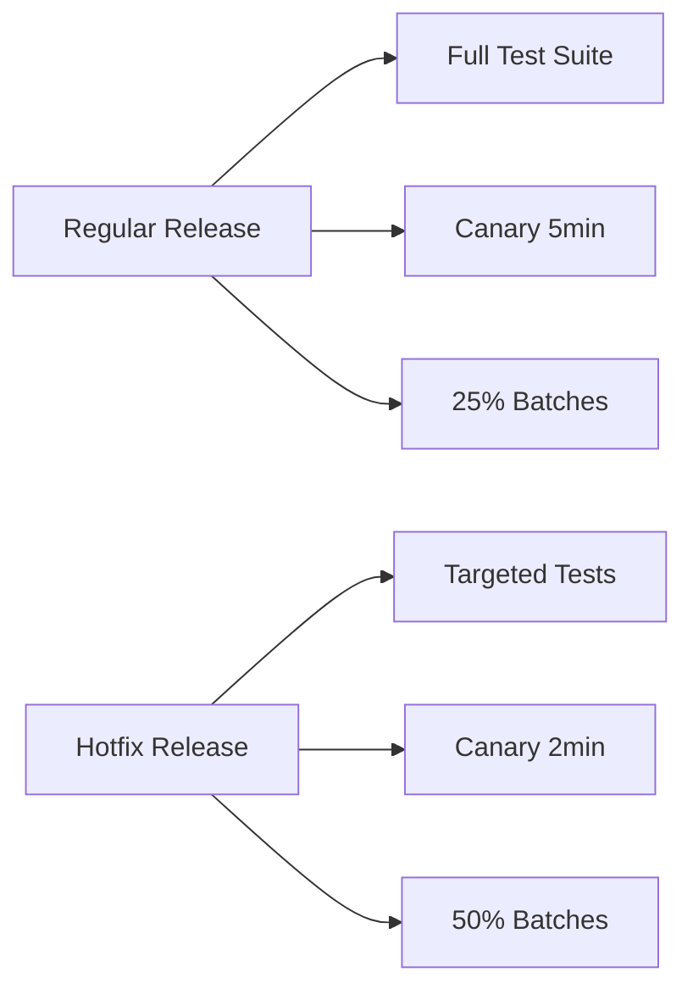

# How to Use Ansible for Hotfix Deployment Automation

Author: [nawazdhandala](https://www.github.com/nawazdhandala)

Tags: Ansible, Hotfix, Deployment, Incident Response

Description: Deploy critical hotfixes to production quickly and safely with Ansible playbooks that streamline the emergency deployment process.

---

When a critical bug hits production, you need to deploy a fix fast. But speed without safety leads to making things worse. Ansible can automate the hotfix deployment process so it is both fast and reliable, with the right guardrails in place.

This post covers building a hotfix deployment pipeline that is separate from your regular release process but equally safe.

## Hotfix vs Regular Release

A hotfix deployment differs from a regular release in several ways:



Hotfixes skip some of the longer validation steps but keep the critical safety checks.

## The Hotfix Playbook

```yaml
# playbooks/hotfix-deploy.yml
# Emergency hotfix deployment with streamlined safety checks
---
- name: Hotfix pre-checks
  hosts: localhost
  connection: local
  tasks:
    - name: Verify hotfix artifact exists
      ansible.builtin.uri:
        url: "{{ artifact_registry }}/{{ app_name }}/{{ hotfix_version }}"
        method: HEAD
        status_code: 200

    - name: Verify targeted tests passed
      ansible.builtin.uri:
        url: "{{ ci_api }}/pipelines/{{ hotfix_version }}/jobs?scope=success"
        headers:
          Authorization: "Bearer {{ ci_token }}"
      register: test_status
      failed_when: test_status.json | length == 0

    - name: Log hotfix deployment start
      ansible.builtin.uri:
        url: "{{ incident_api }}/incidents/{{ incident_id }}/timeline"
        method: POST
        body_format: json
        body:
          message: "Deploying hotfix {{ hotfix_version }}"
          author: "{{ lookup('env', 'USER') }}"
      when: incident_id is defined

    - name: Notify team
      community.general.slack:
        token: "{{ slack_token }}"
        channel: "#incidents"
        msg: "HOTFIX: Deploying {{ hotfix_version }} to production for incident {{ incident_id | default('N/A') }}"

- name: Deploy hotfix to canary
  hosts: webservers[0]
  become: true
  tasks:
    - name: Record current version for rollback
      ansible.builtin.slurp:
        src: "{{ deploy_dir }}/current_version"
      register: previous_version

    - name: Deploy hotfix
      ansible.builtin.include_role:
        name: app_deploy
      vars:
        app_version: "{{ hotfix_version }}"

    - name: Quick canary verification (2 minutes)
      ansible.builtin.uri:
        url: "http://localhost:{{ app_port }}/health"
        status_code: 200
      retries: 24
      delay: 5
      register: canary_health
      until: canary_health.status == 200

    - name: Verify the specific fix is working
      ansible.builtin.uri:
        url: "http://localhost:{{ app_port }}{{ verification_endpoint }}"
        status_code: "{{ expected_status | default(200) }}"
      when: verification_endpoint is defined

- name: Deploy hotfix to all servers
  hosts: webservers[1:]
  become: true
  serial: "50%"
  max_fail_percentage: 10

  pre_tasks:
    - name: Drain connections
      ansible.builtin.uri:
        url: "http://{{ lb_api }}/backends/{{ inventory_hostname }}/drain"
        method: POST
      delegate_to: localhost

    - name: Brief drain period
      ansible.builtin.pause:
        seconds: 10

  tasks:
    - name: Record current version
      ansible.builtin.command:
        cmd: "cat {{ deploy_dir }}/current_version"
      register: prev_ver
      changed_when: false

    - name: Deploy hotfix
      ansible.builtin.include_role:
        name: app_deploy
      vars:
        app_version: "{{ hotfix_version }}"

  post_tasks:
    - name: Health check
      ansible.builtin.uri:
        url: "http://localhost:{{ app_port }}/health"
        status_code: 200
      retries: 20
      delay: 3
      register: health
      until: health.status == 200

    - name: Re-enable in load balancer
      ansible.builtin.uri:
        url: "http://{{ lb_api }}/backends/{{ inventory_hostname }}/enable"
        method: POST
      delegate_to: localhost

- name: Post-hotfix verification
  hosts: localhost
  connection: local
  tasks:
    - name: Run targeted smoke tests
      ansible.builtin.command:
        cmd: "npm run test:smoke -- --suite=critical --env=production"
      register: smoke_result
      changed_when: false

    - name: Update incident timeline
      ansible.builtin.uri:
        url: "{{ incident_api }}/incidents/{{ incident_id }}/timeline"
        method: POST
        body_format: json
        body:
          message: "Hotfix {{ hotfix_version }} deployed. Smoke tests: {{ 'PASSED' if smoke_result.rc == 0 else 'FAILED' }}"
      when: incident_id is defined

    - name: Notify completion
      community.general.slack:
        token: "{{ slack_token }}"
        channel: "#incidents"
        msg: "HOTFIX {{ hotfix_version }} deployed to all production servers. Smoke tests {{ 'PASSED' if smoke_result.rc == 0 else 'FAILED' }}."
```

## Quick Rollback for Failed Hotfixes

```yaml
# playbooks/hotfix-rollback.yml
# Emergency rollback of a failed hotfix
---
- name: Rollback hotfix
  hosts: webservers
  become: true
  serial: "50%"
  tasks:
    - name: Get previous version
      ansible.builtin.slurp:
        src: "{{ deploy_dir }}/.previous_version"
      register: rollback_version

    - name: Rollback to previous version
      ansible.builtin.include_role:
        name: app_deploy
      vars:
        app_version: "{{ rollback_version.content | b64decode | trim }}"

    - name: Verify rollback health
      ansible.builtin.uri:
        url: "http://localhost:{{ app_port }}/health"
        status_code: 200
      retries: 20
      delay: 3
      register: health
      until: health.status == 200
```

## Running the Hotfix

```bash
# Deploy a hotfix tied to an incident
ansible-playbook playbooks/hotfix-deploy.yml \
  -e hotfix_version=v2.3.1-hotfix \
  -e incident_id=INC-1234 \
  -e verification_endpoint=/api/v1/checkout

# Rollback if the hotfix made things worse
ansible-playbook playbooks/hotfix-rollback.yml
```

## Key Takeaways

Hotfix deployments need to be fast but not reckless. Keep the critical safety checks (artifact verification, health checks, canary deployment) but shorten the observation windows and use larger batch sizes. Always record the previous version for quick rollback. Tie hotfix deployments to incident tracking so you have a clear audit trail. And practice your hotfix process regularly so when a real emergency hits, the team knows exactly what to do.

## Common Use Cases

Here are several practical scenarios where this module proves essential in real-world playbooks.

### Infrastructure Provisioning Workflow

```yaml
# Complete workflow incorporating this module
- name: Infrastructure provisioning
  hosts: all
  become: true
  gather_facts: true
  tasks:
    - name: Gather system information
      ansible.builtin.setup:
        gather_subset:
          - hardware
          - network

    - name: Display system summary
      ansible.builtin.debug:
        msg: >-
          Host {{ inventory_hostname }} has
          {{ ansible_memtotal_mb }}MB RAM,
          {{ ansible_processor_vcpus }} vCPUs,
          running {{ ansible_distribution }} {{ ansible_distribution_version }}

    - name: Install required packages
      ansible.builtin.package:
        name:
          - curl
          - wget
          - git
          - vim
          - htop
          - jq
        state: present

    - name: Configure system timezone
      ansible.builtin.timezone:
        name: "{{ system_timezone | default('UTC') }}"

    - name: Configure hostname
      ansible.builtin.hostname:
        name: "{{ inventory_hostname }}"

    - name: Update /etc/hosts
      ansible.builtin.lineinfile:
        path: /etc/hosts
        regexp: '^127\.0\.1\.1'
        line: "127.0.1.1 {{ inventory_hostname }}"

    - name: Configure SSH hardening
      ansible.builtin.lineinfile:
        path: /etc/ssh/sshd_config
        regexp: "{{ item.regexp }}"
        line: "{{ item.line }}"
      loop:
        - { regexp: '^PermitRootLogin', line: 'PermitRootLogin no' }
        - { regexp: '^PasswordAuthentication', line: 'PasswordAuthentication no' }
      notify: restart sshd

    - name: Configure firewall rules
      community.general.ufw:
        rule: allow
        port: "{{ item }}"
        proto: tcp
      loop:
        - "22"
        - "80"
        - "443"

    - name: Enable firewall
      community.general.ufw:
        state: enabled
        policy: deny

  handlers:
    - name: restart sshd
      ansible.builtin.service:
        name: sshd
        state: restarted
```

### Integration with Monitoring

```yaml
# Using gathered facts to configure monitoring thresholds
- name: Configure monitoring based on system specs
  hosts: all
  become: true
  tasks:
    - name: Set monitoring thresholds based on hardware
      ansible.builtin.template:
        src: monitoring_config.yml.j2
        dest: /etc/monitoring/config.yml
      vars:
        memory_warning_threshold: "{{ (ansible_memtotal_mb * 0.8) | int }}"
        memory_critical_threshold: "{{ (ansible_memtotal_mb * 0.95) | int }}"
        cpu_warning_threshold: 80
        cpu_critical_threshold: 95

    - name: Register host with monitoring system
      ansible.builtin.uri:
        url: "https://monitoring.example.com/api/hosts"
        method: POST
        body_format: json
        body:
          hostname: "{{ inventory_hostname }}"
          ip_address: "{{ ansible_default_ipv4.address }}"
          os: "{{ ansible_distribution }}"
          memory_mb: "{{ ansible_memtotal_mb }}"
          cpus: "{{ ansible_processor_vcpus }}"
        headers:
          Authorization: "Bearer {{ monitoring_api_token }}"
        status_code: [200, 201, 409]
```

### Error Handling Patterns

```yaml
# Robust error handling with this module
- name: Robust task execution
  hosts: all
  tasks:
    - name: Attempt primary operation
      ansible.builtin.command: /opt/app/primary-task.sh
      register: primary_result
      failed_when: false

    - name: Handle primary failure with fallback
      ansible.builtin.command: /opt/app/fallback-task.sh
      when: primary_result.rc != 0
      register: fallback_result

    - name: Report final status
      ansible.builtin.debug:
        msg: >-
          Task completed via {{ 'primary' if primary_result.rc == 0 else 'fallback' }} path.
          Return code: {{ primary_result.rc if primary_result.rc == 0 else fallback_result.rc }}

    - name: Fail if both paths failed
      ansible.builtin.fail:
        msg: "Both primary and fallback operations failed"
      when:
        - primary_result.rc != 0
        - fallback_result is defined
        - fallback_result.rc != 0
```

### Scheduling and Automation

```yaml
# Set up scheduled compliance scans using cron
- name: Configure automated scans
  hosts: all
  become: true
  tasks:
    - name: Create scan script
      ansible.builtin.copy:
        dest: /opt/scripts/compliance_scan.sh
        mode: '0755'
        content: |
          #!/bin/bash
          cd /opt/ansible
          ansible-playbook playbooks/validate.yml -i inventory/ > /var/log/compliance_scan.log 2>&1
          EXIT_CODE=$?
          if [ $EXIT_CODE -ne 0 ]; then
            curl -X POST https://hooks.example.com/alert \
              -H "Content-Type: application/json" \
              -d "{\"text\":\"Compliance scan failed on $(hostname)\"}"
          fi
          exit $EXIT_CODE

    - name: Schedule weekly compliance scan
      ansible.builtin.cron:
        name: "Weekly compliance scan"
        minute: "0"
        hour: "3"
        weekday: "1"
        job: "/opt/scripts/compliance_scan.sh"
        user: ansible
```

