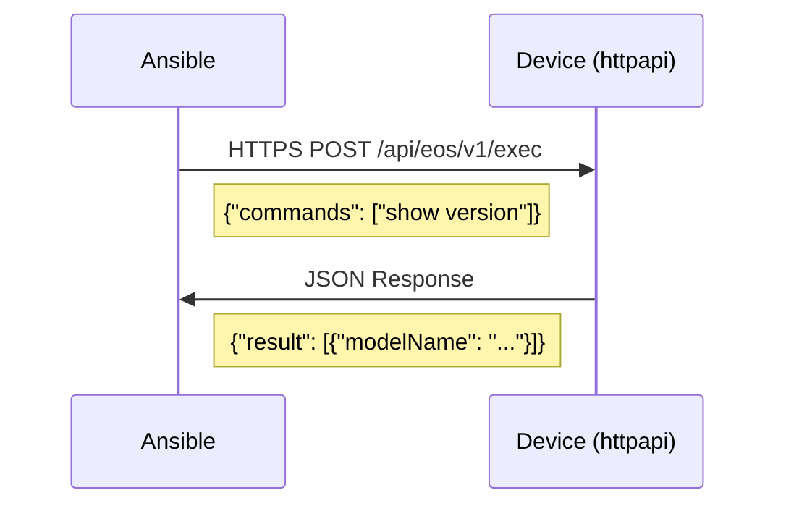

# How to Use Ansible httpapi Connection Plugin

Author: [nawazdhandala](https://www.github.com/nawazdhandala)

Tags: Ansible, httpapi, REST API, Network Automation

Description: Learn how to use the Ansible httpapi connection plugin to automate network devices through their REST APIs for faster, structured management.

---

The httpapi connection plugin is Ansible's way of talking to network devices through their REST APIs instead of CLI over SSH. Platforms like Arista EOS (eAPI), Cisco NX-OS (NX-API), Cisco FTD, and F5 BIG-IP all expose REST interfaces that return structured JSON data natively. Using httpapi instead of network_cli gives you cleaner data, better performance, and access to API-only features.

This post explains how the httpapi plugin works, how to configure it for different platforms, and when to choose it over other connection types.

## How httpapi Differs from network_cli

With `network_cli`, Ansible opens an SSH session and types commands into the CLI, just like a human would. The responses come back as raw text that needs parsing.

With `httpapi`, Ansible sends HTTP/HTTPS requests to a REST API endpoint. Responses come back as structured JSON. No text parsing needed.



The key benefits:

- **Structured responses** - JSON from the start, no regex parsing
- **Performance** - HTTPS is often faster than SSH for bulk operations
- **API-only features** - Some configuration options are only available through the API
- **Parallel requests** - HTTP connections can be more efficient at scale

## Configuring httpapi for Arista EOS

Arista EOS exposes its API through eAPI. Here is how to set it up.

First, make sure eAPI is enabled on the switch.

```
! Enable eAPI on the Arista switch
management api http-commands
   no shutdown
   protocol https
```

Then configure your Ansible inventory.

```yaml
# inventory/eos_switches.yml - Arista EOS with httpapi
---
all:
  children:
    eos_switches:
      hosts:
        spine1:
          ansible_host: 10.1.1.1
        spine2:
          ansible_host: 10.1.1.2
        leaf1:
          ansible_host: 10.1.2.1
        leaf2:
          ansible_host: 10.1.2.2
      vars:
        ansible_connection: ansible.netcommon.httpapi
        ansible_network_os: arista.eos.eos
        ansible_user: admin
        ansible_password: "{{ vault_eos_password }}"
        # HTTPS settings
        ansible_httpapi_use_ssl: true
        ansible_httpapi_validate_certs: false
        ansible_httpapi_port: 443
        # Enable mode
        ansible_become: true
        ansible_become_method: enable
```

## Configuring httpapi for Cisco NX-OS

Cisco NX-OS supports NX-API, which works similarly.

Enable NX-API on the Nexus switch.

```
! Enable NX-API on the Nexus switch
feature nxapi
nxapi https port 443
```

```yaml
# inventory/nxos_switches.yml - Cisco NX-OS with httpapi
---
all:
  children:
    nxos_switches:
      hosts:
        nexus1:
          ansible_host: 10.2.1.1
        nexus2:
          ansible_host: 10.2.1.2
      vars:
        ansible_connection: ansible.netcommon.httpapi
        ansible_network_os: cisco.nxos.nxos
        ansible_user: admin
        ansible_password: "{{ vault_nxos_password }}"
        ansible_httpapi_use_ssl: true
        ansible_httpapi_validate_certs: false
        ansible_httpapi_port: 443
```

## Working with EOS via httpapi

Once httpapi is configured, you use the same Ansible modules as with network_cli. The connection type is transparent to the playbook.

```yaml
# eos_httpapi_playbook.yml - Manage Arista EOS through eAPI
---
- name: Configure EOS via httpapi
  hosts: eos_switches
  gather_facts: false

  tasks:
    # Resource modules work the same way over httpapi
    - name: Configure VLANs
      arista.eos.eos_vlans:
        config:
          - vlan_id: 100
            name: PRODUCTION
            state: active
          - vlan_id: 200
            name: DEVELOPMENT
            state: active
          - vlan_id: 300
            name: MANAGEMENT
            state: active
        state: merged
      register: vlan_result

    - name: Show VLAN changes
      ansible.builtin.debug:
        var: vlan_result.commands
      when: vlan_result.changed

    # Run show commands - responses are already structured JSON
    - name: Get version info
      arista.eos.eos_command:
        commands:
          - show version
      register: version

    - name: Display model info
      ansible.builtin.debug:
        msg: "{{ inventory_hostname }}: {{ version.stdout[0].modelName }} running EOS {{ version.stdout[0].version }}"

    # Configure interfaces
    - name: Configure interfaces
      arista.eos.eos_interfaces:
        config:
          - name: Ethernet1
            description: "Server Port 1"
            enabled: true
            mtu: 9214
          - name: Ethernet2
            description: "Server Port 2"
            enabled: true
            mtu: 9214
        state: merged
```

## Working with NX-OS via httpapi

The same transparent approach works for NX-OS. Modules work identically regardless of whether you use httpapi or network_cli.

```yaml
# nxos_httpapi_playbook.yml - Manage NX-OS through NX-API
---
- name: Configure NX-OS via httpapi
  hosts: nxos_switches
  gather_facts: false

  tasks:
    # Configure VLANs on NX-OS
    - name: Configure VLANs
      cisco.nxos.nxos_vlans:
        config:
          - vlan_id: 100
            name: PRODUCTION
            enabled: true
          - vlan_id: 200
            name: DEVELOPMENT
            enabled: true
        state: merged

    # NX-API returns JSON natively for show commands
    - name: Get interface information
      cisco.nxos.nxos_command:
        commands:
          - command: show interface brief
            output: json
      register: nxos_interfaces

    - name: Display interface data
      ansible.builtin.debug:
        var: nxos_interfaces.stdout[0]

    # Configure features
    - name: Enable required features
      cisco.nxos.nxos_feature:
        feature: "{{ item }}"
        state: enabled
      loop:
        - ospf
        - bgp
        - interface-vlan
        - lacp
        - vpc

    # Configure L3 interfaces
    - name: Configure L3 interfaces
      cisco.nxos.nxos_l3_interfaces:
        config:
          - name: Vlan100
            ipv4:
              - address: 10.100.0.1/24
          - name: Vlan200
            ipv4:
              - address: 10.200.0.1/24
        state: merged
```

## httpapi-Specific Variables

The httpapi plugin supports several connection tuning variables.

```yaml
# group_vars/httpapi_devices.yml - httpapi connection tuning
---
# Basic authentication
ansible_connection: ansible.netcommon.httpapi
ansible_user: admin
ansible_password: "{{ vault_password }}"

# SSL/TLS settings
ansible_httpapi_use_ssl: true
ansible_httpapi_validate_certs: true
ansible_httpapi_ca_path: /etc/ssl/certs/ca-certificates.crt

# Port configuration (defaults to 80 for HTTP, 443 for HTTPS)
ansible_httpapi_port: 443

# Connection timeouts
ansible_persistent_connect_timeout: 30
ansible_persistent_command_timeout: 60

# Custom HTTP headers if needed
# ansible_httpapi_headers:
#   X-Custom-Header: "value"

# Use proxy settings
# ansible_httpapi_use_proxy: true
```

## Token-Based Authentication

Some httpapi implementations support token-based authentication for better security.

```yaml
# token_auth.yml - Use token-based authentication with httpapi
---
- name: Configure device with token authentication
  hosts: api_devices
  gather_facts: false
  connection: ansible.netcommon.httpapi

  vars:
    ansible_httpapi_use_ssl: true
    ansible_httpapi_validate_certs: false

  tasks:
    # For platforms that support session tokens
    # The httpapi plugin handles token acquisition automatically
    # based on the platform's httpapi plugin implementation

    - name: Run commands using token auth
      arista.eos.eos_command:
        commands:
          - show running-config
      register: config
```

## Performance Comparison

Here is a practical comparison of httpapi vs network_cli for common operations.

```yaml
# benchmark.yml - Compare httpapi vs network_cli performance
---
- name: Benchmark httpapi performance
  hosts: eos_httpapi_group
  gather_facts: false
  connection: ansible.netcommon.httpapi

  tasks:
    - name: Start timer
      ansible.builtin.set_fact:
        start_time: "{{ lookup('pipe', 'date +%s%N') }}"

    - name: Gather device facts via httpapi
      arista.eos.eos_facts:
        gather_subset:
          - interfaces
          - vlans
      register: httpapi_facts

    - name: Calculate httpapi duration
      ansible.builtin.debug:
        msg: "httpapi gather_facts took {{ ((lookup('pipe', 'date +%s%N') | int - start_time | int) / 1000000) | round(0) }}ms"

- name: Benchmark network_cli performance
  hosts: eos_cli_group
  gather_facts: false
  connection: ansible.netcommon.network_cli

  tasks:
    - name: Start timer
      ansible.builtin.set_fact:
        start_time: "{{ lookup('pipe', 'date +%s%N') }}"

    - name: Gather device facts via CLI
      arista.eos.eos_facts:
        gather_subset:
          - interfaces
          - vlans
      register: cli_facts

    - name: Calculate CLI duration
      ansible.builtin.debug:
        msg: "network_cli gather_facts took {{ ((lookup('pipe', 'date +%s%N') | int - start_time | int) / 1000000) | round(0) }}ms"
```

## Troubleshooting httpapi Connections

When httpapi connections fail, here are common debugging steps.

```yaml
# debug_httpapi.yml - Troubleshoot httpapi connection issues
---
- name: Debug httpapi connection
  hosts: problem_device
  gather_facts: false
  connection: ansible.netcommon.httpapi

  vars:
    # Enable verbose HTTP logging
    ansible_httpapi_use_ssl: true
    ansible_httpapi_validate_certs: false

  tasks:
    # Test basic connectivity
    - name: Simple command to test connection
      arista.eos.eos_command:
        commands:
          - show hostname
      register: hostname_test
      ignore_errors: true

    - name: Display connection test result
      ansible.builtin.debug:
        msg: "{{ 'Connection successful' if hostname_test is succeeded else 'Connection FAILED: ' + (hostname_test.msg | default('unknown')) }}"
```

Run with verbose output to see the HTTP requests.

```bash
# Run with extra verbosity to see HTTP request/response details
ansible-playbook debug_httpapi.yml -vvvv
```

## When to Use httpapi

Use httpapi when:

- The device has a well-supported REST API
- You want structured JSON responses without parsing
- You need better performance for bulk operations
- The API exposes features not available via CLI

Use network_cli when:

- The device does not have a REST API
- You need to run arbitrary CLI commands that are not covered by modules
- The httpapi plugin for your platform is immature or buggy
- You are troubleshooting and need raw CLI interaction

The httpapi connection plugin represents the modern approach to network automation. Structured data, better performance, and cleaner integration. If your devices support it, there is little reason not to use it.
