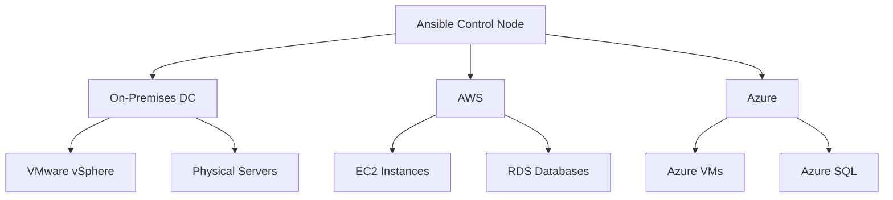

# How to Use Ansible for Hybrid Cloud Management

Author: [nawazdhandala](https://www.github.com/nawazdhandala)

Tags: Ansible, Hybrid Cloud, AWS, Azure, Multi-Cloud

Description: Manage hybrid cloud infrastructure spanning on-premises data centers and multiple cloud providers using Ansible with unified playbooks and inventories.

---

Hybrid cloud means running workloads across on-premises data centers and one or more cloud providers. The management challenge is significant because each environment has different APIs, networking, and conventions. Ansible provides a unified automation layer that works across all of them.

This post covers patterns for managing hybrid cloud infrastructure with Ansible.

## Hybrid Cloud Architecture



## Unified Inventory

Combine multiple inventory sources into one:

```yaml
# inventories/hybrid/hosts.yml
# Static inventory for on-premises resources
all:
  children:
    on_premises:
      children:
        on_prem_webservers:
          hosts:
            web-dc1-01:
              ansible_host: 10.0.1.10
              location: datacenter-1
            web-dc1-02:
              ansible_host: 10.0.1.11
              location: datacenter-1
        on_prem_databases:
          hosts:
            db-dc1-01:
              ansible_host: 10.0.2.10
              location: datacenter-1
```

```yaml
# inventories/hybrid/aws_ec2.yml
# Dynamic inventory for AWS
plugin: amazon.aws.aws_ec2
regions:
  - us-east-1
  - us-west-2
filters:
  tag:ManagedBy: ansible
keyed_groups:
  - key: tags.Role
    prefix: aws
compose:
  ansible_host: private_ip_address
```

```yaml
# inventories/hybrid/azure_rm.yml
# Dynamic inventory for Azure
plugin: azure.azcollection.azure_rm
auth_source: auto
include_vm_resource_groups:
  - production-rg
keyed_groups:
  - key: tags.Role
    prefix: azure
conditional_groups:
  azure_webservers: "'webserver' in tags.Role"
```

Ansible merges these automatically when you point to the directory:

```bash
# Use all inventory sources together
ansible-playbook playbooks/site.yml -i inventories/hybrid/
```

## Cross-Cloud Playbooks

Write playbooks that work regardless of where the host lives:

```yaml
# playbooks/site.yml
# Apply configuration across all environments
---
- name: Common configuration for all hosts
  hosts: all
  become: true
  roles:
    - common
    - security_baseline
    - monitoring_agent

- name: Configure web servers everywhere
  hosts: on_prem_webservers:aws_webserver:azure_webservers
  become: true
  roles:
    - nginx
    - app_deploy

- name: Configure databases everywhere
  hosts: on_prem_databases:aws_database:azure_databases
  become: true
  roles:
    - postgresql
```

## Cloud-Specific Provisioning

Provision resources in each cloud from a single playbook:

```yaml
# playbooks/provision-hybrid.yml
# Provision infrastructure across clouds
---
- name: Provision AWS resources
  hosts: localhost
  connection: local
  tasks:
    - name: Create AWS EC2 instances
      amazon.aws.ec2_instance:
        name: "aws-web-{{ item }}"
        instance_type: t3.medium
        image_id: "{{ aws_ami }}"
        subnet_id: "{{ aws_subnet }}"
        security_group: "{{ aws_sg }}"
        tags:
          Role: webserver
          ManagedBy: ansible
          Environment: production
        state: present
      loop: "{{ range(1, aws_web_count + 1) | list }}"

- name: Provision Azure resources
  hosts: localhost
  connection: local
  tasks:
    - name: Create Azure VMs
      azure.azcollection.azure_rm_virtualmachine:
        resource_group: production-rg
        name: "azure-web-{{ item }}"
        vm_size: Standard_D2s_v3
        admin_username: deploy
        ssh_password_enabled: false
        ssh_public_keys:
          - path: /home/deploy/.ssh/authorized_keys
            key_data: "{{ deploy_ssh_key }}"
        image:
          offer: UbuntuServer
          publisher: Canonical
          sku: 22_04-lts
          version: latest
        tags:
          Role: webserver
          ManagedBy: ansible
      loop: "{{ range(1, azure_web_count + 1) | list }}"
```

## Network Connectivity

Set up VPN tunnels between environments:

```yaml
# roles/hybrid_networking/tasks/main.yml
# Configure networking between cloud and on-premises
---
- name: Create AWS VPN Gateway
  amazon.aws.ec2_vpc_vgw:
    vpc_id: "{{ aws_vpc_id }}"
    name: "hybrid-vpn-gw"
    type: ipsec.1
    state: present
  register: aws_vgw
  delegate_to: localhost

- name: Create AWS Customer Gateway (on-prem endpoint)
  amazon.aws.ec2_customer_gateway:
    ip_address: "{{ on_prem_public_ip }}"
    name: "on-prem-gateway"
    bgp_asn: 65000
    state: present
  register: aws_cgw
  delegate_to: localhost

- name: Create VPN connection
  amazon.aws.ec2_vpc_vpn:
    customer_gateway_id: "{{ aws_cgw.gateway.customer_gateway.customer_gateway_id }}"
    vpn_gateway_id: "{{ aws_vgw.vgw.vpn_gateway_id }}"
    state: present
    static_only: true
    routes:
      - "{{ on_prem_cidr }}"
  register: vpn_connection
  delegate_to: localhost
```

## Environment-Specific Variables

Use group vars to handle differences between environments:

```yaml
# group_vars/on_premises.yml
# On-premises specific settings
---
ntp_servers:
  - 10.0.0.1
dns_servers:
  - 10.0.0.2
proxy_url: http://proxy.dc1.internal:3128
package_mirror: http://mirror.dc1.internal/ubuntu

# group_vars/aws.yml
# AWS specific settings
---
ntp_servers:
  - 169.254.169.123
dns_servers:
  - 10.0.0.2
proxy_url: ""
package_mirror: ""
```

## Monitoring Across Environments

```yaml
# roles/hybrid_monitoring/tasks/main.yml
# Configure monitoring that works across all environments
---
- name: Configure Prometheus node exporter
  ansible.builtin.include_role:
    name: node_exporter

- name: Tag metrics with location
  ansible.builtin.template:
    src: node_exporter_textfile.prom.j2
    dest: /var/lib/prometheus/node-exporter/location.prom
    mode: '0644'
  vars:
    labels:
      cloud_provider: "{{ 'aws' if 'aws' in group_names else 'azure' if 'azure' in group_names else 'on_premises' }}"
      region: "{{ cloud_region | default(location | default('unknown')) }}"
      environment: "{{ environment_name }}"
```

## Key Takeaways

Hybrid cloud management with Ansible works by combining static inventories for on-premises resources with dynamic inventories for each cloud provider. Write cloud-agnostic roles that work everywhere, and use group variables to handle environment-specific differences like NTP servers and package mirrors. Set up VPN connectivity between environments so Ansible can reach all hosts. The biggest advantage of using Ansible for hybrid cloud is that your automation is not locked into any single provider's tooling.

## Common Use Cases

Here are several practical scenarios where this module proves essential in real-world playbooks.

### Infrastructure Provisioning Workflow

```yaml
# Complete workflow incorporating this module
- name: Infrastructure provisioning
  hosts: all
  become: true
  gather_facts: true
  tasks:
    - name: Gather system information
      ansible.builtin.setup:
        gather_subset:
          - hardware
          - network

    - name: Display system summary
      ansible.builtin.debug:
        msg: >-
          Host {{ inventory_hostname }} has
          {{ ansible_memtotal_mb }}MB RAM,
          {{ ansible_processor_vcpus }} vCPUs,
          running {{ ansible_distribution }} {{ ansible_distribution_version }}

    - name: Install required packages
      ansible.builtin.package:
        name:
          - curl
          - wget
          - git
          - vim
          - htop
          - jq
        state: present

    - name: Configure system timezone
      ansible.builtin.timezone:
        name: "{{ system_timezone | default('UTC') }}"

    - name: Configure hostname
      ansible.builtin.hostname:
        name: "{{ inventory_hostname }}"

    - name: Update /etc/hosts
      ansible.builtin.lineinfile:
        path: /etc/hosts
        regexp: '^127\.0\.1\.1'
        line: "127.0.1.1 {{ inventory_hostname }}"

    - name: Configure SSH hardening
      ansible.builtin.lineinfile:
        path: /etc/ssh/sshd_config
        regexp: "{{ item.regexp }}"
        line: "{{ item.line }}"
      loop:
        - { regexp: '^PermitRootLogin', line: 'PermitRootLogin no' }
        - { regexp: '^PasswordAuthentication', line: 'PasswordAuthentication no' }
      notify: restart sshd

    - name: Configure firewall rules
      community.general.ufw:
        rule: allow
        port: "{{ item }}"
        proto: tcp
      loop:
        - "22"
        - "80"
        - "443"

    - name: Enable firewall
      community.general.ufw:
        state: enabled
        policy: deny

  handlers:
    - name: restart sshd
      ansible.builtin.service:
        name: sshd
        state: restarted
```

### Integration with Monitoring

```yaml
# Using gathered facts to configure monitoring thresholds
- name: Configure monitoring based on system specs
  hosts: all
  become: true
  tasks:
    - name: Set monitoring thresholds based on hardware
      ansible.builtin.template:
        src: monitoring_config.yml.j2
        dest: /etc/monitoring/config.yml
      vars:
        memory_warning_threshold: "{{ (ansible_memtotal_mb * 0.8) | int }}"
        memory_critical_threshold: "{{ (ansible_memtotal_mb * 0.95) | int }}"
        cpu_warning_threshold: 80
        cpu_critical_threshold: 95

    - name: Register host with monitoring system
      ansible.builtin.uri:
        url: "https://monitoring.example.com/api/hosts"
        method: POST
        body_format: json
        body:
          hostname: "{{ inventory_hostname }}"
          ip_address: "{{ ansible_default_ipv4.address }}"
          os: "{{ ansible_distribution }}"
          memory_mb: "{{ ansible_memtotal_mb }}"
          cpus: "{{ ansible_processor_vcpus }}"
        headers:
          Authorization: "Bearer {{ monitoring_api_token }}"
        status_code: [200, 201, 409]
```

### Error Handling Patterns

```yaml
# Robust error handling with this module
- name: Robust task execution
  hosts: all
  tasks:
    - name: Attempt primary operation
      ansible.builtin.command: /opt/app/primary-task.sh
      register: primary_result
      failed_when: false

    - name: Handle primary failure with fallback
      ansible.builtin.command: /opt/app/fallback-task.sh
      when: primary_result.rc != 0
      register: fallback_result

    - name: Report final status
      ansible.builtin.debug:
        msg: >-
          Task completed via {{ 'primary' if primary_result.rc == 0 else 'fallback' }} path.
          Return code: {{ primary_result.rc if primary_result.rc == 0 else fallback_result.rc }}

    - name: Fail if both paths failed
      ansible.builtin.fail:
        msg: "Both primary and fallback operations failed"
      when:
        - primary_result.rc != 0
        - fallback_result is defined
        - fallback_result.rc != 0
```

### Scheduling and Automation

```yaml
# Set up scheduled compliance scans using cron
- name: Configure automated scans
  hosts: all
  become: true
  tasks:
    - name: Create scan script
      ansible.builtin.copy:
        dest: /opt/scripts/compliance_scan.sh
        mode: '0755'
        content: |
          #!/bin/bash
          cd /opt/ansible
          ansible-playbook playbooks/validate.yml -i inventory/ > /var/log/compliance_scan.log 2>&1
          EXIT_CODE=$?
          if [ $EXIT_CODE -ne 0 ]; then
            curl -X POST https://hooks.example.com/alert \
              -H "Content-Type: application/json" \
              -d "{\"text\":\"Compliance scan failed on $(hostname)\"}"
          fi
          exit $EXIT_CODE

    - name: Schedule weekly compliance scan
      ansible.builtin.cron:
        name: "Weekly compliance scan"
        minute: "0"
        hour: "3"
        weekday: "1"
        job: "/opt/scripts/compliance_scan.sh"
        user: ansible
```

