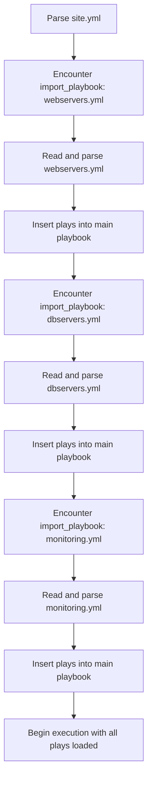

# How to Import Playbooks with import_playbook

Author: [nawazdhandala](https://www.github.com/nawazdhandala)

Tags: Ansible, Playbook, Import, Code Reuse

Description: Learn how to use import_playbook to compose large Ansible configurations from smaller, reusable playbook files for better organization.

---

As your Ansible automation grows, keeping everything in one giant playbook becomes unmanageable. A 500-line YAML file with 10 plays targeting different host groups is hard to read, hard to debug, and hard to maintain. The `import_playbook` directive lets you split your automation into smaller, focused playbook files and compose them together into a master playbook.

## Basic Syntax

The `import_playbook` directive is used at the top level of a playbook, at the same level as plays.

```yaml
# site.yml - master playbook that imports others
---
- import_playbook: webservers.yml
- import_playbook: dbservers.yml
- import_playbook: monitoring.yml
```

Each imported file is a complete playbook with its own plays, tasks, handlers, and variables.

## Creating the Component Playbooks

Let us build a complete example. First, the individual playbooks.

```yaml
# webservers.yml - handles web server configuration
---
- name: Configure web servers
  hosts: webservers
  become: yes

  tasks:
    - name: Install nginx
      apt:
        name: nginx
        state: present

    - name: Deploy nginx configuration
      template:
        src: templates/nginx.conf.j2
        dest: /etc/nginx/nginx.conf
      notify: Reload nginx

    - name: Ensure nginx is running
      service:
        name: nginx
        state: started
        enabled: yes

  handlers:
    - name: Reload nginx
      service:
        name: nginx
        state: reloaded
```

```yaml
# dbservers.yml - handles database server configuration
---
- name: Configure database servers
  hosts: dbservers
  become: yes

  tasks:
    - name: Install PostgreSQL
      apt:
        name:
          - postgresql
          - postgresql-contrib
        state: present

    - name: Configure PostgreSQL
      template:
        src: templates/postgresql.conf.j2
        dest: /etc/postgresql/14/main/postgresql.conf
      notify: Restart PostgreSQL

    - name: Ensure PostgreSQL is running
      service:
        name: postgresql
        state: started
        enabled: yes

  handlers:
    - name: Restart PostgreSQL
      service:
        name: postgresql
        state: restarted
```

```yaml
# monitoring.yml - configures monitoring on all hosts
---
- name: Set up monitoring
  hosts: all
  become: yes

  tasks:
    - name: Install node exporter
      apt:
        name: prometheus-node-exporter
        state: present

    - name: Start node exporter
      service:
        name: prometheus-node-exporter
        state: started
        enabled: yes
```

Now compose them together.

```yaml
# site.yml - the master playbook
---
- import_playbook: webservers.yml
- import_playbook: dbservers.yml
- import_playbook: monitoring.yml
```

Run the master playbook, and all three are executed in order.

```bash
# This runs webservers.yml, then dbservers.yml, then monitoring.yml
ansible-playbook -i inventory.ini site.yml
```

## Directory Structure

A common project structure looks like this.

```
project/
  site.yml              # Master playbook
  webservers.yml        # Web server plays
  dbservers.yml         # Database server plays
  monitoring.yml        # Monitoring plays
  inventory.ini         # Inventory file
  templates/
    nginx.conf.j2
    postgresql.conf.j2
  group_vars/
    webservers.yml
    dbservers.yml
    all.yml
```

## How import_playbook Is Processed

Understanding the processing model is important. `import_playbook` is a static import, meaning Ansible reads and parses the imported file at playbook parsing time, before any tasks execute.



Because it is static, the imported playbooks are effectively inlined into the master playbook. This is different from dynamic includes (there is no `include_playbook` for plays in modern Ansible).

## Passing Variables to Imported Playbooks

You can pass variables to imported playbooks using `vars`.

```yaml
# site.yml - passes variables to imported playbooks
---
- import_playbook: webservers.yml
  vars:
    http_port: 8080
    worker_count: 4

- import_playbook: dbservers.yml
  vars:
    db_port: 5432
    max_connections: 200
```

The imported playbook can reference these variables in its tasks.

```yaml
# webservers.yml - uses variables passed from the importer
---
- name: Configure web servers
  hosts: webservers
  become: yes

  tasks:
    - name: Deploy nginx config with custom port
      template:
        src: templates/nginx.conf.j2
        dest: /etc/nginx/nginx.conf
      # http_port and worker_count are available here from the import
```

## Using Tags with import_playbook

You can apply tags to an imported playbook, and those tags will apply to all plays and tasks within the imported file.

```yaml
# site.yml - tagged imports
---
- import_playbook: webservers.yml
  tags: web

- import_playbook: dbservers.yml
  tags: database

- import_playbook: monitoring.yml
  tags: monitoring
```

Now you can run just the web server configuration.

```bash
# Run only the web server playbook
ansible-playbook -i inventory.ini site.yml --tags web

# Run web and monitoring but skip database
ansible-playbook -i inventory.ini site.yml --tags "web,monitoring"
```

## Conditional Imports

You can use `when` with `import_playbook`, but there is a catch. Since imports are static, the condition is evaluated against each host individually when the plays execute.

```yaml
# conditional-import.yml - imports based on a variable
---
- import_playbook: setup-haproxy.yml
  when: deploy_loadbalancer | default(false) | bool

- import_playbook: webservers.yml

- import_playbook: dbservers.yml
```

```bash
# Run with load balancer setup
ansible-playbook -i inventory.ini conditional-import.yml -e "deploy_loadbalancer=true"

# Run without load balancer setup
ansible-playbook -i inventory.ini conditional-import.yml
```

## Nested Imports

Imported playbooks can import other playbooks, allowing you to build a hierarchy.

```yaml
# site.yml
---
- import_playbook: infrastructure.yml
- import_playbook: applications.yml

# infrastructure.yml
---
- import_playbook: networking.yml
- import_playbook: storage.yml
- import_playbook: compute.yml

# applications.yml
---
- import_playbook: webservers.yml
- import_playbook: dbservers.yml
- import_playbook: cache-servers.yml
```

Keep nesting shallow. More than two or three levels deep becomes hard to follow and debug.

## Relative Paths

Imported playbook paths are relative to the importing playbook's location.

```
project/
  site.yml              # imports playbooks/web.yml
  playbooks/
    web.yml             # imports ../common/base.yml
  common/
    base.yml
```

```yaml
# site.yml
---
- import_playbook: playbooks/web.yml

# playbooks/web.yml
---
- import_playbook: ../common/base.yml
- name: Web-specific tasks
  hosts: webservers
  tasks: [...]
```

## When to Use import_playbook

Use `import_playbook` when:

- Your playbook has grown too large to manage in one file
- Multiple team members work on different parts of the infrastructure
- You want to reuse playbooks across different master playbooks (e.g., one for full deployment, one for just the web tier)
- You need to apply tags at the playbook level for selective execution

Avoid using it when:

- You only have a few plays (no need to split a 50-line playbook)
- The component playbooks have tight interdependencies that make them hard to understand in isolation

The `import_playbook` directive is the foundation of well-organized Ansible projects. It lets you decompose your automation into logical units that are easier to understand, test, and maintain individually, while still providing a single entry point for execution.
