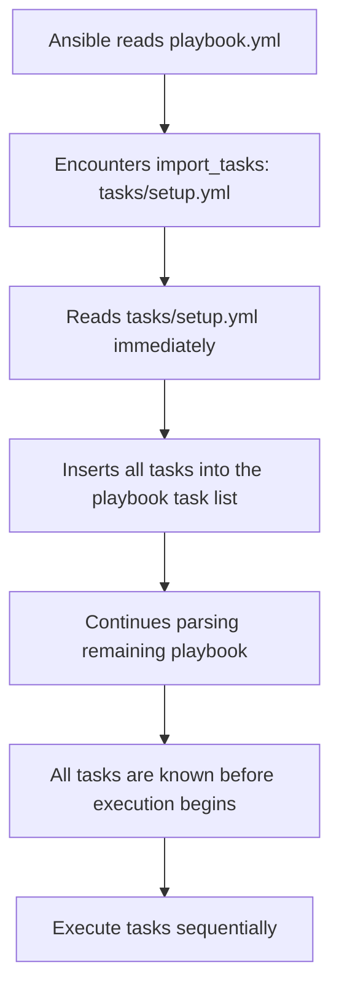

# How to Import Tasks Statically with import_tasks

Author: [nawazdhandala](https://www.github.com/nawazdhandala)

Tags: Ansible, Tasks, Import, Code Organization

Description: Learn how to use import_tasks for static task inclusion in Ansible playbooks, with details on parse-time processing and best practices.

---

When you want to break a large task list into smaller, reusable files, `import_tasks` is the straightforward way to do it. Unlike its dynamic counterpart `include_tasks`, `import_tasks` is processed at parse time. Ansible reads the imported file before any task executes and treats the tasks as if they were written directly in the playbook. This makes the behavior predictable and easy to reason about.

## Basic Usage

Create a task file and import it from your playbook.

```yaml
# tasks/common-setup.yml - shared setup tasks
---
- name: Set timezone
  timezone:
    name: UTC

- name: Install common packages
  apt:
    name:
      - vim
      - curl
      - wget
      - htop
      - git
    state: present

- name: Configure NTP
  apt:
    name: chrony
    state: present

- name: Start NTP service
  service:
    name: chrony
    state: started
    enabled: yes
```

```yaml
# playbook.yml - imports the common setup tasks
---
- name: Server baseline configuration
  hosts: all
  become: yes

  tasks:
    - import_tasks: tasks/common-setup.yml

    - name: Additional host-specific task
      debug:
        msg: "Host {{ inventory_hostname }} baseline complete"
```

When Ansible parses this playbook, it replaces the `import_tasks` line with the contents of `tasks/common-setup.yml`. By the time execution begins, the playbook has five tasks (the four imported ones plus the debug task).

## Passing Variables

You can pass variables to imported tasks.

```yaml
# tasks/create-directory.yml - parameterized task file
---
- name: Create directory {{ dir_path }}
  file:
    path: "{{ dir_path }}"
    state: directory
    owner: "{{ dir_owner }}"
    group: "{{ dir_group | default(dir_owner) }}"
    mode: "{{ dir_mode | default('0755') }}"
```

```yaml
# playbook.yml - imports with different variables
---
- name: Create application directories
  hosts: appservers
  become: yes

  tasks:
    - import_tasks: tasks/create-directory.yml
      vars:
        dir_path: /var/www/myapp
        dir_owner: www-data
        dir_mode: '0755'

    - import_tasks: tasks/create-directory.yml
      vars:
        dir_path: /var/log/myapp
        dir_owner: myapp
        dir_mode: '0750'

    - import_tasks: tasks/create-directory.yml
      vars:
        dir_path: /etc/myapp
        dir_owner: root
        dir_mode: '0700'
```

## How Static Import Works

The key difference between `import_tasks` and `include_tasks` is when the file is processed.



Because tasks are loaded at parse time:
- All imported tasks appear in `--list-tasks` output
- Tags on individual imported tasks work correctly with `--tags`
- The imported file path must be static (cannot use variables)
- Conditions on `import_tasks` are applied to each imported task individually

## Tags Work Fully with Imports

This is one of the biggest advantages of `import_tasks` over `include_tasks`.

```yaml
# tasks/web-deploy.yml - tasks with individual tags
---
- name: Pull latest code
  git:
    repo: https://github.com/example/myapp.git
    dest: /var/www/myapp
    version: "{{ app_version }}"
  tags:
    - code

- name: Install dependencies
  pip:
    requirements: /var/www/myapp/requirements.txt
    virtualenv: /var/www/myapp/venv
  tags:
    - dependencies

- name: Run migrations
  command: /var/www/myapp/venv/bin/python manage.py migrate
  args:
    chdir: /var/www/myapp
  tags:
    - migrations

- name: Collect static files
  command: /var/www/myapp/venv/bin/python manage.py collectstatic --noinput
  args:
    chdir: /var/www/myapp
  tags:
    - static
```

```yaml
# playbook.yml
---
- name: Deploy application
  hosts: webservers
  become: yes

  tasks:
    - import_tasks: tasks/web-deploy.yml
      vars:
        app_version: "v2.5.0"
```

Since the tasks are statically imported, you can target individual tags.

```bash
# Run only the migration step
ansible-playbook -i inventory.ini playbook.yml --tags migrations

# Run code pull and dependencies but skip migrations
ansible-playbook -i inventory.ini playbook.yml --tags "code,dependencies"

# List all available tasks and their tags
ansible-playbook -i inventory.ini playbook.yml --list-tasks
```

The `--list-tasks` output shows every imported task as if it were defined directly in the playbook.

## Conditional Imports

You can add a `when` condition to `import_tasks`, but it behaves differently than you might expect. The condition is applied to every individual task in the imported file, not to the import itself.

```yaml
# playbook.yml - conditional import
---
- name: Platform-specific setup
  hosts: all
  become: yes

  tasks:
    - import_tasks: tasks/debian-setup.yml
      when: ansible_os_family == "Debian"

    - import_tasks: tasks/redhat-setup.yml
      when: ansible_os_family == "RedHat"
```

Both files are read and parsed regardless of the condition. At execution time, each task from `debian-setup.yml` will have `when: ansible_os_family == "Debian"` appended to it. If the host is RedHat, all those tasks are individually skipped (you will see "skipping" for each one in the output).

This is different from `include_tasks`, which never reads the file if the condition is false.

## Building a Modular Playbook

Here is a pattern for organizing a complex playbook using `import_tasks`.

```
project/
  playbook.yml
  tasks/
    prerequisites.yml
    install.yml
    configure.yml
    deploy.yml
    verify.yml
```

```yaml
# playbook.yml - clean, modular structure
---
- name: Full application setup
  hosts: appservers
  become: yes

  vars:
    app_name: myapp
    app_version: "2.5.0"

  pre_tasks:
    - import_tasks: tasks/prerequisites.yml

  tasks:
    - import_tasks: tasks/install.yml
    - import_tasks: tasks/configure.yml
    - import_tasks: tasks/deploy.yml

  post_tasks:
    - import_tasks: tasks/verify.yml
```

Each file is focused on one concern, making the playbook easy to navigate and maintain.

## Nesting Imports

Imported task files can import other task files.

```yaml
# tasks/install.yml - imports sub-tasks
---
- import_tasks: install/packages.yml
- import_tasks: install/python-deps.yml
- import_tasks: install/node-deps.yml
```

Keep nesting shallow. Two levels deep is manageable. Three or more levels makes it hard to trace where a task originates.

## Handlers in Imported Task Files

Handlers are not imported with `import_tasks`. If your imported tasks need to notify handlers, define the handlers in the playbook or in a separate handlers file.

```yaml
# playbook.yml - handlers defined in the playbook
---
- name: Configure services
  hosts: all
  become: yes

  tasks:
    - import_tasks: tasks/nginx-config.yml
    - import_tasks: tasks/app-config.yml

  handlers:
    - name: Reload nginx
      service:
        name: nginx
        state: reloaded

    - name: Restart application
      service:
        name: myapp
        state: restarted
```

The imported task files can use `notify: Reload nginx` and it will work because the handler is defined in the playbook that imports them.

## Limitations of import_tasks

**No loops**: You cannot use `import_tasks` in a loop. If you need to include a task file multiple times with different variables, use `include_tasks` instead.

```yaml
# THIS DOES NOT WORK
- import_tasks: tasks/create-user.yml
  loop: "{{ users }}"

# Use include_tasks for loops
- include_tasks: tasks/create-user.yml
  loop: "{{ users }}"
  loop_control:
    loop_var: user
```

**No variable file names**: The file path must be a literal string, not a variable.

```yaml
# THIS DOES NOT WORK
- import_tasks: "tasks/setup-{{ ansible_os_family }}.yml"

# Use include_tasks for dynamic paths
- include_tasks: "tasks/setup-{{ ansible_os_family }}.yml"
```

**All files must exist**: Since Ansible reads imported files at parse time, all referenced files must exist. Even if a `when` condition would prevent execution, the file still needs to be present.

## Summary

`import_tasks` is the right choice when you have static, predictable task files that you want to break out for organizational purposes. The tasks behave identically to inline tasks, tags work fully, and `--list-tasks` shows everything. Use it as your default for task file inclusion, and switch to `include_tasks` only when you need dynamic features like loops, variable file paths, or truly conditional file loading.
