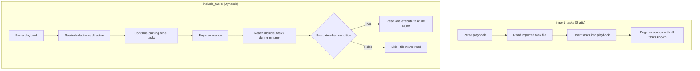

# How to Include Tasks Dynamically with include_tasks

Author: [nawazdhandala](https://www.github.com/nawazdhandala)

Tags: Ansible, Tasks, Dynamic Include, Playbook

Description: Learn how to use include_tasks for dynamic task inclusion in Ansible, enabling conditional logic, loops, and runtime decision-making.

---

Ansible offers two ways to pull external task files into your playbook: static imports and dynamic includes. The `include_tasks` module is the dynamic option. Unlike `import_tasks`, which loads tasks at parse time, `include_tasks` loads tasks at runtime. This means you can use variables, loops, and conditions that are only known during execution to decide which tasks to load and how many times.

## Basic Syntax

Create a task file and include it from your playbook.

```yaml
# tasks/install-nginx.yml - a reusable task file
---
- name: Install nginx
  apt:
    name: nginx
    state: present

- name: Start nginx service
  service:
    name: nginx
    state: started
    enabled: yes
```

```yaml
# playbook.yml - includes the task file dynamically
---
- name: Set up web servers
  hosts: webservers
  become: yes

  tasks:
    - name: Include nginx installation tasks
      include_tasks: tasks/install-nginx.yml
```

When Ansible reaches the `include_tasks` line during execution, it reads the task file and injects the tasks at that point.

## Passing Variables to Included Tasks

You can pass variables to the included tasks using the `vars` keyword.

```yaml
# tasks/install-package.yml - a generic package installer
---
- name: Install {{ package_name }}
  apt:
    name: "{{ package_name }}"
    state: "{{ package_state | default('present') }}"

- name: Ensure {{ package_name }} service is running
  service:
    name: "{{ service_name | default(package_name) }}"
    state: started
    enabled: yes
  when: manage_service | default(true) | bool
```

```yaml
# playbook.yml - includes the task file with different variables each time
---
- name: Set up application stack
  hosts: appservers
  become: yes

  tasks:
    - name: Install nginx
      include_tasks: tasks/install-package.yml
      vars:
        package_name: nginx
        service_name: nginx

    - name: Install Redis
      include_tasks: tasks/install-package.yml
      vars:
        package_name: redis-server
        service_name: redis-server

    - name: Install PostgreSQL client (no service)
      include_tasks: tasks/install-package.yml
      vars:
        package_name: postgresql-client
        manage_service: false
```

## Dynamic Inclusion with Conditions

This is where `include_tasks` shines compared to `import_tasks`. You can use runtime variables and facts to decide which tasks to include.

```yaml
# tasks/setup-debian.yml
---
- name: Update apt cache
  apt:
    update_cache: yes
    cache_valid_time: 3600

- name: Install Debian-specific packages
  apt:
    name:
      - apt-transport-https
      - ca-certificates
    state: present

# tasks/setup-redhat.yml
---
- name: Install EPEL repository
  yum:
    name: epel-release
    state: present

- name: Install RedHat-specific packages
  yum:
    name:
      - yum-utils
    state: present
```

```yaml
# playbook.yml - includes tasks based on the OS family
---
- name: OS-specific setup
  hosts: all
  become: yes

  tasks:
    - name: Include Debian setup
      include_tasks: "tasks/setup-debian.yml"
      when: ansible_os_family == "Debian"

    - name: Include RedHat setup
      include_tasks: "tasks/setup-redhat.yml"
      when: ansible_os_family == "RedHat"
```

## Dynamic File Names

You can construct the task file name from variables. This is impossible with static `import_tasks`.

```yaml
# playbook.yml - dynamically constructs the task file path
---
- name: OS-specific setup using dynamic path
  hosts: all
  become: yes

  tasks:
    - name: Include OS-specific tasks
      include_tasks: "tasks/setup-{{ ansible_os_family | lower }}.yml"
```

This resolves to `tasks/setup-debian.yml` on Ubuntu/Debian hosts and `tasks/setup-redhat.yml` on CentOS/RHEL hosts.

## Using include_tasks in Loops

You can include a task file multiple times in a loop, passing different variables each iteration.

```yaml
# tasks/create-user.yml - creates a single user
---
- name: Create user {{ user.name }}
  user:
    name: "{{ user.name }}"
    groups: "{{ user.groups | default([]) }}"
    shell: "{{ user.shell | default('/bin/bash') }}"
    state: present

- name: Set authorized key for {{ user.name }}
  authorized_key:
    user: "{{ user.name }}"
    key: "{{ user.ssh_key }}"
  when: user.ssh_key is defined
```

```yaml
# playbook.yml - creates multiple users via loop
---
- name: Provision user accounts
  hosts: all
  become: yes

  vars:
    users:
      - name: alice
        groups: [sudo, docker]
        ssh_key: "ssh-rsa AAAA... alice@laptop"
      - name: bob
        groups: [docker]
        shell: /bin/zsh
        ssh_key: "ssh-rsa AAAA... bob@laptop"
      - name: charlie
        groups: [developers]

  tasks:
    - name: Create each user
      include_tasks: tasks/create-user.yml
      loop: "{{ users }}"
      loop_control:
        loop_var: user
```

Note the `loop_control` with `loop_var`. This is important because the default loop variable is `item`, but if the included task file also uses loops internally, you would get a naming conflict. Using a custom `loop_var` avoids this.

## Runtime Processing Flow

Here is how `include_tasks` is processed compared to `import_tasks`.



## Applying Tags to Included Tasks

Tags applied to `include_tasks` propagate to all tasks within the included file.

```yaml
# playbook.yml - tags on include_tasks
---
- name: Full server setup
  hosts: all
  become: yes

  tasks:
    - name: Base system setup
      include_tasks: tasks/base-setup.yml
      tags: base

    - name: Security hardening
      include_tasks: tasks/security.yml
      tags: security

    - name: Application deployment
      include_tasks: tasks/deploy-app.yml
      tags: deploy
```

```bash
# Run only security tasks
ansible-playbook -i inventory.ini playbook.yml --tags security
```

However, there is a caveat. With dynamic includes, Ansible does not know which tasks are inside the included file until runtime. The `--list-tasks` flag will show the `include_tasks` directive but not the individual tasks within it.

## Error Handling with include_tasks

You can wrap `include_tasks` in a block for error handling.

```yaml
# playbook.yml - error handling around included tasks
---
- name: Deploy with error handling
  hosts: webservers
  become: yes

  tasks:
    - block:
        - name: Run deployment tasks
          include_tasks: tasks/deploy.yml

        - name: Run verification tasks
          include_tasks: tasks/verify.yml

      rescue:
        - name: Run rollback tasks
          include_tasks: tasks/rollback.yml

      always:
        - name: Run cleanup tasks
          include_tasks: tasks/cleanup.yml
```

## When to Use include_tasks vs import_tasks

Use `include_tasks` when:
- The task file name depends on a variable or fact
- You need to include tasks conditionally based on runtime state
- You are using loops to include the same file multiple times
- You need the tasks to be evaluated lazily (at runtime)

Use `import_tasks` when:
- The file name is static and known ahead of time
- You want tasks to show up in `--list-tasks` output
- You need tags on individual tasks inside the file to work with `--tags`
- Performance matters (static imports are slightly faster because they are processed once at parse time)

The `include_tasks` module gives you runtime flexibility that static imports cannot match. Whenever your task inclusion logic depends on information that is only available during execution, `include_tasks` is the right tool.
