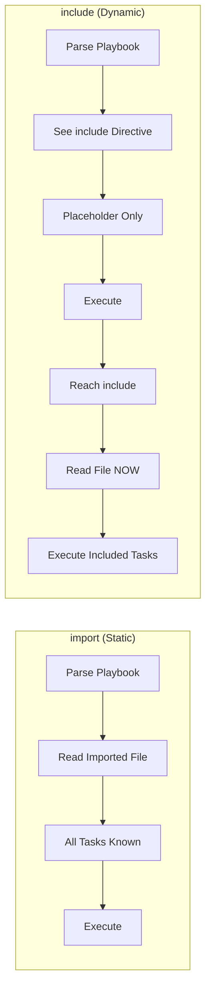
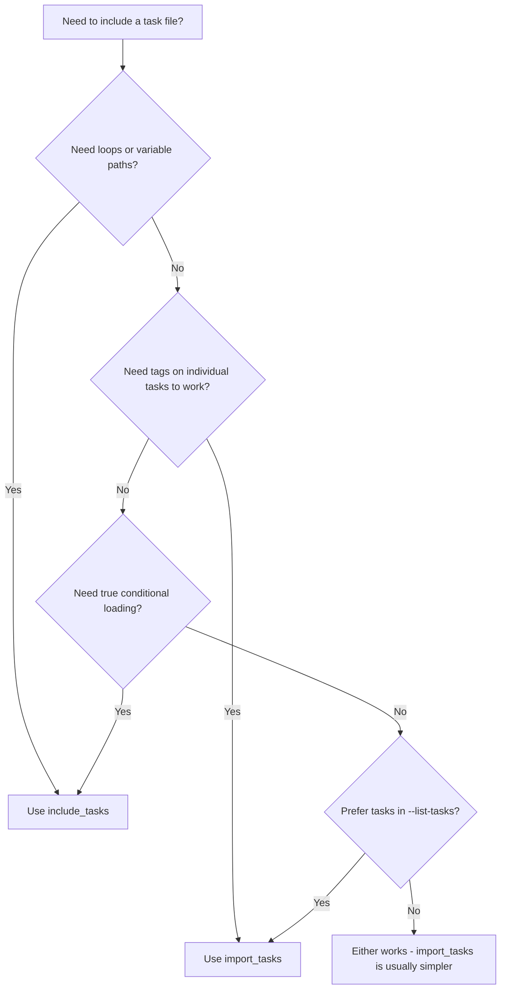

# How to Understand the Difference Between include and import in Ansible

Author: [nawazdhandala](https://www.github.com/nawazdhandala)

Tags: Ansible, Import, Include, Best Practices

Description: A clear explanation of the differences between include and import in Ansible, covering when to use each approach with practical examples.

---

One of the most common sources of confusion for Ansible users is the difference between `include` and `import`. Both let you pull in external files (tasks, roles, playbooks), but they work in fundamentally different ways. Choosing the wrong one leads to subtle bugs with tags, conditions, and variable scoping. This post breaks down exactly how each works and when to use which.

## The Core Difference: Parse Time vs Runtime

This is the single most important thing to understand.

- **import** (static): Ansible reads and processes the file when it parses the playbook, before execution begins
- **include** (dynamic): Ansible reads the file during execution, when it reaches that point in the task list



## Available Directives

Here is the full list of import and include directives in Ansible.

| Directive | Type | Used For |
|-----------|------|----------|
| `import_playbook` | Static | Including entire playbooks |
| `import_tasks` | Static | Including task files |
| `import_role` | Static | Including roles |
| `include_tasks` | Dynamic | Including task files |
| `include_role` | Dynamic | Including roles |

Note: `include_playbook` does not exist. Playbooks can only be imported statically.

## How They Differ in Practice

### Tag Behavior

This is the most impactful difference. With `import_tasks`, tags on individual tasks inside the file work correctly with `--tags` and `--skip-tags`. With `include_tasks`, they do not.

```yaml
# tasks/deploy.yml
---
- name: Pull code
  git:
    repo: https://github.com/example/app.git
    dest: /var/www/app
  tags: code

- name: Install dependencies
  pip:
    requirements: /var/www/app/requirements.txt
  tags: deps

- name: Run migrations
  command: python manage.py migrate
  tags: migrations
```

```yaml
# With import_tasks - tags work
---
- name: Deploy
  hosts: webservers
  tasks:
    - import_tasks: tasks/deploy.yml
```

```bash
# This WORKS - runs only the migration task
ansible-playbook playbook.yml --tags migrations
```

```yaml
# With include_tasks - tags do NOT work the same way
---
- name: Deploy
  hosts: webservers
  tasks:
    - include_tasks: tasks/deploy.yml
```

```bash
# This does NOT run the migration task because Ansible does not know
# about the tasks inside the file at parse time
ansible-playbook playbook.yml --tags migrations
```

To make tags work with `include_tasks`, you must tag the include directive itself.

```yaml
- include_tasks: tasks/deploy.yml
  tags: deploy

# Now this works
# ansible-playbook playbook.yml --tags deploy
# But it runs ALL tasks in the file, not just the ones tagged "migrations"
```

### Conditional Behavior

With `import_tasks`, a `when` condition is copied to every task inside the file.

```yaml
# With import_tasks
- import_tasks: tasks/debian.yml
  when: ansible_os_family == "Debian"

# Equivalent to adding when: ansible_os_family == "Debian" to EVERY task
# in tasks/debian.yml. Each task shows as "skipping" on non-Debian hosts.
```

With `include_tasks`, the condition controls whether the file is loaded at all.

```yaml
# With include_tasks
- include_tasks: tasks/debian.yml
  when: ansible_os_family == "Debian"

# On non-Debian hosts, the file is never read. You see one "skipping"
# line instead of one for each task.
```

### Loop Support

`import_tasks` does not support loops. `include_tasks` does.

```yaml
# THIS DOES NOT WORK
- import_tasks: tasks/create-user.yml
  loop: "{{ users }}"

# THIS WORKS
- include_tasks: tasks/create-user.yml
  loop: "{{ users }}"
  loop_control:
    loop_var: user
```

### Variable File Names

`import_tasks` requires a literal file path. `include_tasks` can use variables.

```yaml
# THIS DOES NOT WORK
- import_tasks: "tasks/{{ ansible_os_family | lower }}.yml"

# THIS WORKS
- include_tasks: "tasks/{{ ansible_os_family | lower }}.yml"
```

### --list-tasks Output

`import_tasks` shows all tasks in `--list-tasks` output. `include_tasks` only shows the include directive.

```bash
# With import_tasks
$ ansible-playbook playbook.yml --list-tasks
  tasks:
    Pull code         TAGS: [code]
    Install deps      TAGS: [deps]
    Run migrations    TAGS: [migrations]

# With include_tasks
$ ansible-playbook playbook.yml --list-tasks
  tasks:
    include_tasks: tasks/deploy.yml    TAGS: []
```

## Side-by-Side Comparison

```yaml
# comparison.yml - demonstrates both approaches
---
- name: Import vs Include demonstration
  hosts: webservers
  become: yes

  tasks:
    # STATIC: Tasks are known at parse time
    # Tags work, --list-tasks shows individual tasks
    # Cannot use loops or variable file names
    - import_tasks: tasks/base-setup.yml
      tags: base

    # DYNAMIC: Tasks are loaded at runtime
    # Can use loops, variable paths, and true conditionals
    # Tags on internal tasks do not work with --tags flag
    - include_tasks: "tasks/setup-{{ ansible_os_family | lower }}.yml"
      tags: os_setup

    # STATIC: Individual task tags work
    - import_tasks: tasks/security.yml

    # DYNAMIC: Can loop over the include
    - include_tasks: tasks/create-vhost.yml
      loop: "{{ virtual_hosts }}"
      loop_control:
        loop_var: vhost
```

## Decision Guide



## Common Patterns

### Role-Like Structure with import_tasks

```yaml
# playbook.yml - organized like a role but simpler
---
- name: Application setup
  hosts: appservers
  become: yes

  tasks:
    - import_tasks: tasks/install.yml
      tags: install

    - import_tasks: tasks/configure.yml
      tags: configure

    - import_tasks: tasks/deploy.yml
      tags: deploy
```

Use `import_tasks` here because the file names are known, and you want `--tags` to work.

### OS-Specific Tasks with include_tasks

```yaml
# playbook.yml - dynamic OS selection
---
- name: Cross-platform setup
  hosts: all
  become: yes

  tasks:
    - name: Include OS-specific tasks
      include_tasks: "tasks/{{ ansible_distribution | lower }}.yml"
```

Use `include_tasks` here because the file name depends on a runtime fact.

### Iterating Over Services with include_tasks

```yaml
# playbook.yml - configure multiple services from a list
---
- name: Configure services
  hosts: all
  become: yes

  vars:
    services:
      - name: nginx
        config_src: templates/nginx.conf.j2
        config_dest: /etc/nginx/nginx.conf
      - name: redis
        config_src: templates/redis.conf.j2
        config_dest: /etc/redis/redis.conf

  tasks:
    - name: Configure each service
      include_tasks: tasks/configure-service.yml
      loop: "{{ services }}"
      loop_control:
        loop_var: svc
```

Use `include_tasks` here because you are looping.

## The Old include Directive

If you see bare `include:` in older playbooks, that is the deprecated version. It was removed in Ansible 2.12. Always use the explicit `import_tasks` or `include_tasks` instead. The explicit names make it clear whether you are getting static or dynamic behavior.

## Summary

| Feature | import_tasks | include_tasks |
|---------|-------------|---------------|
| Processing time | Parse time | Runtime |
| Tags on internal tasks | Work with --tags | Do not work with --tags |
| Loops | Not supported | Supported |
| Variable file names | Not supported | Supported |
| --list-tasks | Shows all tasks | Shows include only |
| when behavior | Applied to each task | Controls file loading |
| Performance | Slightly faster | Slightly slower |

Default to `import_tasks` for static, organizational splitting. Switch to `include_tasks` when you need dynamic behavior. Understanding this distinction eliminates an entire category of confusing Ansible bugs.
