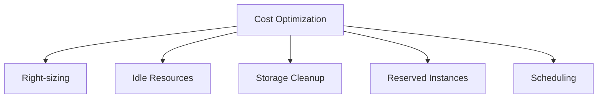

# How to Use Ansible to Automate Infrastructure Cost Optimization

Author: [nawazdhandala](https://www.github.com/nawazdhandala)

Tags: Ansible, Cost Optimization, Cloud, Infrastructure, FinOps

Description: Automate infrastructure cost optimization with Ansible by identifying idle resources, right-sizing instances, and enforcing cost policies.

---

Cloud infrastructure costs have a way of creeping up. Unused resources, oversized instances, forgotten snapshots, and unattached volumes all contribute to waste. Ansible can automate the identification and cleanup of these cost leaks, turning cost optimization from a quarterly fire drill into an ongoing automated process.

## Cost Optimization Areas



## Resource Audit Tasks

```yaml
# roles/cost_optimization/tasks/main.yml - Identify cost savings
---
- name: Find servers with low CPU utilization
  shell: |
    curl -s 'http://prometheus:9090/api/v1/query'       --data-urlencode 'query=avg_over_time(100 - (rate(node_cpu_seconds_total{mode="idle"}[24h]) * 100)[7d:1h]) < 10'
  register: low_cpu_servers
  delegate_to: localhost
  changed_when: false

- name: Find servers with low memory utilization
  shell: |
    curl -s 'http://prometheus:9090/api/v1/query'       --data-urlencode 'query=avg_over_time((1 - node_memory_MemAvailable_bytes / node_memory_MemTotal_bytes) * 100[7d:1h]) < 20'
  register: low_mem_servers
  delegate_to: localhost
  changed_when: false

- name: Find unattached EBS volumes
  command: >
    aws ec2 describe-volumes
    --filters Name=status,Values=available
    --query 'Volumes[].{ID:VolumeId,Size:Size,Created:CreateTime}'
    --output json
  register: unattached_volumes
  delegate_to: localhost
  changed_when: false

- name: Find old snapshots beyond retention
  command: >
    aws ec2 describe-snapshots --owner-ids self
    --query "Snapshots[?StartTime<='{{ retention_cutoff }}'].{ID:SnapshotId,Size:VolumeSize,Date:StartTime}"
    --output json
  register: old_snapshots
  delegate_to: localhost
  changed_when: false

- name: Generate cost optimization report
  template:
    src: cost_report.j2
    dest: /opt/reports/cost_optimization_{{ ansible_date_time.date }}.txt
    mode: '0644'
  delegate_to: localhost
```

## Dev/Test Environment Scheduling

```yaml
# roles/cost_optimization/tasks/scheduling.yml - Stop non-prod after hours
---
- name: Stop development servers after business hours
  amazon.aws.ec2_instance:
    instance_ids: "{{ item }}"
    state: stopped
  loop: "{{ dev_instance_ids }}"
  when: ansible_date_time.hour | int >= 20 or ansible_date_time.hour | int < 7

- name: Start development servers during business hours
  amazon.aws.ec2_instance:
    instance_ids: "{{ item }}"
    state: running
  loop: "{{ dev_instance_ids }}"
  when: ansible_date_time.hour | int >= 7 and ansible_date_time.hour | int < 20
```

## Cleanup Tasks

```yaml
# roles/cost_optimization/tasks/cleanup.yml - Remove waste
---
- name: Delete unattached volumes older than 30 days
  amazon.aws.ec2_vol:
    id: "{{ item.ID }}"
    state: absent
  loop: "{{ (unattached_volumes.stdout | from_json) }}"
  when: cost_auto_cleanup | default(false)

- name: Delete snapshots beyond retention period
  amazon.aws.ec2_snapshot:
    snapshot_id: "{{ item.ID }}"
    state: absent
  loop: "{{ (old_snapshots.stdout | from_json) }}"
  when: cost_auto_cleanup | default(false)
```

## Running the Optimization

```bash
# Generate cost optimization report
ansible-playbook -i inventory/hosts.ini cost-optimize.yml

# Run with auto-cleanup enabled (careful!)
ansible-playbook -i inventory/hosts.ini cost-optimize.yml -e "cost_auto_cleanup=true"
```

## Summary

Ansible-based cost optimization catches waste that manual reviews miss. By running these checks on a weekly schedule, you keep cloud spending under control. The report identifies right-sizing opportunities, idle resources, and storage waste. The scheduling playbook alone can save 50% or more on non-production environments by stopping them outside business hours.

## Common Use Cases

Here are several practical scenarios where this module proves essential in real-world playbooks.

### Infrastructure Provisioning Workflow

```yaml
# Complete workflow incorporating this module
- name: Infrastructure provisioning
  hosts: all
  become: true
  gather_facts: true
  tasks:
    - name: Gather system information
      ansible.builtin.setup:
        gather_subset:
          - hardware
          - network

    - name: Display system summary
      ansible.builtin.debug:
        msg: >-
          Host {{ inventory_hostname }} has
          {{ ansible_memtotal_mb }}MB RAM,
          {{ ansible_processor_vcpus }} vCPUs,
          running {{ ansible_distribution }} {{ ansible_distribution_version }}

    - name: Install required packages
      ansible.builtin.package:
        name:
          - curl
          - wget
          - git
          - vim
          - htop
          - jq
        state: present

    - name: Configure system timezone
      ansible.builtin.timezone:
        name: "{{ system_timezone | default('UTC') }}"

    - name: Configure hostname
      ansible.builtin.hostname:
        name: "{{ inventory_hostname }}"

    - name: Update /etc/hosts
      ansible.builtin.lineinfile:
        path: /etc/hosts
        regexp: '^127\.0\.1\.1'
        line: "127.0.1.1 {{ inventory_hostname }}"

    - name: Configure SSH hardening
      ansible.builtin.lineinfile:
        path: /etc/ssh/sshd_config
        regexp: "{{ item.regexp }}"
        line: "{{ item.line }}"
      loop:
        - { regexp: '^PermitRootLogin', line: 'PermitRootLogin no' }
        - { regexp: '^PasswordAuthentication', line: 'PasswordAuthentication no' }
      notify: restart sshd

    - name: Configure firewall rules
      community.general.ufw:
        rule: allow
        port: "{{ item }}"
        proto: tcp
      loop:
        - "22"
        - "80"
        - "443"

    - name: Enable firewall
      community.general.ufw:
        state: enabled
        policy: deny

  handlers:
    - name: restart sshd
      ansible.builtin.service:
        name: sshd
        state: restarted
```

### Integration with Monitoring

```yaml
# Using gathered facts to configure monitoring thresholds
- name: Configure monitoring based on system specs
  hosts: all
  become: true
  tasks:
    - name: Set monitoring thresholds based on hardware
      ansible.builtin.template:
        src: monitoring_config.yml.j2
        dest: /etc/monitoring/config.yml
      vars:
        memory_warning_threshold: "{{ (ansible_memtotal_mb * 0.8) | int }}"
        memory_critical_threshold: "{{ (ansible_memtotal_mb * 0.95) | int }}"
        cpu_warning_threshold: 80
        cpu_critical_threshold: 95

    - name: Register host with monitoring system
      ansible.builtin.uri:
        url: "https://monitoring.example.com/api/hosts"
        method: POST
        body_format: json
        body:
          hostname: "{{ inventory_hostname }}"
          ip_address: "{{ ansible_default_ipv4.address }}"
          os: "{{ ansible_distribution }}"
          memory_mb: "{{ ansible_memtotal_mb }}"
          cpus: "{{ ansible_processor_vcpus }}"
        headers:
          Authorization: "Bearer {{ monitoring_api_token }}"
        status_code: [200, 201, 409]
```

### Error Handling Patterns

```yaml
# Robust error handling with this module
- name: Robust task execution
  hosts: all
  tasks:
    - name: Attempt primary operation
      ansible.builtin.command: /opt/app/primary-task.sh
      register: primary_result
      failed_when: false

    - name: Handle primary failure with fallback
      ansible.builtin.command: /opt/app/fallback-task.sh
      when: primary_result.rc != 0
      register: fallback_result

    - name: Report final status
      ansible.builtin.debug:
        msg: >-
          Task completed via {{ 'primary' if primary_result.rc == 0 else 'fallback' }} path.
          Return code: {{ primary_result.rc if primary_result.rc == 0 else fallback_result.rc }}

    - name: Fail if both paths failed
      ansible.builtin.fail:
        msg: "Both primary and fallback operations failed"
      when:
        - primary_result.rc != 0
        - fallback_result is defined
        - fallback_result.rc != 0
```

### Scheduling and Automation

```yaml
# Set up scheduled compliance scans using cron
- name: Configure automated scans
  hosts: all
  become: true
  tasks:
    - name: Create scan script
      ansible.builtin.copy:
        dest: /opt/scripts/compliance_scan.sh
        mode: '0755'
        content: |
          #!/bin/bash
          cd /opt/ansible
          ansible-playbook playbooks/validate.yml -i inventory/ > /var/log/compliance_scan.log 2>&1
          EXIT_CODE=$?
          if [ $EXIT_CODE -ne 0 ]; then
            curl -X POST https://hooks.example.com/alert \
              -H "Content-Type: application/json" \
              -d "{\"text\":\"Compliance scan failed on $(hostname)\"}"
          fi
          exit $EXIT_CODE

    - name: Schedule weekly compliance scan
      ansible.builtin.cron:
        name: "Weekly compliance scan"
        minute: "0"
        hour: "3"
        weekday: "1"
        job: "/opt/scripts/compliance_scan.sh"
        user: ansible
```

