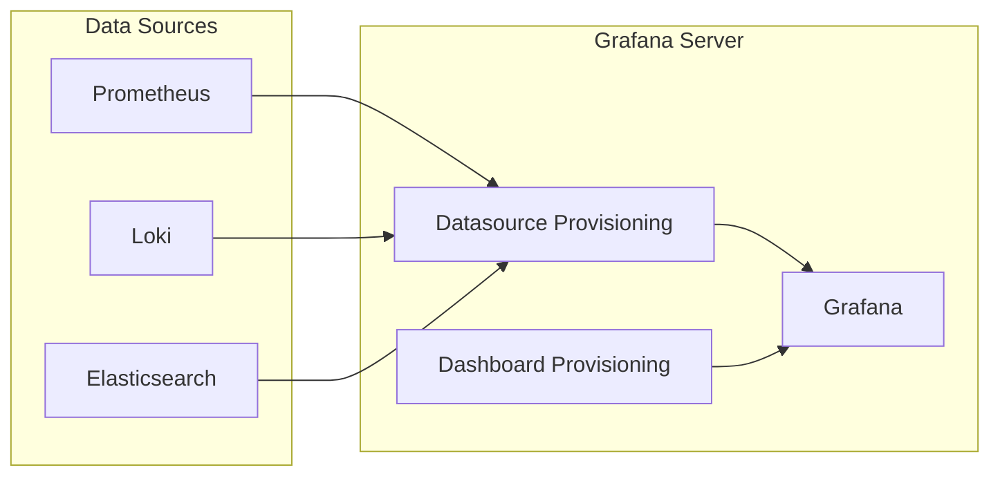

# How to Use Ansible to Set Up Infrastructure Dashboards

Author: [nawazdhandala](https://www.github.com/nawazdhandala)

Tags: Ansible, Grafana, Dashboards, Monitoring, Prometheus

Description: Deploy and provision Grafana dashboards for infrastructure monitoring using Ansible with automated datasource and dashboard configuration.

---

Having metrics without dashboards is like having a car without a windshield. You are technically moving, but you cannot see where you are going. Infrastructure dashboards give your team a real-time view of system health, and Grafana is the go-to tool for building them. The challenge is that setting up Grafana manually through the web UI does not scale and is not reproducible. If you lose the Grafana server, you lose all your dashboards.

Ansible solves this by treating dashboards as code. You define datasources, dashboards, and alert rules in configuration files, and Ansible deploys them through Grafana's provisioning system. This means your dashboards are version-controlled, reproducible, and can be deployed to any environment in minutes.

## Architecture



## Project Structure

```bash
infrastructure-dashboards/
  inventory/
    hosts.ini
  group_vars/
    all.yml
  roles/
    grafana/
      tasks/main.yml
      templates/
        grafana.ini.j2
        datasources.yml.j2
        dashboard-provider.yml.j2
      files/
        dashboards/
          node-exporter.json
          docker-overview.json
          nginx-overview.json
      handlers/main.yml
      defaults/main.yml
  site.yml
```

## Variables

```yaml
# group_vars/all.yml
grafana_version: "10.3.1"
grafana_port: 3000
grafana_admin_user: admin
grafana_admin_password: "{{ vault_grafana_password }}"

# Datasources to configure
grafana_datasources:
  - name: Prometheus
    type: prometheus
    url: http://localhost:9090
    access: proxy
    is_default: true

  - name: Loki
    type: loki
    url: http://localhost:3100
    access: proxy

# Dashboard provisioning
grafana_dashboard_dir: /var/lib/grafana/dashboards
grafana_org_name: "Infrastructure Team"

# SMTP for alert emails
grafana_smtp_enabled: true
grafana_smtp_host: "smtp.company.com:587"
grafana_smtp_from: "grafana@company.com"
```

## Grafana Role

Install Grafana and configure it through provisioning files.

```yaml
# roles/grafana/tasks/main.yml
---
- name: Add Grafana GPG key
  ansible.builtin.apt_key:
    url: https://apt.grafana.com/gpg.key
    state: present

- name: Add Grafana repository
  ansible.builtin.apt_repository:
    repo: "deb https://apt.grafana.com stable main"
    state: present

- name: Install Grafana
  ansible.builtin.apt:
    name: "grafana={{ grafana_version }}*"
    state: present
    update_cache: yes

- name: Deploy Grafana main configuration
  ansible.builtin.template:
    src: grafana.ini.j2
    dest: /etc/grafana/grafana.ini
    owner: root
    group: grafana
    mode: '0640'
  notify: Restart Grafana

- name: Create provisioning directories
  ansible.builtin.file:
    path: "{{ item }}"
    state: directory
    owner: grafana
    group: grafana
    mode: '0755'
  loop:
    - /etc/grafana/provisioning/datasources
    - /etc/grafana/provisioning/dashboards
    - "{{ grafana_dashboard_dir }}"

- name: Deploy datasource provisioning configuration
  ansible.builtin.template:
    src: datasources.yml.j2
    dest: /etc/grafana/provisioning/datasources/ansible.yml
    owner: grafana
    group: grafana
    mode: '0640'
  notify: Restart Grafana

- name: Deploy dashboard provider configuration
  ansible.builtin.template:
    src: dashboard-provider.yml.j2
    dest: /etc/grafana/provisioning/dashboards/ansible.yml
    owner: grafana
    group: grafana
    mode: '0640'
  notify: Restart Grafana

- name: Copy dashboard JSON files
  ansible.builtin.copy:
    src: "dashboards/"
    dest: "{{ grafana_dashboard_dir }}/"
    owner: grafana
    group: grafana
    mode: '0644'
  notify: Restart Grafana

- name: Start and enable Grafana
  ansible.builtin.service:
    name: grafana-server
    state: started
    enabled: yes

- name: Wait for Grafana to be ready
  ansible.builtin.uri:
    url: "http://localhost:{{ grafana_port }}/api/health"
    method: GET
    status_code: 200
  register: grafana_health
  retries: 30
  delay: 3
  until: grafana_health.status == 200
```

## Grafana Configuration Template

```jinja2
# roles/grafana/templates/grafana.ini.j2
# Managed by Ansible
[server]
http_port = {{ grafana_port }}

[security]
admin_user = {{ grafana_admin_user }}
admin_password = {{ grafana_admin_password }}

[users]
allow_sign_up = false
auto_assign_org = true
auto_assign_org_role = Viewer


[smtp]
enabled = true
host = {{ grafana_smtp_host }}
from_address = {{ grafana_smtp_from }}


[dashboards]
default_home_dashboard_path = {{ grafana_dashboard_dir }}/node-exporter.json

[auth.anonymous]
enabled = false
```

## Datasource Provisioning

```jinja2
# roles/grafana/templates/datasources.yml.j2
# Managed by Ansible
apiVersion: 1

datasources:

  - name: {{ ds.name }}
    type: {{ ds.type }}
    url: {{ ds.url }}
    access: {{ ds.access | default('proxy') }}
    isDefault: {{ ds.is_default | default(false) | lower }}
    editable: false

    jsonData:

      {{ key }}: {{ value }}



```

## Dashboard Provider

Tell Grafana where to find dashboard JSON files.

```jinja2
# roles/grafana/templates/dashboard-provider.yml.j2
# Managed by Ansible
apiVersion: 1

providers:
  - name: 'ansible-dashboards'
    orgId: 1
    folder: 'Infrastructure'
    type: file
    disableDeletion: false
    updateIntervalSeconds: 30
    allowUiUpdates: false
    options:
      path: {{ grafana_dashboard_dir }}
      foldersFromFilesStructure: false
```

## Node Exporter Dashboard

Here is a comprehensive Node Exporter dashboard JSON. This is a simplified version showing the key panels.

```json
{
  "dashboard": {
    "title": "Node Exporter Overview",
    "uid": "node-exporter-overview",
    "timezone": "browser",
    "refresh": "30s",
    "time": {
      "from": "now-1h",
      "to": "now"
    },
    "panels": [
      {
        "title": "CPU Usage",
        "type": "timeseries",
        "gridPos": {"h": 8, "w": 12, "x": 0, "y": 0},
        "targets": [
          {
            "expr": "100 - (avg by(instance) (rate(node_cpu_seconds_total{mode=\"idle\"}[5m])) * 100)",
            "legendFormat": "{{instance}}"
          }
        ],
        "fieldConfig": {
          "defaults": {
            "unit": "percent",
            "max": 100,
            "thresholds": {
              "steps": [
                {"color": "green", "value": null},
                {"color": "yellow", "value": 70},
                {"color": "red", "value": 90}
              ]
            }
          }
        }
      },
      {
        "title": "Memory Usage",
        "type": "timeseries",
        "gridPos": {"h": 8, "w": 12, "x": 12, "y": 0},
        "targets": [
          {
            "expr": "(1 - (node_memory_MemAvailable_bytes / node_memory_MemTotal_bytes)) * 100",
            "legendFormat": "{{instance}}"
          }
        ],
        "fieldConfig": {
          "defaults": {
            "unit": "percent",
            "max": 100
          }
        }
      },
      {
        "title": "Disk Usage",
        "type": "gauge",
        "gridPos": {"h": 8, "w": 12, "x": 0, "y": 8},
        "targets": [
          {
            "expr": "(1 - (node_filesystem_avail_bytes{mountpoint=\"/\"} / node_filesystem_size_bytes{mountpoint=\"/\"})) * 100",
            "legendFormat": "{{instance}}"
          }
        ],
        "fieldConfig": {
          "defaults": {
            "unit": "percent",
            "max": 100,
            "thresholds": {
              "steps": [
                {"color": "green", "value": null},
                {"color": "yellow", "value": 70},
                {"color": "red", "value": 85}
              ]
            }
          }
        }
      },
      {
        "title": "Network Traffic",
        "type": "timeseries",
        "gridPos": {"h": 8, "w": 12, "x": 12, "y": 8},
        "targets": [
          {
            "expr": "rate(node_network_receive_bytes_total{device!=\"lo\"}[5m]) * 8",
            "legendFormat": "{{instance}} - {{device}} RX"
          },
          {
            "expr": "rate(node_network_transmit_bytes_total{device!=\"lo\"}[5m]) * 8",
            "legendFormat": "{{instance}} - {{device}} TX"
          }
        ],
        "fieldConfig": {
          "defaults": {
            "unit": "bps"
          }
        }
      }
    ]
  }
}
```

## Creating Dashboards with the Grafana API

For more dynamic dashboard management, use the Grafana API through Ansible.

```yaml
# roles/grafana/tasks/api-dashboards.yml
---
- name: Create or update dashboard via API
  ansible.builtin.uri:
    url: "http://localhost:{{ grafana_port }}/api/dashboards/db"
    method: POST
    body_format: json
    body:
      dashboard: "{{ lookup('file', item) | from_json }}"
      overwrite: true
      folderId: 0
    headers:
      Authorization: "Basic {{ (grafana_admin_user ~ ':' ~ grafana_admin_password) | b64encode }}"
    status_code:
      - 200
      - 201
  loop: "{{ lookup('fileglob', 'dashboards/*.json', wantlist=True) }}"
```

## Handlers

```yaml
# roles/grafana/handlers/main.yml
---
- name: Restart Grafana
  ansible.builtin.service:
    name: grafana-server
    state: restarted
```

## Deployment

```bash
# Deploy Grafana with dashboards
ansible-playbook -i inventory/hosts.ini site.yml

# Update only dashboards without restarting Grafana
ansible-playbook -i inventory/hosts.ini site.yml --tags dashboards
```

## Wrapping Up

Provisioning Grafana dashboards through Ansible means your visualization layer is as reproducible as the rest of your infrastructure. New team members get the same dashboards, disaster recovery is a playbook run, and changes go through code review like any other infrastructure change. Store your dashboard JSON files in version control alongside your Ansible roles, and you will never lose a carefully crafted dashboard again.
