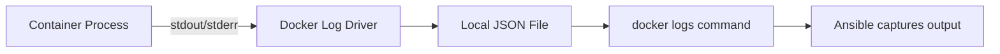

# How to Use Ansible to Inspect Docker Container Logs

Author: [nawazdhandala](https://www.github.com/nawazdhandala)

Tags: Ansible, Docker, Logging, Troubleshooting, DevOps

Description: Retrieve and analyze Docker container logs using Ansible for debugging, monitoring, and automated log collection tasks.

---

When something goes wrong with a containerized service, the first place you look is the container logs. Docker captures everything written to stdout and stderr by the container's main process. While you can SSH into each host and run `docker logs` manually, Ansible lets you pull logs from multiple containers across many hosts in a single run. This is especially valuable during incident response when you need to quickly check logs across your entire fleet.

## How Docker Logging Works

Docker captures the standard output and standard error streams from the container's PID 1 process. These logs are stored locally on the Docker host (typically as JSON files under `/var/lib/docker/containers/`). The `docker logs` command reads from this storage.



## Basic Log Retrieval

The simplest approach uses the `docker_container_info` module to get the container ID, then the `command` module to fetch logs:

```yaml
# get_logs.yml - Retrieve container logs
---
- name: Get Docker Container Logs
  hosts: docker_hosts
  become: true

  tasks:
    - name: Get last 100 lines of container logs
      ansible.builtin.command:
        cmd: docker logs --tail 100 myapp
      register: container_logs
      changed_when: false

    - name: Display logs
      ansible.builtin.debug:
        msg: "{{ container_logs.stdout_lines }}"
```

## Fetching Logs with Timestamps

Adding timestamps helps correlate events across services:

```yaml
# logs_with_timestamps.yml - Logs with timestamp information
---
- name: Get Timestamped Container Logs
  hosts: docker_hosts
  become: true

  tasks:
    - name: Get logs with timestamps
      ansible.builtin.command:
        cmd: docker logs --timestamps --tail 50 myapp
      register: timestamped_logs
      changed_when: false

    - name: Display timestamped logs
      ansible.builtin.debug:
        msg: "{{ timestamped_logs.stdout_lines }}"
```

## Fetching Logs from a Time Range

During incident investigation, you usually know approximately when the problem started. Use the `--since` and `--until` flags to narrow down the logs:

```yaml
# logs_time_range.yml - Get logs from a specific time window
---
- name: Get Logs from Time Range
  hosts: docker_hosts
  become: true
  vars:
    since_time: "2026-02-21T10:00:00"
    until_time: "2026-02-21T11:00:00"

  tasks:
    - name: Get logs from the last hour
      ansible.builtin.command:
        cmd: docker logs --since 1h myapp
      register: recent_logs
      changed_when: false

    - name: Get logs from a specific time range
      ansible.builtin.command:
        cmd: "docker logs --since {{ since_time }} --until {{ until_time }} myapp"
      register: range_logs
      changed_when: false

    - name: Display the time-bounded logs
      ansible.builtin.debug:
        msg: "{{ range_logs.stdout_lines }}"
```

## Collecting Logs from Multiple Containers

When debugging distributed applications, you need logs from several services at once:

```yaml
# multi_container_logs.yml - Collect logs from multiple containers
---
- name: Collect Logs from All Application Containers
  hosts: docker_hosts
  become: true
  vars:
    containers:
      - web
      - api
      - worker
      - scheduler

  tasks:
    - name: Get logs from each container
      ansible.builtin.command:
        cmd: "docker logs --tail 50 --timestamps {{ item }}"
      register: all_logs
      loop: "{{ containers }}"
      changed_when: false
      ignore_errors: true  # Some containers might not exist on every host

    - name: Display logs per container
      ansible.builtin.debug:
        msg: |
          === {{ item.item }} ===
          {{ item.stdout | default('Container not found') }}
      loop: "{{ all_logs.results }}"
      loop_control:
        label: "{{ item.item }}"
      when: item.rc == 0
```

## Searching Logs for Errors

Instead of dumping all logs, filter for specific patterns:

```yaml
# search_logs.yml - Search container logs for error patterns
---
- name: Search Container Logs for Errors
  hosts: docker_hosts
  become: true
  vars:
    error_patterns:
      - "ERROR"
      - "FATAL"
      - "Exception"
      - "OOMKilled"
      - "Connection refused"

  tasks:
    - name: Get recent logs
      ansible.builtin.command:
        cmd: docker logs --tail 500 myapp
      register: raw_logs
      changed_when: false

    - name: Filter logs for error patterns
      ansible.builtin.set_fact:
        error_lines: >-
          {{
            raw_logs.stdout_lines
            | select('search', error_patterns | join('|'))
            | list
          }}

    - name: Report errors found
      ansible.builtin.debug:
        msg: "Found {{ error_lines | length }} error lines"

    - name: Display error lines
      ansible.builtin.debug:
        msg: "{{ error_lines }}"
      when: error_lines | length > 0

    - name: Fail if critical errors found
      ansible.builtin.fail:
        msg: "Critical errors found in container logs"
      when: >
        error_lines | select('search', 'FATAL|OOMKilled') | list | length > 0
```

## Saving Logs to Files

For auditing or post-mortem analysis, save logs to the Ansible control node:

```yaml
# save_logs.yml - Save container logs to files
---
- name: Save Container Logs to Files
  hosts: docker_hosts
  become: true
  vars:
    log_output_dir: /tmp/container_logs
    timestamp: "{{ ansible_date_time.iso8601_basic_short }}"

  tasks:
    - name: Create local log directory
      ansible.builtin.file:
        path: "{{ log_output_dir }}/{{ inventory_hostname }}"
        state: directory
        mode: '0755'
      delegate_to: localhost

    - name: Get full container logs
      ansible.builtin.command:
        cmd: docker logs --timestamps myapp
      register: full_logs
      changed_when: false

    - name: Save logs to local file
      ansible.builtin.copy:
        content: "{{ full_logs.stdout }}"
        dest: "{{ log_output_dir }}/{{ inventory_hostname }}/myapp-{{ timestamp }}.log"
        mode: '0644'
      delegate_to: localhost
```

## Monitoring Log Output in Real Time

While Ansible is not ideal for streaming real-time logs (it is a batch tool), you can implement a polling approach that checks for new log entries periodically:

```yaml
# poll_logs.yml - Poll for new log entries
---
- name: Poll Container Logs for New Entries
  hosts: docker_hosts
  become: true
  vars:
    poll_interval: 10
    max_polls: 6

  tasks:
    - name: Get initial log line count
      ansible.builtin.command:
        cmd: docker logs myapp 2>&1 | wc -l
      register: initial_count
      changed_when: false

    - name: Poll for new log entries
      ansible.builtin.command:
        cmd: "docker logs --tail {{ (current_count.stdout | default(initial_count.stdout) | int) * -1 + 1 }} --timestamps myapp"
      register: new_logs
      changed_when: false
      until: new_logs.stdout_lines | select('search', 'ready|started|listening') | list | length > 0
      retries: "{{ max_polls }}"
      delay: "{{ poll_interval }}"
```

## Checking Logs After Deployment

A common pattern is to check logs right after deploying a new version to make sure it started cleanly:

```yaml
# post_deploy_log_check.yml - Verify clean startup after deployment
---
- name: Post-Deployment Log Check
  hosts: docker_hosts
  become: true

  tasks:
    - name: Deploy new version
      community.docker.docker_container:
        name: myapp
        image: "myapp:{{ new_version }}"
        state: started
        restart: true

    - name: Wait for container to produce logs
      ansible.builtin.pause:
        seconds: 15

    - name: Check startup logs for errors
      ansible.builtin.command:
        cmd: docker logs --since 30s myapp
      register: startup_logs
      changed_when: false

    - name: Verify no startup errors
      ansible.builtin.assert:
        that:
          - startup_logs.stdout_lines | select('search', 'ERROR|FATAL|panic') | list | length == 0
        fail_msg: "Startup errors detected in new deployment"
        success_msg: "No errors in startup logs"

    - name: Verify application started successfully
      ansible.builtin.assert:
        that:
          - startup_logs.stdout_lines | select('search', 'started|ready|listening') | list | length > 0
        fail_msg: "Application did not report successful startup"
        success_msg: "Application started successfully"
```

## Separating stdout and stderr

Docker captures stdout and stderr separately. You can retrieve just one stream:

```yaml
    - name: Get only stderr (error output)
      ansible.builtin.command:
        cmd: docker logs myapp
      register: container_output
      changed_when: false

    - name: Show standard output
      ansible.builtin.debug:
        msg: "STDOUT: {{ container_output.stdout_lines | length }} lines"

    - name: Show error output
      ansible.builtin.debug:
        msg: "STDERR: {{ container_output.stderr_lines | length }} lines"

    - name: Flag containers with stderr output
      ansible.builtin.debug:
        msg: "WARNING: Container myapp has {{ container_output.stderr_lines | length }} lines on stderr"
      when: container_output.stderr_lines | length > 0
```

## Log Rotation Awareness

Docker's default logging driver (json-file) supports log rotation. When configuring containers with Ansible, set log options to prevent disk exhaustion:

```yaml
    - name: Run container with log rotation settings
      community.docker.docker_container:
        name: myapp
        image: myapp:latest
        state: started
        log_driver: json-file
        log_options:
          max-size: "50m"
          max-file: "5"
          compress: "true"
```

This limits each log file to 50MB and keeps at most 5 rotated files, for a maximum of 250MB of logs per container.

## Summary

Retrieving Docker container logs with Ansible is straightforward using the `command` module with `docker logs`. The real power comes from automating log collection across multiple hosts and containers, filtering for error patterns, and integrating log checks into your deployment pipelines. For production environments, combine these techniques with a centralized logging solution like Fluentd or Loki, using Ansible to verify that logs are flowing correctly and to pull ad-hoc logs during troubleshooting.
