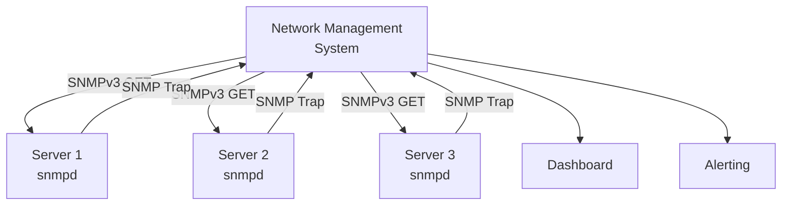

# How to Use Ansible to Install and Configure SNMP Agent

Author: [nawazdhandala](https://www.github.com/nawazdhandala)

Tags: Ansible, SNMP, Monitoring, Network Management

Description: Deploy and configure SNMP agents on Linux servers using Ansible for integration with network monitoring systems like Nagios and Zabbix.

---

SNMP (Simple Network Management Protocol) has been the standard for network and server monitoring for decades. While modern monitoring tools like Prometheus have gained popularity, SNMP remains deeply embedded in enterprise monitoring infrastructure. If your organization uses Nagios, Zabbix, PRTG, SolarWinds, or similar tools, your Linux servers need SNMP agents running and properly configured.

The challenge with SNMP is that the configuration is verbose and security-sensitive. Community strings (basically passwords) need to be consistent across your fleet, and SNMPv3 configuration with proper authentication adds even more complexity. Ansible handles all of this cleanly.

## Installing the SNMP Agent

```yaml
# install-snmp.yml - Install SNMP daemon and tools
---
- name: Install SNMP agent
  hosts: all
  become: true

  tasks:
    # Install SNMP packages on RHEL/CentOS
    - name: Install SNMP (RedHat)
      ansible.builtin.yum:
        name:
          - net-snmp
          - net-snmp-utils
          - net-snmp-libs
        state: present
      when: ansible_os_family == "RedHat"

    # Install SNMP packages on Debian/Ubuntu
    - name: Install SNMP (Debian)
      ansible.builtin.apt:
        name:
          - snmpd
          - snmp
          - libsnmp-dev
        state: present
        update_cache: true
      when: ansible_os_family == "Debian"

    # Enable the SNMP daemon
    - name: Enable snmpd service
      ansible.builtin.systemd:
        name: snmpd
        state: started
        enabled: true
```

## Configuring SNMPv2c (Community-Based)

SNMPv2c is the most common configuration. It uses community strings for authentication:

```yaml
# configure-snmpv2.yml - Configure SNMP with v2c community strings
---
- name: Configure SNMP v2c
  hosts: all
  become: true

  vars:
    snmp_community_ro: "{{ vault_snmp_community_ro }}"
    snmp_community_rw: "{{ vault_snmp_community_rw }}"
    snmp_location: "Data Center 1, Rack A42"
    snmp_contact: "ops-team@example.com"
    snmp_allowed_networks:
      - "10.0.0.0/8"
      - "172.16.0.0/12"
    snmp_listen_address: "0.0.0.0"
    snmp_listen_port: 161

  tasks:
    # Back up the original configuration
    - name: Backup original snmpd.conf
      ansible.builtin.copy:
        src: /etc/snmp/snmpd.conf
        dest: /etc/snmp/snmpd.conf.bak
        remote_src: true
        mode: '0600'
      failed_when: false

    # Deploy SNMP configuration
    - name: Deploy snmpd.conf
      ansible.builtin.template:
        src: snmpd.conf.j2
        dest: /etc/snmp/snmpd.conf
        owner: root
        group: root
        mode: '0600'
        backup: true
      notify: restart snmpd

    # Open firewall for SNMP
    - name: Open SNMP UDP port
      ansible.posix.firewalld:
        port: "{{ snmp_listen_port }}/udp"
        permanent: true
        state: enabled
        immediate: true
      when: ansible_os_family == "RedHat"
      failed_when: false

  handlers:
    - name: restart snmpd
      ansible.builtin.systemd:
        name: snmpd
        state: restarted
```

The snmpd.conf template for v2c:

```jinja2
# snmpd.conf - Managed by Ansible
# Do not edit manually

# Agent address and port
agentAddress udp:{{ snmp_listen_address }}:{{ snmp_listen_port }}

# System information
sysLocation    {{ snmp_location }}
sysContact     {{ snmp_contact }}
sysServices    72

# Access control - read-only community

rocommunity {{ snmp_community_ro }} {{ network }}


# Read-write community (restricted to localhost by default)
rwcommunity {{ snmp_community_rw }} 127.0.0.1

# View definitions
view    systemview    included   .1.3.6.1.2.1.1
view    systemview    included   .1.3.6.1.2.1.25.1
view    allview       included   .1

# Disk monitoring
disk    /       10%
disk    /var    10%
disk    /home   10%
includeAllDisks 10%

# Load monitoring (1min, 5min, 15min thresholds)
load    8 6 4

# Process monitoring
proc    sshd
proc    crond

proc    nginx
proc    php-fpm


proc    mysqld


# Extend with custom scripts
extend  hardware   /bin/cat /sys/class/dmi/id/product_name
extend  osversion  /bin/cat /etc/redhat-release

# Logging
dontLogTCPWrappersConnects yes
```

## Configuring SNMPv3 (Secure Authentication)

SNMPv3 provides proper authentication and encryption. This is what you should use in production:

```yaml
# configure-snmpv3.yml - Configure SNMP with v3 security
---
- name: Configure SNMP v3
  hosts: all
  become: true

  vars:
    snmpv3_user: "monitoring"
    snmpv3_auth_pass: "{{ vault_snmpv3_auth_pass }}"
    snmpv3_priv_pass: "{{ vault_snmpv3_priv_pass }}"
    snmpv3_auth_protocol: SHA
    snmpv3_priv_protocol: AES
    snmp_location: "Data Center 1"
    snmp_contact: "ops-team@example.com"

  tasks:
    # Stop snmpd before configuring v3 users
    - name: Stop snmpd for configuration
      ansible.builtin.systemd:
        name: snmpd
        state: stopped

    # Deploy base snmpd.conf (v3 only, no v2c)
    - name: Deploy SNMPv3 configuration
      ansible.builtin.copy:
        dest: /etc/snmp/snmpd.conf
        owner: root
        group: root
        mode: '0600'
        content: |
          # snmpd.conf - SNMPv3 only - Managed by Ansible
          agentAddress udp:161

          sysLocation    {{ snmp_location }}
          sysContact     {{ snmp_contact }}
          sysServices    72

          # Disable SNMPv1 and v2c entirely
          # No rocommunity or rwcommunity lines

          # SNMPv3 user with authPriv (authentication + encryption)
          rouser {{ snmpv3_user }} priv

          # View for the monitoring user
          view allview included .1

          # Disk and load monitoring
          includeAllDisks 10%
          load 8 6 4

          # Process monitoring
          proc sshd
          proc crond

    # Create the SNMPv3 user
    - name: Check if SNMPv3 user exists
      ansible.builtin.shell:
        cmd: "grep '{{ snmpv3_user }}' /var/lib/snmp/snmpd.conf 2>/dev/null || echo 'not found'"
      register: user_check
      changed_when: false

    - name: Stop snmpd for user creation
      ansible.builtin.systemd:
        name: snmpd
        state: stopped
      when: "'not found' in user_check.stdout"

    - name: Create SNMPv3 user
      ansible.builtin.shell:
        cmd: >
          net-snmp-create-v3-user -ro
          -A '{{ snmpv3_auth_pass }}'
          -a {{ snmpv3_auth_protocol }}
          -X '{{ snmpv3_priv_pass }}'
          -x {{ snmpv3_priv_protocol }}
          {{ snmpv3_user }}
      when: "'not found' in user_check.stdout"
      no_log: true

    # Start snmpd with new configuration
    - name: Start snmpd
      ansible.builtin.systemd:
        name: snmpd
        state: started
        enabled: true

    # Verify SNMPv3 access
    - name: Test SNMPv3 access
      ansible.builtin.command:
        cmd: >
          snmpget -v3 -u {{ snmpv3_user }}
          -l authPriv
          -a {{ snmpv3_auth_protocol }}
          -A '{{ snmpv3_auth_pass }}'
          -x {{ snmpv3_priv_protocol }}
          -X '{{ snmpv3_priv_pass }}'
          localhost sysUpTime.0
      register: snmp_test
      changed_when: false
      no_log: true

    - name: Display SNMPv3 test result
      ansible.builtin.debug:
        msg: "SNMPv3 test: {{ 'PASSED' if snmp_test.rc == 0 else 'FAILED' }}"
```

## SNMP Monitoring Architecture



## Configuring SNMP Traps

SNMP traps allow servers to proactively notify the monitoring system about issues:

```yaml
# configure-snmp-traps.yml - Set up SNMP trap forwarding
---
- name: Configure SNMP traps
  hosts: all
  become: true

  vars:
    trap_receiver: "10.0.1.100"
    trap_community: "{{ vault_snmp_community_ro }}"

  tasks:
    # Configure trap destination in snmpd.conf
    - name: Configure SNMP trap receiver
      ansible.builtin.blockinfile:
        path: /etc/snmp/snmpd.conf
        marker: "# {mark} TRAP CONFIG - ANSIBLE MANAGED"
        block: |
          # Trap receiver configuration
          trap2sink    {{ trap_receiver }} {{ trap_community }}
          informsink   {{ trap_receiver }} {{ trap_community }}

          # Authentication failure traps
          authtrapenable 1

          # Link up/down traps
          linkUpDownNotifications yes

          # Monitor disk space and send trap when threshold exceeded
          monitor -r 300 diskCheck includeAllDisks 10%

          # Monitor process and send trap if not running
          monitor -r 60 sshd_proc prTable.1.1 != 0

          # Default monitors for standard thresholds
          defaultMonitors yes
      notify: restart snmpd

  handlers:
    - name: restart snmpd
      ansible.builtin.systemd:
        name: snmpd
        state: restarted
```

## Custom SNMP Extensions

Extend SNMP with custom scripts that expose application-specific metrics:

```yaml
# snmp-extensions.yml - Deploy custom SNMP extensions
---
- name: Deploy SNMP custom extensions
  hosts: all
  become: true

  tasks:
    # Deploy custom monitoring scripts
    - name: Deploy connection count script
      ansible.builtin.copy:
        dest: /usr/local/bin/snmp-connections.sh
        mode: '0755'
        content: |
          #!/bin/bash
          # Return the number of established TCP connections
          ss -tn state established | wc -l

    - name: Deploy memory usage script
      ansible.builtin.copy:
        dest: /usr/local/bin/snmp-memory-pct.sh
        mode: '0755'
        content: |
          #!/bin/bash
          # Return memory usage percentage
          free | awk '/Mem:/ {printf "%.0f", $3/$2 * 100}'

    - name: Deploy disk IO script
      ansible.builtin.copy:
        dest: /usr/local/bin/snmp-diskio.sh
        mode: '0755'
        content: |
          #!/bin/bash
          # Return current disk IO utilization for primary disk
          iostat -d -x 1 2 | tail -n +7 | head -1 | awk '{print $NF}' | cut -d. -f1

    # Add extend directives to snmpd.conf
    - name: Configure SNMP extensions
      ansible.builtin.blockinfile:
        path: /etc/snmp/snmpd.conf
        marker: "# {mark} CUSTOM EXTENSIONS - ANSIBLE MANAGED"
        block: |
          # Custom monitoring extensions
          extend tcp_connections  /usr/local/bin/snmp-connections.sh
          extend memory_percent   /usr/local/bin/snmp-memory-pct.sh
          extend disk_io_util     /usr/local/bin/snmp-diskio.sh
      notify: restart snmpd

  handlers:
    - name: restart snmpd
      ansible.builtin.systemd:
        name: snmpd
        state: restarted
```

## Verifying SNMP Across the Fleet

```yaml
# verify-snmp.yml - Test SNMP accessibility from the monitoring server
---
- name: Verify SNMP access across fleet
  hosts: monitoring_server
  become: true

  vars:
    snmp_community: "{{ vault_snmp_community_ro }}"

  tasks:
    # Test SNMP access to each host
    - name: Test SNMP v2c access
      ansible.builtin.command:
        cmd: "snmpget -v2c -c {{ snmp_community }} {{ hostvars[item]['ansible_host'] }} sysUpTime.0"
      loop: "{{ groups['all'] }}"
      register: snmp_tests
      changed_when: false
      failed_when: false
      no_log: true

    # Report results
    - name: Report SNMP accessibility
      ansible.builtin.debug:
        msg: "{{ item.item }}: {{ 'OK' if item.rc == 0 else 'UNREACHABLE' }}"
      loop: "{{ snmp_tests.results }}"
      loop_control:
        label: "{{ item.item }}"
```

## Practical Tips

From managing SNMP across enterprise infrastructure:

1. Use SNMPv3 in production. SNMPv2c community strings are sent in clear text, which means anyone sniffing your network can see them. SNMPv3 with authPriv provides both authentication and encryption.

2. Keep snmpd.conf permissions at 0600. The file contains community strings or v3 credentials, and should only be readable by root.

3. Set up process monitoring in snmpd.conf. The `proc` directive lets your NMS detect when critical services crash, which is simpler than deploying a separate agent just for process monitoring.

4. Restrict access with the `rocommunity` network parameter. Never use `rocommunity public` without a network restriction. This exposes your system information to anyone who can reach UDP port 161.

5. Use `extend` scripts for application-specific monitoring. SNMP can expose any metric you can script, making it easy to integrate custom checks into your existing NMS without modifying the monitoring tool itself.

6. Test SNMP from the monitoring server, not from the host itself. Local `snmpget localhost` might work while remote access fails due to firewall rules or network configuration.

SNMP with Ansible gives you consistent monitoring agent configuration across your fleet. Whether you have 10 servers or 10,000, every one gets the same security settings, community strings, and custom extensions.
