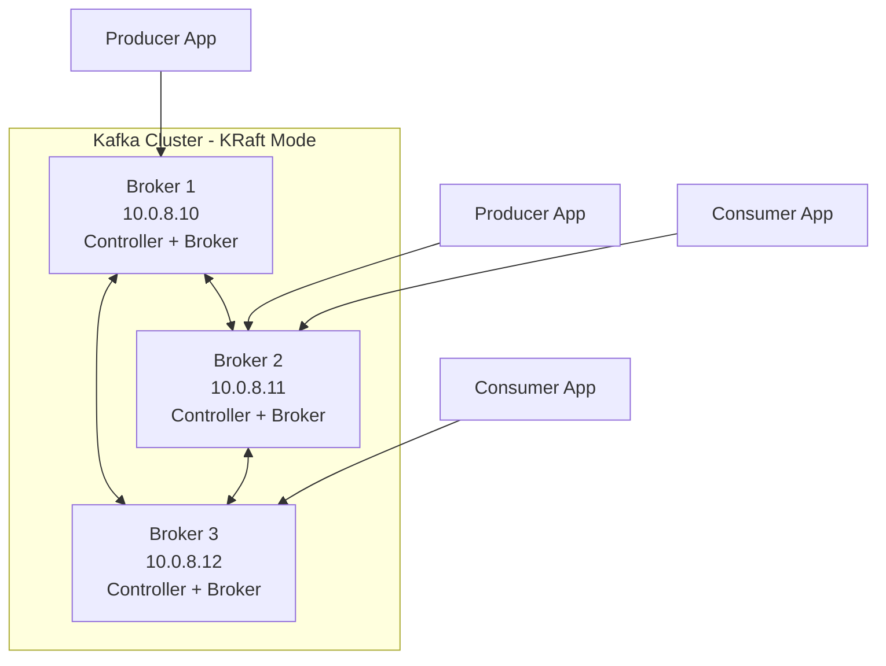

# How to Use Ansible to Install Apache Kafka

Author: [nawazdhandala](https://www.github.com/nawazdhandala)

Tags: Ansible, Apache Kafka, Streaming, Event-Driven Architecture

Description: Automate Apache Kafka installation and broker configuration using Ansible playbooks for scalable event streaming platforms.

---

Apache Kafka is the standard for event streaming. It powers real-time data pipelines, event-driven architectures, and log aggregation at companies of all sizes. But installing Kafka is not trivial. You need Java, ZooKeeper (or KRaft for newer versions), the Kafka binaries, proper system tuning, and systemd service files. Doing this manually on multiple brokers is slow and error-prone. Ansible automates the entire process.

This guide covers installing Apache Kafka using Ansible, including both the traditional ZooKeeper mode and the newer KRaft mode.

## Architecture Overview

A minimal production Kafka deployment has three brokers. In KRaft mode, you do not need separate ZooKeeper nodes.



## Prerequisites

- Ansible 2.9+
- Target servers running Ubuntu 20.04+ or RHEL 8+
- At least 4GB RAM per broker (8GB+ recommended)
- Java 17+ (we will install it via Ansible)

## Inventory

```ini
# inventory/kafka.ini
[kafka_brokers]
kafka-1 ansible_host=10.0.8.10 kafka_broker_id=1
kafka-2 ansible_host=10.0.8.11 kafka_broker_id=2
kafka-3 ansible_host=10.0.8.12 kafka_broker_id=3

[kafka_brokers:vars]
ansible_user=ubuntu
kafka_version=3.7.0
scala_version=2.13
kafka_port=9092
kafka_controller_port=9093
kafka_data_dir=/var/lib/kafka/data
kafka_log_dir=/var/log/kafka
```

## Step 1: Install Java

Kafka requires a JDK. Install OpenJDK 17.

```yaml
# playbooks/install-java.yml
---
- name: Install Java for Kafka
  hosts: kafka_brokers
  become: true

  tasks:
    - name: Install OpenJDK 17
      ansible.builtin.apt:
        name: openjdk-17-jdk-headless
        state: present
        update_cache: true

    - name: Verify Java installation
      ansible.builtin.command:
        cmd: java -version
      register: java_version
      changed_when: false

    - name: Display Java version
      ansible.builtin.debug:
        msg: "{{ java_version.stderr_lines[0] }}"
```

## Step 2: Download and Install Kafka

```yaml
# playbooks/install-kafka.yml
---
- name: Install Apache Kafka
  hosts: kafka_brokers
  become: true
  vars:
    kafka_download_url: "https://downloads.apache.org/kafka/{{ kafka_version }}/kafka_{{ scala_version }}-{{ kafka_version }}.tgz"
    kafka_install_dir: /opt/kafka

  tasks:
    - name: Create kafka system user
      ansible.builtin.user:
        name: kafka
        system: true
        shell: /usr/sbin/nologin
        home: /var/lib/kafka
        create_home: true

    - name: Create required directories
      ansible.builtin.file:
        path: "{{ item }}"
        state: directory
        owner: kafka
        group: kafka
        mode: "0750"
      loop:
        - "{{ kafka_data_dir }}"
        - "{{ kafka_log_dir }}"
        - /opt/kafka

    - name: Download Kafka binary distribution
      ansible.builtin.get_url:
        url: "{{ kafka_download_url }}"
        dest: "/tmp/kafka_{{ scala_version }}-{{ kafka_version }}.tgz"
        mode: "0644"
      register: kafka_download

    - name: Extract Kafka to the installation directory
      ansible.builtin.unarchive:
        src: "/tmp/kafka_{{ scala_version }}-{{ kafka_version }}.tgz"
        dest: /opt/kafka
        remote_src: true
        extra_opts: ["--strip-components=1"]
        owner: kafka
        group: kafka
      when: kafka_download.changed

    - name: Create symlinks for Kafka binaries in /usr/local/bin
      ansible.builtin.file:
        src: "/opt/kafka/bin/{{ item }}"
        dest: "/usr/local/bin/{{ item }}"
        state: link
      loop:
        - kafka-server-start.sh
        - kafka-server-stop.sh
        - kafka-topics.sh
        - kafka-console-producer.sh
        - kafka-console-consumer.sh
        - kafka-consumer-groups.sh
```

## Step 3: Configure Kafka in KRaft Mode

KRaft mode eliminates the ZooKeeper dependency. Here is the configuration.

```yaml
# playbooks/configure-kafka-kraft.yml
---
- name: Configure Kafka in KRaft mode
  hosts: kafka_brokers
  become: true
  vars:
    kafka_cluster_id: "{{ vault_kafka_cluster_id | default('MkU3OEVBNTcwNTJENDM2Qk') }}"

  tasks:
    - name: Deploy KRaft server properties
      ansible.builtin.template:
        src: ../templates/kraft-server.properties.j2
        dest: /opt/kafka/config/kraft/server.properties
        owner: kafka
        group: kafka
        mode: "0640"
      notify: Restart Kafka

    - name: Check if the log directory is already formatted
      ansible.builtin.stat:
        path: "{{ kafka_data_dir }}/meta.properties"
      register: meta_check

    - name: Format the storage directory for KRaft
      ansible.builtin.command:
        cmd: >
          /opt/kafka/bin/kafka-storage.sh format
          -t {{ kafka_cluster_id }}
          -c /opt/kafka/config/kraft/server.properties
      become_user: kafka
      when: not meta_check.stat.exists
      changed_when: true

  handlers:
    - name: Restart Kafka
      ansible.builtin.systemd:
        name: kafka
        state: restarted
```

The KRaft configuration template.

```jinja2
# templates/kraft-server.properties.j2
# Apache Kafka KRaft Configuration - managed by Ansible

# Node identity
node.id={{ kafka_broker_id }}

# This node acts as both controller and broker
process.roles=broker,controller

# Controller quorum voters (all controller nodes)
controller.quorum.voters={{ hostvars[host].kafka_broker_id }}@{{ hostvars[host].ansible_host }}:{{ kafka_controller_port }},

# Listeners
listeners=PLAINTEXT://{{ ansible_host }}:{{ kafka_port }},CONTROLLER://{{ ansible_host }}:{{ kafka_controller_port }}
inter.broker.listener.name=PLAINTEXT
controller.listener.names=CONTROLLER
advertised.listeners=PLAINTEXT://{{ ansible_host }}:{{ kafka_port }}

# Log directories (Kafka uses "log" to mean data)
log.dirs={{ kafka_data_dir }}

# Topic defaults
num.partitions=3
default.replication.factor=3
min.insync.replicas=2

# Log retention
log.retention.hours=168
log.retention.bytes=-1
log.segment.bytes=1073741824
log.retention.check.interval.ms=300000

# Network threads
num.network.threads=3
num.io.threads=8
socket.send.buffer.bytes=102400
socket.receive.buffer.bytes=102400
socket.request.max.bytes=104857600

# Group coordinator
offsets.topic.replication.factor=3
transaction.state.log.replication.factor=3
transaction.state.log.min.isr=2
```

## Step 4: Create Systemd Service

```yaml
# playbooks/create-kafka-service.yml
---
- name: Create systemd service for Kafka
  hosts: kafka_brokers
  become: true

  tasks:
    - name: Deploy Kafka systemd service file
      ansible.builtin.copy:
        dest: /etc/systemd/system/kafka.service
        content: |
          [Unit]
          Description=Apache Kafka
          After=network.target

          [Service]
          Type=simple
          User=kafka
          Group=kafka
          Environment="JAVA_HOME=/usr/lib/jvm/java-17-openjdk-amd64"
          Environment="KAFKA_HEAP_OPTS=-Xmx4g -Xms4g"
          Environment="KAFKA_JVM_PERFORMANCE_OPTS=-server -XX:+UseG1GC -XX:MaxGCPauseMillis=20 -XX:InitiatingHeapOccupancyPercent=35"
          ExecStart=/opt/kafka/bin/kafka-server-start.sh /opt/kafka/config/kraft/server.properties
          ExecStop=/opt/kafka/bin/kafka-server-stop.sh
          Restart=on-failure
          RestartSec=10
          LimitNOFILE=100000

          [Install]
          WantedBy=multi-user.target
        mode: "0644"
      notify: Reload and start Kafka

  handlers:
    - name: Reload and start Kafka
      ansible.builtin.systemd:
        daemon_reload: true
        name: kafka
        state: started
        enabled: true
```

## Step 5: System Tuning

```yaml
# playbooks/tune-system-kafka.yml
---
- name: Apply system tuning for Kafka
  hosts: kafka_brokers
  become: true

  tasks:
    - name: Set kernel parameters for Kafka
      ansible.posix.sysctl:
        name: "{{ item.key }}"
        value: "{{ item.value }}"
        state: present
        reload: true
      loop:
        - { key: "vm.swappiness", value: "1" }
        - { key: "net.core.wmem_default", value: "131072" }
        - { key: "net.core.rmem_default", value: "131072" }
        - { key: "net.core.wmem_max", value: "2097152" }
        - { key: "net.core.rmem_max", value: "2097152" }
        - { key: "net.ipv4.tcp_window_scaling", value: "1" }
        - { key: "vm.dirty_ratio", value: "80" }
        - { key: "vm.dirty_background_ratio", value: "5" }

    - name: Set file descriptor limits for kafka user
      ansible.builtin.copy:
        dest: /etc/security/limits.d/kafka.conf
        content: |
          kafka soft nofile 100000
          kafka hard nofile 100000
        mode: "0644"
```

## Verification

```yaml
# playbooks/verify-kafka.yml
---
- name: Verify Kafka cluster
  hosts: kafka_brokers[0]
  become: true

  tasks:
    - name: Check Kafka broker status
      ansible.builtin.command:
        cmd: /opt/kafka/bin/kafka-metadata.sh --snapshot {{ kafka_data_dir }}/__cluster_metadata-0/00000000000000000000.log --cluster-id
      become_user: kafka
      register: cluster_info
      changed_when: false

    - name: Create a test topic
      ansible.builtin.command:
        cmd: >
          /opt/kafka/bin/kafka-topics.sh
          --create --topic test-ansible
          --partitions 3 --replication-factor 3
          --bootstrap-server {{ ansible_host }}:{{ kafka_port }}
      register: topic_create
      changed_when: "'Created' in topic_create.stdout"
      failed_when: topic_create.rc != 0 and 'already exists' not in topic_create.stdout

    - name: Describe the test topic to verify replication
      ansible.builtin.command:
        cmd: >
          /opt/kafka/bin/kafka-topics.sh
          --describe --topic test-ansible
          --bootstrap-server {{ ansible_host }}:{{ kafka_port }}
      register: topic_info
      changed_when: false

    - name: Display topic details
      ansible.builtin.debug:
        msg: "{{ topic_info.stdout_lines }}"
```

## Production Considerations

1. **Separate data and log disks.** Kafka is I/O intensive. Putting data on dedicated SSDs significantly improves throughput and latency.

2. **Set `min.insync.replicas=2` with `replication.factor=3`.** This ensures no data loss even if one broker fails during a write.

3. **Size the JVM heap at 4-6GB.** Kafka relies on the OS page cache more than JVM heap. Giving too much to the heap starves the page cache.

4. **Use G1GC garbage collector.** The default CMS collector is fine for small deployments, but G1GC handles the large heaps better with more predictable pause times.

5. **Monitor consumer lag.** Use `kafka-consumer-groups.sh` or a monitoring tool to track how far behind consumers are. Growing lag means consumers cannot keep up with producers.

## Conclusion

Installing Apache Kafka with Ansible gives you a reproducible deployment pipeline for your event streaming infrastructure. The playbooks here cover Java installation, Kafka binary deployment, KRaft configuration, systemd service creation, and system tuning. With KRaft mode, you eliminate the ZooKeeper dependency and simplify your architecture. Store these playbooks in version control and iterate on them as your Kafka deployment grows.
