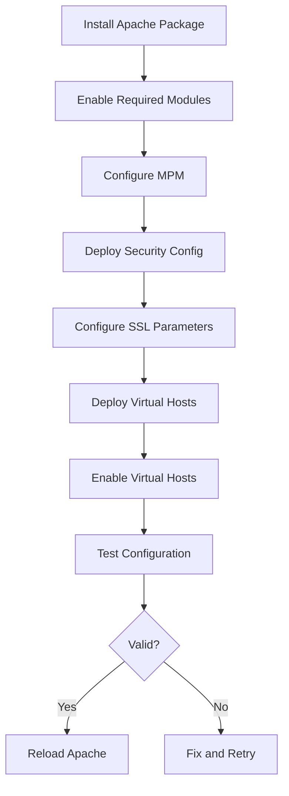

# How to Use Ansible to Install and Configure Apache

Author: [nawazdhandala](https://www.github.com/nawazdhandala)

Tags: Ansible, Apache, Web Server, HTTPD

Description: Automate Apache HTTP Server installation, module management, and configuration using Ansible playbooks for reliable web serving.

---

Apache HTTP Server has been around since 1995 and it is still one of the most widely used web servers. While Nginx gets more attention in the DevOps world, Apache remains the default choice for many organizations, especially those running PHP applications, .htaccess-heavy WordPress sites, or environments where module flexibility matters. Managing Apache with Ansible means consistent installs, reproducible configurations, and no more SSH-ing into servers to enable modules.

This guide covers installing and configuring Apache using Ansible on Ubuntu/Debian and RHEL/CentOS systems.

## Prerequisites

- Ansible 2.9+
- Target servers running Ubuntu 20.04+ or RHEL 8+
- Root/sudo access on target hosts

## Inventory

```ini
# inventory/apache-servers.ini
[apache_servers]
web-1 ansible_host=10.0.12.20
web-2 ansible_host=10.0.12.21

[apache_servers:vars]
ansible_user=ubuntu
apache_listen_port=80
apache_ssl_port=443
```

## Installing Apache on Ubuntu/Debian

```yaml
# playbooks/install-apache.yml
---
- name: Install Apache HTTP Server
  hosts: apache_servers
  become: true

  tasks:
    - name: Install Apache on Debian/Ubuntu
      ansible.builtin.apt:
        name:
          - apache2
          - apache2-utils
        state: present
        update_cache: true
      when: ansible_os_family == "Debian"

    - name: Install Apache on RHEL/CentOS
      ansible.builtin.yum:
        name:
          - httpd
          - httpd-tools
          - mod_ssl
        state: present
      when: ansible_os_family == "RedHat"

    - name: Ensure Apache is started and enabled (Debian)
      ansible.builtin.systemd:
        name: apache2
        state: started
        enabled: true
      when: ansible_os_family == "Debian"

    - name: Ensure Apache is started and enabled (RHEL)
      ansible.builtin.systemd:
        name: httpd
        state: started
        enabled: true
      when: ansible_os_family == "RedHat"
```

## Enabling Apache Modules

Apache has a rich module ecosystem. Here is how to enable the most commonly needed modules.

```yaml
# playbooks/configure-apache-modules.yml
---
- name: Enable Apache modules
  hosts: apache_servers
  become: true
  vars:
    apache_modules:
      - rewrite     # URL rewriting
      - ssl         # HTTPS support
      - headers     # Custom HTTP headers
      - proxy       # Reverse proxy base
      - proxy_http  # HTTP reverse proxy
      - proxy_wstunnel  # WebSocket proxy
      - deflate     # Compression
      - expires     # Cache headers
      - socache_shmcb  # SSL session cache

  tasks:
    - name: Enable each required module (Debian/Ubuntu)
      community.general.apache2_module:
        name: "{{ item }}"
        state: present
      loop: "{{ apache_modules }}"
      notify: Restart Apache
      when: ansible_os_family == "Debian"

    - name: Check if modules are available (RHEL)
      ansible.builtin.command:
        cmd: httpd -M
      register: loaded_modules
      changed_when: false
      when: ansible_os_family == "RedHat"

  handlers:
    - name: Restart Apache
      ansible.builtin.systemd:
        name: "{{ 'apache2' if ansible_os_family == 'Debian' else 'httpd' }}"
        state: restarted
```

## Main Configuration

Deploy the main Apache configuration with security and performance settings.

```yaml
# playbooks/configure-apache.yml
---
- name: Configure Apache HTTP Server
  hosts: apache_servers
  become: true
  vars:
    apache_server_admin: admin@example.com
    apache_timeout: 300
    apache_keepalive: "On"
    apache_keepalive_timeout: 5
    apache_max_keepalive_requests: 100
    apache_mpm: event
    apache_mpm_start_servers: 2
    apache_mpm_min_spare_threads: 25
    apache_mpm_max_spare_threads: 75
    apache_mpm_thread_limit: 64
    apache_mpm_threads_per_child: 25
    apache_mpm_max_request_workers: 150

  tasks:
    - name: Enable the event MPM (disable prefork first)
      community.general.apache2_module:
        name: mpm_prefork
        state: absent
        ignore_configcheck: true
      when: ansible_os_family == "Debian"
      notify: Restart Apache

    - name: Enable event MPM
      community.general.apache2_module:
        name: "mpm_{{ apache_mpm }}"
        state: present
        ignore_configcheck: true
      when: ansible_os_family == "Debian"
      notify: Restart Apache

    - name: Deploy main Apache configuration
      ansible.builtin.template:
        src: ../templates/apache2.conf.j2
        dest: /etc/apache2/apache2.conf
        mode: "0644"
      when: ansible_os_family == "Debian"
      notify: Restart Apache

    - name: Deploy security configuration
      ansible.builtin.copy:
        dest: /etc/apache2/conf-available/security.conf
        content: |
          # Security configuration - managed by Ansible

          # Hide Apache version in headers
          ServerTokens Prod
          ServerSignature Off

          # Prevent clickjacking
          Header always set X-Frame-Options "SAMEORIGIN"
          Header always set X-Content-Type-Options "nosniff"
          Header always set X-XSS-Protection "1; mode=block"
          Header always set Referrer-Policy "strict-origin-when-cross-origin"

          # Disable directory listing
          <Directory />
              Options -Indexes
              AllowOverride None
              Require all denied
          </Directory>

          # Disable TRACE method
          TraceEnable Off

          # Limit request body size
          LimitRequestBody 10485760
        mode: "0644"
      when: ansible_os_family == "Debian"
      notify: Restart Apache

    - name: Enable security configuration
      ansible.builtin.command:
        cmd: a2enconf security
      register: security_conf
      changed_when: "'Enabling' in security_conf.stdout"
      when: ansible_os_family == "Debian"

  handlers:
    - name: Restart Apache
      ansible.builtin.systemd:
        name: "{{ 'apache2' if ansible_os_family == 'Debian' else 'httpd' }}"
        state: restarted
```

The main configuration template.

```jinja2
# templates/apache2.conf.j2
# Apache main configuration - managed by Ansible

ServerRoot "/etc/apache2"
ServerAdmin {{ apache_server_admin }}

# Mutex and PidFile
Mutex file:${APACHE_LOCK_DIR} default
PidFile ${APACHE_PID_FILE}

# Timeouts
Timeout {{ apache_timeout }}

# KeepAlive
KeepAlive {{ apache_keepalive }}
MaxKeepAliveRequests {{ apache_max_keepalive_requests }}
KeepAliveTimeout {{ apache_keepalive_timeout }}

# MPM event configuration
<IfModule mpm_event_module>
    StartServers             {{ apache_mpm_start_servers }}
    MinSpareThreads          {{ apache_mpm_min_spare_threads }}
    MaxSpareThreads          {{ apache_mpm_max_spare_threads }}
    ThreadLimit              {{ apache_mpm_thread_limit }}
    ThreadsPerChild          {{ apache_mpm_threads_per_child }}
    MaxRequestWorkers        {{ apache_mpm_max_request_workers }}
    MaxConnectionsPerChild   0
</IfModule>

# User and group
User ${APACHE_RUN_USER}
Group ${APACHE_RUN_GROUP}

# HostnameLookups
HostnameLookups Off

# Error log
ErrorLog ${APACHE_LOG_DIR}/error.log
LogLevel warn

# Include module configurations
IncludeOptional mods-enabled/*.load
IncludeOptional mods-enabled/*.conf

# Include port configuration
Include ports.conf

# Default document root
<Directory /var/www/>
    Options -Indexes +FollowSymLinks
    AllowOverride All
    Require all granted
</Directory>

# Access log
LogFormat "%h %l %u %t \"%r\" %>s %O \"%{Referer}i\" \"%{User-Agent}i\" %D" combined
LogFormat "%h %l %u %t \"%r\" %>s %O" common

# Include additional configurations
IncludeOptional conf-enabled/*.conf

# Include virtual host configurations
IncludeOptional sites-enabled/*.conf
```

## SSL Configuration

```yaml
# playbooks/configure-apache-ssl.yml
---
- name: Configure Apache SSL
  hosts: apache_servers
  become: true

  tasks:
    - name: Deploy SSL configuration
      ansible.builtin.copy:
        dest: /etc/apache2/conf-available/ssl-params.conf
        content: |
          # SSL Parameters - managed by Ansible
          SSLProtocol all -SSLv3 -TLSv1 -TLSv1.1
          SSLCipherSuite ECDHE-ECDSA-AES128-GCM-SHA256:ECDHE-RSA-AES128-GCM-SHA256:ECDHE-ECDSA-AES256-GCM-SHA384:ECDHE-RSA-AES256-GCM-SHA384
          SSLHonorCipherOrder off
          SSLSessionTickets off

          SSLUseStapling On
          SSLStaplingCache "shmcb:logs/ssl_stapling(32768)"

          Header always set Strict-Transport-Security "max-age=63072000"
        mode: "0644"
      notify: Restart Apache

    - name: Enable SSL configuration
      ansible.builtin.command:
        cmd: a2enconf ssl-params
      register: ssl_conf
      changed_when: "'Enabling' in ssl_conf.stdout"
      when: ansible_os_family == "Debian"

  handlers:
    - name: Restart Apache
      ansible.builtin.systemd:
        name: apache2
        state: restarted
```

## Reverse Proxy Configuration

```yaml
# playbooks/configure-apache-reverse-proxy.yml
---
- name: Configure Apache as reverse proxy
  hosts: apache_servers
  become: true
  vars:
    proxy_sites:
      - name: myapp
        domain: app.example.com
        backend: "http://localhost:3000"
        ssl_cert: /etc/letsencrypt/live/app.example.com/fullchain.pem
        ssl_key: /etc/letsencrypt/live/app.example.com/privkey.pem

  tasks:
    - name: Deploy reverse proxy virtual host
      ansible.builtin.template:
        src: ../templates/apache-reverse-proxy.conf.j2
        dest: "/etc/apache2/sites-available/{{ item.name }}.conf"
        mode: "0644"
      loop: "{{ proxy_sites }}"
      loop_control:
        label: "{{ item.domain }}"

    - name: Enable the virtual host
      ansible.builtin.command:
        cmd: "a2ensite {{ item.name }}"
      loop: "{{ proxy_sites }}"
      loop_control:
        label: "{{ item.name }}"
      register: site_enable
      changed_when: "'Enabling' in site_enable.stdout"
      notify: Reload Apache

    - name: Test Apache configuration
      ansible.builtin.command:
        cmd: apache2ctl configtest
      register: config_test
      changed_when: false

  handlers:
    - name: Reload Apache
      ansible.builtin.systemd:
        name: apache2
        state: reloaded
```

```jinja2
# templates/apache-reverse-proxy.conf.j2
# Reverse proxy for {{ item.domain }} - managed by Ansible

<VirtualHost *:80>
    ServerName {{ item.domain }}
    Redirect permanent / https://{{ item.domain }}/
</VirtualHost>

<VirtualHost *:443>
    ServerName {{ item.domain }}
    ServerAdmin {{ apache_server_admin | default('admin@example.com') }}

    # SSL
    SSLEngine on
    SSLCertificateFile {{ item.ssl_cert }}
    SSLCertificateKeyFile {{ item.ssl_key }}

    # Logging
    ErrorLog ${APACHE_LOG_DIR}/{{ item.name }}_error.log
    CustomLog ${APACHE_LOG_DIR}/{{ item.name }}_access.log combined

    # Proxy settings
    ProxyPreserveHost On
    ProxyRequests Off

    <Location />
        ProxyPass {{ item.backend }}/
        ProxyPassReverse {{ item.backend }}/
    </Location>

    # WebSocket support
    RewriteEngine On
    RewriteCond %{HTTP:Upgrade} websocket [NC]
    RewriteCond %{HTTP:Connection} upgrade [NC]
    RewriteRule ^/?(.*) "ws://{{ item.backend | regex_replace('^http://', '') }}/$1" [P,L]

    # Security headers
    Header always set X-Frame-Options "SAMEORIGIN"
    Header always set X-Content-Type-Options "nosniff"
</VirtualHost>
```

## Apache Configuration Flow



## Verification

```yaml
# playbooks/verify-apache.yml
---
- name: Verify Apache installation
  hosts: apache_servers
  become: true

  tasks:
    - name: Check Apache service status
      ansible.builtin.systemd:
        name: "{{ 'apache2' if ansible_os_family == 'Debian' else 'httpd' }}"
      register: apache_service

    - name: Get Apache version
      ansible.builtin.command:
        cmd: apache2ctl -v
      register: apache_version
      changed_when: false

    - name: List enabled modules
      ansible.builtin.command:
        cmd: apache2ctl -M
      register: apache_modules
      changed_when: false

    - name: Test configuration syntax
      ansible.builtin.command:
        cmd: apache2ctl configtest
      register: config_test
      changed_when: false

    - name: Display Apache status
      ansible.builtin.debug:
        msg:
          - "Service: {{ apache_service.status.ActiveState }}"
          - "Version: {{ apache_version.stdout_lines[0] }}"
          - "Config: {{ config_test.stderr }}"
          - "Modules loaded: {{ apache_modules.stdout_lines | length }}"
```

## Production Tips

1. **Use the event MPM, not prefork.** Prefork spawns a process per connection and scales poorly. Event MPM uses threads and handles many more concurrent connections with less memory.

2. **Always test before reloading.** Run `apache2ctl configtest` before any reload or restart. A broken config on reload does not take Apache down, but a broken config on restart does.

3. **Disable unused modules.** Every loaded module consumes memory and increases attack surface. Only enable what you actually use.

4. **Set `AllowOverride None` globally** and `AllowOverride All` only for directories that need `.htaccess`. Processing `.htaccess` files on every request adds overhead.

5. **Use `mod_security` for web application firewall capabilities.** It is an Apache-native WAF that can block common attacks like SQL injection and XSS.

## Conclusion

Installing and configuring Apache with Ansible gives you consistent, version-controlled web server infrastructure. The playbooks in this guide cover installation on both Debian and RHEL systems, module management, security hardening, SSL configuration, and reverse proxy setup. Whether you are serving static sites, running PHP applications, or proxying to backend services, Ansible ensures every Apache server in your fleet matches your specification.
