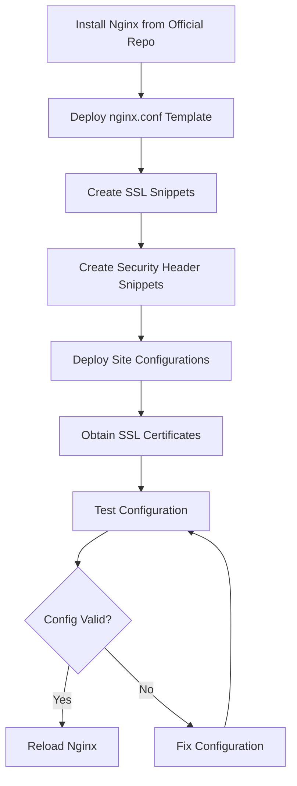

# How to Use Ansible to Install and Configure Nginx

Author: [nawazdhandala](https://www.github.com/nawazdhandala)

Tags: Ansible, Nginx, Web Server, Reverse Proxy

Description: Complete guide to automating Nginx installation, configuration, and SSL setup using Ansible playbooks for web servers and reverse proxies.

---

Nginx powers a huge percentage of the web. Whether you are using it as a web server, reverse proxy, load balancer, or all three, you need consistent configuration across your servers. One misconfigured Nginx instance behind a load balancer causes intermittent errors that are incredibly frustrating to debug. Ansible ensures every Nginx server starts from the same template with the same settings.

This guide covers installing and configuring Nginx using Ansible, including SSL/TLS setup, reverse proxy configuration, and performance tuning.

## Prerequisites

- Ansible 2.9+
- Target servers running Ubuntu 20.04+ or RHEL 8+
- DNS records pointing to your server (for SSL with Let's Encrypt)

## Inventory

```ini
# inventory/webservers.ini
[webservers]
web-1 ansible_host=10.0.12.10
web-2 ansible_host=10.0.12.11

[webservers:vars]
ansible_user=ubuntu
nginx_worker_processes=auto
nginx_worker_connections=1024
```

## Installing Nginx from the Official Repository

The distro-packaged Nginx is often outdated. Install from the official Nginx repository instead.

```yaml
# playbooks/install-nginx.yml
---
- name: Install Nginx from official repository
  hosts: webservers
  become: true

  tasks:
    - name: Install prerequisites
      ansible.builtin.apt:
        name:
          - curl
          - gnupg2
          - ca-certificates
          - lsb-release
        state: present
        update_cache: true

    - name: Add Nginx signing key
      ansible.builtin.apt_key:
        url: https://nginx.org/keys/nginx_signing.key
        state: present

    - name: Add Nginx mainline repository
      ansible.builtin.apt_repository:
        repo: "deb https://nginx.org/packages/mainline/ubuntu {{ ansible_distribution_release }} nginx"
        state: present
        filename: nginx

    - name: Install Nginx
      ansible.builtin.apt:
        name: nginx
        state: present
        update_cache: true

    - name: Ensure Nginx is started and enabled
      ansible.builtin.systemd:
        name: nginx
        state: started
        enabled: true
```

## Main Nginx Configuration

Deploy the main `nginx.conf` with performance tuning.

```yaml
# playbooks/configure-nginx.yml
---
- name: Configure Nginx
  hosts: webservers
  become: true
  vars:
    nginx_worker_processes: auto
    nginx_worker_connections: 4096
    nginx_client_max_body_size: "64m"
    nginx_keepalive_timeout: 65
    nginx_gzip_enabled: true

  tasks:
    - name: Create Nginx directories
      ansible.builtin.file:
        path: "{{ item }}"
        state: directory
        owner: root
        group: root
        mode: "0755"
      loop:
        - /etc/nginx/conf.d
        - /etc/nginx/snippets
        - /var/log/nginx
        - /var/cache/nginx

    - name: Deploy main nginx.conf
      ansible.builtin.template:
        src: ../templates/nginx.conf.j2
        dest: /etc/nginx/nginx.conf
        owner: root
        group: root
        mode: "0644"
      notify: Reload Nginx

    - name: Deploy SSL snippet for reuse across server blocks
      ansible.builtin.copy:
        dest: /etc/nginx/snippets/ssl-params.conf
        content: |
          # SSL configuration snippet - managed by Ansible
          ssl_protocols TLSv1.2 TLSv1.3;
          ssl_ciphers ECDHE-ECDSA-AES128-GCM-SHA256:ECDHE-RSA-AES128-GCM-SHA256:ECDHE-ECDSA-AES256-GCM-SHA384:ECDHE-RSA-AES256-GCM-SHA384;
          ssl_prefer_server_ciphers off;
          ssl_session_timeout 1d;
          ssl_session_cache shared:SSL:10m;
          ssl_session_tickets off;
          ssl_stapling on;
          ssl_stapling_verify on;
          add_header Strict-Transport-Security "max-age=63072000" always;
        mode: "0644"
      notify: Reload Nginx

    - name: Deploy security headers snippet
      ansible.builtin.copy:
        dest: /etc/nginx/snippets/security-headers.conf
        content: |
          # Security headers - managed by Ansible
          add_header X-Frame-Options "SAMEORIGIN" always;
          add_header X-Content-Type-Options "nosniff" always;
          add_header X-XSS-Protection "1; mode=block" always;
          add_header Referrer-Policy "strict-origin-when-cross-origin" always;
        mode: "0644"
      notify: Reload Nginx

    - name: Test Nginx configuration
      ansible.builtin.command:
        cmd: nginx -t
      register: nginx_test
      changed_when: false

  handlers:
    - name: Reload Nginx
      ansible.builtin.systemd:
        name: nginx
        state: reloaded
```

The main configuration template.

```jinja2
# templates/nginx.conf.j2
# Nginx configuration - managed by Ansible

user nginx;
worker_processes {{ nginx_worker_processes }};
error_log /var/log/nginx/error.log warn;
pid /var/run/nginx.pid;

events {
    worker_connections {{ nginx_worker_connections }};
    multi_accept on;
    use epoll;
}

http {
    include /etc/nginx/mime.types;
    default_type application/octet-stream;

    # Logging format
    log_format main '$remote_addr - $remote_user [$time_local] "$request" '
                    '$status $body_bytes_sent "$http_referer" '
                    '"$http_user_agent" "$http_x_forwarded_for" '
                    'rt=$request_time';

    access_log /var/log/nginx/access.log main;

    # Performance
    sendfile on;
    tcp_nopush on;
    tcp_nodelay on;
    keepalive_timeout {{ nginx_keepalive_timeout }};
    types_hash_max_size 2048;
    server_tokens off;

    # Buffer sizes
    client_max_body_size {{ nginx_client_max_body_size }};
    client_body_buffer_size 128k;
    proxy_buffer_size 128k;
    proxy_buffers 4 256k;
    proxy_busy_buffers_size 256k;


    # Gzip compression
    gzip on;
    gzip_vary on;
    gzip_proxied any;
    gzip_comp_level 6;
    gzip_types text/plain text/css application/json application/javascript text/xml application/xml application/xml+rss text/javascript;
    gzip_min_length 1000;


    # Rate limiting zones
    limit_req_zone $binary_remote_addr zone=general:10m rate=10r/s;
    limit_req_zone $binary_remote_addr zone=api:10m rate=30r/s;

    # Include site configurations
    include /etc/nginx/conf.d/*.conf;
}
```

## Reverse Proxy Configuration

Set up Nginx as a reverse proxy for a backend application.

```yaml
# playbooks/configure-reverse-proxy.yml
---
- name: Configure Nginx reverse proxy
  hosts: webservers
  become: true
  vars:
    app_name: myapp
    app_domain: app.example.com
    app_backend: "http://10.0.1.20:3000"
    ssl_cert_path: /etc/letsencrypt/live/app.example.com/fullchain.pem
    ssl_key_path: /etc/letsencrypt/live/app.example.com/privkey.pem

  tasks:
    - name: Deploy reverse proxy configuration
      ansible.builtin.template:
        src: ../templates/reverse-proxy.conf.j2
        dest: "/etc/nginx/conf.d/{{ app_name }}.conf"
        mode: "0644"
      notify: Reload Nginx

    - name: Test Nginx configuration
      ansible.builtin.command:
        cmd: nginx -t
      register: nginx_test
      changed_when: false

  handlers:
    - name: Reload Nginx
      ansible.builtin.systemd:
        name: nginx
        state: reloaded
```

```jinja2
# templates/reverse-proxy.conf.j2
# Reverse proxy for {{ app_name }} - managed by Ansible

upstream {{ app_name }}_backend {
    server {{ app_backend | regex_replace('^https?://', '') }};
    keepalive 32;
}

# Redirect HTTP to HTTPS
server {
    listen 80;
    server_name {{ app_domain }};
    return 301 https://$server_name$request_uri;
}

# HTTPS server
server {
    listen 443 ssl http2;
    server_name {{ app_domain }};

    # SSL certificates
    ssl_certificate {{ ssl_cert_path }};
    ssl_certificate_key {{ ssl_key_path }};
    include /etc/nginx/snippets/ssl-params.conf;
    include /etc/nginx/snippets/security-headers.conf;

    # Logging
    access_log /var/log/nginx/{{ app_name }}_access.log main;
    error_log /var/log/nginx/{{ app_name }}_error.log warn;

    # Rate limiting
    limit_req zone=general burst=20 nodelay;

    location / {
        proxy_pass http://{{ app_name }}_backend;
        proxy_http_version 1.1;
        proxy_set_header Upgrade $http_upgrade;
        proxy_set_header Connection "upgrade";
        proxy_set_header Host $host;
        proxy_set_header X-Real-IP $remote_addr;
        proxy_set_header X-Forwarded-For $proxy_add_x_forwarded_for;
        proxy_set_header X-Forwarded-Proto $scheme;

        # Timeouts
        proxy_connect_timeout 60s;
        proxy_send_timeout 60s;
        proxy_read_timeout 60s;
    }

    # Health check endpoint (no rate limiting)
    location /health {
        limit_req off;
        proxy_pass http://{{ app_name }}_backend/health;
    }

    # Static file caching
    location ~* \.(jpg|jpeg|png|gif|ico|css|js|woff2)$ {
        proxy_pass http://{{ app_name }}_backend;
        expires 30d;
        add_header Cache-Control "public, immutable";
    }
}
```

## Let's Encrypt SSL with Certbot

Automate SSL certificate provisioning.

```yaml
# playbooks/setup-letsencrypt.yml
---
- name: Set up Let's Encrypt SSL certificates
  hosts: webservers
  become: true
  vars:
    certbot_email: admin@example.com
    certbot_domains:
      - app.example.com
      - api.example.com

  tasks:
    - name: Install Certbot and Nginx plugin
      ansible.builtin.apt:
        name:
          - certbot
          - python3-certbot-nginx
        state: present

    - name: Obtain SSL certificates
      ansible.builtin.command:
        cmd: >
          certbot certonly --nginx
          --non-interactive
          --agree-tos
          --email {{ certbot_email }}
          -d {{ item }}
      loop: "{{ certbot_domains }}"
      register: certbot_result
      changed_when: "'Successfully received certificate' in certbot_result.stdout"
      failed_when: certbot_result.rc != 0 and 'already exists' not in certbot_result.stderr

    - name: Set up automatic renewal cron job
      ansible.builtin.cron:
        name: "Certbot renewal"
        minute: "0"
        hour: "3"
        day: "*/7"
        job: "certbot renew --quiet --post-hook 'systemctl reload nginx'"
        user: root
```

## Nginx Configuration Flow



## Verification

```yaml
# playbooks/verify-nginx.yml
---
- name: Verify Nginx installation and configuration
  hosts: webservers
  become: true

  tasks:
    - name: Check Nginx service status
      ansible.builtin.systemd:
        name: nginx
      register: nginx_service

    - name: Get Nginx version
      ansible.builtin.command:
        cmd: nginx -v
      register: nginx_version
      changed_when: false

    - name: Test Nginx configuration syntax
      ansible.builtin.command:
        cmd: nginx -t
      register: nginx_config_test
      changed_when: false

    - name: Check that Nginx is listening on port 80
      ansible.builtin.wait_for:
        port: 80
        timeout: 5

    - name: Check that Nginx is listening on port 443
      ansible.builtin.wait_for:
        port: 443
        timeout: 5

    - name: Display status
      ansible.builtin.debug:
        msg:
          - "Service: {{ nginx_service.status.ActiveState }}"
          - "Version: {{ nginx_version.stderr }}"
          - "Config: {{ nginx_config_test.stderr }}"
```

## Production Tips

1. **Always run `nginx -t` before reloading.** A syntax error in any included config file takes down the entire Nginx process if you restart without testing first. The Ansible handler pattern handles this naturally.

2. **Use `server_tokens off`** to hide the Nginx version in response headers. This makes it slightly harder for attackers to exploit version-specific vulnerabilities.

3. **Set up rate limiting.** Even basic rate limiting prevents simple DDoS attacks and brute force attempts. Define zones in the main config and apply them per location.

4. **Use `http2` on all HTTPS listeners.** HTTP/2 multiplexes requests over a single connection, reducing latency. There is no downside for modern clients.

5. **Monitor Nginx with the stub_status module.** Enable it on a local-only endpoint and scrape it with Prometheus for connection counts, request rates, and active connections.

## Conclusion

Installing and configuring Nginx with Ansible gives you consistent, version-controlled web server infrastructure. The playbooks in this guide cover installation from the official repository, main configuration with performance tuning, reverse proxy setup, SSL with Let's Encrypt, and verification. Use templates for your site configurations, keep SSL snippets reusable, and always test before reloading.
