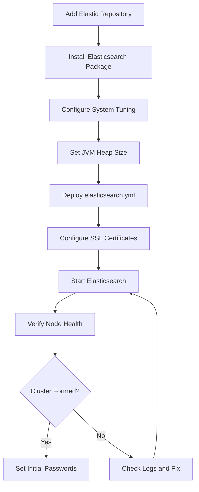

# How to Use Ansible to Install Elasticsearch

Author: [nawazdhandala](https://www.github.com/nawazdhandala)

Tags: Ansible, Elasticsearch, Search, DevOps

Description: Automate Elasticsearch installation on Ubuntu and RHEL systems using Ansible playbooks with proper configuration and security.

---

Elasticsearch is the backbone of many logging, search, and analytics pipelines. Installing it correctly the first time matters because misconfigurations in JVM heap size, file descriptors, or memory locking can cause mysterious failures under load. When you have multiple nodes to set up, doing this manually introduces inconsistency. Ansible gives you a repeatable way to install Elasticsearch across your fleet.

This post walks through installing Elasticsearch using Ansible, covering package installation, system tuning, and basic security setup.

## Prerequisites

- Ansible 2.9+ on your control node
- Target servers running Ubuntu 20.04+ or RHEL 8+
- At least 4GB RAM on each Elasticsearch node (8GB+ recommended)
- Java is bundled with Elasticsearch since version 7, so no separate JDK needed

## Inventory

```ini
# inventory/elasticsearch.ini
[elasticsearch_nodes]
es-node-1 ansible_host=10.0.4.10
es-node-2 ansible_host=10.0.4.11
es-node-3 ansible_host=10.0.4.12

[elasticsearch_nodes:vars]
ansible_user=ubuntu
ansible_ssh_private_key_file=~/.ssh/es-key.pem
es_version=8.12
es_heap_size=4g
es_cluster_name=production-logs
```

## Installation Playbook for Ubuntu/Debian

Here is the playbook for installing Elasticsearch from the official Elastic repository.

```yaml
# playbooks/install-elasticsearch.yml
---
- name: Install Elasticsearch
  hosts: elasticsearch_nodes
  become: true
  vars:
    es_major_version: "8.x"
    es_heap_size: "{{ es_heap_size | default('4g') }}"

  tasks:
    - name: Install required packages
      ansible.builtin.apt:
        name:
          - apt-transport-https
          - curl
          - gnupg
        state: present
        update_cache: true

    - name: Add Elasticsearch GPG key
      ansible.builtin.apt_key:
        url: https://artifacts.elastic.co/GPG-KEY-elasticsearch
        state: present

    - name: Add Elasticsearch APT repository
      ansible.builtin.apt_repository:
        repo: "deb https://artifacts.elastic.co/packages/{{ es_major_version }}/apt stable main"
        state: present
        filename: elastic-{{ es_major_version }}

    - name: Install Elasticsearch package
      ansible.builtin.apt:
        name: elasticsearch
        state: present
        update_cache: true
      register: es_install

    - name: Store the initial security output
      ansible.builtin.debug:
        msg: "{{ es_install.stdout_lines | default([]) }}"
      when: es_install.changed
```

## System Tuning

Elasticsearch requires specific system settings to run correctly. Without these, you will see warnings in the logs and potentially degraded performance.

```yaml
# playbooks/tune-system-elasticsearch.yml
---
- name: Apply system tuning for Elasticsearch
  hosts: elasticsearch_nodes
  become: true

  tasks:
    - name: Set vm.max_map_count for Elasticsearch mmap requirements
      ansible.posix.sysctl:
        name: vm.max_map_count
        value: "262144"
        state: present
        reload: true

    - name: Set vm.swappiness to minimize swapping
      ansible.posix.sysctl:
        name: vm.swappiness
        value: "1"
        state: present
        reload: true

    - name: Configure file descriptor limits for elasticsearch user
      ansible.builtin.copy:
        dest: /etc/security/limits.d/elasticsearch.conf
        content: |
          elasticsearch soft nofile 65535
          elasticsearch hard nofile 65535
          elasticsearch soft memlock unlimited
          elasticsearch hard memlock unlimited
        mode: "0644"

    - name: Set systemd override for Elasticsearch memory lock
      ansible.builtin.file:
        path: /etc/systemd/system/elasticsearch.service.d
        state: directory
        mode: "0755"

    - name: Create systemd override for LimitMEMLOCK
      ansible.builtin.copy:
        dest: /etc/systemd/system/elasticsearch.service.d/override.conf
        content: |
          [Service]
          LimitMEMLOCK=infinity
          LimitNOFILE=65535
        mode: "0644"
      notify: Reload systemd daemon

  handlers:
    - name: Reload systemd daemon
      ansible.builtin.systemd:
        daemon_reload: true
```

## JVM Heap Configuration

The JVM heap size is one of the most important settings. Set it to half of available RAM, but never more than 31GB (to stay in the compressed OOPs range).

```yaml
# playbooks/configure-jvm.yml
---
- name: Configure JVM settings for Elasticsearch
  hosts: elasticsearch_nodes
  become: true
  vars:
    es_heap_size: "{{ es_heap_size | default('4g') }}"

  tasks:
    - name: Create JVM options override directory
      ansible.builtin.file:
        path: /etc/elasticsearch/jvm.options.d
        state: directory
        owner: root
        group: elasticsearch
        mode: "0750"

    - name: Set JVM heap size via override file
      ansible.builtin.copy:
        dest: /etc/elasticsearch/jvm.options.d/heap.options
        content: |
          # Heap size - managed by Ansible
          # Set to half of available RAM, max 31g
          -Xms{{ es_heap_size }}
          -Xmx{{ es_heap_size }}
        owner: root
        group: elasticsearch
        mode: "0640"
      notify: Restart Elasticsearch

  handlers:
    - name: Restart Elasticsearch
      ansible.builtin.systemd:
        name: elasticsearch
        state: restarted
```

## Basic Elasticsearch Configuration

Deploy the main `elasticsearch.yml` configuration file.

```yaml
# playbooks/configure-elasticsearch.yml
---
- name: Configure Elasticsearch
  hosts: elasticsearch_nodes
  become: true
  vars:
    es_cluster_name: "{{ es_cluster_name | default('my-cluster') }}"
    es_data_path: /var/lib/elasticsearch
    es_log_path: /var/log/elasticsearch

  tasks:
    - name: Deploy elasticsearch.yml configuration
      ansible.builtin.template:
        src: ../templates/elasticsearch.yml.j2
        dest: /etc/elasticsearch/elasticsearch.yml
        owner: root
        group: elasticsearch
        mode: "0640"
        backup: true
      notify: Restart Elasticsearch

    - name: Ensure data directory exists with proper permissions
      ansible.builtin.file:
        path: "{{ es_data_path }}"
        state: directory
        owner: elasticsearch
        group: elasticsearch
        mode: "0750"

    - name: Enable and start Elasticsearch service
      ansible.builtin.systemd:
        name: elasticsearch
        state: started
        enabled: true

  handlers:
    - name: Restart Elasticsearch
      ansible.builtin.systemd:
        name: elasticsearch
        state: restarted
```

The configuration template.

```jinja2
# templates/elasticsearch.yml.j2
# Elasticsearch configuration - managed by Ansible
# Do not edit manually

cluster.name: {{ es_cluster_name }}
node.name: {{ inventory_hostname }}

path.data: {{ es_data_path | default('/var/lib/elasticsearch') }}
path.logs: {{ es_log_path | default('/var/log/elasticsearch') }}

# Network
network.host: {{ ansible_host }}
http.port: 9200
transport.port: 9300

# Discovery - list all nodes for cluster formation
discovery.seed_hosts:

  - {{ hostvars[host].ansible_host }}:9300


# Initial master nodes for bootstrapping
cluster.initial_master_nodes:

  - {{ host }}


# Memory locking to prevent swapping
bootstrap.memory_lock: true

# Security (Elasticsearch 8+ has security enabled by default)
xpack.security.enabled: true
xpack.security.transport.ssl.enabled: true
xpack.security.transport.ssl.verification_mode: certificate
xpack.security.transport.ssl.keystore.path: certs/transport.p12
xpack.security.transport.ssl.truststore.path: certs/transport.p12
```

## Installation Flow



## Setting Up Security

Elasticsearch 8 enables security by default. Generate certificates and set passwords.

```yaml
# playbooks/setup-es-security.yml
---
- name: Set up Elasticsearch security
  hosts: elasticsearch_nodes[0]
  become: true

  tasks:
    - name: Generate certificate authority
      ansible.builtin.command:
        cmd: >
          /usr/share/elasticsearch/bin/elasticsearch-certutil ca
          --out /etc/elasticsearch/certs/elastic-stack-ca.p12
          --pass ""
        creates: /etc/elasticsearch/certs/elastic-stack-ca.p12

    - name: Generate transport certificates
      ansible.builtin.command:
        cmd: >
          /usr/share/elasticsearch/bin/elasticsearch-certutil cert
          --ca /etc/elasticsearch/certs/elastic-stack-ca.p12
          --ca-pass ""
          --out /etc/elasticsearch/certs/transport.p12
          --pass ""
        creates: /etc/elasticsearch/certs/transport.p12

    - name: Set correct ownership on certificate files
      ansible.builtin.file:
        path: /etc/elasticsearch/certs
        state: directory
        owner: root
        group: elasticsearch
        mode: "0750"
        recurse: true
```

## Verification

After installation, check that Elasticsearch is healthy.

```yaml
# playbooks/verify-elasticsearch.yml
---
- name: Verify Elasticsearch installation
  hosts: elasticsearch_nodes
  become: true

  tasks:
    - name: Wait for Elasticsearch to start responding
      ansible.builtin.uri:
        url: "https://{{ ansible_host }}:9200"
        method: GET
        user: elastic
        password: "{{ es_elastic_password }}"
        validate_certs: false
        status_code: 200
      register: es_response
      retries: 10
      delay: 15
      until: es_response.status == 200

    - name: Display node info
      ansible.builtin.debug:
        msg: "{{ es_response.json }}"
```

## Common Installation Pitfalls

Here are mistakes I have encountered in production:

1. **Not setting `vm.max_map_count`.** Elasticsearch will refuse to start without at least 262144 memory map areas. This is the single most common installation problem.

2. **Heap size too large.** Going above 31GB disables compressed OOPs and wastes memory. Setting it to more than half your RAM starves the OS file cache, which Elasticsearch depends on heavily for Lucene segment reads.

3. **Forgetting to open port 9300.** The transport port is how nodes communicate. If your firewall blocks it, nodes will install fine but never form a cluster.

4. **Not locking memory.** Without `bootstrap.memory_lock: true`, the JVM heap can get swapped to disk. This causes garbage collection pauses that last minutes instead of milliseconds.

5. **Using the same `cluster.name` in different environments.** If your staging and production networks can see each other and share a cluster name, nodes will try to join the wrong cluster. Always use distinct names.

## Conclusion

Installing Elasticsearch with Ansible ensures every node in your cluster starts from the same baseline. The playbooks here cover package installation, system tuning, JVM configuration, and security setup. Once you have the installation automated, you can focus on the interesting parts: designing your indices, tuning queries, and building search pipelines. Store these playbooks in version control and run them through CI/CD so that spinning up a new Elasticsearch cluster is a single command away.
