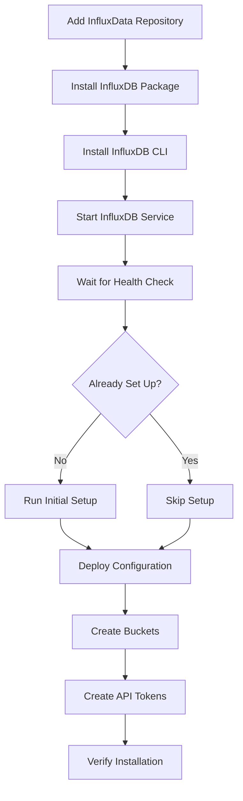

# How to Use Ansible to Install InfluxDB

Author: [nawazdhandala](https://www.github.com/nawazdhandala)

Tags: Ansible, InfluxDB, Time Series Database, Monitoring

Description: Automate InfluxDB installation and initial setup using Ansible playbooks for time series data collection and monitoring.

---

InfluxDB is the go-to time series database for metrics, IoT data, and monitoring. If you are building an observability stack or collecting sensor data, chances are InfluxDB is somewhere in your architecture. Installing it on a single server is simple enough, but when you need consistent installs across development, staging, and production environments, Ansible keeps things clean and reproducible.

This guide covers installing InfluxDB 2.x using Ansible, including initial setup, organization creation, and bucket configuration.

## InfluxDB 2.x vs 1.x

InfluxDB 2.x is a complete rewrite. It replaces the separate components (InfluxDB, Chronograf, Kapacitor) with a unified platform. The configuration model changed significantly: instead of databases and retention policies, you work with organizations, buckets, and tokens. The playbooks in this guide target InfluxDB 2.x.

## Prerequisites

- Ansible 2.9+ on your control node
- Target servers running Ubuntu 20.04+ or RHEL 8+
- At least 2GB RAM (4GB+ recommended for production)

## Inventory

```ini
# inventory/influxdb.ini
[influxdb_servers]
influxdb-1 ansible_host=10.0.6.10

[influxdb_servers:vars]
ansible_user=ubuntu
influxdb_port=8086
influxdb_org=mycompany
influxdb_bucket=default
influxdb_retention=30d
```

## Installation Playbook

```yaml
# playbooks/install-influxdb.yml
---
- name: Install InfluxDB 2.x
  hosts: influxdb_servers
  become: true
  vars:
    influxdb_version: "2.7"

  tasks:
    - name: Install required packages
      ansible.builtin.apt:
        name:
          - curl
          - gnupg
          - apt-transport-https
        state: present
        update_cache: true

    - name: Add InfluxData GPG key
      ansible.builtin.apt_key:
        url: https://repos.influxdata.com/influxdata-archive_compat.key
        state: present

    - name: Add InfluxDB APT repository
      ansible.builtin.apt_repository:
        repo: "deb https://repos.influxdata.com/ubuntu {{ ansible_distribution_release }} stable"
        state: present
        filename: influxdb

    - name: Install InfluxDB package
      ansible.builtin.apt:
        name: influxdb2
        state: present
        update_cache: true

    - name: Install InfluxDB CLI package
      ansible.builtin.apt:
        name: influxdb2-cli
        state: present

    - name: Ensure InfluxDB is started and enabled
      ansible.builtin.systemd:
        name: influxdb
        state: started
        enabled: true

    - name: Wait for InfluxDB to be ready
      ansible.builtin.uri:
        url: "http://{{ ansible_host }}:{{ influxdb_port }}/health"
        method: GET
        status_code: 200
      register: health_check
      retries: 15
      delay: 5
      until: health_check.status == 200
```

## Initial Setup

InfluxDB 2.x requires an initial setup step that creates the first user, organization, and bucket. This is equivalent to the "onboarding" process in the web UI.

```yaml
# playbooks/setup-influxdb.yml
---
- name: Perform InfluxDB initial setup
  hosts: influxdb_servers
  become: true
  vars_files:
    - ../vault/influxdb-secrets.yml

  tasks:
    - name: Check if InfluxDB has already been set up
      ansible.builtin.uri:
        url: "http://{{ ansible_host }}:{{ influxdb_port }}/api/v2/setup"
        method: GET
        status_code: 200
      register: setup_check

    - name: Run initial setup if not already done
      ansible.builtin.uri:
        url: "http://{{ ansible_host }}:{{ influxdb_port }}/api/v2/setup"
        method: POST
        body_format: json
        body:
          username: "{{ influxdb_admin_user }}"
          password: "{{ vault_influxdb_admin_password }}"
          org: "{{ influxdb_org }}"
          bucket: "{{ influxdb_bucket }}"
          retentionPeriodSeconds: "{{ influxdb_retention_seconds | default(2592000) }}"
          token: "{{ vault_influxdb_admin_token }}"
        status_code:
          - 201
      when: setup_check.json.allowed | default(false)
      register: setup_result

    - name: Save the admin token for later use
      ansible.builtin.copy:
        content: "{{ vault_influxdb_admin_token }}"
        dest: /etc/influxdb/admin-token
        owner: root
        group: influxdb
        mode: "0640"
      no_log: true
```

## Configuring InfluxDB

InfluxDB 2.x uses a configuration file at `/etc/influxdb/config.toml`. Here is how to template it.

```yaml
# playbooks/configure-influxdb.yml
---
- name: Configure InfluxDB
  hosts: influxdb_servers
  become: true

  tasks:
    - name: Deploy InfluxDB configuration
      ansible.builtin.template:
        src: ../templates/influxdb-config.toml.j2
        dest: /etc/influxdb/config.toml
        owner: root
        group: influxdb
        mode: "0640"
      notify: Restart InfluxDB

    - name: Create data directories
      ansible.builtin.file:
        path: "{{ item }}"
        state: directory
        owner: influxdb
        group: influxdb
        mode: "0750"
      loop:
        - /var/lib/influxdb2
        - /var/lib/influxdb2/engine

  handlers:
    - name: Restart InfluxDB
      ansible.builtin.systemd:
        name: influxdb
        state: restarted
```

The configuration template.

```jinja2
# templates/influxdb-config.toml.j2
# InfluxDB 2.x configuration - managed by Ansible

# Bind address for the HTTP API
http-bind-address = ":{{ influxdb_port }}"

# Data storage paths
bolt-path = "/var/lib/influxdb2/influxd.bolt"
engine-path = "/var/lib/influxdb2/engine"

# Query settings
query-concurrency = {{ influxdb_query_concurrency | default(10) }}
query-queue-size = {{ influxdb_query_queue_size | default(10) }}

# Storage settings
storage-cache-max-memory-size = {{ influxdb_cache_max_memory | default('1073741824') }}
storage-cache-snapshot-memory-size = {{ influxdb_cache_snapshot_memory | default('26214400') }}
storage-compact-full-write-coldness = {{ influxdb_compact_coldness | default('4') }}

# Logging
log-level = "{{ influxdb_log_level | default('info') }}"


# TLS settings
tls-cert = "{{ influxdb_tls_cert_path }}"
tls-key = "{{ influxdb_tls_key_path }}"


# Retention check interval
storage-retention-check-interval = "{{ influxdb_retention_check_interval | default('30m') }}"
```

## Creating Buckets and Tokens

After the initial setup, create additional buckets for different data types.

```yaml
# playbooks/create-buckets.yml
---
- name: Create InfluxDB buckets
  hosts: influxdb_servers
  become: true
  vars_files:
    - ../vault/influxdb-secrets.yml
  vars:
    influxdb_buckets:
      - name: metrics
        retention: 2592000  # 30 days in seconds
        description: "System and application metrics"
      - name: logs
        retention: 604800   # 7 days in seconds
        description: "Application log data"
      - name: traces
        retention: 259200   # 3 days in seconds
        description: "Distributed tracing data"

  tasks:
    - name: Get the organization ID
      ansible.builtin.uri:
        url: "http://{{ ansible_host }}:{{ influxdb_port }}/api/v2/orgs"
        method: GET
        headers:
          Authorization: "Token {{ vault_influxdb_admin_token }}"
        status_code: 200
      register: orgs_response

    - name: Set organization ID fact
      ansible.builtin.set_fact:
        org_id: "{{ orgs_response.json.orgs[0].id }}"

    - name: Create each bucket
      ansible.builtin.uri:
        url: "http://{{ ansible_host }}:{{ influxdb_port }}/api/v2/buckets"
        method: POST
        headers:
          Authorization: "Token {{ vault_influxdb_admin_token }}"
        body_format: json
        body:
          name: "{{ item.name }}"
          orgID: "{{ org_id }}"
          retentionRules:
            - type: expire
              everySeconds: "{{ item.retention }}"
          description: "{{ item.description }}"
        status_code:
          - 201
          - 422  # Already exists
      loop: "{{ influxdb_buckets }}"
      loop_control:
        label: "{{ item.name }}"
```

## Creating Read/Write Tokens

Create scoped tokens for applications instead of using the admin token.

```yaml
# playbooks/create-tokens.yml
---
- name: Create InfluxDB API tokens for applications
  hosts: influxdb_servers
  become: true
  vars_files:
    - ../vault/influxdb-secrets.yml

  tasks:
    - name: Get organization ID
      ansible.builtin.uri:
        url: "http://{{ ansible_host }}:{{ influxdb_port }}/api/v2/orgs"
        method: GET
        headers:
          Authorization: "Token {{ vault_influxdb_admin_token }}"
      register: orgs

    - name: Get bucket IDs
      ansible.builtin.uri:
        url: "http://{{ ansible_host }}:{{ influxdb_port }}/api/v2/buckets?name=metrics"
        method: GET
        headers:
          Authorization: "Token {{ vault_influxdb_admin_token }}"
      register: metrics_bucket

    - name: Create a write-only token for the metrics collector
      ansible.builtin.uri:
        url: "http://{{ ansible_host }}:{{ influxdb_port }}/api/v2/authorizations"
        method: POST
        headers:
          Authorization: "Token {{ vault_influxdb_admin_token }}"
        body_format: json
        body:
          orgID: "{{ orgs.json.orgs[0].id }}"
          description: "Metrics collector write token"
          permissions:
            - action: write
              resource:
                type: buckets
                id: "{{ metrics_bucket.json.buckets[0].id }}"
                orgID: "{{ orgs.json.orgs[0].id }}"
        status_code: 201
      register: write_token

    - name: Display the new write token
      ansible.builtin.debug:
        msg: "Write token created. Save this: {{ write_token.json.token }}"
```

## Installation Flow



## RHEL/CentOS Installation

If you run RHEL or CentOS, the package management is slightly different.

```yaml
# tasks/install-influxdb-rhel.yml
---
- name: Add InfluxDB YUM repository
  ansible.builtin.yum_repository:
    name: influxdb
    description: InfluxDB Official Repository
    baseurl: https://repos.influxdata.com/rhel/$releasever/$basearch/stable
    gpgcheck: true
    gpgkey: https://repos.influxdata.com/influxdata-archive_compat.key
    enabled: true

- name: Install InfluxDB on RHEL
  ansible.builtin.yum:
    name:
      - influxdb2
      - influxdb2-cli
    state: present
```

## Backup Configuration

Configure automated backups as part of your installation.

```yaml
# playbooks/configure-influxdb-backup.yml
---
- name: Configure InfluxDB automated backups
  hosts: influxdb_servers
  become: true
  vars_files:
    - ../vault/influxdb-secrets.yml

  tasks:
    - name: Create backup directory
      ansible.builtin.file:
        path: /var/backups/influxdb
        state: directory
        owner: influxdb
        group: influxdb
        mode: "0750"

    - name: Create backup script
      ansible.builtin.copy:
        dest: /usr/local/bin/influxdb-backup.sh
        content: |
          #!/bin/bash
          # InfluxDB backup script - managed by Ansible
          BACKUP_DIR="/var/backups/influxdb/$(date +%Y%m%d_%H%M%S)"
          mkdir -p "$BACKUP_DIR"
          influx backup "$BACKUP_DIR" \
            --host http://localhost:{{ influxdb_port }} \
            --token "$(cat /etc/influxdb/admin-token)"
          # Remove backups older than 7 days
          find /var/backups/influxdb -maxdepth 1 -type d -mtime +7 -exec rm -rf {} +
        mode: "0750"
        owner: root
        group: influxdb

    - name: Schedule daily backup via cron
      ansible.builtin.cron:
        name: "InfluxDB daily backup"
        minute: "0"
        hour: "2"
        job: "/usr/local/bin/influxdb-backup.sh >> /var/log/influxdb-backup.log 2>&1"
        user: root
```

## Production Considerations

1. **Size the storage cache appropriately.** The default 1GB cache works for moderate workloads. If you have high write throughput, increase `storage-cache-max-memory-size`.

2. **Use scoped tokens.** Never give applications the admin token. Create tokens with the minimum permissions needed. A metrics collector only needs write access to the metrics bucket.

3. **Plan for retention.** Set retention policies per bucket based on how long you actually need the data. Keeping everything forever fills your disk fast with time series data.

4. **Monitor InfluxDB itself.** InfluxDB exposes Prometheus-compatible metrics at `/metrics`. Scrape them and set up alerts for high memory usage, query latency, and write failures.

5. **Back up regularly.** InfluxDB's `influx backup` command creates full backups. Schedule them and test restores periodically.

## Conclusion

Installing InfluxDB with Ansible gives you a consistent, repeatable process from package installation through initial setup, bucket creation, and token management. The playbooks in this guide cover the full lifecycle for InfluxDB 2.x. Keep your configuration in version control, encrypt tokens with Ansible Vault, and run the playbooks through your CI/CD pipeline so that every environment matches your spec.
