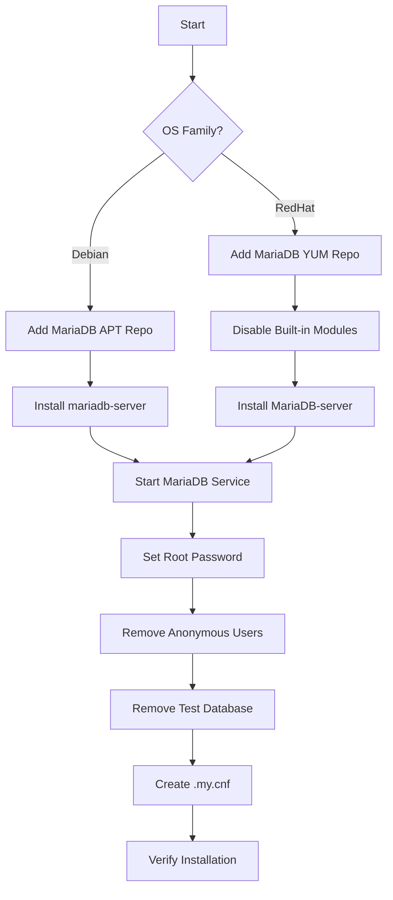

# How to Use Ansible to Install MariaDB

Author: [nawazdhandala](https://www.github.com/nawazdhandala)

Tags: Ansible, MariaDB, Database, Linux

Description: Automate MariaDB installation on Ubuntu and RHEL systems using Ansible with official repository setup and secure initialization.

---

MariaDB is a community-driven fork of MySQL that maintains protocol compatibility while adding features like columnar storage (via the ColumnStore engine), better query optimizer, and Galera Cluster for synchronous multi-master replication. Many Linux distributions have already switched from MySQL to MariaDB as the default database. Ansible makes it straightforward to install MariaDB from the official repository with consistent configuration across your fleet.

This post walks through a complete Ansible role for installing MariaDB on both Debian and RHEL-based systems.

## Why MariaDB Over MySQL?

The decision between MariaDB and MySQL often comes down to organizational preference and specific features. MariaDB offers Galera Cluster out of the box, supports the Aria and ColumnStore storage engines, and is fully open source under the GPL. The wire protocol remains compatible with MySQL, so most MySQL client libraries and tools work with MariaDB without changes.

## Role Structure

```
roles/mariadb_install/
  defaults/main.yml
  tasks/
    main.yml
    debian.yml
    redhat.yml
    secure.yml
  templates/
    root-my.cnf.j2
  handlers/main.yml
```

## Default Variables

```yaml
# roles/mariadb_install/defaults/main.yml
# Default settings for MariaDB installation
---
mariadb_version: "11.4"
mariadb_root_password: "{{ vault_mariadb_root_password }}"
mariadb_port: 3306
mariadb_bind_address: "127.0.0.1"
mariadb_datadir: "/var/lib/mysql"
mariadb_socket: "/var/run/mysqld/mysqld.sock"
mariadb_service_name: "mariadb"
```

## Main Task File

```yaml
# roles/mariadb_install/tasks/main.yml
# Route to OS-specific installation and then secure the instance
---
- name: Include OS-specific installation tasks
  include_tasks: "{{ ansible_os_family | lower }}.yml"

- name: Ensure MariaDB is started and enabled
  systemd:
    name: "{{ mariadb_service_name }}"
    state: started
    enabled: true

- name: Wait for MariaDB to accept connections
  wait_for:
    port: "{{ mariadb_port }}"
    host: 127.0.0.1
    delay: 3
    timeout: 30

- name: Secure MariaDB installation
  include_tasks: secure.yml
```

## Debian/Ubuntu Installation

```yaml
# roles/mariadb_install/tasks/debian.yml
# Install MariaDB on Debian/Ubuntu from the official repository
---
- name: Install prerequisite packages
  apt:
    name:
      - apt-transport-https
      - curl
      - gnupg2
      - python3-mysqldb
      - python3-pymysql
      - software-properties-common
    state: present
    update_cache: true

- name: Add MariaDB signing key
  apt_key:
    url: "https://mariadb.org/mariadb_release_signing_key.pgp"
    state: present

- name: Add MariaDB APT repository
  apt_repository:
    repo: "deb https://dlm.mariadb.com/repo/mariadb-server/{{ mariadb_version }}/repo/ubuntu {{ ansible_distribution_release }} main"
    state: present
    filename: mariadb

- name: Install MariaDB server and client
  apt:
    name:
      - mariadb-server
      - mariadb-client
      - mariadb-backup
    state: present
    update_cache: true
```

## RHEL/Rocky Linux Installation

```yaml
# roles/mariadb_install/tasks/redhat.yml
# Install MariaDB on RHEL/Rocky from the official repository
---
- name: Install prerequisite packages
  dnf:
    name:
      - python3-PyMySQL
    state: present

- name: Disable built-in MariaDB/MySQL module
  command: "dnf module disable {{ item }} -y"
  loop:
    - mariadb
    - mysql
  changed_when: false
  ignore_errors: true

- name: Add MariaDB YUM repository
  yum_repository:
    name: MariaDB
    description: "MariaDB {{ mariadb_version }} Repository"
    baseurl: "https://dlm.mariadb.com/repo/mariadb-server/{{ mariadb_version }}/yum/rhel/{{ ansible_distribution_major_version }}/x86_64"
    gpgkey: "https://mariadb.org/mariadb_release_signing_key.pgp"
    gpgcheck: true
    enabled: true

- name: Install MariaDB packages
  dnf:
    name:
      - MariaDB-server
      - MariaDB-client
      - MariaDB-backup
    state: present

- name: Set service name for RHEL
  set_fact:
    mariadb_service_name: mariadb
```

## Securing the Installation

```yaml
# roles/mariadb_install/tasks/secure.yml
# Secure MariaDB - equivalent to mariadb-secure-installation
---
- name: Set root password
  community.mysql.mysql_user:
    name: root
    host: localhost
    password: "{{ mariadb_root_password }}"
    login_unix_socket: "{{ mariadb_socket }}"
    state: present
  no_log: true
  ignore_errors: true

- name: Create .my.cnf for root
  template:
    src: root-my.cnf.j2
    dest: /root/.my.cnf
    owner: root
    group: root
    mode: '0600'

- name: Remove anonymous users
  community.mysql.mysql_user:
    name: ""
    host_all: true
    state: absent
    login_unix_socket: "{{ mariadb_socket }}"

- name: Remove test database
  community.mysql.mysql_db:
    name: test
    state: absent
    login_unix_socket: "{{ mariadb_socket }}"

- name: Remove remote root login
  community.mysql.mysql_user:
    name: root
    host: "{{ item }}"
    state: absent
    login_unix_socket: "{{ mariadb_socket }}"
  loop:
    - "{{ ansible_hostname }}"
    - "127.0.0.1"
    - "::1"
  ignore_errors: true
```

The root credentials template.

```ini
# roles/mariadb_install/templates/root-my.cnf.j2
# Root credentials for local CLI access
[client]
user=root
password={{ mariadb_root_password }}
socket={{ mariadb_socket }}
```

## Handlers

```yaml
# roles/mariadb_install/handlers/main.yml
# Handlers for MariaDB service management
---
- name: restart mariadb
  systemd:
    name: "{{ mariadb_service_name }}"
    state: restarted

- name: reload mariadb
  systemd:
    name: "{{ mariadb_service_name }}"
    state: reloaded
```

## Using the Role

```yaml
# playbooks/install-mariadb.yml
# Install MariaDB on database servers
---
- name: Install MariaDB
  hosts: databases
  become: true
  roles:
    - role: mariadb_install
      vars:
        mariadb_version: "11.4"
        mariadb_bind_address: "0.0.0.0"
```

```bash
# Run the installation
ansible-playbook playbooks/install-mariadb.yml \
  -i inventory/production/ \
  --ask-vault-pass
```

## Installation Flow



## Post-Installation Configuration

After installation, you will want to tune MariaDB for your workload. Here is a basic configuration template.

```yaml
# Apply basic MariaDB configuration after installation
- name: Deploy MariaDB server configuration
  copy:
    dest: /etc/mysql/mariadb.conf.d/99-custom.cnf
    owner: root
    group: root
    mode: '0644'
    content: |
      [mysqld]
      # InnoDB settings
      innodb_buffer_pool_size = {{ mariadb_innodb_buffer_pool_size | default('256M') }}
      innodb_log_file_size = {{ mariadb_innodb_log_file_size | default('64M') }}
      innodb_flush_log_at_trx_commit = 1
      innodb_flush_method = O_DIRECT

      # Connection settings
      max_connections = {{ mariadb_max_connections | default(151) }}
      wait_timeout = 28800

      # Character set
      character_set_server = utf8mb4
      collation_server = utf8mb4_unicode_ci

      # Logging
      slow_query_log = 1
      slow_query_log_file = /var/log/mysql/mariadb-slow.log
      long_query_time = 2

      # Security
      local_infile = 0
  notify: restart mariadb
```

## Verifying the Installation

```yaml
# Verify MariaDB installation is correct
- name: Check MariaDB version
  command: mariadb --version
  register: mariadb_version_output
  changed_when: false

- name: Display version
  debug:
    msg: "{{ mariadb_version_output.stdout }}"

- name: Verify MariaDB connection
  community.mysql.mysql_info:
    login_unix_socket: "{{ mariadb_socket }}"
    filter: version
  register: db_info

- name: Display server version
  debug:
    msg: "MariaDB server: {{ db_info.version.full }}"

- name: Verify service status
  systemd:
    name: "{{ mariadb_service_name }}"
  register: service_status

- name: Assert service is active
  assert:
    that:
      - service_status.status.ActiveState == "active"
    fail_msg: "MariaDB service is not running"
```

## MariaDB vs MySQL: Ansible Module Compatibility

The `community.mysql` collection works with MariaDB because MariaDB maintains wire protocol compatibility. All `mysql_*` modules (mysql_user, mysql_db, mysql_query, mysql_replication) work with MariaDB servers. You do not need a separate collection.

```bash
# The same MySQL collection works for MariaDB
ansible-galaxy collection install community.mysql
```

## Conclusion

Installing MariaDB with Ansible follows the same patterns as MySQL installation, which makes sense given their shared heritage. The role adds the official MariaDB repository for the latest stable releases, handles both Debian and RHEL families, and secures the installation automatically. Since the `community.mysql` Ansible collection is fully compatible with MariaDB, your existing MySQL playbooks and roles can be reused with minimal changes. From here, you can add configuration tuning, user management, and Galera Cluster setup as additional roles.
