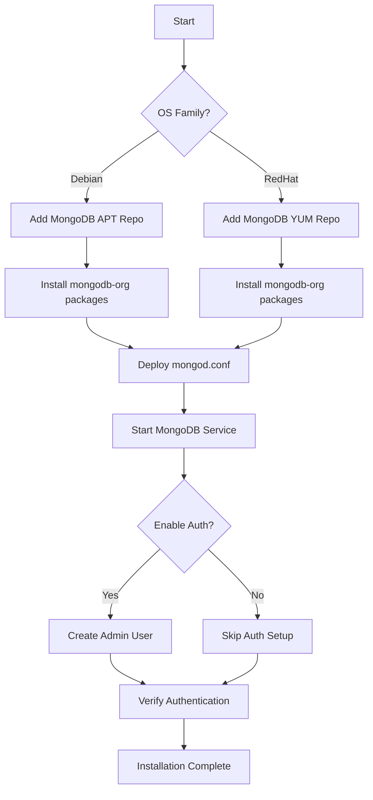

# How to Use Ansible to Install MongoDB

Author: [nawazdhandala](https://www.github.com/nawazdhandala)

Tags: Ansible, MongoDB, Database, NoSQL

Description: Automate MongoDB installation on Ubuntu and RHEL systems using Ansible with official repository setup and initial security configuration.

---

MongoDB is the go-to document database for applications that need flexible schemas and horizontal scaling. Installing it correctly means adding the official MongoDB repository (the distribution packages are often outdated), configuring the storage engine, and setting up authentication. Doing this manually on every server is tedious and inconsistent. Ansible handles all of it in a repeatable, idempotent way.

This post covers a complete Ansible role for installing MongoDB Community Edition from the official repositories on both Debian and RHEL-based systems.

## Role Structure

```
roles/mongodb_install/
  defaults/main.yml
  tasks/
    main.yml
    debian.yml
    redhat.yml
    auth.yml
  templates/
    mongod.conf.j2
  handlers/main.yml
```

## Default Variables

```yaml
# roles/mongodb_install/defaults/main.yml
# Default settings for MongoDB installation
---
mongodb_version: "7.0"
mongodb_port: 27017
mongodb_bind_ip: "127.0.0.1"
mongodb_dbpath: "/var/lib/mongodb"
mongodb_logpath: "/var/log/mongodb/mongod.log"
mongodb_service_name: "mongod"
mongodb_admin_user: "admin"
mongodb_admin_password: "{{ vault_mongodb_admin_password }}"
mongodb_enable_auth: true
mongodb_wiredtiger_cache_size_gb: ""
```

## Main Task File

```yaml
# roles/mongodb_install/tasks/main.yml
# Install MongoDB and optionally enable authentication
---
- name: Include OS-specific installation tasks
  include_tasks: "{{ ansible_os_family | lower }}.yml"

- name: Deploy MongoDB configuration
  template:
    src: mongod.conf.j2
    dest: /etc/mongod.conf
    owner: root
    group: root
    mode: '0644'
  notify: restart mongod

- name: Ensure MongoDB data directory exists
  file:
    path: "{{ mongodb_dbpath }}"
    state: directory
    owner: mongodb
    group: mongodb
    mode: '0755'
  when: ansible_os_family == "Debian"

- name: Ensure MongoDB is started and enabled
  systemd:
    name: "{{ mongodb_service_name }}"
    state: started
    enabled: true

- name: Wait for MongoDB to accept connections
  wait_for:
    port: "{{ mongodb_port }}"
    host: 127.0.0.1
    delay: 3
    timeout: 30

- name: Configure authentication
  include_tasks: auth.yml
  when: mongodb_enable_auth | bool
```

## Debian/Ubuntu Installation

```yaml
# roles/mongodb_install/tasks/debian.yml
# Install MongoDB on Debian/Ubuntu from the official repository
---
- name: Install prerequisite packages
  apt:
    name:
      - gnupg
      - curl
      - python3-pymongo
    state: present
    update_cache: true

- name: Add MongoDB GPG key
  apt_key:
    url: "https://www.mongodb.org/static/pgp/server-{{ mongodb_version }}.asc"
    state: present

- name: Add MongoDB APT repository
  apt_repository:
    repo: "deb [ arch=amd64,arm64 ] https://repo.mongodb.org/apt/ubuntu {{ ansible_distribution_release }}/mongodb-org/{{ mongodb_version }} multiverse"
    state: present
    filename: mongodb-org

- name: Install MongoDB packages
  apt:
    name:
      - "mongodb-org"
      - "mongodb-org-server"
      - "mongodb-org-shell"
      - "mongodb-org-tools"
      - "mongodb-mongosh"
    state: present
    update_cache: true

- name: Pin MongoDB package version to prevent accidental upgrades
  copy:
    dest: /etc/apt/preferences.d/mongodb-org
    content: |
      Package: mongodb-org*
      Pin: version {{ mongodb_version }}.*
      Pin-Priority: 1001
    owner: root
    mode: '0644'
```

## RHEL/Rocky Linux Installation

```yaml
# roles/mongodb_install/tasks/redhat.yml
# Install MongoDB on RHEL/Rocky from the official repository
---
- name: Install prerequisite packages
  dnf:
    name:
      - python3-pymongo
    state: present

- name: Add MongoDB YUM repository
  yum_repository:
    name: mongodb-org
    description: "MongoDB {{ mongodb_version }} Repository"
    baseurl: "https://repo.mongodb.org/yum/redhat/{{ ansible_distribution_major_version }}/mongodb-org/{{ mongodb_version }}/x86_64/"
    gpgcheck: true
    gpgkey: "https://www.mongodb.org/static/pgp/server-{{ mongodb_version }}.asc"
    enabled: true

- name: Install MongoDB packages
  dnf:
    name:
      - mongodb-org
      - mongodb-org-server
      - mongodb-org-shell
      - mongodb-org-tools
      - mongodb-mongosh
    state: present

- name: Set MongoDB data directory ownership
  file:
    path: /var/lib/mongo
    state: directory
    owner: mongod
    group: mongod
    mode: '0755'

- name: Set fact for RHEL paths
  set_fact:
    mongodb_dbpath: "/var/lib/mongo"
    mongodb_logpath: "/var/log/mongodb/mongod.log"
```

## MongoDB Configuration Template

```yaml
# roles/mongodb_install/templates/mongod.conf.j2
# MongoDB configuration - managed by Ansible
# Do not edit manually

# Storage settings
storage:
  dbPath: {{ mongodb_dbpath }}
  journal:
    enabled: true

  wiredTiger:
    engineConfig:
      cacheSizeGB: {{ mongodb_wiredtiger_cache_size_gb }}


# Logging
systemLog:
  destination: file
  logAppend: true
  path: {{ mongodb_logpath }}

# Network
net:
  port: {{ mongodb_port }}
  bindIp: {{ mongodb_bind_ip }}

# Process management
processManagement:
  timeZoneInfo: /usr/share/zoneinfo


# Security
security:
  authorization: enabled



# Replication
replication:
  replSetName: {{ mongodb_replication_replset }}

```

## Setting Up Authentication

```yaml
# roles/mongodb_install/tasks/auth.yml
# Create the admin user and enable authentication
---
- name: Check if admin user already exists
  command: >
    mongosh --quiet --eval
    "db.getSiblingDB('admin').getUser('{{ mongodb_admin_user }}')"
    --port {{ mongodb_port }}
  register: admin_user_check
  changed_when: false
  failed_when: false

- name: Create admin user (auth disabled initially)
  command: >
    mongosh --quiet --eval "
    db.getSiblingDB('admin').createUser({
      user: '{{ mongodb_admin_user }}',
      pwd: '{{ mongodb_admin_password }}',
      roles: [
        { role: 'userAdminAnyDatabase', db: 'admin' },
        { role: 'dbAdminAnyDatabase', db: 'admin' },
        { role: 'readWriteAnyDatabase', db: 'admin' },
        { role: 'clusterAdmin', db: 'admin' }
      ]
    })" --port {{ mongodb_port }}
  when: "'null' in admin_user_check.stdout"
  no_log: true

- name: Verify admin user can authenticate
  command: >
    mongosh --quiet
    -u "{{ mongodb_admin_user }}"
    -p "{{ mongodb_admin_password }}"
    --authenticationDatabase admin
    --eval "db.runCommand({ connectionStatus: 1 })"
    --port {{ mongodb_port }}
  register: auth_check
  changed_when: false
  no_log: true
```

## Handlers

```yaml
# roles/mongodb_install/handlers/main.yml
# Handlers for MongoDB service management
---
- name: restart mongod
  systemd:
    name: "{{ mongodb_service_name }}"
    state: restarted

- name: reload mongod
  systemd:
    name: "{{ mongodb_service_name }}"
    state: reloaded
```

## Using the Role

```yaml
# playbooks/install-mongodb.yml
# Install MongoDB on database servers
---
- name: Install MongoDB
  hosts: mongodb_servers
  become: true
  roles:
    - role: mongodb_install
      vars:
        mongodb_version: "7.0"
        mongodb_bind_ip: "0.0.0.0"
        mongodb_wiredtiger_cache_size_gb: 4
```

```bash
# Run the installation
ansible-playbook playbooks/install-mongodb.yml \
  -i inventory/production/ \
  --ask-vault-pass
```

## Installation Flow



## Creating Application Users

After the admin user is created, add application-specific users.

```yaml
# Create application users with specific database access
- name: Create application database user
  community.mongodb.mongodb_user:
    login_user: "{{ mongodb_admin_user }}"
    login_password: "{{ mongodb_admin_password }}"
    login_database: admin
    database: myapp
    name: myapp_user
    password: "{{ vault_myapp_mongo_password }}"
    roles:
      - db: myapp
        role: readWrite
    state: present
  no_log: true

- name: Create read-only user for reporting
  community.mongodb.mongodb_user:
    login_user: "{{ mongodb_admin_user }}"
    login_password: "{{ mongodb_admin_password }}"
    login_database: admin
    database: myapp
    name: reporting_user
    password: "{{ vault_reporting_mongo_password }}"
    roles:
      - db: myapp
        role: read
    state: present
  no_log: true
```

## WiredTiger Cache Sizing

MongoDB's WiredTiger storage engine uses an internal cache. By default, it takes 50% of available RAM minus 1GB. For dedicated database servers, this is usually fine. For shared servers, you should set it explicitly.

```yaml
# Set WiredTiger cache based on available RAM
# For a server with 16GB RAM dedicated to MongoDB
mongodb_wiredtiger_cache_size_gb: 10

# For a shared server with 16GB RAM running other services
mongodb_wiredtiger_cache_size_gb: 4
```

## Verifying the Installation

```yaml
# Verify MongoDB installation
- name: Check MongoDB version
  command: mongod --version
  register: mongo_version
  changed_when: false

- name: Display version
  debug:
    msg: "{{ mongo_version.stdout_lines[0] }}"

- name: Check MongoDB service status
  systemd:
    name: "{{ mongodb_service_name }}"
  register: service_status

- name: Assert service is running
  assert:
    that:
      - service_status.status.ActiveState == "active"
    fail_msg: "MongoDB service is not running"
```

## Conclusion

Installing MongoDB with Ansible gives you a reproducible, secure database setup across all your servers. The role handles both Debian and RHEL families, adds the official MongoDB repository for the latest stable version, and optionally sets up authentication with an admin user. Pin the package version to prevent accidental upgrades during routine system updates. From here, you can build on this foundation with replica set configuration, sharding setup, and application user management.
