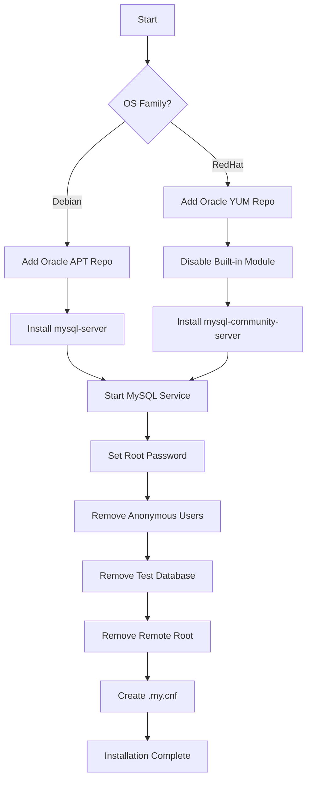

# How to Use Ansible to Install MySQL

Author: [nawazdhandala](https://www.github.com/nawazdhandala)

Tags: Ansible, MySQL, Database, Linux

Description: Automate MySQL installation on Ubuntu and RHEL systems using Ansible with official repository setup and secure initial configuration.

---

MySQL remains one of the most widely deployed databases in the world. Whether you are setting up a single development server or provisioning a fleet of database nodes for a large application, doing it by hand every time is not sustainable. Ansible lets you write the installation process once and repeat it reliably across any number of servers.

This post walks through a complete Ansible role that installs MySQL from the official Oracle repository on both Debian and RHEL-based systems, secures the installation, and gets it ready for use.

## Role Structure

```
roles/mysql_install/
  defaults/main.yml
  tasks/
    main.yml
    debian.yml
    redhat.yml
    secure.yml
  handlers/main.yml
```

## Default Variables

```yaml
# roles/mysql_install/defaults/main.yml
# Default settings for MySQL installation
---
mysql_version: "8.0"
mysql_root_password: "{{ vault_mysql_root_password }}"
mysql_port: 3306
mysql_bind_address: "127.0.0.1"
mysql_datadir: "/var/lib/mysql"
mysql_socket: "/var/run/mysqld/mysqld.sock"
mysql_pid_file: "/var/run/mysqld/mysqld.pid"
mysql_service_name: "mysql"
```

## Main Task File

```yaml
# roles/mysql_install/tasks/main.yml
# Route to OS-specific installation, then secure the installation
---
- name: Include OS-specific installation tasks
  include_tasks: "{{ ansible_os_family | lower }}.yml"

- name: Ensure MySQL is started and enabled
  systemd:
    name: "{{ mysql_service_name }}"
    state: started
    enabled: true

- name: Wait for MySQL to accept connections
  wait_for:
    port: "{{ mysql_port }}"
    host: 127.0.0.1
    delay: 3
    timeout: 30

- name: Secure MySQL installation
  include_tasks: secure.yml
```

## Debian/Ubuntu Installation

```yaml
# roles/mysql_install/tasks/debian.yml
# Install MySQL on Debian/Ubuntu from the official Oracle APT repo
---
- name: Install prerequisite packages
  apt:
    name:
      - gnupg2
      - python3-mysqldb
      - python3-pymysql
    state: present
    update_cache: true

- name: Download MySQL APT repository config
  get_url:
    url: "https://dev.mysql.com/get/mysql-apt-config_0.8.29-1_all.deb"
    dest: /tmp/mysql-apt-config.deb
    mode: '0644'

- name: Install MySQL APT repository
  apt:
    deb: /tmp/mysql-apt-config.deb
    state: present
  environment:
    DEBIAN_FRONTEND: noninteractive

- name: Update APT cache after adding MySQL repo
  apt:
    update_cache: true

- name: Install MySQL server and client
  apt:
    name:
      - "mysql-server"
      - "mysql-client"
    state: present
  environment:
    DEBIAN_FRONTEND: noninteractive

- name: Clean up downloaded deb file
  file:
    path: /tmp/mysql-apt-config.deb
    state: absent
```

## RHEL/Rocky Installation

```yaml
# roles/mysql_install/tasks/redhat.yml
# Install MySQL on RHEL/Rocky Linux from the official Oracle YUM repo
---
- name: Install prerequisite packages
  dnf:
    name:
      - python3-PyMySQL
    state: present

- name: Disable the built-in MySQL module
  command: dnf module disable mysql -y
  changed_when: false
  ignore_errors: true

- name: Install MySQL repository RPM
  dnf:
    name: "https://dev.mysql.com/get/mysql80-community-release-el{{ ansible_distribution_major_version }}-7.noarch.rpm"
    state: present
    disable_gpg_check: true

- name: Install MySQL server
  dnf:
    name:
      - mysql-community-server
      - mysql-community-client
    state: present

- name: Set MySQL service name for RHEL
  set_fact:
    mysql_service_name: mysqld

- name: Start MySQL to generate initial password
  systemd:
    name: "{{ mysql_service_name }}"
    state: started

- name: Get temporary root password from MySQL log
  shell: "grep 'temporary password' /var/log/mysqld.log | tail -1 | awk '{print $NF}'"
  register: mysql_temp_password
  changed_when: false
  no_log: true

- name: Set the MySQL temp password fact
  set_fact:
    mysql_initial_password: "{{ mysql_temp_password.stdout }}"
  no_log: true
```

## Securing the Installation

```yaml
# roles/mysql_install/tasks/secure.yml
# Secure MySQL installation - equivalent to mysql_secure_installation
---
- name: Set root password
  community.mysql.mysql_user:
    name: root
    host: localhost
    password: "{{ mysql_root_password }}"
    login_unix_socket: "{{ mysql_socket }}"
    state: present
  no_log: true
  ignore_errors: true

- name: Create .my.cnf for root user
  template:
    src: root-my.cnf.j2
    dest: /root/.my.cnf
    owner: root
    group: root
    mode: '0600'

- name: Remove anonymous users
  community.mysql.mysql_user:
    name: ""
    host_all: true
    state: absent
    login_unix_socket: "{{ mysql_socket }}"

- name: Remove test database
  community.mysql.mysql_db:
    name: test
    state: absent
    login_unix_socket: "{{ mysql_socket }}"

- name: Remove remote root access
  community.mysql.mysql_user:
    name: root
    host: "{{ item }}"
    state: absent
    login_unix_socket: "{{ mysql_socket }}"
  loop:
    - "{{ ansible_hostname }}"
    - "127.0.0.1"
    - "::1"
  ignore_errors: true
```

Here is the .my.cnf template for passwordless root access from the CLI.

```ini
# roles/mysql_install/templates/root-my.cnf.j2
# Root user MySQL credentials for local CLI access
[client]
user=root
password={{ mysql_root_password }}
socket={{ mysql_socket }}
```

## Handlers

```yaml
# roles/mysql_install/handlers/main.yml
# Restart or reload MySQL when configuration changes
---
- name: restart mysql
  systemd:
    name: "{{ mysql_service_name }}"
    state: restarted

- name: reload mysql
  command: "mysqladmin reload"
```

## Using the Role

```yaml
# playbooks/install-mysql.yml
# Install MySQL on all database servers
---
- name: Install MySQL
  hosts: databases
  become: true
  roles:
    - role: mysql_install
      vars:
        mysql_version: "8.0"
        mysql_bind_address: "0.0.0.0"
```

```bash
# Run the installation playbook
ansible-playbook playbooks/install-mysql.yml \
  -i inventory/production/ \
  --ask-vault-pass
```

## Installation Flow



## Verifying the Installation

```yaml
# Verify MySQL is installed and accessible
- name: Check MySQL version
  command: mysql --version
  register: mysql_version_output
  changed_when: false

- name: Display MySQL version
  debug:
    msg: "{{ mysql_version_output.stdout }}"

- name: Verify MySQL connection
  community.mysql.mysql_info:
    login_unix_socket: "{{ mysql_socket }}"
    filter: version
  register: mysql_info

- name: Display server info
  debug:
    msg: "MySQL server version: {{ mysql_info.version.full }}"
```

## Installing the Required Ansible Collection

Before using the MySQL modules, install the collection.

```bash
# Install the community MySQL collection for Ansible
ansible-galaxy collection install community.mysql
pip install PyMySQL
```

## Conclusion

Automating MySQL installation with Ansible eliminates the manual steps of adding repositories, installing packages, and running the security hardening script. The role handles both Debian and RHEL families, uses the official Oracle repositories for the latest versions, and secures the installation automatically. From here, you can add configuration management, user creation, and replication setup as additional roles that build on this foundation.
