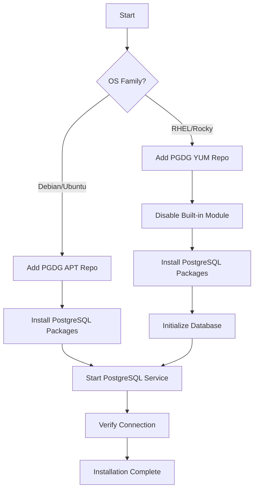

# How to Use Ansible to Install PostgreSQL

Author: [nawazdhandala](https://www.github.com/nawazdhandala)

Tags: Ansible, PostgreSQL, Database, Linux

Description: Automate PostgreSQL installation on Ubuntu and RHEL-based systems using Ansible with proper repository setup and initial configuration.

---

Installing PostgreSQL by hand on a single server is easy. Installing it consistently across 10 or 50 servers with the same version, the same configuration, and the same security settings is where Ansible shines. This post walks through a complete Ansible role that installs PostgreSQL from the official repositories on both Ubuntu/Debian and RHEL/Rocky systems.

## Why Not Just Use the Distro Package?

Distribution packages are often several major versions behind. Ubuntu 22.04 ships PostgreSQL 14, but PostgreSQL 16 has been out for a while. The official PostgreSQL Global Development Group (PGDG) repository always has the latest stable releases. Our Ansible role will add the PGDG repo and install from there.

## The PostgreSQL Install Role

Here is the complete role structure.

```
roles/postgresql_install/
  defaults/main.yml
  tasks/
    main.yml
    debian.yml
    redhat.yml
  handlers/main.yml
  templates/
```

## Role Defaults

```yaml
# roles/postgresql_install/defaults/main.yml
# Default variables for PostgreSQL installation
---
postgresql_version: "16"
postgresql_data_dir: "/var/lib/postgresql/{{ postgresql_version }}/main"
postgresql_config_dir: "/etc/postgresql/{{ postgresql_version }}/main"
postgresql_bin_dir: "/usr/lib/postgresql/{{ postgresql_version }}/bin"
postgresql_service_name: "postgresql"
postgresql_listen_addresses: "localhost"
postgresql_port: 5432
postgresql_max_connections: 100
postgresql_shared_buffers: "128MB"
```

## Main Task File

```yaml
# roles/postgresql_install/tasks/main.yml
# Route to OS-specific installation tasks
---
- name: Include OS-specific tasks
  include_tasks: "{{ ansible_os_family | lower }}.yml"

- name: Ensure PostgreSQL service is running
  systemd:
    name: "{{ postgresql_service_name }}"
    state: started
    enabled: true

- name: Wait for PostgreSQL to accept connections
  wait_for:
    port: "{{ postgresql_port }}"
    host: 127.0.0.1
    delay: 2
    timeout: 30
```

## Debian/Ubuntu Installation

```yaml
# roles/postgresql_install/tasks/debian.yml
# Install PostgreSQL on Debian/Ubuntu from PGDG repository
---
- name: Install prerequisite packages
  apt:
    name:
      - gnupg2
      - python3-psycopg2
      - acl
    state: present
    update_cache: true

- name: Add PostgreSQL GPG key
  apt_key:
    url: https://www.postgresql.org/media/keys/ACCC4CF8.asc
    state: present

- name: Add PostgreSQL APT repository
  apt_repository:
    repo: "deb http://apt.postgresql.org/pub/repos/apt {{ ansible_distribution_release }}-pgdg main"
    state: present
    filename: pgdg

- name: Install PostgreSQL packages
  apt:
    name:
      - "postgresql-{{ postgresql_version }}"
      - "postgresql-client-{{ postgresql_version }}"
      - "postgresql-contrib-{{ postgresql_version }}"
    state: present
    update_cache: true

- name: Set PostgreSQL data directory path
  set_fact:
    postgresql_data_dir: "/var/lib/postgresql/{{ postgresql_version }}/main"
    postgresql_config_dir: "/etc/postgresql/{{ postgresql_version }}/main"
```

## RHEL/Rocky Linux Installation

```yaml
# roles/postgresql_install/tasks/redhat.yml
# Install PostgreSQL on RHEL/Rocky from PGDG repository
---
- name: Install prerequisite packages
  dnf:
    name:
      - python3-psycopg2
    state: present

- name: Disable the built-in PostgreSQL module
  command: dnf module disable postgresql -y
  args:
    warn: false
  changed_when: false

- name: Install PGDG repository RPM
  dnf:
    name: "https://download.postgresql.org/pub/repos/yum/reporpms/EL-{{ ansible_distribution_major_version }}-x86_64/pgdg-redhat-repo-latest.noarch.rpm"
    state: present
    disable_gpg_check: true

- name: Install PostgreSQL packages
  dnf:
    name:
      - "postgresql{{ postgresql_version }}-server"
      - "postgresql{{ postgresql_version }}"
      - "postgresql{{ postgresql_version }}-contrib"
    state: present

- name: Check if PostgreSQL database is initialized
  stat:
    path: "/var/lib/pgsql/{{ postgresql_version }}/data/PG_VERSION"
  register: pgdata

- name: Initialize PostgreSQL database
  command: "/usr/pgsql-{{ postgresql_version }}/bin/postgresql-{{ postgresql_version }}-setup initdb"
  when: not pgdata.stat.exists

- name: Set PostgreSQL paths for RHEL
  set_fact:
    postgresql_data_dir: "/var/lib/pgsql/{{ postgresql_version }}/data"
    postgresql_config_dir: "/var/lib/pgsql/{{ postgresql_version }}/data"
    postgresql_service_name: "postgresql-{{ postgresql_version }}"
```

## Handlers

```yaml
# roles/postgresql_install/handlers/main.yml
# Restart or reload PostgreSQL when configuration changes
---
- name: restart postgresql
  systemd:
    name: "{{ postgresql_service_name }}"
    state: restarted

- name: reload postgresql
  systemd:
    name: "{{ postgresql_service_name }}"
    state: reloaded
```

## Using the Role in a Playbook

```yaml
# playbooks/install-postgresql.yml
# Install PostgreSQL on database servers
---
- name: Install PostgreSQL
  hosts: databases
  become: true
  roles:
    - role: postgresql_install
      vars:
        postgresql_version: "16"
        postgresql_listen_addresses: "0.0.0.0"
        postgresql_max_connections: 200
```

Run the playbook.

```bash
# Install PostgreSQL on all database servers
ansible-playbook playbooks/install-postgresql.yml -i inventory/production.yml
```

## Verifying the Installation

Add verification tasks to confirm everything is working.

```yaml
# tasks/verify.yml
# Verify PostgreSQL installation is correct
---
- name: Check PostgreSQL version
  command: "psql --version"
  register: pg_version
  changed_when: false

- name: Display installed version
  debug:
    msg: "{{ pg_version.stdout }}"

- name: Verify PostgreSQL is accepting connections
  become: true
  become_user: postgres
  command: "psql -c 'SELECT version();'"
  register: pg_connection
  changed_when: false

- name: Display server version
  debug:
    msg: "{{ pg_connection.stdout }}"

- name: Check PostgreSQL service status
  systemd:
    name: "{{ postgresql_service_name }}"
  register: pg_service

- name: Confirm service is active
  assert:
    that:
      - pg_service.status.ActiveState == "active"
    fail_msg: "PostgreSQL service is not running"
```

## Installation Flow



## Handling Different Versions on Different Servers

If some servers need PostgreSQL 15 and others need 16, use host variables.

```yaml
# inventory/production.yml
# Different PostgreSQL versions per server group
all:
  children:
    databases_v15:
      hosts:
        db-legacy-01:
          ansible_host: 10.0.2.10
      vars:
        postgresql_version: "15"
    databases_v16:
      hosts:
        db-new-01:
          ansible_host: 10.0.2.20
        db-new-02:
          ansible_host: 10.0.2.21
      vars:
        postgresql_version: "16"
```

## Common Issues and Fixes

One issue I have run into is the `python3-psycopg2` package not being available on older distributions. In that case, install it via pip instead.

```yaml
# Fallback: install psycopg2 via pip if the system package is not available
- name: Install psycopg2 via pip (fallback)
  pip:
    name: psycopg2-binary
    state: present
  when: ansible_os_family == "Debian" and ansible_distribution_major_version | int < 20
```

Another common issue is the locale not being set correctly, which causes PostgreSQL initialization to fail.

```yaml
# Ensure locale is configured before PostgreSQL initialization
- name: Generate locale
  locale_gen:
    name: en_US.UTF-8
    state: present
  when: ansible_os_family == "Debian"
```

## Conclusion

Automating PostgreSQL installation with Ansible ensures every server in your fleet gets the same version with the same initial setup. The role handles both Debian and RHEL families, adds the official PGDG repository for the latest versions, and includes verification tasks to confirm everything is working. From here, you can layer on configuration, user management, and replication, all using additional Ansible roles that build on this foundation.
