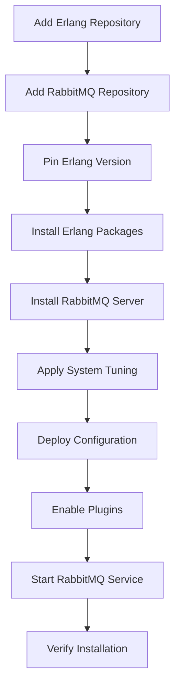

# How to Use Ansible to Install RabbitMQ

Author: [nawazdhandala](https://www.github.com/nawazdhandala)

Tags: Ansible, RabbitMQ, Message Queue, DevOps

Description: Step-by-step guide to automating RabbitMQ installation and basic configuration using Ansible for reliable message queuing.

---

RabbitMQ is the most widely deployed message broker in production systems. It handles async communication between services, background job processing, event streaming, and more. Getting it installed correctly on a single server is not hard, but rolling it out consistently across your infrastructure with the right Erlang version, plugins, and initial config requires careful automation. Ansible handles this well.

This guide covers installing RabbitMQ using Ansible on Ubuntu/Debian systems, including Erlang dependency management, plugin activation, and basic configuration.

## Why RabbitMQ Installation Needs Automation

RabbitMQ has a specific dependency on Erlang, and not just any Erlang. RabbitMQ 3.12+ requires Erlang 25.x or 26.x. Using the wrong Erlang version causes subtle runtime errors or outright startup failures. The distro-packaged Erlang is often too old. Ansible lets you pin the correct Erlang version alongside RabbitMQ and deploy both together.

## Prerequisites

- Ansible 2.9+
- Target servers running Ubuntu 20.04+ or Debian 11+
- Sudo access on target hosts

## Inventory

```ini
# inventory/rabbitmq.ini
[rabbitmq_servers]
rabbit-1 ansible_host=10.0.7.10
rabbit-2 ansible_host=10.0.7.11
rabbit-3 ansible_host=10.0.7.12

[rabbitmq_servers:vars]
ansible_user=ubuntu
rabbitmq_version=3.13.*
erlang_version=1:26.*
```

## Installation Playbook

This playbook installs both Erlang and RabbitMQ from the official Cloudsmith repositories maintained by the RabbitMQ team.

```yaml
# playbooks/install-rabbitmq.yml
---
- name: Install RabbitMQ
  hosts: rabbitmq_servers
  become: true

  tasks:
    - name: Install prerequisite packages
      ansible.builtin.apt:
        name:
          - curl
          - gnupg
          - apt-transport-https
          - software-properties-common
        state: present
        update_cache: true

    # Erlang installation from RabbitMQ's curated repository
    - name: Add RabbitMQ Erlang repository signing key
      ansible.builtin.apt_key:
        url: https://github.com/rabbitmq/signing-keys/releases/download/3.0/cloudsmith.rabbitmq-erlang.E495BB49CC4BBE5B.key
        state: present

    - name: Add RabbitMQ server repository signing key
      ansible.builtin.apt_key:
        url: https://github.com/rabbitmq/signing-keys/releases/download/3.0/cloudsmith.rabbitmq-server.9F4587F226208342.key
        state: present

    - name: Add Erlang repository
      ansible.builtin.apt_repository:
        repo: "deb https://ppa1.novemberain.com/rabbitmq/rabbitmq-erlang/deb/ubuntu {{ ansible_distribution_release }} main"
        state: present
        filename: rabbitmq-erlang

    - name: Add RabbitMQ repository
      ansible.builtin.apt_repository:
        repo: "deb https://ppa1.novemberain.com/rabbitmq/rabbitmq-server/deb/ubuntu {{ ansible_distribution_release }} main"
        state: present
        filename: rabbitmq-server

    - name: Pin Erlang version to prevent accidental upgrades
      ansible.builtin.copy:
        dest: /etc/apt/preferences.d/erlang
        content: |
          Package: erlang*
          Pin: origin ppa1.novemberain.com
          Pin-Priority: 1000
        mode: "0644"

    - name: Install Erlang packages
      ansible.builtin.apt:
        name:
          - erlang-base
          - erlang-asn1
          - erlang-crypto
          - erlang-eldap
          - erlang-ftp
          - erlang-inets
          - erlang-mnesia
          - erlang-os-mon
          - erlang-parsetools
          - erlang-public-key
          - erlang-runtime-tools
          - erlang-snmp
          - erlang-ssl
          - erlang-syntax-tools
          - erlang-tftp
          - erlang-tools
          - erlang-xmerl
        state: present
        update_cache: true

    - name: Install RabbitMQ server
      ansible.builtin.apt:
        name: rabbitmq-server
        state: present
        update_cache: true

    - name: Ensure RabbitMQ is started and enabled
      ansible.builtin.systemd:
        name: rabbitmq-server
        state: started
        enabled: true
```

## Enabling Plugins

RabbitMQ ships with several plugins disabled by default. The management plugin (web UI) is the most commonly needed one.

```yaml
# playbooks/configure-rabbitmq-plugins.yml
---
- name: Enable RabbitMQ plugins
  hosts: rabbitmq_servers
  become: true

  tasks:
    - name: Enable the management plugin for web UI access
      community.rabbitmq.rabbitmq_plugin:
        names: rabbitmq_management
        state: enabled
      notify: Restart RabbitMQ

    - name: Enable the Prometheus metrics plugin
      community.rabbitmq.rabbitmq_plugin:
        names: rabbitmq_prometheus
        state: enabled
      notify: Restart RabbitMQ

    - name: Enable the shovel plugin for cross-cluster message forwarding
      community.rabbitmq.rabbitmq_plugin:
        names: rabbitmq_shovel,rabbitmq_shovel_management
        state: enabled
      notify: Restart RabbitMQ

  handlers:
    - name: Restart RabbitMQ
      ansible.builtin.systemd:
        name: rabbitmq-server
        state: restarted
```

If you do not have the `community.rabbitmq` collection, use the command module instead.

```yaml
    - name: Enable management plugin using rabbitmq-plugins command
      ansible.builtin.command:
        cmd: rabbitmq-plugins enable rabbitmq_management
      register: plugin_result
      changed_when: "'enabled' in plugin_result.stdout"
```

## System Tuning

RabbitMQ needs some system-level tuning for production workloads.

```yaml
# playbooks/tune-system-rabbitmq.yml
---
- name: Apply system tuning for RabbitMQ
  hosts: rabbitmq_servers
  become: true

  tasks:
    - name: Set file descriptor limits for RabbitMQ
      ansible.builtin.copy:
        dest: /etc/security/limits.d/rabbitmq.conf
        content: |
          rabbitmq soft nofile 65535
          rabbitmq hard nofile 65535
        mode: "0644"

    - name: Create systemd override directory for RabbitMQ
      ansible.builtin.file:
        path: /etc/systemd/system/rabbitmq-server.service.d
        state: directory
        mode: "0755"

    - name: Set LimitNOFILE in systemd override
      ansible.builtin.copy:
        dest: /etc/systemd/system/rabbitmq-server.service.d/limits.conf
        content: |
          [Service]
          LimitNOFILE=65535
        mode: "0644"
      notify: Reload systemd and restart RabbitMQ

    - name: Tune network settings for RabbitMQ
      ansible.posix.sysctl:
        name: "{{ item.key }}"
        value: "{{ item.value }}"
        state: present
        reload: true
      loop:
        - { key: "net.core.somaxconn", value: "4096" }
        - { key: "net.ipv4.tcp_max_syn_backlog", value: "4096" }

  handlers:
    - name: Reload systemd and restart RabbitMQ
      ansible.builtin.systemd:
        daemon_reload: true
        name: rabbitmq-server
        state: restarted
```

## Basic Configuration

Deploy a RabbitMQ configuration file with essential settings.

```yaml
# playbooks/configure-rabbitmq-base.yml
---
- name: Configure RabbitMQ base settings
  hosts: rabbitmq_servers
  become: true

  tasks:
    - name: Deploy RabbitMQ configuration file
      ansible.builtin.template:
        src: ../templates/rabbitmq.conf.j2
        dest: /etc/rabbitmq/rabbitmq.conf
        owner: rabbitmq
        group: rabbitmq
        mode: "0640"
      notify: Restart RabbitMQ

    - name: Deploy RabbitMQ environment file
      ansible.builtin.copy:
        dest: /etc/rabbitmq/rabbitmq-env.conf
        content: |
          # RabbitMQ environment - managed by Ansible
          NODENAME=rabbit@{{ inventory_hostname }}
          NODE_IP_ADDRESS={{ ansible_host }}
          RABBITMQ_LOG_BASE=/var/log/rabbitmq
        owner: rabbitmq
        group: rabbitmq
        mode: "0640"
      notify: Restart RabbitMQ

  handlers:
    - name: Restart RabbitMQ
      ansible.builtin.systemd:
        name: rabbitmq-server
        state: restarted
```

The configuration template.

```jinja2
# templates/rabbitmq.conf.j2
# RabbitMQ configuration - managed by Ansible

# Listeners
listeners.tcp.default = {{ rabbitmq_port | default(5672) }}
management.tcp.port = {{ rabbitmq_management_port | default(15672) }}

# Memory and disk thresholds
vm_memory_high_watermark.relative = {{ rabbitmq_memory_watermark | default(0.6) }}
disk_free_limit.relative = {{ rabbitmq_disk_free_limit | default(1.5) }}

# Connection limits
channel_max = {{ rabbitmq_channel_max | default(2047) }}
heartbeat = {{ rabbitmq_heartbeat | default(60) }}

# Logging
log.file.level = {{ rabbitmq_log_level | default('info') }}
log.console = false

# Default user settings
default_user = guest
default_pass = guest
# Restrict the default guest user to localhost only
loopback_users.guest = true

# Consumer timeout (milliseconds) - prevents stuck consumers
consumer_timeout = {{ rabbitmq_consumer_timeout | default(1800000) }}

# Collect per-queue and per-connection statistics
collect_statistics = coarse
collect_statistics_interval = 5000
```

## Installation Flow



## Verification

After installation, verify RabbitMQ is running and accessible.

```yaml
# playbooks/verify-rabbitmq.yml
---
- name: Verify RabbitMQ installation
  hosts: rabbitmq_servers
  become: true

  tasks:
    - name: Check RabbitMQ service status
      ansible.builtin.command:
        cmd: rabbitmqctl status
      register: rmq_status
      changed_when: false

    - name: Check RabbitMQ node health
      ansible.builtin.command:
        cmd: rabbitmq-diagnostics check_running
      register: rmq_health
      changed_when: false

    - name: List enabled plugins
      ansible.builtin.command:
        cmd: rabbitmq-plugins list --enabled
      register: rmq_plugins
      changed_when: false

    - name: Display RabbitMQ status
      ansible.builtin.debug:
        msg:
          - "Health check: {{ rmq_health.stdout_lines[0] }}"
          - "Enabled plugins: {{ rmq_plugins.stdout_lines }}"

    - name: Verify management UI is accessible
      ansible.builtin.uri:
        url: "http://{{ ansible_host }}:15672/api/overview"
        method: GET
        user: guest
        password: guest
        status_code: 200
      register: mgmt_check

    - name: Display management UI status
      ansible.builtin.debug:
        msg: "Management UI: OK - RabbitMQ {{ mgmt_check.json.rabbitmq_version }}"
```

## Production Tips

1. **Always pin the Erlang version.** An unplanned Erlang upgrade can break RabbitMQ. Use APT pinning to prevent this.

2. **Remove the default guest user in production.** The guest user can only connect from localhost by default, but it is still a good practice to remove it and create dedicated users.

3. **Set memory and disk watermarks conservatively.** The defaults are reasonable, but if RabbitMQ hits the memory watermark, it blocks all publishers. This can cascade through your entire system.

4. **Enable the Prometheus plugin from day one.** You want metrics visibility before you have a problem, not after.

5. **Use the management plugin carefully.** It adds overhead and should not be the primary way you monitor RabbitMQ in production. Use it for debugging and one-off checks.

## Conclusion

Installing RabbitMQ with Ansible eliminates the most common source of problems: wrong Erlang versions, missing plugins, and inconsistent configurations. The playbooks in this guide give you a solid foundation that covers the full installation process from repository setup to verification. From here, you can layer on user management, virtual hosts, and clustering, all of which we cover in separate posts.
