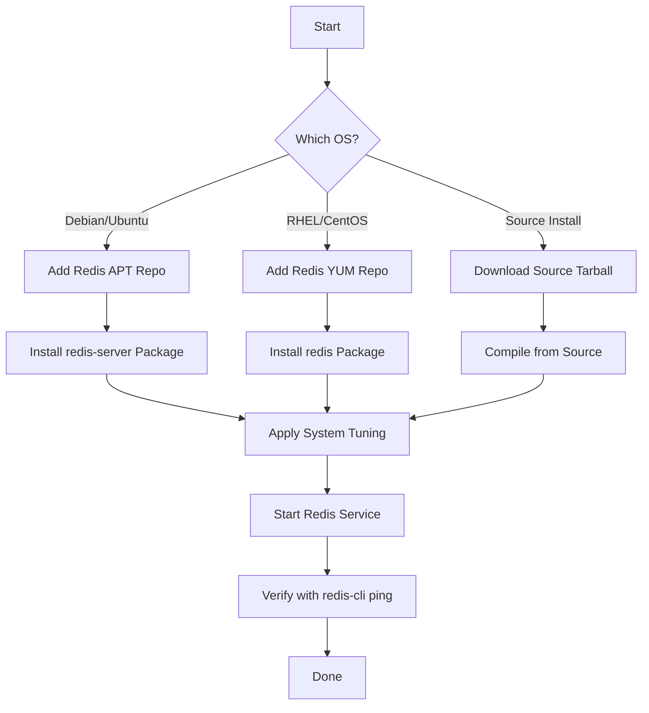

# How to Use Ansible to Install Redis

Author: [nawazdhandala](https://www.github.com/nawazdhandala)

Tags: Ansible, Redis, Caching, DevOps

Description: A practical guide to automating Redis installation across your infrastructure using Ansible playbooks and roles.

---

Redis is one of those tools that shows up in almost every modern stack. Whether you are using it as a cache, session store, message broker, or all three, you probably have it running on multiple servers. Installing Redis by hand once is straightforward. Installing it on 50 servers while making sure every instance matches your spec is a different story. That is where Ansible comes in.

This post covers how to install Redis using Ansible, with playbooks that work on Ubuntu/Debian and RHEL/CentOS systems.

## Prerequisites

You will need:

- Ansible 2.9+ on your control node
- Target servers running Ubuntu 20.04+, Debian 11+, or RHEL 8+/CentOS 8+
- SSH access with sudo privileges on target hosts

## Inventory Setup

Start with an inventory file that groups your Redis servers.

```ini
# inventory/redis.ini
[redis_servers]
redis-01 ansible_host=10.0.2.10
redis-02 ansible_host=10.0.2.11
redis-03 ansible_host=10.0.2.12

[redis_servers:vars]
ansible_user=ubuntu
ansible_ssh_private_key_file=~/.ssh/redis-key.pem
redis_version=7.2
redis_port=6379
redis_bind_address=0.0.0.0
```

## Basic Redis Installation Playbook

Here is a playbook that installs Redis from the official repository on Ubuntu/Debian systems.

```yaml
# playbooks/install-redis.yml
---
- name: Install Redis on target servers
  hosts: redis_servers
  become: true
  vars:
    redis_port: 6379
    redis_maxmemory: "256mb"
    redis_maxmemory_policy: "allkeys-lru"

  tasks:
    - name: Install prerequisite packages
      ansible.builtin.apt:
        name:
          - lsb-release
          - curl
          - gpg
        state: present
        update_cache: true

    - name: Add the official Redis GPG key
      ansible.builtin.apt_key:
        url: https://packages.redis.io/gpg
        state: present

    - name: Add the Redis APT repository
      ansible.builtin.apt_repository:
        repo: "deb https://packages.redis.io/deb {{ ansible_distribution_release }} main"
        state: present
        filename: redis

    - name: Install Redis server package
      ansible.builtin.apt:
        name: redis-server
        state: present
        update_cache: true

    - name: Ensure Redis is started and enabled on boot
      ansible.builtin.systemd:
        name: redis-server
        state: started
        enabled: true
```

## Multi-OS Installation

In real environments, you rarely have a homogeneous fleet. Here is a playbook that handles both Debian-family and RedHat-family distributions.

```yaml
# playbooks/install-redis-multi-os.yml
---
- name: Install Redis on any supported OS
  hosts: redis_servers
  become: true

  tasks:
    # Debian/Ubuntu installation block
    - name: Install Redis on Debian/Ubuntu
      when: ansible_os_family == "Debian"
      block:
        - name: Install prerequisite packages for Debian
          ansible.builtin.apt:
            name:
              - lsb-release
              - curl
              - gpg
            state: present
            update_cache: true

        - name: Add Redis GPG key for Debian
          ansible.builtin.apt_key:
            url: https://packages.redis.io/gpg
            state: present

        - name: Add Redis repository for Debian
          ansible.builtin.apt_repository:
            repo: "deb https://packages.redis.io/deb {{ ansible_distribution_release }} main"
            state: present
            filename: redis

        - name: Install Redis on Debian
          ansible.builtin.apt:
            name: redis-server
            state: present
            update_cache: true

    # RHEL/CentOS installation block
    - name: Install Redis on RHEL/CentOS
      when: ansible_os_family == "RedHat"
      block:
        - name: Install EPEL repository
          ansible.builtin.yum:
            name: epel-release
            state: present

        - name: Add Redis repository for RHEL
          ansible.builtin.yum_repository:
            name: redis
            description: Redis Official Repository
            baseurl: https://packages.redis.io/rpm/rhel$releasever/$basearch
            gpgcheck: true
            gpgkey: https://packages.redis.io/gpg
            enabled: true

        - name: Install Redis on RHEL
          ansible.builtin.yum:
            name: redis
            state: present

    # Common tasks for all OS families
    - name: Enable Redis service on boot
      ansible.builtin.systemd:
        name: redis
        state: started
        enabled: true
```

## System Tuning for Redis

Redis works best with certain kernel parameters tuned. This is something most people forget on the first install and then wonder why Redis logs are full of warnings.

```yaml
# playbooks/tune-system-for-redis.yml
---
- name: Apply system tuning for Redis
  hosts: redis_servers
  become: true

  tasks:
    - name: Set vm.overcommit_memory to 1 for Redis background saves
      ansible.posix.sysctl:
        name: vm.overcommit_memory
        value: "1"
        state: present
        reload: true

    - name: Set net.core.somaxconn for Redis connection backlog
      ansible.posix.sysctl:
        name: net.core.somaxconn
        value: "65535"
        state: present
        reload: true

    - name: Disable Transparent Huge Pages (causes latency issues)
      ansible.builtin.copy:
        dest: /etc/systemd/system/disable-thp.service
        content: |
          [Unit]
          Description=Disable Transparent Huge Pages
          Before=redis-server.service

          [Service]
          Type=oneshot
          ExecStart=/bin/sh -c 'echo never > /sys/kernel/mm/transparent_hugepage/enabled'
          ExecStart=/bin/sh -c 'echo never > /sys/kernel/mm/transparent_hugepage/defrag'

          [Install]
          WantedBy=multi-user.target
        mode: "0644"
      notify: Reload systemd and start THP service

    - name: Increase file descriptor limit for Redis
      ansible.builtin.lineinfile:
        path: /etc/security/limits.conf
        line: "redis soft nofile 65535"
        state: present

    - name: Increase hard file descriptor limit for Redis
      ansible.builtin.lineinfile:
        path: /etc/security/limits.conf
        line: "redis hard nofile 65535"
        state: present

  handlers:
    - name: Reload systemd and start THP service
      ansible.builtin.systemd:
        daemon_reload: true
        name: disable-thp
        state: started
        enabled: true
```

## Installing a Specific Redis Version from Source

Sometimes the package managers do not have the exact version you need. In that case, compile from source.

```yaml
# playbooks/install-redis-from-source.yml
---
- name: Install Redis from source
  hosts: redis_servers
  become: true
  vars:
    redis_version: "7.2.4"
    redis_install_dir: /opt/redis

  tasks:
    - name: Install build dependencies
      ansible.builtin.apt:
        name:
          - build-essential
          - tcl
          - pkg-config
        state: present
        update_cache: true

    - name: Download Redis source tarball
      ansible.builtin.get_url:
        url: "https://download.redis.io/releases/redis-{{ redis_version }}.tar.gz"
        dest: "/tmp/redis-{{ redis_version }}.tar.gz"
        mode: "0644"

    - name: Extract Redis source code
      ansible.builtin.unarchive:
        src: "/tmp/redis-{{ redis_version }}.tar.gz"
        dest: /tmp
        remote_src: true

    - name: Compile Redis from source
      ansible.builtin.command:
        cmd: make
        chdir: "/tmp/redis-{{ redis_version }}"
      changed_when: true

    - name: Install Redis binaries to the target directory
      ansible.builtin.command:
        cmd: "make install PREFIX={{ redis_install_dir }}"
        chdir: "/tmp/redis-{{ redis_version }}"
      changed_when: true

    - name: Create redis system user
      ansible.builtin.user:
        name: redis
        system: true
        shell: /usr/sbin/nologin
        home: /var/lib/redis
        create_home: true

    - name: Create Redis data directory
      ansible.builtin.file:
        path: /var/lib/redis
        state: directory
        owner: redis
        group: redis
        mode: "0750"

    - name: Create systemd unit file for Redis
      ansible.builtin.copy:
        dest: /etc/systemd/system/redis.service
        content: |
          [Unit]
          Description=Redis In-Memory Data Store
          After=network.target

          [Service]
          User=redis
          Group=redis
          ExecStart={{ redis_install_dir }}/bin/redis-server /etc/redis/redis.conf
          ExecStop={{ redis_install_dir }}/bin/redis-cli shutdown
          Restart=always
          LimitNOFILE=65535

          [Install]
          WantedBy=multi-user.target
        mode: "0644"
      notify: Start Redis service

  handlers:
    - name: Start Redis service
      ansible.builtin.systemd:
        daemon_reload: true
        name: redis
        state: started
        enabled: true
```

## Verification Playbook

After installation, verify that Redis is running and responding correctly.

```yaml
# playbooks/verify-redis.yml
---
- name: Verify Redis installation
  hosts: redis_servers
  become: true

  tasks:
    - name: Check Redis service status
      ansible.builtin.systemd:
        name: redis-server
      register: redis_service

    - name: Ping Redis to verify it responds
      ansible.builtin.command:
        cmd: redis-cli ping
      register: redis_ping
      changed_when: false

    - name: Display Redis version
      ansible.builtin.command:
        cmd: redis-cli info server
      register: redis_info
      changed_when: false

    - name: Show Redis status summary
      ansible.builtin.debug:
        msg:
          - "Service active: {{ redis_service.status.ActiveState }}"
          - "Ping response: {{ redis_ping.stdout }}"
          - "Redis version: {{ redis_info.stdout_lines[1] }}"
```

## Installation Flow

Here is the overall flow of the Redis installation process.



## Tips for Production

A few things that will save you headaches:

1. **Pin your Redis version.** Do not just install "latest" in production. Specify the exact version so every server matches.

2. **The system tuning matters.** Redis will work without the sysctl tweaks, but it will complain loudly in the logs and performance will suffer under load.

3. **Use the official repository**, not the distro packages. The distro packages are often several major versions behind.

4. **Always set `maxmemory` and `maxmemory-policy`.** Without these, Redis will happily consume all your RAM and then the OOM killer will pay a visit.

5. **Test your playbook in a staging environment** before rolling it out to production. A failed Redis install during peak traffic is not a fun debugging session.

## Conclusion

Installing Redis with Ansible gives you a repeatable, version-controlled process that works across your entire fleet. Whether you are setting up a single development instance or rolling out Redis to a hundred production servers, the playbooks in this guide handle the common scenarios. In the next post, we will cover configuring Redis after installation, including memory policies, persistence settings, and security hardening.
