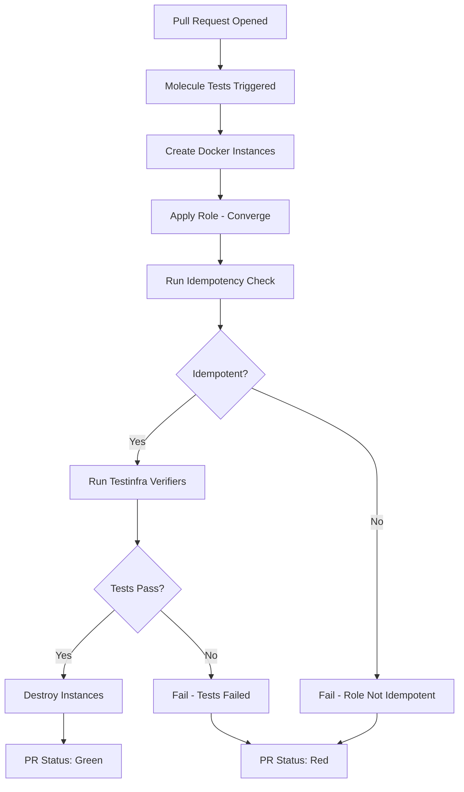

# How to Run Ansible Integration Tests in CI/CD

Author: [nawazdhandala](https://www.github.com/nawazdhandala)

Tags: Ansible, Testing, CI/CD, Molecule

Description: Set up integration tests for your Ansible roles and playbooks in CI/CD using Molecule, Testinfra, and container-based testing.

---

Writing Ansible roles without testing them is like writing application code without unit tests. It works until it does not. Integration tests verify that your roles actually produce the expected result on a real system. Molecule is the standard tool for this in the Ansible world. It spins up a test environment (usually a Docker container), applies your role, runs verifiers, and tears everything down.

This post covers setting up Molecule for integration testing, writing Testinfra verifiers, and running the whole thing in GitHub Actions and GitLab CI.

## Installing Molecule

Molecule needs a driver to create test instances. The Docker driver is the most common for CI/CD because containers are fast and disposable.

```bash
# Install Molecule with the Docker driver and Testinfra verifier
pip install "molecule[docker]" molecule-plugins pytest-testinfra ansible
```

## Initializing Molecule for a Role

If you have an existing role, add Molecule to it.

```bash
# Initialize Molecule in an existing role directory
cd roles/nginx_setup
molecule init scenario --driver-name docker
```

This creates a `molecule/default/` directory inside your role with the test configuration.

## Molecule Configuration

Here is a `molecule.yml` that tests a role on both Ubuntu and Rocky Linux.

```yaml
# roles/nginx_setup/molecule/default/molecule.yml
# Test the nginx_setup role on multiple distros
---
dependency:
  name: galaxy
driver:
  name: docker
platforms:
  - name: ubuntu-test
    image: ubuntu:22.04
    pre_build_image: true
    command: /bin/systemd
    privileged: true
    volumes:
      - /sys/fs/cgroup:/sys/fs/cgroup:rw
  - name: rocky-test
    image: rockylinux:9
    pre_build_image: true
    command: /usr/sbin/init
    privileged: true
    volumes:
      - /sys/fs/cgroup:/sys/fs/cgroup:rw
provisioner:
  name: ansible
  inventory:
    host_vars:
      ubuntu-test:
        ansible_python_interpreter: /usr/bin/python3
      rocky-test:
        ansible_python_interpreter: /usr/bin/python3
verifier:
  name: testinfra
```

## The Converge Playbook

Molecule uses a `converge.yml` playbook to apply your role to the test instances.

```yaml
# roles/nginx_setup/molecule/default/converge.yml
# Apply the role under test to the Molecule instances
---
- name: Converge
  hosts: all
  become: true
  vars:
    nginx_worker_processes: 2
    nginx_server_name: test.example.com
    nginx_listen_port: 80

  tasks:
    - name: Include the nginx_setup role
      include_role:
        name: nginx_setup
```

## Writing Testinfra Verifiers

Testinfra is a Python testing framework that verifies system state. It checks that packages are installed, services are running, files exist with correct permissions, and ports are open.

```python
# roles/nginx_setup/molecule/default/tests/test_default.py
# Verify that the nginx_setup role produced the expected system state
import pytest

def test_nginx_is_installed(host):
    """Nginx package should be installed."""
    nginx = host.package("nginx")
    assert nginx.is_installed

def test_nginx_service_running(host):
    """Nginx service should be running and enabled."""
    service = host.service("nginx")
    assert service.is_running
    assert service.is_enabled

def test_nginx_config_exists(host):
    """Nginx configuration file should exist with correct permissions."""
    config = host.file("/etc/nginx/nginx.conf")
    assert config.exists
    assert config.user == "root"
    assert config.group == "root"

def test_nginx_listening(host):
    """Nginx should be listening on port 80."""
    socket = host.socket("tcp://0.0.0.0:80")
    assert socket.is_listening

def test_nginx_worker_processes(host):
    """Nginx config should have the correct worker_processes setting."""
    config = host.file("/etc/nginx/nginx.conf")
    assert config.contains("worker_processes 2")

def test_server_name_configured(host):
    """The server block should have the correct server_name."""
    vhost = host.file("/etc/nginx/sites-enabled/default")
    assert vhost.contains("server_name test.example.com")
```

## Running Molecule Locally

Before pushing to CI/CD, run the tests locally.

```bash
# Run the full Molecule test sequence
cd roles/nginx_setup
molecule test
```

This runs the full sequence: dependency, lint, cleanup, destroy, syntax, create, prepare, converge, idempotence, side_effect, verify, cleanup, destroy.

For faster iteration during development, run individual steps.

```bash
# Create instances, converge, and verify without destroying
molecule create
molecule converge
molecule verify

# Log into a test instance to debug
molecule login --host ubuntu-test

# Destroy test instances when done
molecule destroy
```

## GitHub Actions Integration

Here is a workflow that runs Molecule tests on every pull request.

```yaml
# .github/workflows/molecule-test.yml
# Run Molecule integration tests on pull requests
name: Molecule Tests

on:
  pull_request:
    paths:
      - 'roles/**'

jobs:
  molecule:
    runs-on: ubuntu-latest
    strategy:
      matrix:
        role:
          - nginx_setup
          - app_deploy
          - database_setup
      fail-fast: false

    steps:
      - uses: actions/checkout@v4

      - name: Setup Python
        uses: actions/setup-python@v5
        with:
          python-version: '3.11'

      - name: Cache pip
        uses: actions/cache@v4
        with:
          path: ~/.cache/pip
          key: pip-molecule-${{ hashFiles('requirements-test.txt') }}

      - name: Install dependencies
        run: |
          pip install "molecule[docker]" molecule-plugins pytest-testinfra ansible

      - name: Run Molecule tests
        run: |
          cd roles/${{ matrix.role }}
          molecule test
        env:
          PY_COLORS: '1'
          ANSIBLE_FORCE_COLOR: '1'
```

The matrix strategy runs each role's tests in parallel, which speeds up the pipeline significantly.

## GitLab CI Integration

```yaml
# .gitlab-ci.yml
# Molecule integration tests in GitLab CI
stages:
  - test
  - deploy

molecule_test:
  stage: test
  image: python:3.11-slim
  services:
    - docker:dind
  variables:
    DOCKER_HOST: tcp://docker:2375
  before_script:
    - pip install "molecule[docker]" molecule-plugins pytest-testinfra ansible
  script:
    - |
      for role in roles/*/; do
        if [ -d "${role}molecule" ]; then
          echo "Testing ${role}"
          cd "${role}"
          molecule test
          cd -
        fi
      done
  only:
    changes:
      - roles/**/*
```

## Testing Idempotency

Molecule has a built-in idempotency check. It runs your role twice and verifies that the second run produces no changes. This is critical for Ansible roles because non-idempotent roles cause problems in production.

```yaml
# molecule.yml - idempotency is enabled by default in the test sequence
# You can also configure it explicitly
provisioner:
  name: ansible
  config_options:
    defaults:
      callbacks_enabled: profile_tasks
  playbooks:
    converge: converge.yml
    verify: verify.yml
```

If the idempotency check fails, it means your role makes changes on every run. Common causes include using `command` or `shell` modules without `creates` or `changed_when` guards.

## Test Pipeline Flow



## Testing Playbooks (Not Just Roles)

Molecule is designed for roles, but you can test entire playbooks too. Create a dedicated molecule scenario with a custom converge playbook.

```yaml
# molecule/playbook-test/converge.yml
# Test a full deployment playbook in an isolated environment
---
- name: Test full deployment
  hosts: all
  become: true
  vars:
    app_version: "test-123"
    env_name: "test"
    db_host: "localhost"
  tasks:
    - name: Run the deployment playbook
      include_tasks: ../../playbooks/deploy.yml
```

## Conclusion

Integration testing with Molecule catches problems before they reach production. The combination of Docker-based test instances, Testinfra verifiers, and CI/CD automation gives you confidence that your roles work on real systems. Run Molecule tests on every pull request that touches role code, and use the matrix strategy to test across multiple distributions in parallel. The upfront investment in testing saves you from debugging mysterious failures in production at 2 AM.
