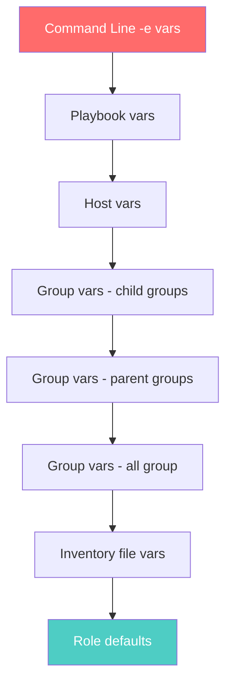

# How to Use Ansible Inventory for CI/CD Environment Separation

Author: [nawazdhandala](https://www.github.com/nawazdhandala)

Tags: Ansible, Inventory, CI/CD, Environment Management

Description: Use Ansible inventory strategies to cleanly separate development, staging, and production environments in your CI/CD pipelines.

---

When you run Ansible in CI/CD, the inventory file determines where your code lands. If your inventory is a mess, you risk deploying to the wrong environment. I have seen teams accidentally push staging configs to production because their inventory structure was unclear. The fix is straightforward: use Ansible's inventory features properly to create hard boundaries between environments.

This post covers static inventory separation, dynamic inventories, inventory plugins, and how to enforce environment safety in your CI/CD pipeline.

## Static Inventory Separation

The simplest approach is one inventory directory per environment.

```
inventories/
  dev/
    hosts.yml
    group_vars/
      all.yml
      webservers.yml
  staging/
    hosts.yml
    group_vars/
      all.yml
      webservers.yml
  production/
    hosts.yml
    group_vars/
      all.yml
      webservers.yml
```

Each directory is self-contained with its own host definitions and variables.

```yaml
# inventories/dev/hosts.yml
# Development environment - local VMs or cloud dev instances
all:
  vars:
    env_name: development
    env_short: dev
  children:
    webservers:
      hosts:
        dev-web-01:
          ansible_host: 192.168.56.10
    databases:
      hosts:
        dev-db-01:
          ansible_host: 192.168.56.20
```

```yaml
# inventories/staging/hosts.yml
# Staging environment - mirrors production topology at smaller scale
all:
  vars:
    env_name: staging
    env_short: stg
  children:
    webservers:
      hosts:
        stg-web-01:
          ansible_host: 10.1.1.10
        stg-web-02:
          ansible_host: 10.1.1.11
    databases:
      hosts:
        stg-db-01:
          ansible_host: 10.1.2.10
```

```yaml
# inventories/production/hosts.yml
# Production environment - full fleet with HA configuration
all:
  vars:
    env_name: production
    env_short: prod
  children:
    webservers:
      hosts:
        prod-web-01:
          ansible_host: 10.2.1.10
        prod-web-02:
          ansible_host: 10.2.1.11
        prod-web-03:
          ansible_host: 10.2.1.12
        prod-web-04:
          ansible_host: 10.2.1.13
    databases:
      hosts:
        prod-db-01:
          ansible_host: 10.2.2.10
        prod-db-02:
          ansible_host: 10.2.2.11
```

## Dynamic Inventory for Cloud Environments

If your infrastructure lives in AWS, GCP, or Azure, static inventory files get stale fast. Dynamic inventory plugins query your cloud provider in real time.

```yaml
# inventories/production/aws_ec2.yml
# AWS dynamic inventory plugin - discovers instances by tags
plugin: amazon.aws.aws_ec2
regions:
  - us-east-1
  - us-west-2
filters:
  "tag:Environment":
    - production
keyed_groups:
  - key: tags.Role
    prefix: ""
    separator: ""
  - key: placement.region
    prefix: region
compose:
  ansible_host: private_ip_address
hostnames:
  - tag:Name
  - private-ip-address
```

```yaml
# inventories/staging/aws_ec2.yml
# Same plugin, different tag filter for staging
plugin: amazon.aws.aws_ec2
regions:
  - us-east-1
filters:
  "tag:Environment":
    - staging
keyed_groups:
  - key: tags.Role
    prefix: ""
    separator: ""
compose:
  ansible_host: private_ip_address
```

Install the required collection.

```bash
# Install AWS collection for dynamic inventory
ansible-galaxy collection install amazon.aws
pip install boto3 botocore
```

## Using Inventory Variables for Environment-Specific Behavior

Group variables let you change behavior without touching playbooks.

```yaml
# inventories/dev/group_vars/all.yml
# Development settings - verbose logging, no HA, relaxed security
---
env_name: development
deploy_strategy: all-at-once
log_level: debug
enable_ssl: false
backup_enabled: false
monitoring_enabled: false
db_pool_size: 5
app_replicas: 1
```

```yaml
# inventories/production/group_vars/all.yml
# Production settings - minimal logging, full HA, strict security
---
env_name: production
deploy_strategy: rolling
log_level: warning
enable_ssl: true
backup_enabled: true
monitoring_enabled: true
db_pool_size: 20
app_replicas: 4
```

Your playbook reads these variables and adjusts.

```yaml
# playbooks/deploy.yml
# Deployment playbook that adapts behavior based on inventory variables
---
- name: Deploy to {{ env_name }}
  hosts: webservers
  serial: "{{ '2' if deploy_strategy == 'rolling' else '100%' }}"
  become: true

  tasks:
    - name: Deploy application
      include_role:
        name: app_deploy

    - name: Configure SSL
      include_role:
        name: ssl_setup
      when: enable_ssl | bool

    - name: Setup monitoring agent
      include_role:
        name: monitoring
      when: monitoring_enabled | bool

    - name: Configure backups
      include_role:
        name: backup
      when: backup_enabled | bool
```

## CI/CD Pipeline with Environment Separation

Here is a GitLab CI configuration that uses different inventories for different pipeline stages.

```yaml
# .gitlab-ci.yml
# Pipeline stages map to inventory environments
stages:
  - test
  - deploy-staging
  - deploy-production

variables:
  ANSIBLE_CONFIG: ./ansible.cfg

deploy_staging:
  stage: deploy-staging
  image: python:3.11-slim
  before_script:
    - pip install ansible boto3
    - ansible-galaxy collection install amazon.aws
  script:
    - ansible-playbook playbooks/deploy.yml
        -i inventories/staging/
        -e "deploy_version=${CI_COMMIT_TAG}"
  only:
    - tags
  environment:
    name: staging

deploy_production:
  stage: deploy-production
  image: python:3.11-slim
  before_script:
    - pip install ansible boto3
    - ansible-galaxy collection install amazon.aws
  script:
    - ansible-playbook playbooks/deploy.yml
        -i inventories/production/
        -e "deploy_version=${CI_COMMIT_TAG}"
  only:
    - tags
  when: manual
  environment:
    name: production
```

## Safety Guards: Preventing Accidental Cross-Environment Deployments

Add a pre-task that verifies the environment matches expectations.

```yaml
# playbooks/deploy.yml
# Safety check to prevent deploying to wrong environment
---
- name: Environment safety check
  hosts: all
  gather_facts: false
  tasks:
    - name: Verify target environment
      assert:
        that:
          - env_name is defined
          - env_name in ['development', 'staging', 'production']
        fail_msg: "Environment '{{ env_name | default('undefined') }}' is not valid"
      run_once: true

    - name: Require confirmation for production
      pause:
        prompt: "You are deploying to PRODUCTION. Type 'yes' to continue"
      register: confirm
      when: env_name == 'production' and not (auto_confirm | default(false) | bool)
      run_once: true

    - name: Check confirmation
      fail:
        msg: "Production deployment not confirmed"
      when:
        - env_name == 'production'
        - not (auto_confirm | default(false) | bool)
        - confirm.user_input != 'yes'
      run_once: true
```

In CI/CD, you pass `auto_confirm=true` because the approval gate is handled by the CI/CD platform itself.

## Inventory Variables Precedence

Understanding variable precedence is crucial when working with multiple environments. Here is the order Ansible resolves variables.



Command line variables (`-e`) have the highest precedence, and role defaults have the lowest. This means you can always override an inventory variable from your CI/CD command.

## Multi-Cloud Inventory

If you run infrastructure across multiple clouds, you can combine dynamic inventory sources.

```yaml
# inventories/production/combined.yml
# Combine AWS and GCP inventory sources
plugin: constructed
strict: false
groups:
  cloud_aws: "'aws' in group_names"
  cloud_gcp: "'gcp' in group_names"
```

Create separate inventory files for each cloud in the same directory.

```bash
# Ansible will load all inventory files in the directory
inventories/production/
  aws_ec2.yml    # AWS dynamic inventory
  gcp_compute.yml  # GCP dynamic inventory
  group_vars/
    all.yml
```

## Testing Inventory Configuration

Before running deployments, verify your inventory is resolving correctly.

```bash
# List all hosts in the staging inventory
ansible-inventory -i inventories/staging/ --list

# Show the variables for a specific host
ansible-inventory -i inventories/production/ --host prod-web-01

# Graph the inventory groups
ansible-inventory -i inventories/production/ --graph
```

These commands are useful in CI/CD as a pre-deployment validation step to make sure the inventory is not empty or misconfigured.

## Conclusion

Clean inventory separation is the foundation of reliable multi-environment deployments. Whether you use static files or dynamic plugins, the pattern is the same: one inventory directory per environment, with environment-specific variables that drive playbook behavior. Add safety guards to prevent cross-environment mistakes, and use your CI/CD platform's environment gates for production approvals. The result is a deployment pipeline where switching environments is just a flag change, and accidental production deployments become nearly impossible.
