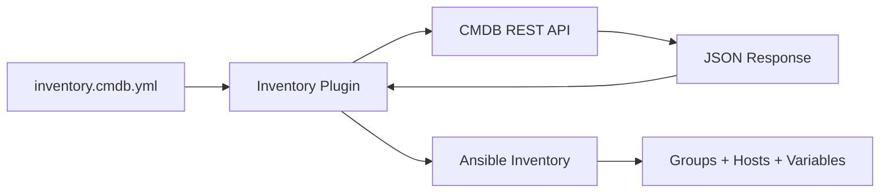

# How to Create an Inventory Plugin for Custom CMDB

Author: [nawazdhandala](https://www.github.com/nawazdhandala)

Tags: Ansible, Plugins, Inventory, CMDB, Dynamic Inventory

Description: Build a custom Ansible inventory plugin that pulls hosts and groups from your organization's CMDB or asset management system.

---

Most organizations maintain a Configuration Management Database (CMDB) or asset management system that tracks servers, their roles, locations, and ownership. Instead of manually keeping Ansible inventory files in sync with your CMDB, you can write an inventory plugin that queries the CMDB directly. This ensures your Ansible inventory is always up to date.

This guide builds a complete inventory plugin that fetches hosts from a REST API-based CMDB system.

## Plugin Architecture

The inventory plugin reads a YAML source file for connection settings, queries the CMDB API, and populates Ansible's inventory with hosts, groups, and variables.



## The Inventory Source File

Users create a YAML file that tells Ansible which plugin to use and how to connect:

```yaml
# inventory.cmdb.yml
plugin: myorg.myutils.cmdb_inventory
api_url: https://cmdb.internal.myorg.com/api/v2
api_token: "{{ lookup('env', 'CMDB_API_TOKEN') }}"
environment: production
group_by:
  - datacenter
  - role
  - os_family
compose:
  ansible_host: ip_address
  ansible_user: "'admin'"
keyed_groups:
  - key: datacenter
    prefix: dc
  - key: os_family
    prefix: os
```

## The Inventory Plugin

Create `plugins/inventory/cmdb_inventory.py`:

```python
# cmdb_inventory.py - Inventory plugin for a custom CMDB
from __future__ import absolute_import, division, print_function
__metaclass__ = type

DOCUMENTATION = """
    name: cmdb_inventory
    plugin_type: inventory
    short_description: CMDB dynamic inventory
    description:
        - Fetches hosts from a REST API-based CMDB system.
        - Supports grouping by any host attribute.
        - Supports compose, keyed_groups, and groups from Constructable.
    extends_documentation_fragment:
        - inventory_cache
        - constructed
    options:
      plugin:
        description: Must be myorg.myutils.cmdb_inventory
        required: true
        choices: ['myorg.myutils.cmdb_inventory']
      api_url:
        description: Base URL of the CMDB API.
        type: str
        required: true
        env:
          - name: CMDB_API_URL
      api_token:
        description: Authentication token for the CMDB API.
        type: str
        required: true
        env:
          - name: CMDB_API_TOKEN
      environment:
        description: Filter hosts by environment (e.g., production, staging).
        type: str
        default: ''
      group_by:
        description: List of host attributes to create groups from.
        type: list
        elements: str
        default: []
      hostname_field:
        description: CMDB field to use as the Ansible inventory hostname.
        type: str
        default: hostname
      verify_ssl:
        description: Whether to verify SSL certificates.
        type: bool
        default: true
"""

EXAMPLES = """
# inventory.cmdb.yml
plugin: myorg.myutils.cmdb_inventory
api_url: https://cmdb.example.com/api/v2
api_token: "{{ lookup('env', 'CMDB_TOKEN') }}"
environment: production
group_by:
  - datacenter
  - role
compose:
  ansible_host: ip_address
"""

import json
from ansible.plugins.inventory import BaseInventoryPlugin, Constructable, Cacheable
from ansible.errors import AnsibleParserError
from ansible.module_utils.urls import open_url


class InventoryModule(BaseInventoryPlugin, Constructable, Cacheable):
    NAME = 'myorg.myutils.cmdb_inventory'

    def verify_file(self, path):
        """Check if the inventory source file is valid for this plugin."""
        valid = False
        if super(InventoryModule, self).verify_file(path):
            if path.endswith(('.cmdb.yml', '.cmdb.yaml')):
                valid = True
        return valid

    def parse(self, inventory, loader, path, cache=True):
        """Parse the inventory source and populate the inventory."""
        super(InventoryModule, self).parse(inventory, loader, path, cache)

        # Read configuration from the YAML source file
        self._read_config_data(path)

        # Check cache first
        cache_key = self.get_cache_key(path)
        use_cache = self.get_option('cache') and cache
        update_cache = False

        hosts_data = None

        if use_cache:
            try:
                hosts_data = self._cache[cache_key]
                self.display.vv("cmdb_inventory: using cached data")
            except KeyError:
                update_cache = True

        if hosts_data is None:
            hosts_data = self._fetch_hosts()

        if update_cache:
            self._cache[cache_key] = hosts_data

        self._populate(hosts_data)

    def _fetch_hosts(self):
        """Fetch host data from the CMDB API."""
        api_url = self.get_option('api_url')
        api_token = self.get_option('api_token')
        environment = self.get_option('environment')
        verify_ssl = self.get_option('verify_ssl')

        if not api_url:
            raise AnsibleParserError("api_url is required")

        # Build the API URL with filters
        url = '%s/hosts' % api_url.rstrip('/')
        params = []
        if environment:
            params.append('environment=%s' % environment)
        if params:
            url += '?' + '&'.join(params)

        self.display.vv("cmdb_inventory: fetching from %s" % url)

        headers = {
            'Authorization': 'Bearer %s' % api_token,
            'Accept': 'application/json',
        }

        try:
            response = open_url(
                url,
                headers=headers,
                validate_certs=verify_ssl,
                timeout=30,
            )
            data = json.loads(response.read())
        except Exception as e:
            raise AnsibleParserError(
                "Failed to fetch hosts from CMDB at %s: %s" % (url, str(e))
            )

        # Handle paginated responses
        hosts = data.get('results', data.get('hosts', data))
        if not isinstance(hosts, list):
            raise AnsibleParserError(
                "Unexpected CMDB response format. Expected a list of hosts."
            )

        self.display.vv("cmdb_inventory: fetched %d hosts" % len(hosts))
        return hosts

    def _populate(self, hosts_data):
        """Populate the inventory with hosts and groups."""
        hostname_field = self.get_option('hostname_field')
        group_by_fields = self.get_option('group_by')

        for host_data in hosts_data:
            hostname = host_data.get(hostname_field)
            if not hostname:
                self.display.warning(
                    "cmdb_inventory: skipping host without '%s' field: %s"
                    % (hostname_field, host_data)
                )
                continue

            # Add the host to the inventory
            self.inventory.add_host(hostname)

            # Set all CMDB attributes as host variables
            for key, value in host_data.items():
                self.inventory.set_variable(hostname, key, value)

            # Create groups based on host attributes
            for field in group_by_fields:
                group_value = host_data.get(field)
                if group_value:
                    # Sanitize the group name
                    group_name = self._sanitize_group_name(
                        '%s_%s' % (field, group_value)
                    )
                    self.inventory.add_group(group_name)
                    self.inventory.add_host(hostname, group=group_name)

            # Support Constructable features (compose, keyed_groups, groups)
            strict = self.get_option('strict')
            self._set_composite_vars(
                self.get_option('compose'), host_data, hostname, strict=strict
            )
            self._add_host_to_composed_groups(
                self.get_option('groups'), host_data, hostname, strict=strict
            )
            self._add_host_to_keyed_groups(
                self.get_option('keyed_groups'), host_data, hostname, strict=strict
            )

    @staticmethod
    def _sanitize_group_name(name):
        """Convert a string to a valid Ansible group name."""
        import re
        # Replace non-alphanumeric chars with underscores
        name = re.sub(r'[^a-zA-Z0-9_]', '_', name)
        # Remove leading numbers
        name = re.sub(r'^[0-9]+', '', name)
        return name.lower()
```

## Example CMDB API Response

The plugin expects the CMDB to return JSON like this:

```json
{
  "results": [
    {
      "hostname": "web-prod-01",
      "ip_address": "10.1.1.10",
      "datacenter": "us-east-1",
      "role": "webserver",
      "os_family": "RedHat",
      "environment": "production",
      "cpu_cores": 4,
      "memory_gb": 16
    },
    {
      "hostname": "db-prod-01",
      "ip_address": "10.1.2.20",
      "datacenter": "us-east-1",
      "role": "database",
      "os_family": "RedHat",
      "environment": "production",
      "cpu_cores": 8,
      "memory_gb": 64
    }
  ]
}
```

## Using the Inventory

Run a playbook with the CMDB inventory:

```bash
# List all hosts from the CMDB
ansible-inventory -i inventory.cmdb.yml --list

# View the host graph
ansible-inventory -i inventory.cmdb.yml --graph

# Run a playbook
ansible-playbook -i inventory.cmdb.yml deploy.yml
```

Use the dynamic groups in playbooks:

```yaml
---
- name: Deploy web application
  hosts: role_webserver
  become: true
  tasks:
    - name: Deploy latest code
      ansible.builtin.git:
        repo: https://github.com/myorg/webapp.git
        dest: /opt/webapp

- name: Update database servers
  hosts: role_database
  become: true
  tasks:
    - name: Run database migrations
      ansible.builtin.command: /opt/webapp/manage.py migrate
```

## Enabling Caching

Add cache settings to your inventory source:

```yaml
# inventory.cmdb.yml
plugin: myorg.myutils.cmdb_inventory
api_url: https://cmdb.internal.myorg.com/api/v2
api_token: "{{ lookup('env', 'CMDB_TOKEN') }}"
cache: true
cache_plugin: jsonfile
cache_connection: /tmp/ansible_cmdb_cache
cache_timeout: 3600
```

## Summary

A CMDB inventory plugin eliminates the need to maintain static inventory files. It queries your CMDB API at runtime and creates hosts, groups, and variables dynamically. The `Constructable` mixin gives you `compose`, `keyed_groups`, and `groups` features for free, and the `Cacheable` mixin adds caching to avoid hitting the API on every run. This pattern works for any asset management system, service catalog, or infrastructure database that has a REST API.
