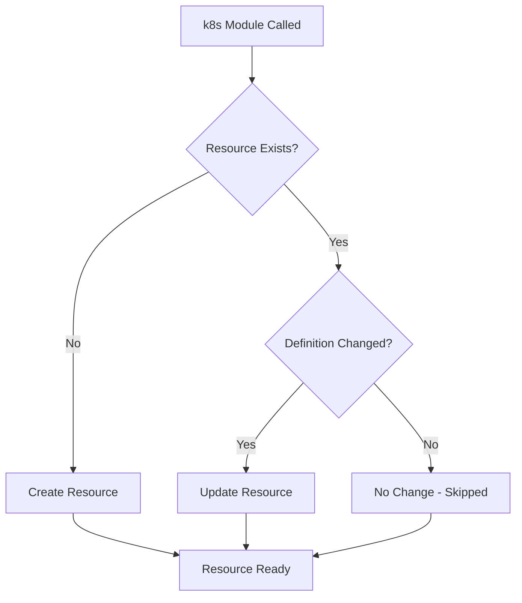

# How to Use the Ansible k8s Module to Create Resources

Author: [nawazdhandala](https://www.github.com/nawazdhandala)

Tags: Ansible, Kubernetes, k8s Module, Resources, Automation

Description: Create any Kubernetes resource using the Ansible k8s module with inline definitions, YAML files, and Jinja2 templates.

---

The `k8s` module from the `kubernetes.core` collection is the Swiss Army knife of Kubernetes automation in Ansible. It can create, update, patch, and delete any Kubernetes resource type. Whether you need to create a simple ConfigMap or a complex CustomResource, the same module handles it. This post focuses specifically on resource creation patterns, with working examples for common resource types.

## How the k8s Module Creates Resources

When you set `state: present`, the k8s module checks if the resource already exists. If it does not, the module creates it. If it does exist, the module updates it to match your definition. This makes the module idempotent, so you can run the same playbook multiple times without creating duplicate resources.



## Creating Resources with Inline Definitions

The most direct approach puts the Kubernetes YAML right in the task:

```yaml
# create_inline.yml - Create resources with inline definitions
---
- name: Create Kubernetes Resources Inline
  hosts: localhost
  connection: local
  vars:
    namespace: myapp

  tasks:
    - name: Create namespace
      kubernetes.core.k8s:
        state: present
        definition:
          apiVersion: v1
          kind: Namespace
          metadata:
            name: "{{ namespace }}"
            labels:
              managed-by: ansible

    - name: Create a ConfigMap
      kubernetes.core.k8s:
        state: present
        definition:
          apiVersion: v1
          kind: ConfigMap
          metadata:
            name: app-settings
            namespace: "{{ namespace }}"
          data:
            database.host: "postgres.{{ namespace }}.svc.cluster.local"
            database.port: "5432"
            cache.host: "redis.{{ namespace }}.svc.cluster.local"
            log.level: "info"

    - name: Create a Secret
      kubernetes.core.k8s:
        state: present
        definition:
          apiVersion: v1
          kind: Secret
          metadata:
            name: app-credentials
            namespace: "{{ namespace }}"
          type: Opaque
          stringData:
            db-password: "{{ vault_db_password }}"
            api-key: "{{ vault_api_key }}"
```

## Creating Resources from YAML Files

For larger manifests, keep them as separate files:

```yaml
# create_from_files.yml - Create resources from YAML files
---
- name: Create Resources from Files
  hosts: localhost
  connection: local

  tasks:
    - name: Apply a single manifest
      kubernetes.core.k8s:
        state: present
        src: manifests/service-account.yaml

    - name: Apply multiple manifests from a directory
      kubernetes.core.k8s:
        state: present
        src: "{{ item }}"
      with_fileglob:
        - "manifests/base/*.yaml"

    - name: Apply manifests in a specific order
      kubernetes.core.k8s:
        state: present
        src: "{{ item }}"
      loop:
        - manifests/namespace.yaml
        - manifests/rbac.yaml
        - manifests/configmap.yaml
        - manifests/deployment.yaml
        - manifests/service.yaml
```

## Creating Resources from Templates

Templates are the most powerful approach because they combine Kubernetes manifests with Ansible variables:

```yaml
# create_from_templates.yml - Create resources using Jinja2 templates
---
- name: Create Resources from Templates
  hosts: localhost
  connection: local
  vars:
    app_name: webapp
    namespace: production
    app_version: "2.1.0"
    replicas: 3
    registry: registry.example.com

  tasks:
    - name: Create deployment from template
      kubernetes.core.k8s:
        state: present
        template: templates/deployment.yaml.j2
```

Here is the template file:

```yaml
# templates/deployment.yaml.j2
apiVersion: apps/v1
kind: Deployment
metadata:
  name: {{ app_name }}
  namespace: {{ namespace }}
  labels:
    app: {{ app_name }}
    version: {{ app_version }}
spec:
  replicas: {{ replicas }}
  selector:
    matchLabels:
      app: {{ app_name }}
  template:
    metadata:
      labels:
        app: {{ app_name }}
        version: {{ app_version }}
    spec:
      containers:
        - name: {{ app_name }}
          image: {{ registry }}/{{ app_name }}:{{ app_version }}
          ports:
            - containerPort: 8080
              name: http
          env:
            - name: APP_VERSION
              value: "{{ app_version }}"
          envFrom:
            - configMapRef:
                name: {{ app_name }}-config
            - secretRef:
                name: {{ app_name }}-secrets
          resources:
            requests:
              cpu: 250m
              memory: 256Mi
            limits:
              cpu: 500m
              memory: 512Mi
          readinessProbe:
            httpGet:
              path: /health
              port: 8080
            initialDelaySeconds: 10
            periodSeconds: 5
          livenessProbe:
            httpGet:
              path: /health
              port: 8080
            initialDelaySeconds: 30
            periodSeconds: 10
```

## Creating Services

Expose your deployments with Services:

```yaml
    - name: Create ClusterIP Service
      kubernetes.core.k8s:
        state: present
        definition:
          apiVersion: v1
          kind: Service
          metadata:
            name: webapp
            namespace: "{{ namespace }}"
          spec:
            type: ClusterIP
            selector:
              app: webapp
            ports:
              - port: 80
                targetPort: 8080
                protocol: TCP

    - name: Create LoadBalancer Service
      kubernetes.core.k8s:
        state: present
        definition:
          apiVersion: v1
          kind: Service
          metadata:
            name: webapp-public
            namespace: "{{ namespace }}"
            annotations:
              service.beta.kubernetes.io/aws-load-balancer-type: nlb
          spec:
            type: LoadBalancer
            selector:
              app: webapp
            ports:
              - port: 443
                targetPort: 8080
                protocol: TCP

    - name: Create NodePort Service
      kubernetes.core.k8s:
        state: present
        definition:
          apiVersion: v1
          kind: Service
          metadata:
            name: webapp-nodeport
            namespace: "{{ namespace }}"
          spec:
            type: NodePort
            selector:
              app: webapp
            ports:
              - port: 80
                targetPort: 8080
                nodePort: 30080
```

## Creating RBAC Resources

Set up role-based access control:

```yaml
# create_rbac.yml - Create RBAC resources
---
- name: Create RBAC Resources
  hosts: localhost
  connection: local

  tasks:
    - name: Create ServiceAccount
      kubernetes.core.k8s:
        state: present
        definition:
          apiVersion: v1
          kind: ServiceAccount
          metadata:
            name: app-service-account
            namespace: myapp

    - name: Create Role
      kubernetes.core.k8s:
        state: present
        definition:
          apiVersion: rbac.authorization.k8s.io/v1
          kind: Role
          metadata:
            name: app-role
            namespace: myapp
          rules:
            - apiGroups: [""]
              resources: ["pods", "services", "configmaps"]
              verbs: ["get", "list", "watch"]
            - apiGroups: ["apps"]
              resources: ["deployments"]
              verbs: ["get", "list", "watch", "update"]

    - name: Create RoleBinding
      kubernetes.core.k8s:
        state: present
        definition:
          apiVersion: rbac.authorization.k8s.io/v1
          kind: RoleBinding
          metadata:
            name: app-role-binding
            namespace: myapp
          subjects:
            - kind: ServiceAccount
              name: app-service-account
              namespace: myapp
          roleRef:
            kind: Role
            name: app-role
            apiGroup: rbac.authorization.k8s.io
```

## Creating Ingress Resources

Expose services externally with Ingress:

```yaml
    - name: Create Ingress
      kubernetes.core.k8s:
        state: present
        definition:
          apiVersion: networking.k8s.io/v1
          kind: Ingress
          metadata:
            name: webapp-ingress
            namespace: myapp
            annotations:
              nginx.ingress.kubernetes.io/rewrite-target: /
              cert-manager.io/cluster-issuer: letsencrypt-prod
          spec:
            ingressClassName: nginx
            tls:
              - hosts:
                  - app.example.com
                secretName: webapp-tls
            rules:
              - host: app.example.com
                http:
                  paths:
                    - path: /
                      pathType: Prefix
                      backend:
                        service:
                          name: webapp
                          port:
                            number: 80
                    - path: /api
                      pathType: Prefix
                      backend:
                        service:
                          name: api
                          port:
                            number: 80
```

## Creating PersistentVolumeClaims

Request storage for stateful workloads:

```yaml
    - name: Create PersistentVolumeClaim
      kubernetes.core.k8s:
        state: present
        definition:
          apiVersion: v1
          kind: PersistentVolumeClaim
          metadata:
            name: postgres-data
            namespace: myapp
          spec:
            accessModes:
              - ReadWriteOnce
            resources:
              requests:
                storage: 50Gi
            storageClassName: gp3
```

## Waiting for Resources to be Ready

The `wait` parameter ensures the resource is actually running before the task completes:

```yaml
    - name: Create deployment and wait until ready
      kubernetes.core.k8s:
        state: present
        definition:
          apiVersion: apps/v1
          kind: Deployment
          metadata:
            name: api-server
            namespace: myapp
          spec:
            replicas: 3
            selector:
              matchLabels:
                app: api-server
            template:
              metadata:
                labels:
                  app: api-server
              spec:
                containers:
                  - name: api
                    image: registry.example.com/api:latest
                    ports:
                      - containerPort: 3000
        wait: true
        wait_timeout: 300
        wait_condition:
          type: Available
          status: "True"
      register: deploy_result

    - name: Report deployment status
      ansible.builtin.debug:
        msg: "Deployment ready with {{ deploy_result.result.status.readyReplicas }} replicas"
```

## Force Replacing Resources

Some resources cannot be updated in place. Use `force: true` to delete and recreate them:

```yaml
    - name: Force replace a Job (Jobs are immutable)
      kubernetes.core.k8s:
        state: present
        force: true
        definition:
          apiVersion: batch/v1
          kind: Job
          metadata:
            name: db-migration
            namespace: myapp
          spec:
            template:
              spec:
                containers:
                  - name: migrate
                    image: registry.example.com/api:latest
                    command: ["python", "manage.py", "migrate"]
                restartPolicy: Never
            backoffLimit: 3
```

## Creating Multiple Related Resources

Deploy a complete application stack in a single play:

```yaml
# full_stack.yml - Create all resources for an application
---
- name: Deploy Full Application Stack
  hosts: localhost
  connection: local
  vars:
    app_name: myapp
    namespace: production

  tasks:
    - name: Create all base resources
      kubernetes.core.k8s:
        state: present
        definition: "{{ item }}"
      loop:
        - apiVersion: v1
          kind: Namespace
          metadata:
            name: "{{ namespace }}"
        - apiVersion: v1
          kind: ConfigMap
          metadata:
            name: "{{ app_name }}-config"
            namespace: "{{ namespace }}"
          data:
            APP_NAME: "{{ app_name }}"
        - apiVersion: v1
          kind: Service
          metadata:
            name: "{{ app_name }}"
            namespace: "{{ namespace }}"
          spec:
            selector:
              app: "{{ app_name }}"
            ports:
              - port: 80
                targetPort: 8080
```

## Summary

The `k8s` module provides a single, consistent interface for creating any Kubernetes resource type. Whether you use inline YAML definitions for quick tasks, separate files for complex manifests, or Jinja2 templates for parameterized deployments, the module handles idempotent creation and updates. Use the `wait` parameter to block until resources are ready, `force` for immutable resources that need replacement, and template files to keep your Kubernetes manifests DRY across environments. The module is the building block for every Kubernetes automation task in Ansible.
