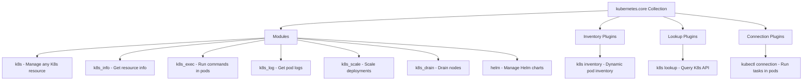

# How to Use the kubernetes.core Collection in Ansible

Author: [nawazdhandala](https://www.github.com/nawazdhandala)

Tags: Ansible, Kubernetes, Collection, Automation, DevOps

Description: Get started with the kubernetes.core Ansible collection for managing Kubernetes clusters with dedicated modules and plugins.

---

The `kubernetes.core` collection is the official Ansible collection for managing Kubernetes resources. It provides modules for creating, updating, and deleting any Kubernetes resource, along with inventory plugins, lookup plugins, and connection plugins. If you are managing Kubernetes with Ansible, this collection is the foundation everything else builds on.

## What is in the Collection?

The `kubernetes.core` collection includes several modules and plugins:



## Installation

Install the collection and its Python dependencies:

```bash
# Install the kubernetes.core collection
ansible-galaxy collection install kubernetes.core

# Install required Python libraries
pip install kubernetes openshift PyYAML
```

The `kubernetes` Python library is required for all modules. The `openshift` library adds extra capabilities like applying strategic merge patches.

## Authentication Setup

Before using any module, you need to configure how Ansible authenticates to your Kubernetes cluster. There are several options.

### Using kubeconfig (Default)

If you have a kubeconfig file set up, the modules use it automatically:

```yaml
# uses_kubeconfig.yml - Relies on default kubeconfig
---
- name: Use Default Kubeconfig
  hosts: localhost
  connection: local

  tasks:
    - name: Get cluster info
      kubernetes.core.k8s_cluster_info:
      register: cluster_info

    - name: Display cluster version
      ansible.builtin.debug:
        msg: "Cluster version: {{ cluster_info.version.server.gitVersion }}"
```

### Specifying kubeconfig Path

Point to a specific kubeconfig file:

```yaml
    - name: Use specific kubeconfig
      kubernetes.core.k8s:
        kubeconfig: /path/to/my/kubeconfig
        state: present
        definition:
          apiVersion: v1
          kind: Namespace
          metadata:
            name: test
```

### Using In-Task Authentication

Pass credentials directly in the task:

```yaml
    - name: Authenticate with token
      kubernetes.core.k8s:
        host: "https://k8s-api.example.com:6443"
        api_key: "{{ vault_k8s_token }}"
        validate_certs: true
        ca_cert: /path/to/ca.crt
        state: present
        definition:
          apiVersion: v1
          kind: Namespace
          metadata:
            name: test
```

### Using Environment Variables

Set authentication via environment variables in your playbook:

```yaml
- name: Use Environment Variables
  hosts: localhost
  environment:
    K8S_AUTH_HOST: "https://k8s-api.example.com:6443"
    K8S_AUTH_API_KEY: "{{ vault_k8s_token }}"
    K8S_AUTH_VERIFY_SSL: "true"
```

## The k8s Module

The `k8s` module is the workhorse of the collection. It can create, update, and delete any Kubernetes resource:

```yaml
# k8s_basics.yml - Basic k8s module usage
---
- name: Basic k8s Module Examples
  hosts: localhost
  connection: local

  tasks:
    - name: Create a namespace
      kubernetes.core.k8s:
        state: present
        definition:
          apiVersion: v1
          kind: Namespace
          metadata:
            name: myapp
            labels:
              environment: production

    - name: Create a ConfigMap
      kubernetes.core.k8s:
        state: present
        definition:
          apiVersion: v1
          kind: ConfigMap
          metadata:
            name: app-config
            namespace: myapp
          data:
            APP_ENV: "production"
            LOG_LEVEL: "info"
            MAX_CONNECTIONS: "100"

    - name: Create a Secret
      kubernetes.core.k8s:
        state: present
        definition:
          apiVersion: v1
          kind: Secret
          metadata:
            name: app-secrets
            namespace: myapp
          type: Opaque
          stringData:
            DATABASE_PASSWORD: "{{ vault_db_password }}"
            API_KEY: "{{ vault_api_key }}"
```

## Applying YAML Files

Instead of inline definitions, you can apply YAML files from the filesystem:

```yaml
    - name: Apply a manifest file
      kubernetes.core.k8s:
        state: present
        src: manifests/deployment.yaml

    - name: Apply all manifests in a directory
      kubernetes.core.k8s:
        state: present
        src: "{{ item }}"
      with_fileglob:
        - manifests/*.yaml
```

## Using Templates

Combine Ansible's Jinja2 templating with Kubernetes manifests:

```yaml
    - name: Apply templated manifest
      kubernetes.core.k8s:
        state: present
        template: templates/deployment.yaml.j2
        wait: true
        wait_timeout: 300
```

The template file uses Jinja2 syntax:

```yaml
# templates/deployment.yaml.j2
apiVersion: apps/v1
kind: Deployment
metadata:
  name: {{ app_name }}
  namespace: {{ namespace }}
spec:
  replicas: {{ replicas }}
  selector:
    matchLabels:
      app: {{ app_name }}
  template:
    metadata:
      labels:
        app: {{ app_name }}
        version: {{ app_version }}
    spec:
      containers:
        - name: {{ app_name }}
          image: {{ registry }}/{{ app_name }}:{{ app_version }}
          ports:
            - containerPort: {{ app_port }}
          resources:
            requests:
              cpu: {{ cpu_request }}
              memory: {{ memory_request }}
            limits:
              cpu: {{ cpu_limit }}
              memory: {{ memory_limit }}
```

## The k8s_info Module

Query Kubernetes for information about existing resources:

```yaml
# k8s_info_examples.yml - Query Kubernetes resources
---
- name: Query Kubernetes Resources
  hosts: localhost
  connection: local

  tasks:
    - name: Get all pods in a namespace
      kubernetes.core.k8s_info:
        kind: Pod
        namespace: myapp
      register: pods

    - name: Display pod names and status
      ansible.builtin.debug:
        msg: "{{ item.metadata.name }}: {{ item.status.phase }}"
      loop: "{{ pods.resources }}"
      loop_control:
        label: "{{ item.metadata.name }}"

    - name: Get specific deployment
      kubernetes.core.k8s_info:
        kind: Deployment
        namespace: myapp
        name: webapp
      register: deployment

    - name: Check deployment replicas
      ansible.builtin.debug:
        msg: "Ready: {{ deployment.resources[0].status.readyReplicas | default(0) }}/{{ deployment.resources[0].spec.replicas }}"

    - name: Find pods with specific labels
      kubernetes.core.k8s_info:
        kind: Pod
        namespace: myapp
        label_selectors:
          - app=webapp
          - tier=frontend
      register: labeled_pods

    - name: Get nodes with conditions
      kubernetes.core.k8s_info:
        kind: Node
      register: nodes

    - name: Report node status
      ansible.builtin.debug:
        msg: "{{ item.metadata.name }}: {{ item.status.conditions | selectattr('type', 'equalto', 'Ready') | map(attribute='status') | first }}"
      loop: "{{ nodes.resources }}"
      loop_control:
        label: "{{ item.metadata.name }}"
```

## Executing Commands in Pods

Run commands inside running pods:

```yaml
# k8s_exec_examples.yml - Execute commands in pods
---
- name: Execute Commands in Pods
  hosts: localhost
  connection: local

  tasks:
    - name: Run a command in a pod
      kubernetes.core.k8s_exec:
        namespace: myapp
        pod: webapp-abc123
        command: /app/healthcheck.sh
      register: exec_result

    - name: Display output
      ansible.builtin.debug:
        msg: "{{ exec_result.stdout }}"

    - name: Run database migration
      kubernetes.core.k8s_exec:
        namespace: myapp
        pod: "{{ (pods.resources | first).metadata.name }}"
        container: app  # Specify container in multi-container pods
        command: python manage.py migrate
      register: migration_result
```

## Getting Pod Logs

Retrieve logs from containers:

```yaml
    - name: Get pod logs
      kubernetes.core.k8s_log:
        namespace: myapp
        name: webapp-abc123
        container: app
      register: pod_logs

    - name: Get logs from the last hour
      kubernetes.core.k8s_log:
        namespace: myapp
        name: webapp-abc123
        since_seconds: 3600
      register: recent_logs
```

## Scaling Resources

Scale deployments up or down:

```yaml
    - name: Scale deployment to 5 replicas
      kubernetes.core.k8s_scale:
        kind: Deployment
        namespace: myapp
        name: webapp
        replicas: 5
        wait: true
        wait_timeout: 120
```

## Waiting for Resource State

The `wait` parameter blocks until a resource reaches the desired state:

```yaml
    - name: Create deployment and wait for it to be ready
      kubernetes.core.k8s:
        state: present
        definition:
          apiVersion: apps/v1
          kind: Deployment
          metadata:
            name: webapp
            namespace: myapp
          spec:
            replicas: 3
            selector:
              matchLabels:
                app: webapp
            template:
              metadata:
                labels:
                  app: webapp
              spec:
                containers:
                  - name: webapp
                    image: myapp:latest
                    ports:
                      - containerPort: 8080
        wait: true
        wait_timeout: 300
        wait_condition:
          type: Available
          status: "True"
```

## Helm Chart Management

The collection includes a `helm` module:

```yaml
    - name: Add Helm repository
      kubernetes.core.helm_repository:
        name: bitnami
        repo_url: https://charts.bitnami.com/bitnami

    - name: Install a Helm chart
      kubernetes.core.helm:
        name: redis
        chart_ref: bitnami/redis
        release_namespace: myapp
        create_namespace: true
        values:
          auth:
            password: "{{ vault_redis_password }}"
          master:
            resources:
              limits:
                memory: 256Mi
                cpu: 250m
```

## Deleting Resources

Remove Kubernetes resources:

```yaml
    - name: Delete a deployment
      kubernetes.core.k8s:
        state: absent
        kind: Deployment
        namespace: myapp
        name: webapp

    - name: Delete all resources matching a label
      kubernetes.core.k8s:
        state: absent
        kind: "{{ item }}"
        namespace: myapp
        label_selectors:
          - app=old-service
      loop:
        - Deployment
        - Service
        - ConfigMap
```

## Summary

The `kubernetes.core` collection is the standard way to manage Kubernetes resources from Ansible. The `k8s` module handles any resource type through inline definitions, YAML files, or Jinja2 templates. The `k8s_info` module queries the cluster for current state, and helper modules handle common operations like executing commands in pods, fetching logs, and scaling deployments. Combined with Ansible's templating and variable management, you get a powerful way to manage Kubernetes deployments that integrates with your existing Ansible infrastructure code.
