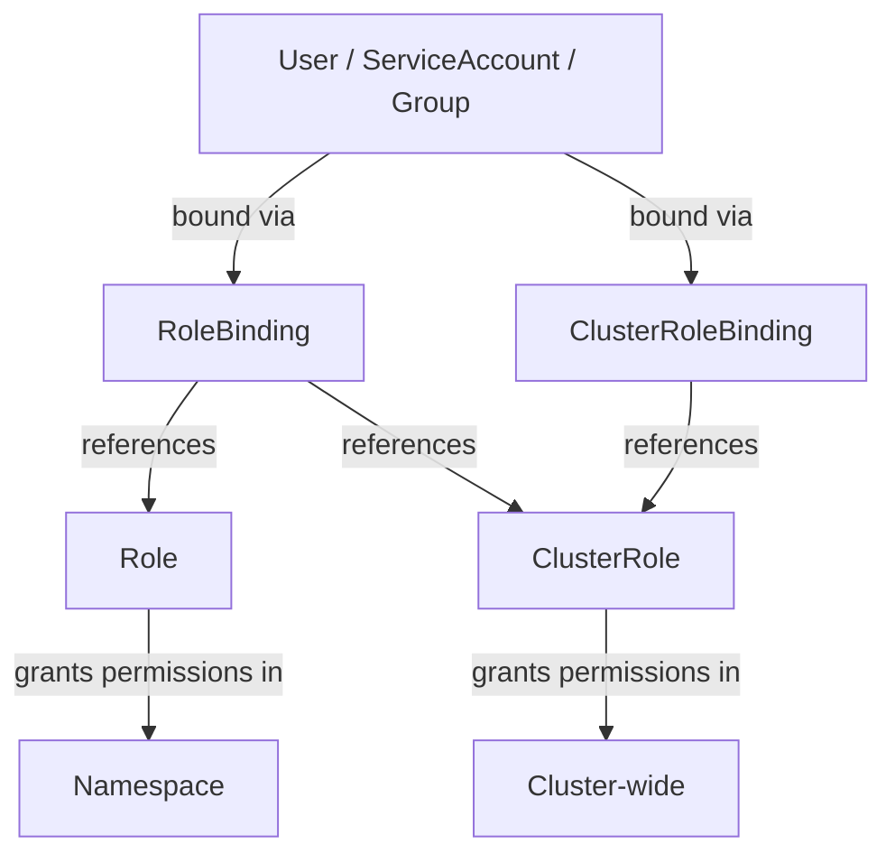

# How to Use Ansible to Manage Kubernetes RBAC

Author: [nawazdhandala](https://www.github.com/nawazdhandala)

Tags: Ansible, Kubernetes, RBAC, Security, Access Control

Description: Manage Kubernetes Role-Based Access Control with Ansible to define Roles, ClusterRoles, RoleBindings, and ClusterRoleBindings for secure cluster access.

---

Role-Based Access Control (RBAC) in Kubernetes determines who can do what in your cluster. It is the primary mechanism for enforcing the principle of least privilege: giving users and service accounts only the permissions they actually need. Managing RBAC through Ansible makes your access policies auditable, version-controlled, and reproducible across environments.

This guide covers creating Roles, ClusterRoles, RoleBindings, and ClusterRoleBindings with Ansible, along with practical patterns for common scenarios like developer access, CI/CD service accounts, and read-only monitoring.

## Understanding RBAC Components

RBAC has four main objects:

- **Role**: Grants permissions within a specific namespace
- **ClusterRole**: Grants permissions cluster-wide or across all namespaces
- **RoleBinding**: Binds a Role (or ClusterRole) to users/groups/service accounts in a namespace
- **ClusterRoleBinding**: Binds a ClusterRole to users/groups/service accounts cluster-wide



## Creating a Namespace-Scoped Role

Start with a Role that allows developers to manage common resources in their namespace.

```yaml
# playbook: create-developer-rbac.yml
# Sets up RBAC for developers in the development namespace
---
- name: Configure Developer RBAC
  hosts: localhost
  connection: local
  gather_facts: false

  vars:
    namespace: development

  tasks:
    - name: Create developer Role
      kubernetes.core.k8s:
        state: present
        definition:
          apiVersion: rbac.authorization.k8s.io/v1
          kind: Role
          metadata:
            name: developer
            namespace: "{{ namespace }}"
          rules:
            # Full access to deployments, services, and configmaps
            - apiGroups: ["apps"]
              resources: ["deployments", "replicasets"]
              verbs: ["get", "list", "watch", "create", "update", "patch", "delete"]
            - apiGroups: [""]
              resources: ["services", "configmaps", "pods", "pods/log"]
              verbs: ["get", "list", "watch", "create", "update", "patch", "delete"]
            # Read-only access to secrets (can view but not modify)
            - apiGroups: [""]
              resources: ["secrets"]
              verbs: ["get", "list", "watch"]
            # Allow port-forwarding for debugging
            - apiGroups: [""]
              resources: ["pods/portforward"]
              verbs: ["create"]
            # Allow exec into pods for debugging
            - apiGroups: [""]
              resources: ["pods/exec"]
              verbs: ["create"]
```

Each rule specifies an `apiGroup`, a list of `resources`, and the allowed `verbs`. The core API group (pods, services, configmaps) uses an empty string `""` for the apiGroup. The apps API group covers deployments and replicasets.

## Binding the Role to Users

A Role by itself does nothing. You need a RoleBinding to connect it to actual users or groups.

```yaml
    # Continued from the same playbook
    - name: Bind developer role to the dev team group
      kubernetes.core.k8s:
        state: present
        definition:
          apiVersion: rbac.authorization.k8s.io/v1
          kind: RoleBinding
          metadata:
            name: dev-team-binding
            namespace: "{{ namespace }}"
          subjects:
            # Bind to an OIDC group
            - kind: Group
              name: "dev-team"
              apiGroup: rbac.authorization.k8s.io
            # Also bind to specific users
            - kind: User
              name: "alice@company.com"
              apiGroup: rbac.authorization.k8s.io
            - kind: User
              name: "bob@company.com"
              apiGroup: rbac.authorization.k8s.io
          roleRef:
            kind: Role
            name: developer
            apiGroup: rbac.authorization.k8s.io
```

## Creating a ClusterRole for Read-Only Access

ClusterRoles work across all namespaces. Here is a read-only role for monitoring tools and on-call engineers.

```yaml
# playbook: create-readonly-clusterrole.yml
# Creates a cluster-wide read-only role for monitoring and on-call
---
- name: Create Read-Only ClusterRole
  hosts: localhost
  connection: local
  gather_facts: false

  tasks:
    - name: Create cluster-wide read-only role
      kubernetes.core.k8s:
        state: present
        definition:
          apiVersion: rbac.authorization.k8s.io/v1
          kind: ClusterRole
          metadata:
            name: cluster-viewer
          rules:
            # Read access to most resources
            - apiGroups: ["", "apps", "batch", "networking.k8s.io"]
              resources: ["*"]
              verbs: ["get", "list", "watch"]
            # Explicitly deny secrets access at the cluster level
            - apiGroups: [""]
              resources: ["secrets"]
              verbs: []

    - name: Bind cluster-viewer to the oncall group
      kubernetes.core.k8s:
        state: present
        definition:
          apiVersion: rbac.authorization.k8s.io/v1
          kind: ClusterRoleBinding
          metadata:
            name: oncall-viewer-binding
          subjects:
            - kind: Group
              name: "oncall-team"
              apiGroup: rbac.authorization.k8s.io
          roleRef:
            kind: ClusterRole
            name: cluster-viewer
            apiGroup: rbac.authorization.k8s.io
```

## RBAC for CI/CD Service Accounts

CI/CD pipelines need a service account with specific permissions to deploy applications. This is more secure than using a human user's credentials.

```yaml
# playbook: create-cicd-rbac.yml
# Creates a service account and RBAC for CI/CD deployments
---
- name: Configure CI/CD RBAC
  hosts: localhost
  connection: local
  gather_facts: false

  vars:
    namespace: production
    cicd_sa_name: cicd-deployer

  tasks:
    - name: Create the CI/CD service account
      kubernetes.core.k8s:
        state: present
        definition:
          apiVersion: v1
          kind: ServiceAccount
          metadata:
            name: "{{ cicd_sa_name }}"
            namespace: "{{ namespace }}"
            labels:
              purpose: ci-cd

    - name: Create deployment role for CI/CD
      kubernetes.core.k8s:
        state: present
        definition:
          apiVersion: rbac.authorization.k8s.io/v1
          kind: Role
          metadata:
            name: cicd-deployer-role
            namespace: "{{ namespace }}"
          rules:
            # Manage deployments and rollouts
            - apiGroups: ["apps"]
              resources: ["deployments", "deployments/scale"]
              verbs: ["get", "list", "watch", "create", "update", "patch"]
            # Manage services and configmaps
            - apiGroups: [""]
              resources: ["services", "configmaps"]
              verbs: ["get", "list", "watch", "create", "update", "patch"]
            # Read-only on pods for deployment status checks
            - apiGroups: [""]
              resources: ["pods", "pods/log"]
              verbs: ["get", "list", "watch"]
            # Manage secrets for pulling images
            - apiGroups: [""]
              resources: ["secrets"]
              verbs: ["get", "list", "create", "update", "patch"]
            # Manage ingress resources
            - apiGroups: ["networking.k8s.io"]
              resources: ["ingresses"]
              verbs: ["get", "list", "watch", "create", "update", "patch"]

    - name: Bind the role to the CI/CD service account
      kubernetes.core.k8s:
        state: present
        definition:
          apiVersion: rbac.authorization.k8s.io/v1
          kind: RoleBinding
          metadata:
            name: cicd-deployer-binding
            namespace: "{{ namespace }}"
          subjects:
            - kind: ServiceAccount
              name: "{{ cicd_sa_name }}"
              namespace: "{{ namespace }}"
          roleRef:
            kind: Role
            name: cicd-deployer-role
            apiGroup: rbac.authorization.k8s.io
```

Notice the CI/CD role intentionally omits the `delete` verb for deployments. This prevents the pipeline from accidentally deleting resources. It can create and update, but not destroy.

## Multi-Namespace RBAC Setup

When teams own multiple namespaces, you can create a ClusterRole and bind it per namespace.

```yaml
# playbook: create-team-rbac.yml
# Grants team-level access across multiple namespaces
---
- name: Configure team RBAC across namespaces
  hosts: localhost
  connection: local
  gather_facts: false

  vars:
    teams:
      - name: backend-team
        group: backend-devs
        namespaces:
          - backend-staging
          - backend-production
      - name: frontend-team
        group: frontend-devs
        namespaces:
          - frontend-staging
          - frontend-production

  tasks:
    - name: Create the team developer ClusterRole
      kubernetes.core.k8s:
        state: present
        definition:
          apiVersion: rbac.authorization.k8s.io/v1
          kind: ClusterRole
          metadata:
            name: team-developer
          rules:
            - apiGroups: ["", "apps", "batch"]
              resources: ["deployments", "services", "configmaps", "pods", "jobs"]
              verbs: ["get", "list", "watch", "create", "update", "patch", "delete"]

    - name: Create RoleBindings for each team in each namespace
      kubernetes.core.k8s:
        state: present
        definition:
          apiVersion: rbac.authorization.k8s.io/v1
          kind: RoleBinding
          metadata:
            name: "{{ item.0.name }}-binding"
            namespace: "{{ item.1 }}"
          subjects:
            - kind: Group
              name: "{{ item.0.group }}"
              apiGroup: rbac.authorization.k8s.io
          roleRef:
            kind: ClusterRole
            name: team-developer
            apiGroup: rbac.authorization.k8s.io
      loop: "{{ teams | subelements('namespaces') }}"
      loop_control:
        label: "{{ item.0.name }} in {{ item.1 }}"
```

The `subelements` filter is the key here. It creates a flattened list from the nested structure, so you get one iteration for each team-namespace combination.

## Auditing Existing RBAC

Before making changes, it helps to know what RBAC rules already exist.

```yaml
# task: list all RoleBindings in a namespace
- name: Get all RoleBindings in production
  kubernetes.core.k8s_info:
    kind: RoleBinding
    namespace: production
  register: existing_bindings

- name: Display existing bindings
  ansible.builtin.debug:
    msg: "{{ item.metadata.name }} -> {{ item.roleRef.name }} ({{ item.subjects | map(attribute='name') | list }})"
  loop: "{{ existing_bindings.resources }}"
  loop_control:
    label: "{{ item.metadata.name }}"
```

## Summary

RBAC is non-negotiable for production Kubernetes clusters. Managing it through Ansible gives you the same infrastructure-as-code benefits you get for other resources: everything is versioned, reviewable, and repeatable. Start with the principle of least privilege, create specific Roles for each use case, and use ClusterRoles sparingly. Keep CI/CD service accounts separate from human users, and audit your bindings regularly to catch permission drift. With Ansible handling RBAC, adding a new team member or a new namespace is a pull request away rather than a manual kubectl session.
