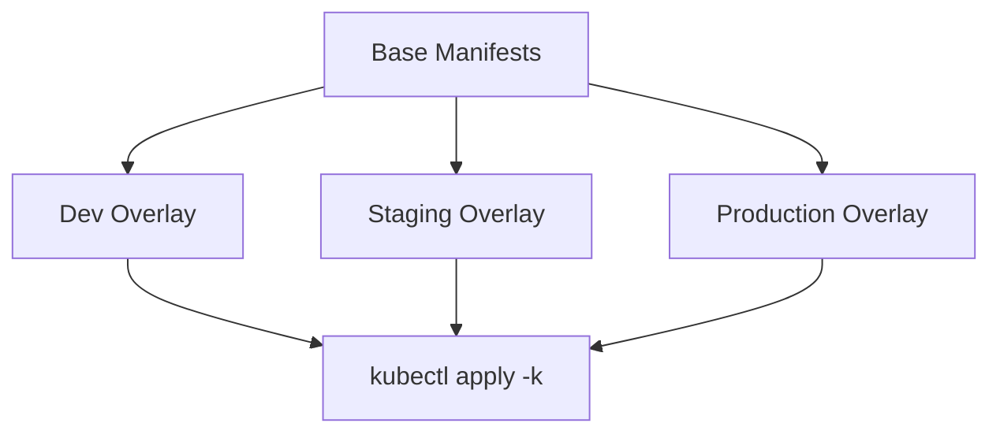

# How to Use Ansible with Kustomize for Kubernetes

Author: [nawazdhandala](https://www.github.com/nawazdhandala)

Tags: Ansible, Kustomize, Kubernetes, DevOps

Description: Use Ansible to manage Kustomize overlays for Kubernetes deployments with environment-specific patches and configurations.

---

Kustomize is a Kubernetes-native configuration management tool that uses overlays to customize base manifests without templates. Ansible can apply Kustomize configurations using the kubernetes.core.k8s module, combining Kustomize's overlay approach with Ansible's orchestration capabilities.

## Kustomize Structure



## Project Layout

```
k8s/
  base/
    kustomization.yaml
    deployment.yaml
    service.yaml
    configmap.yaml
  overlays/
    development/
      kustomization.yaml
      patches/
        deployment-patch.yaml
    staging/
      kustomization.yaml
      patches/
        deployment-patch.yaml
    production/
      kustomization.yaml
      patches/
        deployment-patch.yaml
        hpa.yaml
```

## Base Kustomization

```yaml
# k8s/base/kustomization.yaml
apiVersion: kustomize.config.k8s.io/v1beta1
kind: Kustomization
resources:
  - deployment.yaml
  - service.yaml
  - configmap.yaml
commonLabels:
  app: myapp
  managed-by: ansible
```

```yaml
# k8s/base/deployment.yaml
apiVersion: apps/v1
kind: Deployment
metadata:
  name: myapp
spec:
  replicas: 1
  selector:
    matchLabels:
      app: myapp
  template:
    metadata:
      labels:
        app: myapp
    spec:
      containers:
        - name: myapp
          image: myapp:latest
          ports:
            - containerPort: 8080
          resources:
            requests:
              memory: "128Mi"
              cpu: "100m"
```

## Environment Overlays

```yaml
# k8s/overlays/production/kustomization.yaml
apiVersion: kustomize.config.k8s.io/v1beta1
kind: Kustomization
namespace: production
bases:
  - ../../base
patches:
  - path: patches/deployment-patch.yaml
  - path: patches/hpa.yaml
images:
  - name: myapp
    newName: registry.example.com/myapp
    newTag: v2.1.0
```

```yaml
# k8s/overlays/production/patches/deployment-patch.yaml
apiVersion: apps/v1
kind: Deployment
metadata:
  name: myapp
spec:
  replicas: 3
  template:
    spec:
      containers:
        - name: myapp
          resources:
            requests:
              memory: "256Mi"
              cpu: "250m"
            limits:
              memory: "512Mi"
              cpu: "500m"
```

## Applying Kustomize with Ansible

```yaml
# playbooks/deploy-kustomize.yml
# Deploy Kubernetes resources using Kustomize overlays
---
- name: Deploy with Kustomize
  hosts: k8s_control_plane
  vars:
    environment: production
    k8s_dir: "{{ playbook_dir }}/../k8s"

  tasks:
    - name: Update image tag in kustomization
      ansible.builtin.lineinfile:
        path: "{{ k8s_dir }}/overlays/{{ environment }}/kustomization.yaml"
        regexp: 'newTag:'
        line: "    newTag: {{ app_version }}"
      delegate_to: localhost

    - name: Build Kustomize output
      ansible.builtin.command:
        cmd: "kubectl kustomize {{ k8s_dir }}/overlays/{{ environment }}"
      register: kustomize_output
      delegate_to: localhost
      changed_when: false

    - name: Apply Kustomize manifests
      kubernetes.core.k8s:
        state: present
        definition: "{{ kustomize_output.stdout | from_yaml_all | list }}"
        wait: true
        wait_timeout: 300

    - name: Verify deployment
      kubernetes.core.k8s_info:
        kind: Deployment
        namespace: "{{ environment }}"
        name: myapp
      register: deploy_check
      retries: 20
      delay: 15
      until:
        - deploy_check.resources | length > 0
        - deploy_check.resources[0].status.readyReplicas | default(0) == deploy_check.resources[0].spec.replicas
```

## Generating Overlays with Ansible

Use Ansible templates to generate Kustomize patches:

```yaml
# tasks/generate-kustomize-overlay.yml
# Generate environment-specific Kustomize overlay
---
- name: Generate kustomization.yaml
  ansible.builtin.template:
    src: kustomization.yaml.j2
    dest: "{{ k8s_dir }}/overlays/{{ environment }}/kustomization.yaml"
    mode: '0644'
  delegate_to: localhost

- name: Generate deployment patch
  ansible.builtin.template:
    src: deployment-patch.yaml.j2
    dest: "{{ k8s_dir }}/overlays/{{ environment }}/patches/deployment-patch.yaml"
    mode: '0644'
  delegate_to: localhost
```

## Key Takeaways

Kustomize and Ansible work well together. Kustomize handles Kubernetes manifest customization through overlays and patches. Ansible orchestrates the deployment, handles ordering, and verifies success. Use Ansible to generate Kustomize overlays from templates when you need dynamic values. Apply the built Kustomize output through the k8s module for full control over the deployment process.

## Common Use Cases

Here are several practical scenarios where this module proves essential in real-world playbooks.

### Infrastructure Provisioning Workflow

```yaml
# Complete workflow incorporating this module
- name: Infrastructure provisioning
  hosts: all
  become: true
  gather_facts: true
  tasks:
    - name: Gather system information
      ansible.builtin.setup:
        gather_subset:
          - hardware
          - network

    - name: Display system summary
      ansible.builtin.debug:
        msg: >-
          Host {{ inventory_hostname }} has
          {{ ansible_memtotal_mb }}MB RAM,
          {{ ansible_processor_vcpus }} vCPUs,
          running {{ ansible_distribution }} {{ ansible_distribution_version }}

    - name: Install required packages
      ansible.builtin.package:
        name:
          - curl
          - wget
          - git
          - vim
          - htop
          - jq
        state: present

    - name: Configure system timezone
      ansible.builtin.timezone:
        name: "{{ system_timezone | default('UTC') }}"

    - name: Configure hostname
      ansible.builtin.hostname:
        name: "{{ inventory_hostname }}"

    - name: Update /etc/hosts
      ansible.builtin.lineinfile:
        path: /etc/hosts
        regexp: '^127\.0\.1\.1'
        line: "127.0.1.1 {{ inventory_hostname }}"

    - name: Configure SSH hardening
      ansible.builtin.lineinfile:
        path: /etc/ssh/sshd_config
        regexp: "{{ item.regexp }}"
        line: "{{ item.line }}"
      loop:
        - { regexp: '^PermitRootLogin', line: 'PermitRootLogin no' }
        - { regexp: '^PasswordAuthentication', line: 'PasswordAuthentication no' }
      notify: restart sshd

    - name: Configure firewall rules
      community.general.ufw:
        rule: allow
        port: "{{ item }}"
        proto: tcp
      loop:
        - "22"
        - "80"
        - "443"

    - name: Enable firewall
      community.general.ufw:
        state: enabled
        policy: deny

  handlers:
    - name: restart sshd
      ansible.builtin.service:
        name: sshd
        state: restarted
```

### Integration with Monitoring

```yaml
# Using gathered facts to configure monitoring thresholds
- name: Configure monitoring based on system specs
  hosts: all
  become: true
  tasks:
    - name: Set monitoring thresholds based on hardware
      ansible.builtin.template:
        src: monitoring_config.yml.j2
        dest: /etc/monitoring/config.yml
      vars:
        memory_warning_threshold: "{{ (ansible_memtotal_mb * 0.8) | int }}"
        memory_critical_threshold: "{{ (ansible_memtotal_mb * 0.95) | int }}"
        cpu_warning_threshold: 80
        cpu_critical_threshold: 95

    - name: Register host with monitoring system
      ansible.builtin.uri:
        url: "https://monitoring.example.com/api/hosts"
        method: POST
        body_format: json
        body:
          hostname: "{{ inventory_hostname }}"
          ip_address: "{{ ansible_default_ipv4.address }}"
          os: "{{ ansible_distribution }}"
          memory_mb: "{{ ansible_memtotal_mb }}"
          cpus: "{{ ansible_processor_vcpus }}"
        headers:
          Authorization: "Bearer {{ monitoring_api_token }}"
        status_code: [200, 201, 409]
```

### Error Handling Patterns

```yaml
# Robust error handling with this module
- name: Robust task execution
  hosts: all
  tasks:
    - name: Attempt primary operation
      ansible.builtin.command: /opt/app/primary-task.sh
      register: primary_result
      failed_when: false

    - name: Handle primary failure with fallback
      ansible.builtin.command: /opt/app/fallback-task.sh
      when: primary_result.rc != 0
      register: fallback_result

    - name: Report final status
      ansible.builtin.debug:
        msg: >-
          Task completed via {{ 'primary' if primary_result.rc == 0 else 'fallback' }} path.
          Return code: {{ primary_result.rc if primary_result.rc == 0 else fallback_result.rc }}

    - name: Fail if both paths failed
      ansible.builtin.fail:
        msg: "Both primary and fallback operations failed"
      when:
        - primary_result.rc != 0
        - fallback_result is defined
        - fallback_result.rc != 0
```

### Scheduling and Automation

```yaml
# Set up scheduled compliance scans using cron
- name: Configure automated scans
  hosts: all
  become: true
  tasks:
    - name: Create scan script
      ansible.builtin.copy:
        dest: /opt/scripts/compliance_scan.sh
        mode: '0755'
        content: |
          #!/bin/bash
          cd /opt/ansible
          ansible-playbook playbooks/validate.yml -i inventory/ > /var/log/compliance_scan.log 2>&1
          EXIT_CODE=$?
          if [ $EXIT_CODE -ne 0 ]; then
            curl -X POST https://hooks.example.com/alert \
              -H "Content-Type: application/json" \
              -d "{\"text\":\"Compliance scan failed on $(hostname)\"}"
          fi
          exit $EXIT_CODE

    - name: Schedule weekly compliance scan
      ansible.builtin.cron:
        name: "Weekly compliance scan"
        minute: "0"
        hour: "3"
        weekday: "1"
        job: "/opt/scripts/compliance_scan.sh"
        user: ansible
```

