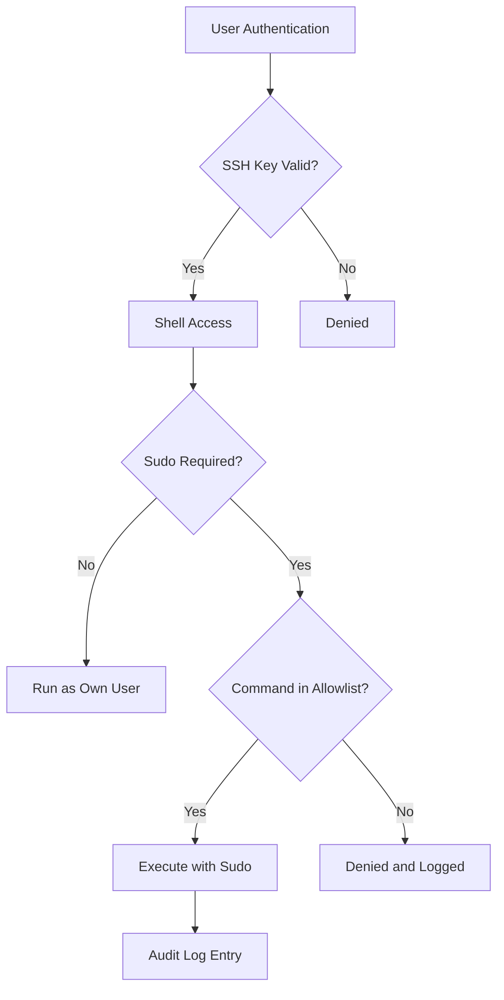

# How to Use Ansible to Implement Least Privilege Access

Author: [nawazdhandala](https://www.github.com/nawazdhandala)

Tags: Ansible, Security, Access Control, Linux, DevOps

Description: Implement the principle of least privilege across your Linux infrastructure using Ansible to manage users, sudo rules, SSH access, and file permissions.

---

The principle of least privilege says that every user, process, and program should operate with the minimum set of permissions needed to do its job. In practice, most organizations struggle with this. Developers get sudo access "temporarily" that never gets revoked. Service accounts run as root because it was easier to set up that way. Ansible gives you the tools to enforce least privilege systematically across your entire fleet.

## The Problem with Manual Access Management

I once inherited an environment where every developer had full sudo access on every server. When I asked why, the answer was "it was easier than figuring out what they actually needed." This is how most breaches escalate from a single compromised account to a full infrastructure takeover. Let us fix that with Ansible.

## Defining Access Policies as Data

The first step is defining who gets what access in a structured format. We will use group variables to define access policies.

This inventory structure organizes access by server role:

```yaml
# group_vars/all.yml - Base access policies
---
# Default users present on all servers
base_users:
  - name: deploy
    uid: 2000
    groups: []
    shell: /bin/bash
    sudo_commands: []
  - name: monitoring
    uid: 2001
    groups: []
    shell: /usr/sbin/nologin
    sudo_commands:
      - /usr/bin/systemctl status *
      - /usr/bin/journalctl *

# Users that should never exist
prohibited_users:
  - games
  - news
  - lp

# SSH settings
ssh_permit_root_login: "no"
ssh_password_authentication: "no"
ssh_max_auth_tries: 3
```

Access policies specific to web servers:

```yaml
# group_vars/webservers.yml - Web server access policies
---
webserver_users:
  - name: webadmin
    uid: 3000
    groups:
      - www-data
    shell: /bin/bash
    sudo_commands:
      - /usr/bin/systemctl restart nginx
      - /usr/bin/systemctl reload nginx
      - /usr/bin/systemctl status nginx
      - /usr/bin/tail /var/log/nginx/*
```

## Creating Users with Minimal Permissions

This playbook creates users with exactly the permissions they need and nothing more.

The playbook creates user accounts and assigns specific sudo privileges:

```yaml
# enforce-least-privilege.yml - Enforce least privilege access
---
- name: Enforce Least Privilege Access
  hosts: all
  become: true
  vars:
    all_users: "{{ base_users + (webserver_users | default([])) + (db_users | default([])) }}"

  tasks:
    - name: Create user groups
      ansible.builtin.group:
        name: "{{ item.name }}"
        state: present
      loop: "{{ all_users }}"
      loop_control:
        label: "{{ item.name }}"

    - name: Create user accounts with restricted shells
      ansible.builtin.user:
        name: "{{ item.name }}"
        uid: "{{ item.uid }}"
        groups: "{{ item.groups }}"
        shell: "{{ item.shell }}"
        create_home: true
        password_lock: true
        state: present
      loop: "{{ all_users }}"
      loop_control:
        label: "{{ item.name }}"

    - name: Remove prohibited users
      ansible.builtin.user:
        name: "{{ item }}"
        state: absent
        remove: true
      loop: "{{ prohibited_users }}"

    - name: Lock root account direct login
      ansible.builtin.user:
        name: root
        password_lock: true
```

## Configuring Granular Sudo Rules

Instead of giving users full sudo access, we give them exactly the commands they need.

This task creates per-user sudoers files with specific command allowlists:

```yaml
    - name: Remove default broad sudo access
      ansible.builtin.file:
        path: /etc/sudoers.d/90-cloud-init-users
        state: absent

    - name: Create individual sudoers files for each user
      ansible.builtin.template:
        src: sudoers-user.j2
        dest: "/etc/sudoers.d/{{ item.name }}"
        mode: '0440'
        owner: root
        group: root
        validate: '/usr/sbin/visudo -cf %s'
      loop: "{{ all_users }}"
      loop_control:
        label: "{{ item.name }}"
      when: item.sudo_commands | length > 0
```

The sudoers template that grants only specific commands:

```jinja2
# sudoers-user.j2 - Per-user sudo configuration
# Managed by Ansible - do not edit
# User: {{ item.name }}


{{ item.name }} ALL=(root) NOPASSWD: {{ cmd }}


# Prevent this user from running anything else as root
Defaults:{{ item.name }} !root_sudo
Defaults:{{ item.name }} log_output
Defaults:{{ item.name }} logfile="/var/log/sudo-{{ item.name }}.log"
```

## Hardening SSH Access

SSH is the front door to your servers. Locking it down is critical for least privilege.

This task deploys a hardened SSH configuration:

```yaml
    - name: Deploy hardened SSH configuration
      ansible.builtin.template:
        src: sshd_config.j2
        dest: /etc/ssh/sshd_config
        mode: '0600'
        owner: root
        group: root
        validate: '/usr/sbin/sshd -t -f %s'
      notify: Restart sshd

    - name: Create SSH access control file
      ansible.builtin.template:
        src: ssh_allowed_users.j2
        dest: /etc/ssh/allowed_users
        mode: '0644'
      notify: Restart sshd
```

The SSH configuration template that restricts access:

```jinja2
# sshd_config.j2 - Hardened SSH configuration
# Managed by Ansible

Port 22
Protocol 2
PermitRootLogin {{ ssh_permit_root_login }}
PasswordAuthentication {{ ssh_password_authentication }}
PubkeyAuthentication yes
MaxAuthTries {{ ssh_max_auth_tries }}
MaxSessions 3
LoginGraceTime 30

# Only allow specific users to SSH in
AllowUsers {{ user.name }} 

# Disable forwarding unless explicitly needed
AllowTcpForwarding no
X11Forwarding no
AllowAgentForwarding no

# Session timeout after 10 minutes of inactivity
ClientAliveInterval 300
ClientAliveCountMax 2

# Restrict key exchange and cipher algorithms
KexAlgorithms curve25519-sha256,curve25519-sha256@libssh.org
Ciphers chacha20-poly1305@openssh.com,aes256-gcm@openssh.com,aes128-gcm@openssh.com
MACs hmac-sha2-512-etm@openssh.com,hmac-sha2-256-etm@openssh.com

# Logging
LogLevel VERBOSE
SyslogFacility AUTH
```

## File Permission Lockdown

Least privilege extends to file permissions. This task secures critical system files.

This playbook enforces strict permissions on sensitive files and directories:

```yaml
    - name: Set restrictive permissions on sensitive files
      ansible.builtin.file:
        path: "{{ item.path }}"
        mode: "{{ item.mode }}"
        owner: "{{ item.owner | default('root') }}"
        group: "{{ item.group | default('root') }}"
      loop:
        - { path: /etc/shadow, mode: '0640', group: shadow }
        - { path: /etc/gshadow, mode: '0640', group: shadow }
        - { path: /etc/passwd, mode: '0644' }
        - { path: /etc/group, mode: '0644' }
        - { path: /etc/sudoers, mode: '0440' }
        - { path: /etc/ssh/sshd_config, mode: '0600' }
        - { path: /etc/crontab, mode: '0600' }
        - { path: /var/log, mode: '0750' }

    - name: Remove world-writable permissions from key directories
      ansible.builtin.command:
        cmd: "find {{ item }} -type f -perm -0002 -exec chmod o-w {} +"
      loop:
        - /etc
        - /usr/local/bin
      changed_when: false
      failed_when: false
```

## Service Account Restrictions

Service accounts should be locked down even more tightly than human accounts.

This task configures service accounts with no interactive login:

```yaml
    - name: Configure service accounts with restricted access
      ansible.builtin.user:
        name: "{{ item.name }}"
        shell: /usr/sbin/nologin
        home: "{{ item.home }}"
        create_home: false
        system: true
        password_lock: true
      loop:
        - { name: nginx, home: /var/www }
        - { name: postgres, home: /var/lib/postgresql }
        - { name: redis, home: /var/lib/redis }

    - name: Ensure service accounts cannot be used for SSH
      ansible.builtin.lineinfile:
        path: /etc/ssh/sshd_config
        line: "DenyUsers nginx postgres redis"
        insertafter: "^AllowUsers"
      notify: Restart sshd
```

## Access Audit Playbook

Regularly auditing access is part of maintaining least privilege. This playbook checks for violations.

This playbook identifies potential privilege escalation risks:

```yaml
# audit-access.yml - Find least privilege violations
---
- name: Audit Access Privileges
  hosts: all
  become: true
  tasks:
    - name: Find users with UID 0 (root equivalent)
      ansible.builtin.shell: |
        awk -F: '$3 == 0 && $1 != "root" {print $1}' /etc/passwd
      register: uid_zero_users
      changed_when: false

    - name: Alert on unauthorized UID 0 users
      ansible.builtin.debug:
        msg: "WARNING: {{ item }} has UID 0 on {{ inventory_hostname }}"
      loop: "{{ uid_zero_users.stdout_lines }}"
      when: uid_zero_users.stdout_lines | length > 0

    - name: Find SUID binaries
      ansible.builtin.shell: |
        find / -perm -4000 -type f 2>/dev/null
      register: suid_binaries
      changed_when: false

    - name: List SUID binaries for review
      ansible.builtin.debug:
        msg: "SUID binaries on {{ inventory_hostname }}: {{ suid_binaries.stdout_lines }}"

    - name: Check for users with empty passwords
      ansible.builtin.shell: |
        awk -F: '$2 == "" {print $1}' /etc/shadow
      register: empty_passwords
      changed_when: false

    - name: Alert on accounts with empty passwords
      ansible.builtin.fail:
        msg: "CRITICAL: {{ item }} has an empty password on {{ inventory_hostname }}"
      loop: "{{ empty_passwords.stdout_lines }}"
      when: empty_passwords.stdout_lines | length > 0
```

## Privilege Model Overview



Implementing least privilege is an ongoing process, not a one-time setup. Start with the playbooks above to establish a baseline, then refine the access policies as you learn what each role actually needs. The key insight is that Ansible lets you define access as code, which means it is version-controlled, reviewable, and reproducible.
