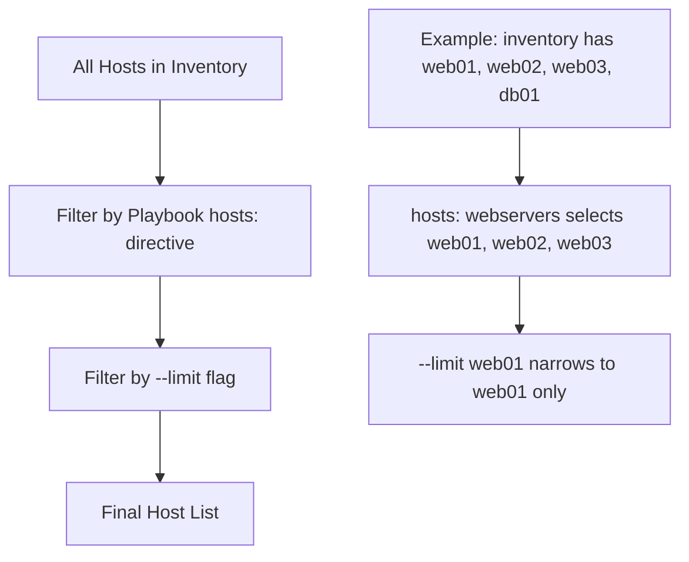

# How to Limit Playbook Execution to a Single Host

Author: [nawazdhandala](https://www.github.com/nawazdhandala)

Tags: Ansible, Playbook, Limit, Host Targeting

Description: Learn how to use Ansible's limit flag and patterns to run playbooks against a single host, a subset of hosts, or exclude specific machines.

---

You wrote a playbook that targets all your web servers, but right now you only want to run it against one machine. Maybe you are testing a change, or maybe one server needs a hotfix while the rest are fine. The `--limit` flag is how you narrow down playbook execution without modifying the playbook itself.

## Basic Usage of --limit

The `--limit` flag restricts execution to the hosts you specify, regardless of what the playbook's `hosts` directive says.

```bash
# Run the playbook only on web01
ansible-playbook -i inventory.ini site.yml --limit web01
```

If your inventory looks like this:

```ini
# inventory.ini
[webservers]
web01 ansible_host=192.168.1.10
web02 ansible_host=192.168.1.11
web03 ansible_host=192.168.1.12

[dbservers]
db01 ansible_host=192.168.1.20
```

And your playbook targets `webservers`:

```yaml
# site.yml - targets all web servers
---
- name: Configure web servers
  hosts: webservers
  become: yes

  tasks:
    - name: Update apt cache
      apt:
        update_cache: yes

    - name: Install nginx
      apt:
        name: nginx
        state: present
```

Running with `--limit web01` means only `web01` gets the update, even though the playbook says `hosts: webservers`.

## Limiting to Multiple Hosts

You can specify multiple hosts separated by commas.

```bash
# Run on web01 and web03 only
ansible-playbook -i inventory.ini site.yml --limit "web01,web03"
```

Or use a colon as the separator (both work):

```bash
# Same thing, different syntax
ansible-playbook -i inventory.ini site.yml --limit "web01:web03"
```

## Using Patterns with --limit

The limit flag supports Ansible host patterns, which gives you flexible targeting options.

```bash
# All hosts in the webservers group
ansible-playbook -i inventory.ini site.yml --limit "webservers"

# All hosts matching a wildcard
ansible-playbook -i inventory.ini site.yml --limit "web*"

# Hosts in webservers but NOT web02
ansible-playbook -i inventory.ini site.yml --limit "webservers:!web02"

# Hosts in BOTH webservers and staging groups (intersection)
ansible-playbook -i inventory.ini site.yml --limit "webservers:&staging"
```

The `!` prefix excludes hosts, and the `&` prefix does intersection (hosts must be in both groups).

## Using a File for --limit

When you need to limit to a long list of hosts, put them in a file and reference it with the `@` prefix.

```bash
# Create a file with one host per line
cat > limit-hosts.txt << 'EOF'
web01
web03
db01
EOF

# Use the file as the limit source
ansible-playbook -i inventory.ini site.yml --limit @limit-hosts.txt
```

This is especially useful after a failed run. Ansible automatically creates a `.retry` file listing the hosts that failed, and you can use it to rerun only on those hosts.

```bash
# After a partial failure, rerun on only the failed hosts
ansible-playbook -i inventory.ini site.yml --limit @site.retry
```

## How Limit Interacts with Playbook Hosts

Understanding the interaction between `--limit` and the `hosts` directive is important. The limit acts as a filter on top of the hosts directive.



If you limit to a host that is not in the playbook's target group, nothing will run. For example:

```bash
# This will not execute any tasks because db01 is not in the webservers group
ansible-playbook -i inventory.ini site.yml --limit db01
```

You will see this warning:

```
[WARNING]: Could not match supplied host pattern, ignoring: db01
```

## Limiting to a Single Host by IP

You can also limit by IP address if that is how your inventory is defined.

```bash
# Limit by IP address
ansible-playbook -i inventory.ini site.yml --limit 192.168.1.10
```

## Real-World Scenarios

### Rolling Out a Change Gradually

Instead of deploying to all hosts at once, test on a single machine first.

```bash
# Step 1: Test on one host
ansible-playbook -i production.ini deploy.yml --limit web01

# Step 2: Verify web01 is working correctly
curl -s http://web01.example.com/health | jq .

# Step 3: Roll out to the rest
ansible-playbook -i production.ini deploy.yml --limit "webservers:!web01"
```

### Debugging a Problem Host

When one host is misbehaving, run your playbook against just that host with verbose output.

```bash
# Focused debugging on a single problematic host
ansible-playbook -i production.ini site.yml --limit web03 -vvv
```

### Excluding a Host Under Maintenance

If a host is in maintenance mode, exclude it from the run.

```bash
# Run on all web servers except the one in maintenance
ansible-playbook -i production.ini deploy.yml --limit "webservers:!web02"
```

## Setting Limit in ansible.cfg

If you frequently limit to a specific subset during development, you can set a default limit in your configuration.

```ini
# ansible.cfg - sets a default limit (rarely used in production)
[defaults]
limit = web01
```

However, this is generally a bad idea for production because you might forget it is there and wonder why your playbook is only running on one host. It is better to always pass `--limit` explicitly on the command line.

## Combining --limit with --list-hosts

Before running a playbook with a limit, verify which hosts will be targeted using `--list-hosts`.

```bash
# Preview which hosts would be targeted without running anything
ansible-playbook -i inventory.ini site.yml --limit "web*" --list-hosts

# Output:
#   playbook: site.yml
#
#   play #1 (webservers): Configure web servers	TAGS: []
#     pattern: ['webservers']
#     hosts (3):
#       web01
#       web02
#       web03
```

Wait, that shows all three because `--list-hosts` shows the intersection of the playbook hosts and the limit pattern. Let me fix that example.

```bash
# Preview hosts with a specific limit applied
ansible-playbook -i inventory.ini site.yml --limit web01 --list-hosts

# Output:
#   playbook: site.yml
#
#   play #1 (webservers): Configure web servers	TAGS: []
#     pattern: ['webservers']
#     hosts (1):
#       web01
```

This confirmation step is a good habit before running anything against production. One quick `--list-hosts` check can prevent you from accidentally deploying to hosts you did not intend to touch.

## Summary of Limit Patterns

| Pattern | What It Does |
|---------|-------------|
| `web01` | Single host |
| `web01,web02` | Multiple specific hosts |
| `web*` | Wildcard match |
| `webservers` | All hosts in group |
| `webservers:!web02` | Group minus exclusion |
| `webservers:&staging` | Intersection of two groups |
| `@hosts.txt` | Read from file |
| `~web[0-9]+` | Regex match (prefix with ~) |

The `--limit` flag is a simple concept, but it is essential for safe, controlled playbook execution. Use it generously, especially in production environments where you want to minimize blast radius.
