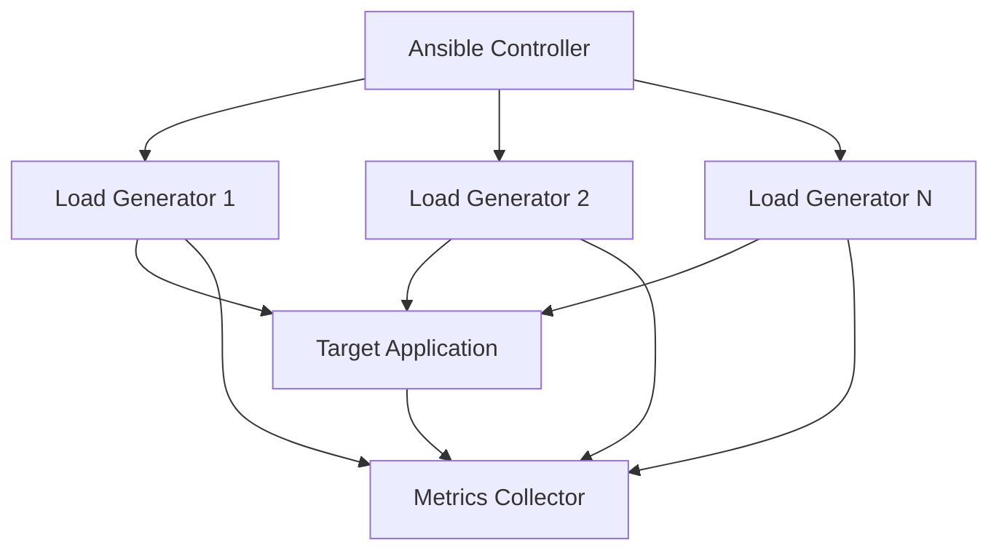

# How to Use Ansible for Load Testing Infrastructure Setup

Author: [nawazdhandala](https://www.github.com/nawazdhandala)

Tags: Ansible, Load Testing, Performance, DevOps

Description: Provision and manage distributed load testing infrastructure with Ansible to run scalable performance tests using tools like k6, Locust, and JMeter.

---

Load testing requires infrastructure. You need load generators, possibly dozens of them, configured with the right tools and test scripts, pointed at your target application. After the test, you need to collect results and tear everything down. Ansible handles all of this, from provisioning load generators to orchestrating test runs and collecting results.

This post covers setting up distributed load testing infrastructure with Ansible.

## Load Testing Architecture

A distributed load test setup looks like this:



## Provisioning Load Generators

First, spin up the load generator instances:

```yaml
# playbooks/provision-load-test.yml
# Provision distributed load testing infrastructure
---
- name: Provision load generators
  hosts: localhost
  connection: local
  vars:
    generator_count: "{{ load_generators | default(5) }}"
    generator_type: "{{ instance_type | default('c5.xlarge') }}"

  tasks:
    - name: Launch load generator instances
      amazon.aws.ec2_instance:
        name: "loadgen-{{ item }}"
        instance_type: "{{ generator_type }}"
        image_id: "{{ ami_id }}"
        subnet_id: "{{ subnet_id }}"
        security_group: "{{ sg_id }}"
        key_name: "{{ key_name }}"
        tags:
          Role: load-generator
          TestRun: "{{ test_run_id | default(ansible_date_time.epoch) }}"
        state: present
        wait: true
      loop: "{{ range(1, generator_count | int + 1) | list }}"
      register: generators

    - name: Add generators to inventory
      ansible.builtin.add_host:
        name: "loadgen-{{ item.item }}"
        ansible_host: "{{ item.instances[0].public_ip_address }}"
        groups: load_generators
      loop: "{{ generators.results }}"

    - name: Wait for SSH
      ansible.builtin.wait_for:
        host: "{{ item.instances[0].public_ip_address }}"
        port: 22
        timeout: 300
      loop: "{{ generators.results }}"
```

## Configuring Load Generators with k6

k6 is a popular load testing tool. Here is a role that installs and configures it:

```yaml
# roles/k6_setup/tasks/main.yml
# Install k6 load testing tool on generators
---
- name: Add k6 GPG key
  ansible.builtin.apt_key:
    url: https://dl.k6.io/key.gpg
    state: present

- name: Add k6 repository
  ansible.builtin.apt_repository:
    repo: "deb https://dl.k6.io/deb stable main"
    state: present

- name: Install k6
  ansible.builtin.apt:
    name: k6
    state: present
    update_cache: true

- name: Create test scripts directory
  ansible.builtin.file:
    path: /opt/load-tests
    state: directory
    owner: "{{ ansible_user }}"
    mode: '0755'

- name: Deploy k6 test script
  ansible.builtin.template:
    src: "{{ test_script }}"
    dest: /opt/load-tests/test.js
    owner: "{{ ansible_user }}"
    mode: '0644'
```

A sample k6 test script template:

```javascript
// roles/k6_setup/templates/api-load-test.js.j2
// k6 load test for API endpoints
import http from 'k6/http';
import { check, sleep } from 'k6';
import { Rate } from 'k6/metrics';

const errorRate = new Rate('errors');

export let options = {
  stages: [
    { duration: '{{ ramp_up_duration | default("2m") }}', target: {{ concurrent_users | default(100) }} },
    { duration: '{{ steady_duration | default("5m") }}', target: {{ concurrent_users | default(100) }} },
    { duration: '{{ ramp_down_duration | default("1m") }}', target: 0 },
  ],
  thresholds: {
    http_req_duration: ['p(95)<{{ p95_threshold_ms | default(500) }}'],
    errors: ['rate<{{ error_rate_threshold | default(0.01) }}'],
  },
};

const BASE_URL = '{{ target_url }}';

export default function () {
  // Test the main API endpoint
  let response = http.get(`${BASE_URL}/api/v1/items`, {
    headers: {
      'Authorization': 'Bearer {{ test_api_token }}',
      'Content-Type': 'application/json',
    },
  });

  check(response, {
    'status is 200': (r) => r.status === 200,
    'response time < {{ p95_threshold_ms | default(500) }}ms': (r) => r.timings.duration < {{ p95_threshold_ms | default(500) }},
  });

  errorRate.add(response.status !== 200);

  sleep(Math.random() * 2 + 1);

  // Test create endpoint
  let payload = JSON.stringify({
    name: `test-item-${Date.now()}`,
    value: Math.random() * 100,
  });

  let createResponse = http.post(`${BASE_URL}/api/v1/items`, payload, {
    headers: {
      'Authorization': 'Bearer {{ test_api_token }}',
      'Content-Type': 'application/json',
    },
  });

  check(createResponse, {
    'create status is 201': (r) => r.status === 201,
  });

  errorRate.add(createResponse.status !== 201);

  sleep(1);
}
```

## Running Distributed Load Tests

Orchestrate the test across all generators:

```yaml
# playbooks/run-load-test.yml
# Execute distributed load test across all generators
---
- name: Configure load generators
  hosts: load_generators
  become: true
  roles:
    - k6_setup

- name: Start load test
  hosts: load_generators
  vars:
    results_dir: /opt/load-tests/results
    test_run_id: "{{ lookup('pipe', 'date +%Y%m%d_%H%M%S') }}"

  tasks:
    - name: Create results directory
      ansible.builtin.file:
        path: "{{ results_dir }}"
        state: directory
        mode: '0755'

    - name: Run k6 load test
      ansible.builtin.command:
        cmd: >
          k6 run
          --out json={{ results_dir }}/{{ inventory_hostname }}_{{ test_run_id }}.json
          --summary-export={{ results_dir }}/{{ inventory_hostname }}_summary.json
          --tag testrun={{ test_run_id }}
          --tag generator={{ inventory_hostname }}
          /opt/load-tests/test.js
      async: 3600
      poll: 30
      register: k6_result

    - name: Display test summary
      ansible.builtin.debug:
        var: k6_result.stdout_lines

- name: Collect results
  hosts: load_generators
  tasks:
    - name: Fetch result files
      ansible.builtin.fetch:
        src: "{{ results_dir }}/{{ inventory_hostname }}_summary.json"
        dest: "./results/{{ test_run_id }}/"
        flat: true

- name: Aggregate results
  hosts: localhost
  connection: local
  tasks:
    - name: Read all summary files
      ansible.builtin.slurp:
        src: "{{ item }}"
      register: summaries
      with_fileglob: "./results/{{ test_run_id }}/*_summary.json"

    - name: Generate combined report
      ansible.builtin.template:
        src: templates/load-test-report.md.j2
        dest: "./results/{{ test_run_id }}/report.md"
        mode: '0644'
```

## Locust Setup Alternative

If you prefer Locust for Python-based tests:

```yaml
# roles/locust_setup/tasks/main.yml
# Install and configure Locust on load generators
---
- name: Install Python and pip
  ansible.builtin.apt:
    name:
      - python3
      - python3-pip
    state: present

- name: Install Locust
  ansible.builtin.pip:
    name: locust
    state: present

- name: Deploy Locust test file
  ansible.builtin.template:
    src: locustfile.py.j2
    dest: /opt/load-tests/locustfile.py
    mode: '0644'

- name: Start Locust worker
  ansible.builtin.command:
    cmd: >
      locust --worker
      --master-host={{ locust_master_host }}
      --locustfile=/opt/load-tests/locustfile.py
  async: 7200
  poll: 0
  when: "'master' not in group_names"

- name: Start Locust master
  ansible.builtin.command:
    cmd: >
      locust --master
      --expect-workers={{ groups['load_generators'] | length - 1 }}
      --host={{ target_url }}
      --locustfile=/opt/load-tests/locustfile.py
      --headless
      --users={{ total_users }}
      --spawn-rate={{ spawn_rate }}
      --run-time={{ test_duration }}
      --csv=/opt/load-tests/results/{{ test_run_id }}
  when: "'master' in group_names"
```

## Cleanup After Tests

Always tear down load testing infrastructure after the test:

```yaml
# playbooks/teardown-load-test.yml
# Destroy load testing infrastructure
---
- name: Teardown load generators
  hosts: localhost
  connection: local
  tasks:
    - name: Terminate all load generator instances
      amazon.aws.ec2_instance:
        state: absent
        filters:
          "tag:Role": load-generator
          "tag:TestRun": "{{ test_run_id }}"
        wait: true

    - name: Display teardown complete
      ansible.builtin.debug:
        msg: "Load testing infrastructure destroyed. Results saved to ./results/{{ test_run_id }}/"
```

## Key Takeaways

Ansible makes distributed load testing infrastructure management straightforward. Provision load generators on demand, configure them with your chosen tool (k6, Locust, JMeter), orchestrate the test run across all generators simultaneously, collect results, and tear everything down. By parameterizing the test configuration through Ansible variables, you can easily adjust the number of generators, concurrent users, test duration, and target endpoints without changing code. This approach gives you repeatable, scalable load tests that you can run as part of your release process.
