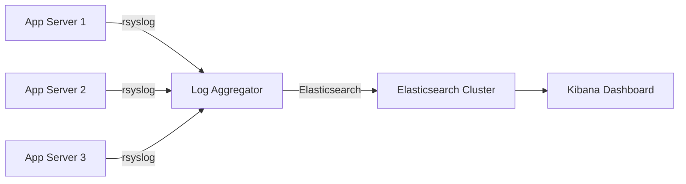

# How to Use Ansible to Set Up Log Aggregation

Author: [nawazdhandala](https://www.github.com/nawazdhandala)

Tags: Ansible, Logging, Monitoring, DevOps, Observability

Description: Learn how to automate centralized log aggregation across your infrastructure using Ansible playbooks and roles for scalable log collection.

---

Log aggregation is one of those things that every team knows they need but often puts off until something goes wrong. When you have ten servers, grepping through individual log files is tedious but possible. When you have a hundred servers, it becomes completely impractical. This is where centralized log aggregation comes in, and Ansible makes deploying it across your entire fleet straightforward.

In this post, I will walk through setting up a complete log aggregation stack using Ansible. We will use rsyslog as the log shipper, Elasticsearch as the storage backend, and Kibana for visualization. The entire setup will be repeatable and idempotent, which is exactly what you want from infrastructure automation.

## Architecture Overview

Before we write any playbooks, let us understand what we are building.



Each application server runs rsyslog, which forwards logs to a central aggregator. The aggregator pushes logs into Elasticsearch, and Kibana provides the web interface for searching and visualizing them.

## Project Structure

First, let us set up a clean Ansible project structure for this.

```bash
# Create the project layout
mkdir -p log-aggregation/{roles,group_vars,host_vars}
mkdir -p log-aggregation/roles/{rsyslog-client,rsyslog-server,elasticsearch,kibana}/{tasks,templates,handlers,defaults}
```

## Inventory File

Define your inventory with separate groups for log producers and the central aggregator.

```ini
# inventory/hosts.ini
[log_clients]
app-server-01 ansible_host=10.0.1.10
app-server-02 ansible_host=10.0.1.11
app-server-03 ansible_host=10.0.1.12

[log_aggregator]
log-server-01 ansible_host=10.0.2.10

[elasticsearch]
es-node-01 ansible_host=10.0.3.10

[kibana]
es-node-01 ansible_host=10.0.3.10
```

## Group Variables

Set shared variables that multiple roles will reference.

```yaml
# group_vars/all.yml
# Central log server address used by all clients
log_aggregator_host: 10.0.2.10
log_aggregator_port: 514

# Elasticsearch connection details
elasticsearch_host: 10.0.3.10
elasticsearch_port: 9200
elasticsearch_index_prefix: "syslog"

# Retention settings
log_retention_days: 30
```

## The rsyslog Client Role

This role goes on every server that needs to ship logs to the central aggregator.

```yaml
# roles/rsyslog-client/defaults/main.yml
rsyslog_protocol: tcp
rsyslog_target_host: "{{ log_aggregator_host }}"
rsyslog_target_port: "{{ log_aggregator_port }}"
rsyslog_extra_conf_options: []
```

The main tasks file installs rsyslog and configures forwarding.

```yaml
# roles/rsyslog-client/tasks/main.yml
- name: Install rsyslog
  ansible.builtin.apt:
    name: rsyslog
    state: present
    update_cache: yes
  when: ansible_os_family == "Debian"

- name: Install rsyslog on RHEL-based systems
  ansible.builtin.yum:
    name: rsyslog
    state: present
  when: ansible_os_family == "RedHat"

- name: Deploy rsyslog client configuration
  ansible.builtin.template:
    src: rsyslog-client.conf.j2
    dest: /etc/rsyslog.d/60-forward.conf
    owner: root
    group: root
    mode: '0644'
  notify: Restart rsyslog

- name: Make sure rsyslog is running and enabled
  ansible.builtin.service:
    name: rsyslog
    state: started
    enabled: yes
```

The template handles the actual forwarding configuration.

```jinja2
# roles/rsyslog-client/templates/rsyslog-client.conf.j2
# Managed by Ansible - do not edit manually
# Forward all logs to the central aggregator

# Use TCP for reliable delivery

*.* @@{{ rsyslog_target_host }}:{{ rsyslog_target_port }}

*.* @{{ rsyslog_target_host }}:{{ rsyslog_target_port }}


# Queue configuration for reliability
$ActionQueueType LinkedList
$ActionQueueFileName fwdRule1
$ActionResumeRetryCount -1
$ActionQueueSaveOnShutdown on
$ActionQueueMaxDiskSpace 1g


{{ option }}

```

The handler restarts rsyslog when configuration changes.

```yaml
# roles/rsyslog-client/handlers/main.yml
- name: Restart rsyslog
  ansible.builtin.service:
    name: rsyslog
    state: restarted
```

## The rsyslog Server Role

The central aggregator receives logs from all clients and stores them locally before shipping to Elasticsearch.

```yaml
# roles/rsyslog-server/tasks/main.yml
- name: Install rsyslog and Elasticsearch output module
  ansible.builtin.apt:
    name:
      - rsyslog
      - rsyslog-elasticsearch
    state: present
    update_cache: yes

- name: Deploy rsyslog server configuration
  ansible.builtin.template:
    src: rsyslog-server.conf.j2
    dest: /etc/rsyslog.d/50-server.conf
    owner: root
    group: root
    mode: '0644'
  notify: Restart rsyslog

- name: Create log storage directory
  ansible.builtin.file:
    path: /var/log/remote
    state: directory
    owner: syslog
    group: adm
    mode: '0755'

- name: Make sure rsyslog is running and enabled
  ansible.builtin.service:
    name: rsyslog
    state: started
    enabled: yes
```

The server template listens for incoming logs and forwards them to Elasticsearch.

```jinja2
# roles/rsyslog-server/templates/rsyslog-server.conf.j2
# Managed by Ansible - do not edit manually

# Load required modules
module(load="imtcp")
module(load="omelasticsearch")

# Listen for incoming TCP syslog
input(type="imtcp" port="{{ log_aggregator_port }}")

# Template for Elasticsearch JSON output
template(name="json-syslog" type="list") {
    constant(value="{")
    constant(value="\"@timestamp\":\"") property(name="timereported" dateFormat="rfc3339")
    constant(value="\",\"host\":\"")    property(name="hostname")
    constant(value="\",\"severity\":\"") property(name="syslogseverity-text")
    constant(value="\",\"facility\":\"") property(name="syslogfacility-text")
    constant(value="\",\"tag\":\"")      property(name="syslogtag" format="json")
    constant(value="\",\"message\":\"")  property(name="msg" format="json")
    constant(value="\"}")
}

# Store logs locally organized by hostname
template(name="RemoteLogPath" type="string"
    string="/var/log/remote/%HOSTNAME%/%PROGRAMNAME%.log")

*.* ?RemoteLogPath

# Ship to Elasticsearch
action(type="omelasticsearch"
    server="{{ elasticsearch_host }}"
    serverport="{{ elasticsearch_port }}"
    searchIndex="{{ elasticsearch_index_prefix }}-%$YEAR%.%$MONTH%.%$DAY%"
    searchType="_doc"
    template="json-syslog"
    bulkmode="on"
    queue.type="linkedlist"
    queue.size="5000"
    queue.dequeuebatchsize="300"
    action.resumeretrycount="-1")
```

## Elasticsearch Role

A simplified role to get Elasticsearch up and running for log storage.

```yaml
# roles/elasticsearch/tasks/main.yml
- name: Add Elasticsearch GPG key
  ansible.builtin.apt_key:
    url: https://artifacts.elastic.co/GPG-KEY-elasticsearch
    state: present

- name: Add Elasticsearch repository
  ansible.builtin.apt_repository:
    repo: "deb https://artifacts.elastic.co/packages/8.x/apt stable main"
    state: present

- name: Install Elasticsearch
  ansible.builtin.apt:
    name: elasticsearch
    state: present
    update_cache: yes

- name: Configure Elasticsearch
  ansible.builtin.template:
    src: elasticsearch.yml.j2
    dest: /etc/elasticsearch/elasticsearch.yml
    owner: root
    group: elasticsearch
    mode: '0660'
  notify: Restart Elasticsearch

- name: Set JVM heap size
  ansible.builtin.template:
    src: jvm.options.j2
    dest: /etc/elasticsearch/jvm.options.d/heap.options
    owner: root
    group: elasticsearch
    mode: '0660'
  notify: Restart Elasticsearch

- name: Enable and start Elasticsearch
  ansible.builtin.service:
    name: elasticsearch
    state: started
    enabled: yes

- name: Wait for Elasticsearch to become available
  ansible.builtin.uri:
    url: "http://localhost:{{ elasticsearch_port }}"
    method: GET
    status_code: 200
  register: es_health
  retries: 30
  delay: 5
  until: es_health.status == 200
```

## Index Lifecycle Management

To keep your Elasticsearch cluster from running out of disk, set up an ILM policy.

```yaml
# roles/elasticsearch/tasks/ilm.yml
- name: Create ILM policy for log retention
  ansible.builtin.uri:
    url: "http://localhost:{{ elasticsearch_port }}/_ilm/policy/log-retention"
    method: PUT
    body_format: json
    body:
      policy:
        phases:
          hot:
            actions:
              rollover:
                max_size: "10gb"
                max_age: "1d"
          delete:
            min_age: "{{ log_retention_days }}d"
            actions:
              delete: {}
    status_code:
      - 200
      - 201
```

## The Main Playbook

Tie everything together with a single playbook.

```yaml
# site.yml
---
- name: Configure log shipping on all application servers
  hosts: log_clients
  become: yes
  roles:
    - rsyslog-client

- name: Set up the central log aggregator
  hosts: log_aggregator
  become: yes
  roles:
    - rsyslog-server

- name: Deploy Elasticsearch for log storage
  hosts: elasticsearch
  become: yes
  roles:
    - elasticsearch

- name: Deploy Kibana for log visualization
  hosts: kibana
  become: yes
  roles:
    - kibana
```

Run the entire stack deployment with a single command.

```bash
# Deploy the complete log aggregation stack
ansible-playbook -i inventory/hosts.ini site.yml
```

## Verifying the Setup

After deployment, verify that logs are flowing correctly.

```yaml
# verify-logs.yml
---
- name: Verify log aggregation is working
  hosts: log_aggregator
  become: yes
  tasks:
    - name: Check rsyslog is listening on the expected port
      ansible.builtin.wait_for:
        port: "{{ log_aggregator_port }}"
        state: started
        timeout: 10

    - name: Send a test log message from the aggregator
      ansible.builtin.command:
        cmd: logger -t ansible-test "Log aggregation verification test"

    - name: Verify Elasticsearch has received logs
      ansible.builtin.uri:
        url: "http://{{ elasticsearch_host }}:{{ elasticsearch_port }}/{{ elasticsearch_index_prefix }}-*/_count"
        method: GET
      register: log_count

    - name: Display log count
      ansible.builtin.debug:
        msg: "Total logs in Elasticsearch: {{ log_count.json.count }}"
```

## Adding Log Parsing

You can enhance the setup by parsing structured logs like nginx access logs.

```jinja2
# roles/rsyslog-client/templates/nginx-parse.conf.j2
# Parse nginx access logs into structured fields
module(load="mmjsonparse")

template(name="nginx-json" type="list") {
    constant(value="{")
    constant(value="\"@timestamp\":\"") property(name="timereported" dateFormat="rfc3339")
    constant(value="\",\"client_ip\":\"") property(name="$!client_ip")
    constant(value="\",\"request\":\"") property(name="$!request")
    constant(value="\",\"status\":\"") property(name="$!status")
    constant(value="\",\"bytes_sent\":\"") property(name="$!bytes_sent")
    constant(value="\"}")
}

if $programname == 'nginx' then {
    action(type="mmjsonparse")
    action(type="omelasticsearch"
        server="{{ elasticsearch_host }}"
        serverport="{{ elasticsearch_port }}"
        searchIndex="nginx-%$YEAR%.%$MONTH%.%$DAY%"
        template="nginx-json")
}
```

## Wrapping Up

With this Ansible setup, you can roll out centralized log aggregation to any number of servers with a single command. The key benefits are consistency (every server gets the same configuration), reliability (rsyslog queues handle network blips), and maintainability (changes to the logging pipeline are a playbook run away).

A few things to consider for production use: enable TLS between rsyslog clients and the server, set up Elasticsearch with multiple nodes for redundancy, and configure alerting on the aggregator itself so you know immediately if log forwarding stops. You can also swap Elasticsearch for alternatives like Loki if you want something lighter weight. The Ansible patterns remain the same regardless of the backend you choose.
