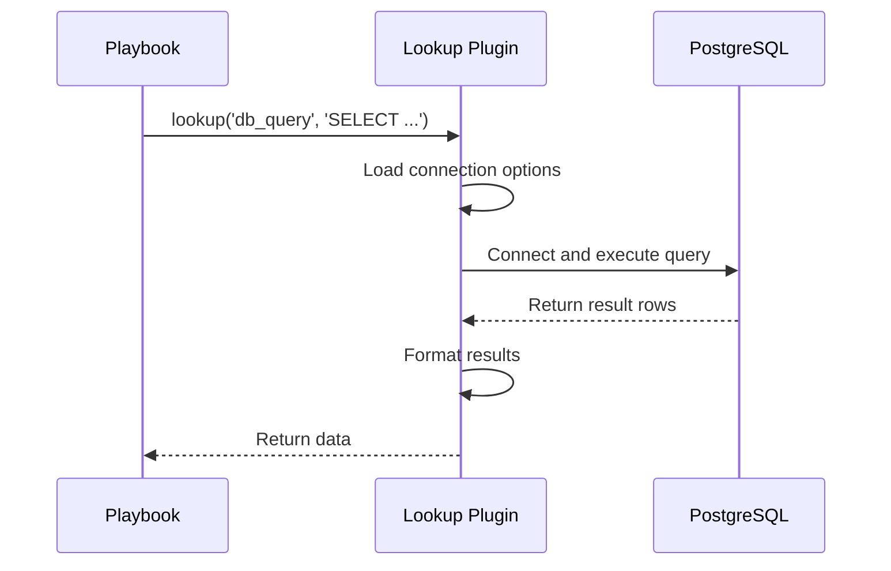

# How to Create a Lookup Plugin that Reads from a Database

Author: [nawazdhandala](https://www.github.com/nawazdhandala)

Tags: Ansible, Plugins, Database, Lookup, Python

Description: Build an Ansible lookup plugin that queries a PostgreSQL database to retrieve configuration data for use in playbooks and templates.

---

Lookup plugins let you pull data from external sources into your Ansible playbooks. While Ansible ships with lookups for files, URLs, and environment variables, there is no built-in lookup for databases. If your infrastructure configuration lives in a PostgreSQL, MySQL, or other database, building a custom database lookup plugin saves you from maintaining duplicate configuration files.

This guide walks through building a lookup plugin that queries PostgreSQL, but the patterns apply to any database backend.

## Plugin Architecture

The plugin connects to a database, executes a query, and returns the results to Ansible. Connection parameters come from plugin options (environment variables, ansible.cfg, or playbook variables).



## The Lookup Plugin

Create `plugins/lookup/db_query.py`:

```python
# db_query.py - Lookup plugin that queries a PostgreSQL database
from __future__ import absolute_import, division, print_function
__metaclass__ = type

DOCUMENTATION = """
    name: db_query
    author: Your Name
    version_added: "1.0.0"
    short_description: Query a PostgreSQL database
    description:
        - Execute SQL queries against a PostgreSQL database and return results.
        - Results are returned as a list of dictionaries (one per row).
    requirements:
        - psycopg2 Python library (pip install psycopg2-binary)
    options:
      _terms:
        description: SQL query or queries to execute.
        required: true
      db_host:
        description: Database host.
        type: str
        default: localhost
        env:
          - name: ANSIBLE_DB_HOST
        ini:
          - section: db_query
            key: host
        vars:
          - name: db_query_host
      db_port:
        description: Database port.
        type: int
        default: 5432
        env:
          - name: ANSIBLE_DB_PORT
        ini:
          - section: db_query
            key: port
      db_name:
        description: Database name.
        type: str
        required: true
        env:
          - name: ANSIBLE_DB_NAME
        ini:
          - section: db_query
            key: database
        vars:
          - name: db_query_database
      db_user:
        description: Database user.
        type: str
        required: true
        env:
          - name: ANSIBLE_DB_USER
        ini:
          - section: db_query
            key: user
        vars:
          - name: db_query_user
      db_password:
        description: Database password.
        type: str
        no_log: true
        env:
          - name: ANSIBLE_DB_PASSWORD
        ini:
          - section: db_query
            key: password
        vars:
          - name: db_query_password
      connect_timeout:
        description: Connection timeout in seconds.
        type: int
        default: 10
        env:
          - name: ANSIBLE_DB_TIMEOUT
      single_value:
        description:
          - If true, return just the first column of the first row as a scalar.
          - Useful for queries that return a single value.
        type: bool
        default: false
"""

EXAMPLES = """
# Query all web servers from the database
- name: Get web server list
  ansible.builtin.set_fact:
    web_servers: "{{ lookup('myorg.myutils.db_query', 'SELECT hostname, ip_address FROM servers WHERE role = %s', args=['web']) }}"

# Get a single configuration value
- name: Get max connections setting
  ansible.builtin.set_fact:
    max_conn: "{{ lookup('myorg.myutils.db_query', 'SELECT value FROM config WHERE key = %s', args=['max_connections'], single_value=true) }}"

# Use environment variables for connection
- name: Get deployment targets
  ansible.builtin.debug:
    msg: "{{ lookup('myorg.myutils.db_query', 'SELECT * FROM deploy_targets WHERE env = %s', args=['production']) }}"
"""

RETURN = """
  _raw:
    description: List of dictionaries, one per result row.
    type: list
    elements: dict
"""

import traceback
from ansible.errors import AnsibleLookupError
from ansible.plugins.lookup import LookupBase

try:
    import psycopg2
    import psycopg2.extras
    HAS_PSYCOPG2 = True
except ImportError:
    HAS_PSYCOPG2 = False


class LookupModule(LookupBase):
    def run(self, terms, variables=None, **kwargs):
        if not HAS_PSYCOPG2:
            raise AnsibleLookupError(
                "The db_query lookup requires the psycopg2 Python library. "
                "Install it with: pip install psycopg2-binary"
            )

        self.set_options(var_options=variables, direct=kwargs)

        # Build connection parameters
        conn_params = {
            'host': self.get_option('db_host'),
            'port': self.get_option('db_port'),
            'dbname': self.get_option('db_name'),
            'user': self.get_option('db_user'),
            'password': self.get_option('db_password'),
            'connect_timeout': self.get_option('connect_timeout'),
        }

        # Validate required params
        if not conn_params['dbname']:
            raise AnsibleLookupError(
                "db_name is required. Set it via ANSIBLE_DB_NAME env var "
                "or db_query_database variable."
            )

        single_value = self.get_option('single_value')

        # Get query arguments if provided
        query_args = kwargs.get('args', None)

        self._display.vv(
            "db_query: connecting to %s@%s:%s/%s"
            % (conn_params['user'], conn_params['host'],
               conn_params['port'], conn_params['dbname'])
        )

        results = []
        conn = None
        try:
            conn = psycopg2.connect(**conn_params)
            cursor = conn.cursor(cursor_factory=psycopg2.extras.RealDictCursor)

            for term in terms:
                self._display.vv("db_query: executing: %s" % term)

                if query_args:
                    cursor.execute(term, query_args)
                else:
                    cursor.execute(term)

                rows = cursor.fetchall()
                self._display.vv("db_query: returned %d rows" % len(rows))

                if single_value and rows:
                    # Return just the first value of the first row
                    first_row = dict(rows[0])
                    first_key = list(first_row.keys())[0]
                    results.append(first_row[first_key])
                else:
                    # Return all rows as dicts
                    results.append([dict(row) for row in rows])

        except psycopg2.OperationalError as e:
            raise AnsibleLookupError(
                "Cannot connect to database %s at %s:%s - %s. "
                "Check connection parameters and ensure the database is accessible."
                % (conn_params['dbname'], conn_params['host'],
                   conn_params['port'], str(e))
            )
        except psycopg2.ProgrammingError as e:
            raise AnsibleLookupError(
                "SQL error in query: %s" % str(e)
            )
        except Exception as e:
            raise AnsibleLookupError(
                "Database lookup failed: %s\n%s"
                % (str(e), traceback.format_exc())
            )
        finally:
            if conn:
                conn.close()

        return results
```

## Using the Plugin in Playbooks

### Basic Query

Pull a list of servers from the database:

```yaml
---
- name: Deploy using database-driven inventory
  hosts: localhost
  connection: local
  vars:
    db_query_host: "db.internal.myorg.com"
    db_query_database: "infra_config"
    db_query_user: "ansible_reader"
    db_query_password: "{{ vault_db_password }}"

  tasks:
    - name: Get deployment targets from database
      ansible.builtin.set_fact:
        targets: >-
          {{ lookup('myorg.myutils.db_query',
             "SELECT hostname, ip_address, datacenter FROM servers WHERE environment = 'production' AND role = 'web'") }}

    - name: Show targets
      ansible.builtin.debug:
        msg: "Deploying to {{ item.hostname }} ({{ item.ip_address }}) in {{ item.datacenter }}"
      loop: "{{ targets[0] }}"
```

### Parameterized Queries

Always use parameterized queries to prevent SQL injection:

```yaml
  tasks:
    - name: Get config for specific environment
      ansible.builtin.set_fact:
        app_config: >-
          {{ lookup('myorg.myutils.db_query',
             'SELECT key, value FROM app_config WHERE environment = %s AND application = %s',
             args=[target_env, app_name]) }}
```

### Single Value Lookups

When you just need one value, use `single_value`:

```yaml
  tasks:
    - name: Get database connection limit
      ansible.builtin.set_fact:
        db_max_connections: >-
          {{ lookup('myorg.myutils.db_query',
             "SELECT value FROM settings WHERE key = 'max_connections'",
             single_value=true) }}

    - name: Apply the setting
      ansible.builtin.template:
        src: postgresql.conf.j2
        dest: /etc/postgresql/15/main/postgresql.conf
```

## MySQL Variant

If you use MySQL instead of PostgreSQL, the plugin needs minor changes:

```python
# db_query_mysql.py - MySQL variant
try:
    import mysql.connector
    HAS_MYSQL = True
except ImportError:
    HAS_MYSQL = False


class LookupModule(LookupBase):
    def run(self, terms, variables=None, **kwargs):
        if not HAS_MYSQL:
            raise AnsibleLookupError(
                "The db_query_mysql lookup requires mysql-connector-python. "
                "Install with: pip install mysql-connector-python"
            )

        self.set_options(var_options=variables, direct=kwargs)

        conn_params = {
            'host': self.get_option('db_host'),
            'port': self.get_option('db_port'),
            'database': self.get_option('db_name'),
            'user': self.get_option('db_user'),
            'password': self.get_option('db_password'),
            'connection_timeout': self.get_option('connect_timeout'),
        }

        conn = mysql.connector.connect(**conn_params)
        cursor = conn.cursor(dictionary=True)

        results = []
        for term in terms:
            query_args = kwargs.get('args', None)
            if query_args:
                cursor.execute(term, query_args)
            else:
                cursor.execute(term)
            rows = cursor.fetchall()
            results.append(rows)

        conn.close()
        return results
```

## Security Considerations

1. **Always use parameterized queries.** Never use string formatting to build SQL.
2. **Use a read-only database user.** The plugin should never need write access.
3. **Store credentials in Ansible Vault**, not in plaintext.
4. **Set `no_log: true`** on the password option to prevent it from appearing in logs.
5. **Use SSL connections** in production by adding `sslmode: require` to connection params.

## Summary

A database lookup plugin bridges the gap between your configuration database and Ansible playbooks. The key pieces are: proper option handling for connection parameters, parameterized queries for security, clear error messages for connection issues, and `RealDictCursor` for returning results as dictionaries. This pattern works with PostgreSQL, MySQL, SQLite, or any database that has a Python driver.
