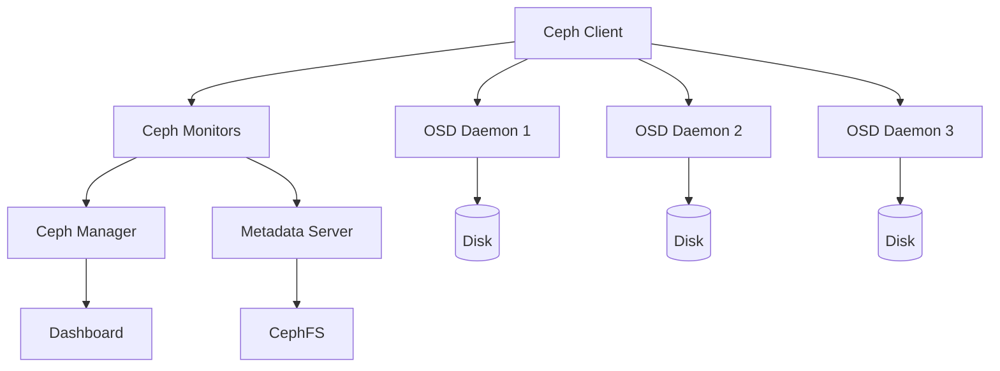

# How to Use Ansible to Manage Ceph Storage

Author: [nawazdhandala](https://www.github.com/nawazdhandala)

Tags: Ansible, Ceph, Storage, Distributed Systems

Description: Deploy and manage Ceph distributed storage clusters using Ansible playbooks for scalable and reliable object and block storage.

---

Ceph is one of the most powerful open-source distributed storage systems available. It provides object storage, block storage, and a POSIX-compliant filesystem all from a single cluster. But deploying and managing Ceph by hand is notoriously complex. There are monitors, OSDs, managers, metadata servers, and a web of configuration that all needs to be consistent.

Ansible is the natural fit for managing Ceph. The official ceph-ansible project from the Ceph community provides battle-tested roles, but understanding the fundamentals will help you customize and troubleshoot when things get interesting. This guide covers both approaches.

## Ceph Architecture at a Glance

Before we write any playbooks, here is a quick look at the components:



## Inventory Setup

A typical Ceph cluster inventory splits hosts into their roles. Here is an example for a small cluster:

```ini
# inventory/ceph-cluster
[mons]
ceph-mon-01 ansible_host=10.0.1.10
ceph-mon-02 ansible_host=10.0.1.11
ceph-mon-03 ansible_host=10.0.1.12

[osds]
ceph-osd-01 ansible_host=10.0.2.10
ceph-osd-02 ansible_host=10.0.2.11
ceph-osd-03 ansible_host=10.0.2.12
ceph-osd-04 ansible_host=10.0.2.13

[mgrs]
ceph-mon-01
ceph-mon-02

[mdss]
ceph-mds-01 ansible_host=10.0.3.10

[rgws]
ceph-rgw-01 ansible_host=10.0.4.10

[ceph:children]
mons
osds
mgrs
mdss
rgws
```

## Installing Ceph Packages

The first step is getting the Ceph packages installed on all nodes. This playbook adds the official repository and installs the right packages per role:

```yaml
# install-ceph.yml - Install Ceph packages on all cluster nodes
---
- name: Install Ceph packages
  hosts: ceph
  become: true

  vars:
    ceph_release: reef  # Current stable release
    ceph_repo_baseurl: "https://download.ceph.com/rpm-{{ ceph_release }}/el{{ ansible_distribution_major_version }}"

  tasks:
    # Add the official Ceph repository
    - name: Add Ceph repository
      ansible.builtin.yum_repository:
        name: ceph
        description: "Ceph {{ ceph_release }} Repository"
        baseurl: "{{ ceph_repo_baseurl }}/{{ ansible_architecture }}"
        gpgcheck: true
        gpgkey: "https://download.ceph.com/keys/release.asc"
        enabled: true
      when: ansible_os_family == "RedHat"

    # Install base packages on all nodes
    - name: Install common Ceph packages
      ansible.builtin.yum:
        name:
          - ceph-common
          - ceph-base
          - python3-cephfs
          - python3-rados
          - python3-rbd
        state: present

    # Install monitor-specific packages
    - name: Install Ceph monitor packages
      ansible.builtin.yum:
        name:
          - ceph-mon
        state: present
      when: "'mons' in group_names"

    # Install OSD-specific packages
    - name: Install Ceph OSD packages
      ansible.builtin.yum:
        name:
          - ceph-osd
          - ceph-volume
        state: present
      when: "'osds' in group_names"

    # Install manager packages
    - name: Install Ceph manager packages
      ansible.builtin.yum:
        name:
          - ceph-mgr
          - ceph-mgr-dashboard
        state: present
      when: "'mgrs' in group_names"
```

## Bootstrapping the Monitor Cluster

Monitors are the brain of Ceph. They maintain the cluster map and handle consensus. You need at least three for production.

```yaml
# bootstrap-monitors.yml - Initialize the Ceph monitor cluster
---
- name: Bootstrap Ceph monitors
  hosts: mons[0]
  become: true

  vars:
    cluster_name: ceph
    cluster_network: "10.0.2.0/24"
    public_network: "10.0.1.0/24"
    fsid: "{{ lookup('pipe', 'uuidgen') }}"

  tasks:
    # Generate the cluster configuration file
    - name: Create ceph.conf
      ansible.builtin.template:
        src: ceph.conf.j2
        dest: /etc/ceph/ceph.conf
        owner: ceph
        group: ceph
        mode: '0644'

    # Generate the monitor keyring
    - name: Create monitor keyring
      ansible.builtin.command:
        cmd: ceph-authtool --create-keyring /tmp/ceph.mon.keyring --gen-key -n mon. --cap mon 'allow *'
        creates: /tmp/ceph.mon.keyring

    # Generate the admin keyring
    - name: Create admin keyring
      ansible.builtin.command:
        cmd: ceph-authtool --create-keyring /etc/ceph/ceph.client.admin.keyring --gen-key -n client.admin --cap mon 'allow *' --cap osd 'allow *' --cap mds 'allow *' --cap mgr 'allow *'
        creates: /etc/ceph/ceph.client.admin.keyring

    # Import admin key into monitor keyring
    - name: Import admin key into monitor keyring
      ansible.builtin.command:
        cmd: ceph-authtool /tmp/ceph.mon.keyring --import-keyring /etc/ceph/ceph.client.admin.keyring

    # Generate the monitor map
    - name: Create initial monmap
      ansible.builtin.command:
        cmd: >
          monmaptool --create
          --add {{ hostvars[item]['inventory_hostname'] }} {{ hostvars[item]['ansible_host'] }}
          --fsid {{ fsid }}
          /tmp/monmap
      loop: "{{ groups['mons'] }}"
      when: item == groups['mons'][0]

    # Initialize the monitor data directory
    - name: Create monitor data directory
      ansible.builtin.file:
        path: "/var/lib/ceph/mon/{{ cluster_name }}-{{ inventory_hostname }}"
        state: directory
        owner: ceph
        group: ceph
        mode: '0755'

    # Populate the monitor store
    - name: Initialize monitor
      ansible.builtin.command:
        cmd: >
          sudo -u ceph ceph-mon --mkfs -i {{ inventory_hostname }}
          --monmap /tmp/monmap
          --keyring /tmp/ceph.mon.keyring
      args:
        creates: "/var/lib/ceph/mon/{{ cluster_name }}-{{ inventory_hostname }}/store.db"

    # Start the first monitor
    - name: Enable and start ceph-mon
      ansible.builtin.systemd:
        name: "ceph-mon@{{ inventory_hostname }}"
        state: started
        enabled: true
```

The ceph.conf template:

```jinja2
# ceph.conf.j2 - Ceph cluster configuration managed by Ansible
[global]
fsid = {{ fsid }}
mon_initial_members = {{ hostvars[host]['inventory_hostname'] }}, 

mon_host = {{ hostvars[host]['ansible_host'] }}, 

public_network = {{ public_network }}
cluster_network = {{ cluster_network }}
auth_cluster_required = cephx
auth_service_required = cephx
auth_client_required = cephx

[mon]
mon_allow_pool_delete = false
mon_osd_full_ratio = 0.95
mon_osd_nearfull_ratio = 0.85

[osd]
osd_journal_size = 5120
osd_pool_default_size = 3
osd_pool_default_min_size = 2
osd_pool_default_pg_num = 128
osd_pool_default_pgp_num = 128
osd_crush_chooseleaf_type = 1
```

## Deploying OSDs

OSDs are where the actual data lives. Each OSD manages one disk. Here is how to deploy them:

```yaml
# deploy-osds.yml - Prepare and activate OSDs on storage nodes
---
- name: Deploy Ceph OSDs
  hosts: osds
  become: true
  serial: 1  # Deploy one node at a time to maintain cluster health

  vars:
    # List of devices to use as OSDs on each host
    osd_devices:
      - /dev/sdb
      - /dev/sdc
      - /dev/sdd
      - /dev/sde

  tasks:
    # Distribute the ceph.conf and admin keyring from the first monitor
    - name: Copy ceph.conf from monitor
      ansible.builtin.slurp:
        src: /etc/ceph/ceph.conf
      delegate_to: "{{ groups['mons'][0] }}"
      register: ceph_conf

    - name: Deploy ceph.conf to OSD node
      ansible.builtin.copy:
        content: "{{ ceph_conf.content | b64decode }}"
        dest: /etc/ceph/ceph.conf
        owner: ceph
        group: ceph
        mode: '0644'

    # Prepare each disk as an OSD using ceph-volume
    - name: Create OSD on each device
      ansible.builtin.command:
        cmd: "ceph-volume lvm create --data {{ item }}"
      loop: "{{ osd_devices }}"
      register: osd_create
      changed_when: "'was created' in osd_create.stdout"
      failed_when:
        - osd_create.rc != 0
        - "'already used' not in osd_create.stderr"

    # Verify OSDs are up and running
    - name: List local OSDs
      ansible.builtin.command:
        cmd: ceph-volume lvm list
      register: osd_list
      changed_when: false

    - name: Display OSD list
      ansible.builtin.debug:
        var: osd_list.stdout_lines
```

## Managing Pools and Health Checks

Once the cluster is up, you need to create storage pools and monitor health:

```yaml
# manage-pools.yml - Create and configure Ceph storage pools
---
- name: Manage Ceph pools
  hosts: mons[0]
  become: true

  vars:
    ceph_pools:
      - name: rbd-pool
        pg_num: 128
        application: rbd
      - name: cephfs-data
        pg_num: 64
        application: cephfs
      - name: cephfs-metadata
        pg_num: 32
        application: cephfs

  tasks:
    # Create pools if they do not exist
    - name: Create storage pools
      ansible.builtin.command:
        cmd: "ceph osd pool create {{ item.name }} {{ item.pg_num }}"
      loop: "{{ ceph_pools }}"
      register: pool_create
      changed_when: "'already exists' not in pool_create.stderr"
      failed_when:
        - pool_create.rc != 0
        - "'already exists' not in pool_create.stderr"

    # Enable the appropriate application on each pool
    - name: Set pool application
      ansible.builtin.command:
        cmd: "ceph osd pool application enable {{ item.name }} {{ item.application }}"
      loop: "{{ ceph_pools }}"
      changed_when: false

    # Check overall cluster health
    - name: Get cluster health
      ansible.builtin.command:
        cmd: ceph health detail
      register: cluster_health
      changed_when: false

    - name: Display cluster health
      ansible.builtin.debug:
        var: cluster_health.stdout_lines

    # Get cluster status overview
    - name: Get cluster status
      ansible.builtin.command:
        cmd: ceph -s
      register: cluster_status
      changed_when: false

    - name: Display cluster status
      ansible.builtin.debug:
        var: cluster_status.stdout_lines
```

## Day-Two Operations

Ongoing cluster management includes tasks like adding new OSDs, rebalancing, and upgrading. Here is a playbook for safely draining an OSD before maintenance:

```yaml
# drain-osd.yml - Safely remove an OSD for maintenance
---
- name: Drain OSD for maintenance
  hosts: mons[0]
  become: true

  vars:
    osd_id: 5  # The OSD to drain

  tasks:
    # Mark the OSD out so data migrates away from it
    - name: Mark OSD out
      ansible.builtin.command:
        cmd: "ceph osd out osd.{{ osd_id }}"

    # Wait for rebalancing to complete
    - name: Wait for cluster to rebalance
      ansible.builtin.command:
        cmd: ceph health
      register: health
      until: "'HEALTH_OK' in health.stdout or 'HEALTH_WARN' in health.stdout"
      retries: 60
      delay: 30
      changed_when: false

    # Stop the OSD daemon
    - name: Stop OSD daemon
      ansible.builtin.systemd:
        name: "ceph-osd@{{ osd_id }}"
        state: stopped
      delegate_to: "{{ osd_host }}"

    - name: Report drain complete
      ansible.builtin.debug:
        msg: "OSD {{ osd_id }} has been drained and stopped. Safe for maintenance."
```

## Lessons Learned

Running Ceph in production has taught me a few things the hard way:

1. Never deploy with fewer than 3 monitors. Ceph uses Paxos for consensus, and you need a majority quorum. With 2 monitors, losing one means losing the cluster.

2. Always use `serial: 1` when deploying OSDs or doing maintenance. Adding all OSDs at once will trigger massive rebalancing that can impact client I/O.

3. Monitor your cluster health continuously. A HEALTH_WARN about nearfull OSDs today becomes HEALTH_ERR and a read-only cluster tomorrow if you do not act.

4. Keep your ceph.conf identical across all nodes. Ansible makes this easy, but make sure you are distributing from a single source of truth.

5. Test failure scenarios in staging. Pull an OSD, kill a monitor, simulate a network partition. You need to know how your cluster behaves before production teaches you the hard way.

Ceph is complex, but Ansible turns that complexity into repeatable, auditable infrastructure code. Start small, understand each component, and build up from there.
