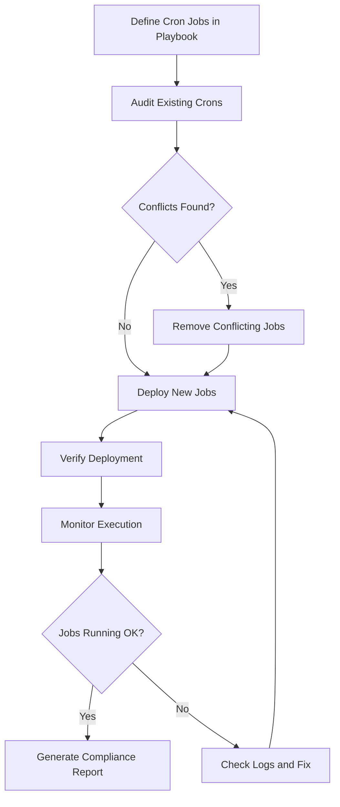

# How to Use Ansible to Manage Cron Jobs Across Servers

Author: [nawazdhandala](https://www.github.com/nawazdhandala)

Tags: Ansible, Cron, Automation, Linux Administration

Description: Manage cron jobs consistently across your entire server fleet using Ansible to prevent schedule drift and job conflicts.

---

Cron is one of those tools that every Linux administrator uses but few manage well at scale. On a single server, adding a cron job is a quick edit to a crontab. Across 50 or 500 servers, cron jobs become a management headache. Jobs get added manually, schedules drift between servers, someone forgets to add a job to the new server they just provisioned, and before you know it, you have inconsistent scheduled tasks across your fleet.

Ansible brings order to this chaos. By defining cron jobs in playbooks, you get version-controlled, auditable, and consistent scheduling across every server.

## The Ansible Cron Module

Ansible has a built-in `cron` module that handles all the common cron operations. Let us start with the basics:

```yaml
# manage-cron.yml - Manage cron jobs across the fleet
---
- name: Manage cron jobs
  hosts: all
  become: true

  tasks:
    # Add a simple cron job that runs daily
    - name: Schedule daily log cleanup
      ansible.builtin.cron:
        name: "Daily log cleanup"
        minute: "30"
        hour: "2"
        job: "find /var/log -name '*.gz' -mtime +30 -delete"
        user: root
        state: present

    # Add a cron job that runs every 5 minutes
    - name: Schedule health check
      ansible.builtin.cron:
        name: "Health check ping"
        minute: "*/5"
        job: "/usr/local/bin/health-check.sh >> /var/log/health-check.log 2>&1"
        user: root

    # Add a weekly job
    - name: Schedule weekly security scan
      ansible.builtin.cron:
        name: "Weekly security scan"
        minute: "0"
        hour: "4"
        weekday: "0"
        job: "/usr/local/bin/security-scan.sh"
        user: root

    # Remove a cron job that is no longer needed
    - name: Remove deprecated backup job
      ansible.builtin.cron:
        name: "Old backup script"
        state: absent
        user: root
```

## Role-Based Cron Management

Different server roles need different cron jobs. Here is how to organize them:

```yaml
# role-based-cron.yml - Deploy cron jobs based on server role
---
- name: Deploy common cron jobs to all servers
  hosts: all
  become: true

  vars:
    common_cron_jobs:
      - name: "System metrics collection"
        minute: "*/1"
        hour: "*"
        job: "/usr/local/bin/collect-metrics.sh"
        user: root

      - name: "Disk space check"
        minute: "0"
        hour: "*/4"
        job: "/usr/local/bin/check-disk-space.sh"
        user: root

      - name: "NTP sync check"
        minute: "15"
        hour: "*/6"
        job: "/usr/sbin/chronyc tracking >> /var/log/ntp-check.log 2>&1"
        user: root

  tasks:
    - name: Deploy common cron jobs
      ansible.builtin.cron:
        name: "{{ item.name }}"
        minute: "{{ item.minute }}"
        hour: "{{ item.hour }}"
        weekday: "{{ item.weekday | default('*') }}"
        day: "{{ item.day | default('*') }}"
        month: "{{ item.month | default('*') }}"
        job: "{{ item.job }}"
        user: "{{ item.user }}"
      loop: "{{ common_cron_jobs }}"

# Web server specific cron jobs
- name: Deploy web server cron jobs
  hosts: web_servers
  become: true

  vars:
    web_cron_jobs:
      - name: "Rotate access logs"
        minute: "0"
        hour: "0"
        job: "/usr/sbin/logrotate /etc/logrotate.d/nginx"
        user: root

      - name: "Clear PHP opcache"
        minute: "0"
        hour: "3"
        job: "/usr/local/bin/clear-opcache.sh"
        user: www-data

      - name: "SSL certificate check"
        minute: "0"
        hour: "8"
        job: "/usr/local/bin/check-ssl-expiry.sh"
        user: root

  tasks:
    - name: Deploy web server cron jobs
      ansible.builtin.cron:
        name: "{{ item.name }}"
        minute: "{{ item.minute }}"
        hour: "{{ item.hour }}"
        job: "{{ item.job }}"
        user: "{{ item.user }}"
      loop: "{{ web_cron_jobs }}"

# Database server specific cron jobs
- name: Deploy database cron jobs
  hosts: db_servers
  become: true

  vars:
    db_cron_jobs:
      - name: "Database backup"
        minute: "0"
        hour: "1"
        job: "/usr/local/bin/db-backup.sh >> /var/log/db-backup.log 2>&1"
        user: root

      - name: "Analyze database tables"
        minute: "0"
        hour: "5"
        weekday: "0"
        job: "mysqlcheck --auto-repair --optimize --all-databases >> /var/log/mysql-optimize.log 2>&1"
        user: root

  tasks:
    - name: Deploy database cron jobs
      ansible.builtin.cron:
        name: "{{ item.name }}"
        minute: "{{ item.minute }}"
        hour: "{{ item.hour }}"
        weekday: "{{ item.weekday | default('*') }}"
        job: "{{ item.job }}"
        user: "{{ item.user }}"
      loop: "{{ db_cron_jobs }}"
```

## Using Cron Environment Variables

Sometimes you need environment variables set for cron jobs to work correctly:

```yaml
# cron-env.yml - Set up cron environment variables
---
- name: Configure cron environment
  hosts: all
  become: true

  tasks:
    # Set PATH for cron (cron has a very limited default PATH)
    - name: Set PATH for cron
      ansible.builtin.cron:
        name: PATH
        env: true
        job: "/usr/local/sbin:/usr/local/bin:/usr/sbin:/usr/bin:/sbin:/bin"
        user: root

    # Set MAILTO to redirect cron output
    - name: Set MAILTO for cron output
      ansible.builtin.cron:
        name: MAILTO
        env: true
        job: "ops-team@example.com"
        user: root

    # Set SHELL explicitly
    - name: Set SHELL for cron
      ansible.builtin.cron:
        name: SHELL
        env: true
        job: "/bin/bash"
        user: root
```

## Managing Cron Files in /etc/cron.d

For more structured cron management, deploying files to `/etc/cron.d/` is cleaner than editing individual crontabs:

```yaml
# cron-files.yml - Deploy structured cron files
---
- name: Deploy cron files to /etc/cron.d
  hosts: all
  become: true

  vars:
    app_name: myapp
    app_user: appuser
    cron_schedules:
      - name: process_queue
        schedule: "*/5 * * * *"
        command: "/opt/myapp/bin/process-queue.sh"
      - name: cleanup_temp
        schedule: "0 */6 * * *"
        command: "/opt/myapp/bin/cleanup-temp.sh"
      - name: generate_reports
        schedule: "30 6 * * 1-5"
        command: "/opt/myapp/bin/generate-reports.sh"
      - name: monthly_archive
        schedule: "0 2 1 * *"
        command: "/opt/myapp/bin/monthly-archive.sh"

  tasks:
    # Deploy a cron file for the application
    - name: Deploy application cron file
      ansible.builtin.template:
        src: app-cron.j2
        dest: "/etc/cron.d/{{ app_name }}"
        owner: root
        group: root
        mode: '0644'

    # Remove old cron files that are no longer needed
    - name: Remove deprecated cron files
      ansible.builtin.file:
        path: "/etc/cron.d/{{ item }}"
        state: absent
      loop:
        - old-backup-job
        - legacy-cleanup
```

The cron file template:

```jinja2
# /etc/cron.d/{{ app_name }} - Managed by Ansible
# Do not edit manually

SHELL=/bin/bash
PATH=/usr/local/sbin:/usr/local/bin:/usr/sbin:/usr/bin:/sbin:/bin
MAILTO=ops-team@example.com


# {{ job.name }}
{{ job.schedule }} {{ app_user }} {{ job.command }} >> /var/log/{{ app_name }}/{{ job.name }}.log 2>&1

```

## Auditing Cron Jobs Across the Fleet

Before making changes, you want to know what cron jobs already exist:

```yaml
# audit-cron.yml - Collect all cron jobs from all servers
---
- name: Audit cron jobs across fleet
  hosts: all
  become: true

  tasks:
    # Collect root crontab
    - name: Get root crontab
      ansible.builtin.command:
        cmd: crontab -l -u root
      register: root_crontab
      changed_when: false
      failed_when: false

    # Collect cron.d files
    - name: List cron.d files
      ansible.builtin.command:
        cmd: ls -la /etc/cron.d/
      register: cron_d_files
      changed_when: false

    # Collect all user crontabs
    - name: Get all user crontabs
      ansible.builtin.shell:
        cmd: |
          for user in $(cut -f1 -d: /etc/passwd); do
            crontab=$(crontab -l -u "$user" 2>/dev/null)
            if [ -n "$crontab" ]; then
              echo "=== $user ==="
              echo "$crontab"
            fi
          done
      register: all_crontabs
      changed_when: false

    # Build audit report
    - name: Generate cron audit report
      ansible.builtin.copy:
        content: |
          Cron Audit Report for {{ inventory_hostname }}
          Generated: {{ ansible_date_time.iso8601 }}
          ================================================

          === Root Crontab ===
          {{ root_crontab.stdout | default('No root crontab') }}

          === /etc/cron.d Files ===
          {{ cron_d_files.stdout }}

          === All User Crontabs ===
          {{ all_crontabs.stdout | default('No user crontabs found') }}
        dest: "/tmp/cron-audit-{{ inventory_hostname }}.txt"
        mode: '0644'
      delegate_to: localhost

    - name: Display crontab summary
      ansible.builtin.debug:
        msg:
          - "Host: {{ inventory_hostname }}"
          - "Root crontab lines: {{ root_crontab.stdout_lines | default([]) | length }}"
          - "Cron.d files: {{ cron_d_files.stdout_lines | length }}"
```

## Preventing Cron Job Overlap

One common problem is long-running cron jobs overlapping with the next scheduled run. Here is how to handle that:

```yaml
# cron-with-locking.yml - Deploy cron jobs with proper locking
---
- name: Deploy cron jobs with flock-based locking
  hosts: all
  become: true

  tasks:
    # Install flock wrapper script
    - name: Deploy cron wrapper script
      ansible.builtin.copy:
        dest: /usr/local/bin/cron-wrapper.sh
        owner: root
        group: root
        mode: '0755'
        content: |
          #!/bin/bash
          # Cron wrapper with locking, logging, and timeout
          # Usage: cron-wrapper.sh <job-name> <timeout-minutes> <command>

          JOB_NAME="$1"
          TIMEOUT="$2"
          shift 2
          COMMAND="$@"

          LOCK_DIR="/var/lock/cron"
          LOG_DIR="/var/log/cron-jobs"
          LOCK_FILE="${LOCK_DIR}/${JOB_NAME}.lock"
          LOG_FILE="${LOG_DIR}/${JOB_NAME}.log"

          mkdir -p "$LOCK_DIR" "$LOG_DIR"

          # Try to acquire lock (non-blocking)
          exec 200>"$LOCK_FILE"
          if ! flock -n 200; then
              echo "$(date '+%Y-%m-%d %H:%M:%S') SKIPPED: ${JOB_NAME} already running" >> "$LOG_FILE"
              exit 0
          fi

          echo "$(date '+%Y-%m-%d %H:%M:%S') START: ${JOB_NAME}" >> "$LOG_FILE"
          timeout "${TIMEOUT}m" $COMMAND >> "$LOG_FILE" 2>&1
          RC=$?
          echo "$(date '+%Y-%m-%d %H:%M:%S') END: ${JOB_NAME} (exit: ${RC})" >> "$LOG_FILE"

          exit $RC

    # Deploy cron jobs that use the wrapper
    - name: Schedule job with locking
      ansible.builtin.cron:
        name: "Process payment queue"
        minute: "*/10"
        job: "/usr/local/bin/cron-wrapper.sh payment-queue 8 /opt/app/bin/process-payments.sh"
        user: root

    - name: Schedule another locked job
      ansible.builtin.cron:
        name: "Generate sitemap"
        minute: "0"
        hour: "*/2"
        job: "/usr/local/bin/cron-wrapper.sh sitemap-gen 30 /opt/app/bin/generate-sitemap.sh"
        user: www-data
```

## Cron Management Workflow



## Production Tips

From managing thousands of cron jobs across large fleets:

1. Always use the `name` parameter in Ansible cron tasks. Without it, Ansible cannot identify which cron entry to manage, and you will end up with duplicate entries every time you run the playbook.

2. Redirect stdout and stderr in your cron jobs. The default behavior sends output as email to the user, which usually goes nowhere on servers without local mail delivery configured. Use `>> /var/log/something.log 2>&1` on every job.

3. Use `flock` or a similar locking mechanism for any job that takes more than a minute to run. Without locking, a slow job can overlap with the next scheduled run, causing resource contention or data corruption.

4. Stagger cron schedules across servers. If all 100 servers run the same backup at 2:00 AM, you will overwhelm your backup storage. Use `{{ groups['all'].index(inventory_hostname) % 60 }}` as the minute field to spread jobs across the hour.

5. Do not use `@reboot` cron entries for critical services. Use systemd service files instead. Cron reboot jobs have no dependency ordering and no restart-on-failure capability.

6. Audit before you automate. Run the audit playbook first to understand what cron jobs already exist on your servers. Manual cron entries are common, and you do not want to accidentally break something by deploying Ansible-managed jobs that conflict.

Managing cron with Ansible turns a chaotic mess of per-server configurations into a clean, documented, version-controlled system. When the inevitable "what runs on server X?" question comes up, you have a definitive answer in your playbooks.
