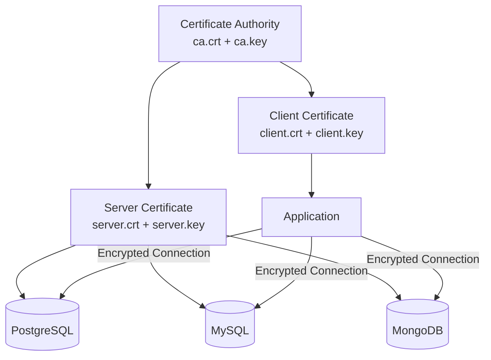

# How to Use Ansible to Manage Database SSL/TLS

Author: [nawazdhandala](https://www.github.com/nawazdhandala)

Tags: Ansible, SSL/TLS, Database Security, Encryption

Description: Automate SSL/TLS certificate deployment and configuration for PostgreSQL, MySQL, and MongoDB using Ansible playbooks.

---

Database connections carry sensitive data: credentials, personal information, financial records. Without encryption, anyone who can sniff network traffic between your application and database can read everything in plain text. SSL/TLS encryption solves this, but managing certificates across multiple database servers is tedious. Ansible automates the entire certificate lifecycle: generating, distributing, configuring, and rotating certificates.

This guide covers setting up SSL/TLS for PostgreSQL, MySQL, and MongoDB using Ansible.

## Certificate Architecture



## Generating Certificates with Ansible

First, create a CA and generate server certificates. In production, you would use a proper CA. For internal services, a self-signed CA works.

```yaml
# playbooks/generate-certificates.yml
---
- name: Generate SSL certificates for databases
  hosts: localhost
  connection: local
  vars:
    cert_dir: /tmp/db-certs
    ca_common_name: "Database Internal CA"
    cert_validity_days: 365

  tasks:
    - name: Create certificate directory
      ansible.builtin.file:
        path: "{{ cert_dir }}"
        state: directory
        mode: "0700"

    - name: Generate CA private key
      community.crypto.openssl_privatekey:
        path: "{{ cert_dir }}/ca.key"
        size: 4096
        type: RSA

    - name: Generate CA certificate signing request
      community.crypto.openssl_csr:
        path: "{{ cert_dir }}/ca.csr"
        privatekey_path: "{{ cert_dir }}/ca.key"
        common_name: "{{ ca_common_name }}"
        basic_constraints:
          - "CA:TRUE"
        basic_constraints_critical: true
        key_usage:
          - keyCertSign
          - cRLSign
        key_usage_critical: true

    - name: Self-sign the CA certificate
      community.crypto.x509_certificate:
        path: "{{ cert_dir }}/ca.crt"
        privatekey_path: "{{ cert_dir }}/ca.key"
        csr_path: "{{ cert_dir }}/ca.csr"
        provider: selfsigned
        selfsigned_not_after: "+{{ cert_validity_days * 3 }}d"

    - name: Generate server private key
      community.crypto.openssl_privatekey:
        path: "{{ cert_dir }}/server.key"
        size: 2048
        type: RSA

    - name: Generate server CSR with SANs for all database hosts
      community.crypto.openssl_csr:
        path: "{{ cert_dir }}/server.csr"
        privatekey_path: "{{ cert_dir }}/server.key"
        common_name: "database-server"
        subject_alt_name: >-
          {{ groups['database_servers'] | map('regex_replace', '^(.*)$', 'DNS:\1') | list
          + groups['database_servers'] | map('extract', hostvars, 'ansible_host') | map('regex_replace', '^(.*)$', 'IP:\1') | list }}

    - name: Sign the server certificate with the CA
      community.crypto.x509_certificate:
        path: "{{ cert_dir }}/server.crt"
        csr_path: "{{ cert_dir }}/server.csr"
        ownca_path: "{{ cert_dir }}/ca.crt"
        ownca_privatekey_path: "{{ cert_dir }}/ca.key"
        provider: ownca
        ownca_not_after: "+{{ cert_validity_days }}d"
```

## Distributing Certificates

Deploy the certificates to all database servers.

```yaml
# playbooks/distribute-certificates.yml
---
- name: Distribute SSL certificates to database servers
  hosts: database_servers
  become: true
  vars:
    cert_dir: /tmp/db-certs
    db_cert_dir: /etc/ssl/database

  tasks:
    - name: Create database certificate directory
      ansible.builtin.file:
        path: "{{ db_cert_dir }}"
        state: directory
        owner: root
        group: root
        mode: "0750"

    - name: Copy CA certificate to the server
      ansible.builtin.copy:
        src: "{{ cert_dir }}/ca.crt"
        dest: "{{ db_cert_dir }}/ca.crt"
        owner: root
        group: root
        mode: "0644"

    - name: Copy server certificate to the server
      ansible.builtin.copy:
        src: "{{ cert_dir }}/server.crt"
        dest: "{{ db_cert_dir }}/server.crt"
        owner: root
        group: root
        mode: "0644"

    - name: Copy server private key to the server
      ansible.builtin.copy:
        src: "{{ cert_dir }}/server.key"
        dest: "{{ db_cert_dir }}/server.key"
        owner: root
        mode: "0600"
      no_log: true
```

## Configuring PostgreSQL SSL

```yaml
# playbooks/configure-postgresql-ssl.yml
---
- name: Configure PostgreSQL for SSL
  hosts: postgres_servers
  become: true
  vars:
    db_cert_dir: /etc/ssl/database
    pg_conf_dir: /etc/postgresql/16/main

  tasks:
    - name: Set correct ownership on certificate files for PostgreSQL
      ansible.builtin.file:
        path: "{{ item }}"
        owner: postgres
        group: postgres
      loop:
        - "{{ db_cert_dir }}/server.crt"
        - "{{ db_cert_dir }}/server.key"
        - "{{ db_cert_dir }}/ca.crt"

    - name: Enable SSL in postgresql.conf
      ansible.builtin.lineinfile:
        path: "{{ pg_conf_dir }}/postgresql.conf"
        regexp: "^#?ssl = "
        line: "ssl = on"
      notify: Restart PostgreSQL

    - name: Set SSL certificate file path
      ansible.builtin.lineinfile:
        path: "{{ pg_conf_dir }}/postgresql.conf"
        regexp: "^#?ssl_cert_file = "
        line: "ssl_cert_file = '{{ db_cert_dir }}/server.crt'"
      notify: Restart PostgreSQL

    - name: Set SSL private key file path
      ansible.builtin.lineinfile:
        path: "{{ pg_conf_dir }}/postgresql.conf"
        regexp: "^#?ssl_key_file = "
        line: "ssl_key_file = '{{ db_cert_dir }}/server.key'"
      notify: Restart PostgreSQL

    - name: Set SSL CA file for client certificate verification
      ansible.builtin.lineinfile:
        path: "{{ pg_conf_dir }}/postgresql.conf"
        regexp: "^#?ssl_ca_file = "
        line: "ssl_ca_file = '{{ db_cert_dir }}/ca.crt'"
      notify: Restart PostgreSQL

    - name: Set minimum SSL/TLS version
      ansible.builtin.lineinfile:
        path: "{{ pg_conf_dir }}/postgresql.conf"
        regexp: "^#?ssl_min_protocol_version = "
        line: "ssl_min_protocol_version = 'TLSv1.2'"
      notify: Restart PostgreSQL

    - name: Require SSL for remote connections in pg_hba.conf
      ansible.builtin.lineinfile:
        path: "{{ pg_conf_dir }}/pg_hba.conf"
        regexp: "^hostssl"
        line: "hostssl all all 0.0.0.0/0 scram-sha-256"
        insertafter: "^# IPv4"
      notify: Reload PostgreSQL

  handlers:
    - name: Restart PostgreSQL
      ansible.builtin.systemd:
        name: postgresql
        state: restarted

    - name: Reload PostgreSQL
      ansible.builtin.systemd:
        name: postgresql
        state: reloaded
```

## Configuring MySQL SSL

```yaml
# playbooks/configure-mysql-ssl.yml
---
- name: Configure MySQL for SSL
  hosts: mysql_servers
  become: true
  vars:
    db_cert_dir: /etc/ssl/database

  tasks:
    - name: Set correct ownership for MySQL
      ansible.builtin.file:
        path: "{{ item }}"
        owner: mysql
        group: mysql
      loop:
        - "{{ db_cert_dir }}/server.crt"
        - "{{ db_cert_dir }}/server.key"
        - "{{ db_cert_dir }}/ca.crt"

    - name: Deploy MySQL SSL configuration
      ansible.builtin.copy:
        dest: /etc/mysql/mysql.conf.d/ssl.cnf
        content: |
          [mysqld]
          # SSL configuration - managed by Ansible
          ssl-ca = {{ db_cert_dir }}/ca.crt
          ssl-cert = {{ db_cert_dir }}/server.crt
          ssl-key = {{ db_cert_dir }}/server.key

          # Require TLS 1.2 or higher
          tls_version = TLSv1.2,TLSv1.3

          # Require SSL for all connections (optional but recommended)
          require_secure_transport = ON
        mode: "0644"
      notify: Restart MySQL

    - name: Verify MySQL SSL is enabled
      ansible.builtin.command:
        cmd: mysql -e "SHOW VARIABLES LIKE '%ssl%';"
      register: mysql_ssl_vars
      changed_when: false

    - name: Display MySQL SSL variables
      ansible.builtin.debug:
        msg: "{{ mysql_ssl_vars.stdout_lines }}"

  handlers:
    - name: Restart MySQL
      ansible.builtin.systemd:
        name: mysql
        state: restarted
```

## Configuring MongoDB SSL

```yaml
# playbooks/configure-mongodb-ssl.yml
---
- name: Configure MongoDB for TLS
  hosts: mongodb_servers
  become: true
  vars:
    db_cert_dir: /etc/ssl/database

  tasks:
    - name: Create combined PEM file for MongoDB
      ansible.builtin.shell:
        cmd: "cat {{ db_cert_dir }}/server.crt {{ db_cert_dir }}/server.key > {{ db_cert_dir }}/mongodb.pem"
      changed_when: true

    - name: Set ownership on PEM file
      ansible.builtin.file:
        path: "{{ db_cert_dir }}/mongodb.pem"
        owner: mongodb
        group: mongodb
        mode: "0600"

    - name: Enable TLS in mongod.conf
      ansible.builtin.blockinfile:
        path: /etc/mongod.conf
        marker: "# {mark} ANSIBLE MANAGED TLS BLOCK"
        block: |
          net:
            tls:
              mode: requireTLS
              certificateKeyFile: {{ db_cert_dir }}/mongodb.pem
              CAFile: {{ db_cert_dir }}/ca.crt
      notify: Restart MongoDB

  handlers:
    - name: Restart MongoDB
      ansible.builtin.systemd:
        name: mongod
        state: restarted
```

## Certificate Rotation

Certificates expire. Automate rotation before they do.

```yaml
# playbooks/check-cert-expiry.yml
---
- name: Check certificate expiration dates
  hosts: database_servers
  become: true
  vars:
    db_cert_dir: /etc/ssl/database
    expiry_warning_days: 30

  tasks:
    - name: Get certificate expiration date
      community.crypto.x509_certificate_info:
        path: "{{ db_cert_dir }}/server.crt"
      register: cert_info

    - name: Calculate days until expiration
      ansible.builtin.set_fact:
        days_until_expiry: "{{ ((cert_info.not_after | to_datetime('%Y%m%d%H%M%SZ')) - (ansible_date_time.iso8601 | to_datetime('%Y-%m-%dT%H:%M:%SZ'))).days }}"

    - name: Display expiration information
      ansible.builtin.debug:
        msg: "Certificate expires in {{ days_until_expiry }} days ({{ cert_info.not_after }})"

    - name: Warn if certificate is expiring soon
      ansible.builtin.fail:
        msg: "CERTIFICATE EXPIRING SOON: {{ days_until_expiry }} days remaining on {{ inventory_hostname }}"
      when: days_until_expiry | int < expiry_warning_days
      ignore_errors: true
```

## Verification

Verify that SSL/TLS is working correctly.

```yaml
# playbooks/verify-database-ssl.yml
---
- name: Verify database SSL configuration
  hosts: database_servers
  become: true

  tasks:
    - name: Test PostgreSQL SSL connection
      ansible.builtin.command:
        cmd: >
          psql "host=localhost dbname=postgres sslmode=require"
          -c "SELECT ssl, version FROM pg_stat_ssl WHERE pid = pg_backend_pid();"
      become_user: postgres
      register: pg_ssl_test
      changed_when: false
      when: "'postgres' in group_names"

    - name: Display PostgreSQL SSL status
      ansible.builtin.debug:
        msg: "{{ pg_ssl_test.stdout_lines }}"
      when: pg_ssl_test is defined and pg_ssl_test.stdout_lines is defined
```

## Production Tips

1. **Use TLS 1.2 as the minimum version.** TLS 1.0 and 1.1 have known vulnerabilities. There is no reason to support them in 2026.

2. **Automate certificate renewal.** Do not wait for certificates to expire. Run the expiry check playbook weekly and renew certificates at least 30 days before expiration.

3. **Use SANs (Subject Alternative Names).** Modern TLS verification checks SANs, not just the Common Name. Include both hostnames and IP addresses.

4. **Store private keys securely.** Keys should be readable only by the database process user. Use file permissions 0600 and Ansible Vault for any keys in transit.

5. **Test SSL with `openssl s_client`.** Use `openssl s_client -connect host:port` to verify the certificate chain independently of the database client.

## Conclusion

Managing database SSL/TLS with Ansible gives you consistent encryption across your entire database fleet. The playbooks in this guide cover certificate generation, distribution, configuration for PostgreSQL, MySQL, and MongoDB, and automated expiration checking. Encrypt every database connection, automate certificate rotation, and make SSL a non-negotiable part of your database deployment pipeline.
