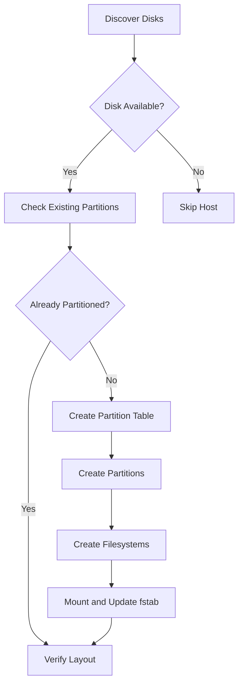

# How to Use Ansible to Manage Disk Partitions

Author: [nawazdhandala](https://www.github.com/nawazdhandala)

Tags: Ansible, Disk Management, Linux, Storage, DevOps

Description: Learn how to automate disk partitioning across your Linux servers using Ansible's parted and community modules for consistent storage setup.

---

Setting up disk partitions manually on a dozen servers is one of those tasks that feels straightforward until you realize you made a typo on server number seven and now the partition table is wrong. Ansible takes the guesswork out of disk partitioning by letting you define your partition layout as code and apply it consistently across your fleet.

## When You Need Automated Partitioning

There are several common scenarios where Ansible-driven partitioning makes sense:

- Provisioning new servers with additional data disks
- Setting up dedicated partitions for /var/log, /tmp, or /home for security compliance
- Preparing disks for LVM or RAID configurations
- Standardizing partition layouts across identical hardware

## Discovering Available Disks

Before partitioning anything, you need to know what disks are available. This playbook gathers disk information.

This playbook collects information about all block devices on your servers:

```yaml
# discover-disks.yml - Find available disks on target hosts
---
- name: Discover Available Disks
  hosts: all
  become: true
  tasks:
    - name: Gather block device information
      ansible.builtin.command: lsblk -d -n -o NAME,SIZE,TYPE,MOUNTPOINT
      register: block_devices
      changed_when: false

    - name: Display available disks
      ansible.builtin.debug:
        msg: "{{ block_devices.stdout_lines }}"

    - name: Get detailed partition info for each disk
      ansible.builtin.command: fdisk -l /dev/{{ item }}
      register: fdisk_info
      changed_when: false
      loop: "{{ block_devices.stdout_lines | map('split') | selectattr('2', 'equalto', 'disk') | map('first') | list }}"
      failed_when: false

    - name: Find unpartitioned disks (no partition table)
      ansible.builtin.shell: |
        # List disks that have no partitions
        for disk in $(lsblk -d -n -o NAME,TYPE | awk '$2=="disk"{print $1}'); do
          PARTS=$(lsblk -n -o NAME /dev/$disk | wc -l)
          if [ "$PARTS" -eq 1 ]; then
            echo "/dev/$disk"
          fi
        done
      register: unpartitioned_disks
      changed_when: false

    - name: Show unpartitioned disks
      ansible.builtin.debug:
        msg: "Unpartitioned disks: {{ unpartitioned_disks.stdout_lines }}"
```

## Creating Partitions with the parted Module

Ansible's `community.general.parted` module is the primary tool for partition management. Let us use it to partition a data disk.

This playbook creates a GPT partition table and a single partition on a data disk:

```yaml
# partition-data-disk.yml - Create partitions on data disks
---
- name: Partition Data Disks
  hosts: all
  become: true
  vars:
    data_disk: /dev/sdb
    partitions:
      - number: 1
        name: data
        start: 0%
        end: 100%
        flags: []

  tasks:
    - name: Check if disk exists
      ansible.builtin.stat:
        path: "{{ data_disk }}"
      register: disk_check

    - name: Fail if disk does not exist
      ansible.builtin.fail:
        msg: "Disk {{ data_disk }} not found on {{ inventory_hostname }}"
      when: not disk_check.stat.exists

    - name: Check if disk has existing partitions
      ansible.builtin.command: "lsblk -n -o NAME {{ data_disk }}"
      register: existing_parts
      changed_when: false

    - name: Create GPT partition table and partitions
      community.general.parted:
        device: "{{ data_disk }}"
        label: gpt
        number: "{{ item.number }}"
        name: "{{ item.name }}"
        part_start: "{{ item.start }}"
        part_end: "{{ item.end }}"
        flags: "{{ item.flags }}"
        state: present
      loop: "{{ partitions }}"
      loop_control:
        label: "{{ item.name }}"
      when: existing_parts.stdout_lines | length == 1
```

## Multi-Partition Layouts

For servers that need separate partitions for different purposes (like CIS benchmark compliance), here is a more complex layout.

This playbook creates multiple partitions with specific sizes for security compliance:

```yaml
# partition-compliance-layout.yml - CIS-compliant partition layout
---
- name: Create CIS Compliant Partition Layout
  hosts: new_servers
  become: true
  vars:
    target_disk: /dev/sdb
    compliance_partitions:
      - number: 1
        name: var
        start: 0%
        end: 30%
        mount: /var
        fstype: ext4
      - number: 2
        name: var_log
        start: 30%
        end: 50%
        mount: /var/log
        fstype: ext4
      - number: 3
        name: var_log_audit
        start: 50%
        end: 60%
        mount: /var/log/audit
        fstype: ext4
      - number: 4
        name: tmp
        start: 60%
        end: 70%
        mount: /tmp
        fstype: ext4
      - number: 5
        name: home
        start: 70%
        end: 100%
        mount: /home
        fstype: ext4

  tasks:
    - name: Create GPT label on target disk
      community.general.parted:
        device: "{{ target_disk }}"
        label: gpt
        state: present

    - name: Create each partition
      community.general.parted:
        device: "{{ target_disk }}"
        number: "{{ item.number }}"
        name: "{{ item.name }}"
        part_start: "{{ item.start }}"
        part_end: "{{ item.end }}"
        state: present
      loop: "{{ compliance_partitions }}"
      loop_control:
        label: "{{ item.name }}"

    - name: Create filesystem on each partition
      community.general.filesystem:
        fstype: "{{ item.fstype }}"
        dev: "{{ target_disk }}{{ item.number }}"
      loop: "{{ compliance_partitions }}"
      loop_control:
        label: "{{ item.name }}"

    - name: Create mount point directories
      ansible.builtin.file:
        path: "{{ item.mount }}"
        state: directory
        mode: '0755'
      loop: "{{ compliance_partitions }}"
      loop_control:
        label: "{{ item.mount }}"

    - name: Mount partitions and add to fstab
      ansible.posix.mount:
        path: "{{ item.mount }}"
        src: "{{ target_disk }}{{ item.number }}"
        fstype: "{{ item.fstype }}"
        opts: defaults,nodev,nosuid
        state: mounted
      loop: "{{ compliance_partitions }}"
      loop_control:
        label: "{{ item.mount }}"
```

## Working with MBR Partition Tables

Some older systems or specific use cases require MBR instead of GPT. Here is how to handle that.

This playbook creates an MBR partition table with primary partitions:

```yaml
# partition-mbr.yml - Create MBR partition layout
---
- name: Create MBR Partitions
  hosts: legacy_servers
  become: true
  vars:
    target_disk: /dev/sdb

  tasks:
    - name: Create MBR partition table with a single large partition
      community.general.parted:
        device: "{{ target_disk }}"
        label: msdos
        number: 1
        part_type: primary
        part_start: 1MiB
        part_end: 100%
        state: present

    - name: Set boot flag if this is a boot disk
      community.general.parted:
        device: "{{ target_disk }}"
        number: 1
        flags:
          - boot
        state: present
      when: target_disk == "/dev/sda"
```

## Preparing Disks for LVM

A common pattern is to create a single partition marked for LVM use on each disk, then let LVM handle the rest.

This playbook prepares disks for LVM by creating LVM-flagged partitions:

```yaml
# partition-for-lvm.yml - Prepare disks for LVM
---
- name: Prepare Disks for LVM
  hosts: all
  become: true
  vars:
    lvm_disks:
      - /dev/sdb
      - /dev/sdc

  tasks:
    - name: Create GPT label on each LVM disk
      community.general.parted:
        device: "{{ item }}"
        label: gpt
        state: present
      loop: "{{ lvm_disks }}"

    - name: Create single partition spanning entire disk for LVM
      community.general.parted:
        device: "{{ item }}"
        number: 1
        name: "lvm_{{ item | basename }}"
        part_start: 0%
        part_end: 100%
        flags:
          - lvm
        state: present
      loop: "{{ lvm_disks }}"

    - name: Verify LVM flag is set
      ansible.builtin.command: "parted {{ item }} print"
      register: parted_output
      changed_when: false
      loop: "{{ lvm_disks }}"

    - name: Display partition tables
      ansible.builtin.debug:
        msg: "{{ item.stdout_lines }}"
      loop: "{{ parted_output.results }}"
      loop_control:
        label: "{{ item.item }}"
```

## Partition Layout Verification

After partitioning, always verify the results. This playbook checks that partitions match expectations.

This playbook validates the partition layout against your intended configuration:

```yaml
# verify-partitions.yml - Validate partition layout
---
- name: Verify Partition Layout
  hosts: all
  become: true
  vars:
    expected_partitions:
      - device: /dev/sdb1
        min_size_gb: 10
      - device: /dev/sdb2
        min_size_gb: 20

  tasks:
    - name: Check each expected partition exists
      ansible.builtin.stat:
        path: "{{ item.device }}"
      register: partition_check
      loop: "{{ expected_partitions }}"
      loop_control:
        label: "{{ item.device }}"

    - name: Fail if any partition is missing
      ansible.builtin.fail:
        msg: "Partition {{ item.item.device }} not found on {{ inventory_hostname }}"
      loop: "{{ partition_check.results }}"
      loop_control:
        label: "{{ item.item.device }}"
      when: not item.stat.exists

    - name: Get partition sizes
      ansible.builtin.shell: |
        lsblk -b -n -o SIZE "{{ item.device }}"
      register: partition_sizes
      changed_when: false
      loop: "{{ expected_partitions }}"
      loop_control:
        label: "{{ item.device }}"

    - name: Verify partition sizes meet minimums
      ansible.builtin.assert:
        that:
          - (item.stdout | int / 1073741824) >= item.item.min_size_gb
        fail_msg: >
          Partition {{ item.item.device }} is too small.
          Expected at least {{ item.item.min_size_gb }}GB,
          got {{ (item.stdout | int / 1073741824) | round(1) }}GB
      loop: "{{ partition_sizes.results }}"
      loop_control:
        label: "{{ item.item.device }}"
```

## Partition Workflow



## Safety Tips

Disk partitioning is one of those areas where mistakes can cause data loss. Here are some practices I follow:

1. **Always check for existing data first.** The playbooks above include checks, but add more if your environment has special cases.

2. **Use `--check` mode first.** Run `ansible-playbook partition-data-disk.yml --check` before applying changes.

3. **Target specific hosts.** Never run partition playbooks against `hosts: all` in production. Use specific host groups or the `--limit` flag.

4. **Back up partition tables.** Before modifying anything, back up the existing partition table with `sfdisk -d /dev/sda > sda-partitions.bak`.

5. **Test in staging.** Partition operations are destructive. Always test your playbooks on non-production machines first.

Ansible cannot un-delete a partition, so treat these playbooks with appropriate caution. But when used carefully, they save hours of repetitive manual work and ensure every server in your fleet has an identical disk layout.
