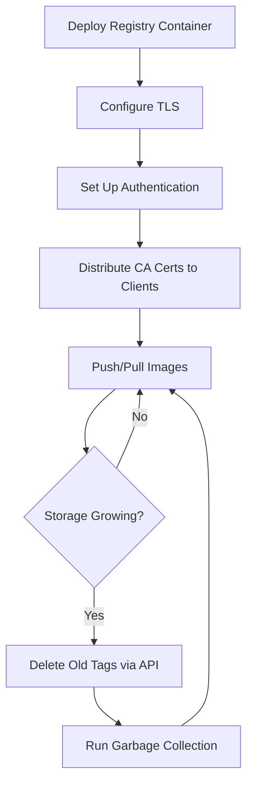

# How to Use Ansible to Manage Docker Registries

Author: [nawazdhandala](https://www.github.com/nawazdhandala)

Tags: Ansible, Docker, Registry, DevOps, Automation

Description: Learn how to automate the deployment and management of Docker registries using Ansible playbooks with practical examples.

---

Running your own Docker registry gives you full control over image storage, access policies, and distribution. Instead of configuring registries by hand on every server, Ansible lets you define the entire setup as code. This post walks through deploying a private Docker registry, configuring TLS, setting up authentication, and managing registry operations with Ansible.

## Why Run a Private Docker Registry?

Public registries like Docker Hub work fine for open source projects, but production workloads often need a private registry. You might need to keep proprietary images internal, reduce external bandwidth, comply with data residency requirements, or simply speed up deployments by keeping images close to your infrastructure.

A private registry also gives you control over image retention policies, vulnerability scanning integrations, and access control at a granular level.

## Prerequisites

Before starting, make sure you have:

- Ansible 2.10+ installed on your control node
- The `community.docker` collection installed
- Docker installed on the target hosts
- TLS certificates for production setups (self-signed works for testing)

Install the required Ansible collection if you have not already:

```bash
# Install the community.docker collection from Ansible Galaxy
ansible-galaxy collection install community.docker
```

## Deploying a Basic Docker Registry

The simplest way to run a registry is as a Docker container. Here is a playbook that sets up a basic registry:

```yaml
# deploy_registry.yml - Deploy a basic Docker registry container
---
- name: Deploy Docker Registry
  hosts: registry_servers
  become: true
  vars:
    registry_port: 5000
    registry_data_dir: /opt/registry/data
    registry_version: "2.8"

  tasks:
    - name: Create registry data directory
      ansible.builtin.file:
        path: "{{ registry_data_dir }}"
        state: directory
        mode: '0755'

    - name: Deploy registry container
      community.docker.docker_container:
        name: docker-registry
        image: "registry:{{ registry_version }}"
        state: started
        restart_policy: always
        ports:
          - "{{ registry_port }}:5000"
        volumes:
          - "{{ registry_data_dir }}:/var/lib/registry"
        env:
          REGISTRY_STORAGE_DELETE_ENABLED: "true"
```

This gets you a functional registry, but it lacks TLS and authentication. Let us fix that.

## Adding TLS to the Registry

Running a registry without TLS means Docker clients will refuse to connect (or you have to configure every client to allow insecure registries). Here is how to deploy a registry with TLS:

```yaml
# deploy_secure_registry.yml - Registry with TLS certificates
---
- name: Deploy Secure Docker Registry
  hosts: registry_servers
  become: true
  vars:
    registry_domain: registry.example.com
    certs_dir: /opt/registry/certs
    auth_dir: /opt/registry/auth
    data_dir: /opt/registry/data

  tasks:
    - name: Create registry directories
      ansible.builtin.file:
        path: "{{ item }}"
        state: directory
        mode: '0755'
      loop:
        - "{{ certs_dir }}"
        - "{{ auth_dir }}"
        - "{{ data_dir }}"

    - name: Copy TLS certificate
      ansible.builtin.copy:
        src: "files/{{ registry_domain }}.crt"
        dest: "{{ certs_dir }}/domain.crt"
        mode: '0644'

    - name: Copy TLS key
      ansible.builtin.copy:
        src: "files/{{ registry_domain }}.key"
        dest: "{{ certs_dir }}/domain.key"
        mode: '0600'

    - name: Deploy registry with TLS
      community.docker.docker_container:
        name: docker-registry
        image: registry:2.8
        state: started
        restart_policy: always
        ports:
          - "443:5000"
        volumes:
          - "{{ data_dir }}:/var/lib/registry"
          - "{{ certs_dir }}:/certs:ro"
        env:
          REGISTRY_HTTP_TLS_CERTIFICATE: "/certs/domain.crt"
          REGISTRY_HTTP_TLS_KEY: "/certs/domain.key"
```

## Setting Up Basic Authentication

For access control, the Docker registry supports htpasswd-based authentication. Here is how to configure it with Ansible:

```yaml
# setup_registry_auth.yml - Add htpasswd authentication to registry
---
- name: Configure Registry Authentication
  hosts: registry_servers
  become: true
  vars:
    auth_dir: /opt/registry/auth
    registry_users:
      - { username: "deployer", password: "s3cureP@ss" }
      - { username: "ci-runner", password: "an0therP@ss" }

  tasks:
    - name: Install apache2-utils for htpasswd
      ansible.builtin.apt:
        name: apache2-utils
        state: present

    - name: Create htpasswd file with first user
      ansible.builtin.command:
        cmd: >
          htpasswd -Bbn {{ registry_users[0].username }}
          {{ registry_users[0].password }}
      register: htpasswd_output
      changed_when: true

    - name: Write htpasswd file
      ansible.builtin.copy:
        content: "{{ htpasswd_output.stdout }}\n"
        dest: "{{ auth_dir }}/htpasswd"
        mode: '0644'

    - name: Add additional users to htpasswd
      ansible.builtin.command:
        cmd: >
          htpasswd -Bb {{ auth_dir }}/htpasswd
          {{ item.username }} {{ item.password }}
      loop: "{{ registry_users[1:] }}"
      changed_when: true

    - name: Deploy registry with auth and TLS
      community.docker.docker_container:
        name: docker-registry
        image: registry:2.8
        state: started
        restart_policy: always
        ports:
          - "443:5000"
        volumes:
          - "/opt/registry/data:/var/lib/registry"
          - "/opt/registry/certs:/certs:ro"
          - "/opt/registry/auth:/auth:ro"
        env:
          REGISTRY_HTTP_TLS_CERTIFICATE: "/certs/domain.crt"
          REGISTRY_HTTP_TLS_KEY: "/certs/domain.key"
          REGISTRY_AUTH: "htpasswd"
          REGISTRY_AUTH_HTPASSWD_REALM: "Registry Realm"
          REGISTRY_AUTH_HTPASSWD_PATH: "/auth/htpasswd"
```

## Configuring Docker Clients to Trust the Registry

Every Docker host that needs to pull from your private registry needs to trust its TLS certificate. Here is a task to distribute the CA certificate:

```yaml
# configure_clients.yml - Configure Docker hosts to trust private registry
---
- name: Configure Docker Clients for Private Registry
  hosts: docker_hosts
  become: true
  vars:
    registry_domain: registry.example.com

  tasks:
    - name: Create cert directory for registry
      ansible.builtin.file:
        path: "/etc/docker/certs.d/{{ registry_domain }}"
        state: directory
        mode: '0755'

    - name: Copy CA certificate to Docker cert directory
      ansible.builtin.copy:
        src: files/ca.crt
        dest: "/etc/docker/certs.d/{{ registry_domain }}/ca.crt"
        mode: '0644'
      notify: restart docker

  handlers:
    - name: restart docker
      ansible.builtin.service:
        name: docker
        state: restarted
```

## Managing Registry Content with the API

The Docker registry exposes a REST API that Ansible can interact with using the `uri` module. This is useful for listing repositories, checking tags, and cleaning up old images:

```yaml
# registry_operations.yml - Interact with registry API
---
- name: Registry Operations
  hosts: localhost
  vars:
    registry_url: "https://registry.example.com"
    registry_user: deployer
    registry_pass: "s3cureP@ss"

  tasks:
    - name: List all repositories in registry
      ansible.builtin.uri:
        url: "{{ registry_url }}/v2/_catalog"
        method: GET
        url_username: "{{ registry_user }}"
        url_password: "{{ registry_pass }}"
        force_basic_auth: true
        validate_certs: true
      register: catalog

    - name: Show repositories
      ansible.builtin.debug:
        msg: "Repositories: {{ catalog.json.repositories }}"

    - name: Get tags for each repository
      ansible.builtin.uri:
        url: "{{ registry_url }}/v2/{{ item }}/tags/list"
        method: GET
        url_username: "{{ registry_user }}"
        url_password: "{{ registry_pass }}"
        force_basic_auth: true
      loop: "{{ catalog.json.repositories }}"
      register: tags_result

    - name: Display tags per repository
      ansible.builtin.debug:
        msg: "{{ item.item }}: {{ item.json.tags | default([]) }}"
      loop: "{{ tags_result.results }}"
```

## Garbage Collection

Over time, deleted image layers pile up on disk. The registry supports garbage collection to reclaim space:

```yaml
# registry_gc.yml - Run garbage collection on the registry
---
- name: Run Registry Garbage Collection
  hosts: registry_servers
  become: true

  tasks:
    - name: Stop the registry before GC
      community.docker.docker_container:
        name: docker-registry
        state: stopped

    - name: Run garbage collection (dry run first)
      ansible.builtin.command:
        cmd: >
          docker run --rm
          -v /opt/registry/data:/var/lib/registry
          registry:2.8 garbage-collect
          /etc/docker/registry/config.yml --dry-run
      register: gc_dry_run
      changed_when: false

    - name: Show GC dry run results
      ansible.builtin.debug:
        msg: "{{ gc_dry_run.stdout_lines }}"

    - name: Run actual garbage collection
      ansible.builtin.command:
        cmd: >
          docker run --rm
          -v /opt/registry/data:/var/lib/registry
          registry:2.8 garbage-collect
          /etc/docker/registry/config.yml
      changed_when: true

    - name: Start the registry again
      community.docker.docker_container:
        name: docker-registry
        state: started
```

## Registry Lifecycle Overview

Here is a diagram showing the typical registry management workflow:



## Wrapping Up

Managing Docker registries with Ansible removes the manual overhead of setting up and maintaining private image storage. You get repeatable deployments, consistent security configurations, and automated maintenance. The key pieces are the `community.docker.docker_container` module for running the registry itself, the `uri` module for interacting with the registry API, and standard file management modules for handling certificates and authentication files.

For production environments, consider adding monitoring (Prometheus metrics are built into the registry), setting up registry replication for high availability, and integrating with an external authentication provider like LDAP or OAuth instead of htpasswd.
