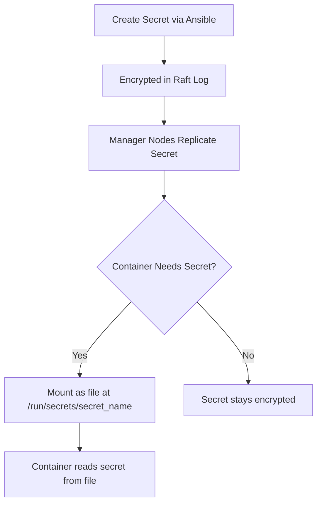

# How to Use Ansible to Manage Docker Secrets

Author: [nawazdhandala](https://www.github.com/nawazdhandala)

Tags: Ansible, Docker, Secrets, Security, Swarm

Description: Manage Docker Swarm secrets with Ansible to securely distribute passwords, API keys, and certificates to containers.

---

Docker Secrets provide a way to securely store and distribute sensitive data like passwords, TLS certificates, and API keys to containers running in a Swarm cluster. Unlike environment variables, secrets are encrypted at rest, only mounted in memory inside containers, and never written to disk on worker nodes. Ansible can manage the entire lifecycle of Docker secrets, from creation to rotation to removal.

## How Docker Secrets Work

Docker secrets are a Swarm-only feature. When you create a secret, it gets stored encrypted in the Swarm's Raft log and distributed to the nodes that need it. Inside a container, secrets appear as files in the `/run/secrets/` directory.



This is significantly more secure than environment variables, which can leak through process listings, logs, and container inspect commands.

## Prerequisites

Docker secrets require Docker Swarm mode. Make sure your cluster is initialized:

```bash
# Install the community.docker collection
ansible-galaxy collection install community.docker
```

Your playbooks must target a Swarm manager node since secrets can only be managed from managers.

## Creating Docker Secrets

The `docker_secret` module creates and manages secrets:

```yaml
# create_secrets.yml - Create Docker secrets from various sources
---
- name: Create Docker Secrets
  hosts: swarm_managers[0]
  become: true

  tasks:
    - name: Create a simple text secret
      community.docker.docker_secret:
        name: db_password
        data: "{{ vault_db_password }}"
        state: present

    - name: Create a secret from a variable
      community.docker.docker_secret:
        name: api_key
        data: "{{ vault_api_key }}"
        state: present

    - name: Create a multi-line secret (like a config file)
      community.docker.docker_secret:
        name: app_config
        data: |
          database_host=db.internal
          database_port=5432
          database_name=production
          cache_ttl=3600
        state: present
```

## Creating Secrets from Files

For TLS certificates and other file-based secrets, read the file content and pass it to the module:

```yaml
# file_secrets.yml - Create secrets from files
---
- name: Create Secrets from Files
  hosts: swarm_managers[0]
  become: true

  tasks:
    - name: Read TLS certificate
      ansible.builtin.slurp:
        src: files/tls/server.crt
      register: tls_cert
      delegate_to: localhost

    - name: Read TLS key
      ansible.builtin.slurp:
        src: files/tls/server.key
      register: tls_key
      delegate_to: localhost

    - name: Create TLS certificate secret
      community.docker.docker_secret:
        name: tls_certificate
        data: "{{ tls_cert.content | b64decode }}"
        state: present

    - name: Create TLS key secret
      community.docker.docker_secret:
        name: tls_private_key
        data: "{{ tls_key.content | b64decode }}"
        state: present
      no_log: true
```

## Using Secrets in Containers

Secrets are referenced in service definitions. In Swarm, you use the `docker_swarm_service` module:

```yaml
# deploy_with_secrets.yml - Deploy a service that uses secrets
---
- name: Deploy Service with Secrets
  hosts: swarm_managers[0]
  become: true

  tasks:
    - name: Ensure all secrets exist
      community.docker.docker_secret:
        name: "{{ item.name }}"
        data: "{{ item.value }}"
        state: present
      loop:
        - { name: "db_password", value: "{{ vault_db_password }}" }
        - { name: "redis_password", value: "{{ vault_redis_password }}" }
        - { name: "jwt_secret", value: "{{ vault_jwt_secret }}" }
      no_log: true

    - name: Deploy API service with secrets
      community.docker.docker_swarm_service:
        name: api
        image: myapi:latest
        replicas: 3
        secrets:
          - secret_name: db_password
            filename: db_password     # Filename inside /run/secrets/
          - secret_name: redis_password
            filename: redis_password
          - secret_name: jwt_secret
            filename: jwt_secret
        env:
          DB_PASSWORD_FILE: "/run/secrets/db_password"
          REDIS_PASSWORD_FILE: "/run/secrets/redis_password"
          JWT_SECRET_FILE: "/run/secrets/jwt_secret"
        networks:
          - app_network
```

Notice the `_FILE` suffix pattern in the environment variables. Many official Docker images (PostgreSQL, MySQL, etc.) support this convention. Instead of reading the password from an environment variable, the application reads it from the file path specified by the `_FILE` variable.

## Custom Secret Mounting

You can control where secrets are mounted and their permissions:

```yaml
    - name: Deploy service with custom secret mount options
      community.docker.docker_swarm_service:
        name: web
        image: nginx:latest
        secrets:
          - secret_name: tls_certificate
            filename: server.crt
            uid: "0"
            gid: "0"
            mode: 0444  # Read-only for all
          - secret_name: tls_private_key
            filename: server.key
            uid: "0"
            gid: "0"
            mode: 0400  # Read-only for owner
```

## Secret Rotation

Updating a secret requires a specific workflow because Docker secrets are immutable. You cannot update a secret in place. Instead, you create a new version and update the service to use it:

```yaml
# rotate_secrets.yml - Rotate a Docker secret
---
- name: Rotate Docker Secret
  hosts: swarm_managers[0]
  become: true
  vars:
    secret_base_name: db_password
    new_secret_value: "{{ vault_new_db_password }}"
    timestamp: "{{ ansible_date_time.epoch }}"

  tasks:
    - name: Create new versioned secret
      community.docker.docker_secret:
        name: "{{ secret_base_name }}_{{ timestamp }}"
        data: "{{ new_secret_value }}"
        state: present
      no_log: true

    - name: Update service to use new secret
      community.docker.docker_swarm_service:
        name: api
        image: myapi:latest
        secrets:
          - secret_name: "{{ secret_base_name }}_{{ timestamp }}"
            filename: "{{ secret_base_name }}"
        force_update: true  # Forces service update even if config unchanged

    - name: Wait for service to stabilize
      ansible.builtin.pause:
        seconds: 30

    - name: Remove old secret versions
      community.docker.docker_secret:
        name: "{{ item }}"
        state: absent
      loop: "{{ old_secret_versions }}"
      when: old_secret_versions is defined
```

## Listing and Inspecting Secrets

Get information about existing secrets:

```yaml
# list_secrets.yml - List and inspect Docker secrets
---
- name: List Docker Secrets
  hosts: swarm_managers[0]
  become: true

  tasks:
    - name: List all secrets
      ansible.builtin.command:
        cmd: docker secret ls --format "{{.Name}} {{.CreatedAt}}"
      register: secret_list
      changed_when: false

    - name: Display secrets
      ansible.builtin.debug:
        msg: "{{ secret_list.stdout_lines }}"

    - name: Inspect a specific secret (metadata only, not the value)
      ansible.builtin.command:
        cmd: docker secret inspect db_password
      register: secret_inspect
      changed_when: false

    - name: Show secret metadata
      ansible.builtin.debug:
        msg: "{{ secret_inspect.stdout | from_json }}"
```

Note that `docker secret inspect` never shows the actual secret value. The data is only accessible from inside a container that has been granted access to the secret.

## Batch Secret Management

For applications with many secrets, manage them as a group:

```yaml
# batch_secrets.yml - Manage multiple secrets at once
---
- name: Batch Secret Management
  hosts: swarm_managers[0]
  become: true
  vars:
    application_secrets:
      - name: app_db_password
        value: "{{ vault_db_password }}"
      - name: app_redis_password
        value: "{{ vault_redis_password }}"
      - name: app_smtp_password
        value: "{{ vault_smtp_password }}"
      - name: app_aws_access_key
        value: "{{ vault_aws_access_key }}"
      - name: app_aws_secret_key
        value: "{{ vault_aws_secret_key }}"
      - name: app_encryption_key
        value: "{{ vault_encryption_key }}"

  tasks:
    - name: Create or update all application secrets
      community.docker.docker_secret:
        name: "{{ item.name }}"
        data: "{{ item.value }}"
        state: present
        force: true  # Recreate if data changed
      loop: "{{ application_secrets }}"
      loop_control:
        label: "{{ item.name }}"
      no_log: true

    - name: Remove secrets not in the list
      community.docker.docker_secret:
        name: "{{ item }}"
        state: absent
      loop: "{{ secrets_to_remove | default([]) }}"
```

## Application Code for Reading Secrets

For applications that do not natively support the `_FILE` convention, here is a simple wrapper pattern. This is the application-side code that reads secrets from files:

```python
# read_secrets.py - Helper to read Docker secrets in Python applications
import os

def get_secret(secret_name, default=None):
    """Read a Docker secret from /run/secrets/ or fall back to env var."""
    # First try the _FILE env var pattern
    file_env = os.environ.get(f"{secret_name}_FILE")
    if file_env and os.path.exists(file_env):
        with open(file_env, 'r') as f:
            return f.read().strip()

    # Then try /run/secrets/ directly
    secret_path = f"/run/secrets/{secret_name.lower()}"
    if os.path.exists(secret_path):
        with open(secret_path, 'r') as f:
            return f.read().strip()

    # Fall back to environment variable
    return os.environ.get(secret_name, default)

# Usage
db_password = get_secret("DB_PASSWORD")
api_key = get_secret("API_KEY")
```

## Cleaning Up Secrets

Remove secrets that are no longer needed:

```yaml
# cleanup_secrets.yml - Remove unused secrets
---
- name: Clean Up Unused Secrets
  hosts: swarm_managers[0]
  become: true

  tasks:
    - name: Get list of all secrets
      ansible.builtin.command:
        cmd: docker secret ls --format "{{.Name}}"
      register: all_secrets
      changed_when: false

    - name: Get secrets in use by services
      ansible.builtin.command:
        cmd: >
          docker service inspect --format
          '{{range .Spec.TaskTemplate.ContainerSpec.Secrets}}{{.SecretName}} {{end}}'
          {{ item }}
      loop: "{{ service_list.stdout_lines }}"
      register: used_secrets
      changed_when: false

    - name: Remove specific deprecated secrets
      community.docker.docker_secret:
        name: "{{ item }}"
        state: absent
      loop:
        - old_db_password
        - deprecated_api_key
        - temp_cert
```

## Summary

Docker secrets provide proper secret management for Swarm deployments, keeping sensitive data encrypted and only exposing it inside authorized containers as in-memory files. Ansible handles the full lifecycle through the `docker_secret` module: creating secrets from Vault-encrypted variables or files, deploying services that reference those secrets, rotating secrets by creating new versions and updating services, and cleaning up old secret versions. Always use `no_log: true` on tasks that handle secret values, and prefer the `_FILE` convention so your applications read secrets from files rather than environment variables.
